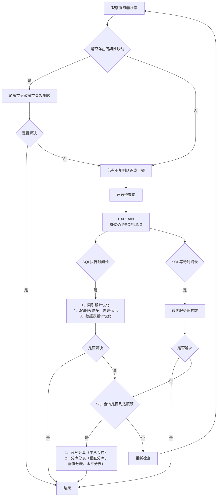

# 性能分析工具的使用

在数据库调优中，我们的目标就是`响应时间更快，吞吐量更大`。利用宏观的监控工具和微观的日志分析可以帮我们快速找到调优的思路和方式。

## 数据库服务器的优化步骤

当我们遇到数据库调优问题的时候，该如何思考呢？这里把思考的流程整理成下面这张图。

:::details 查看



:::

## 查看系统性能参数

在 MySQL 中，可以使用 `SHOW STATUS` 语句查询一些 MySQL 数据库服务器的**性能参数**、**执行频率**。

SHOW STATUS 语句语法

```sql
SHOW [GLOBAL|SESSION] STATUS LIKE '参数';
```

**常用性能参数**

- `Connections`：连接 MySQL 服务器的次数。
- `Uptime`：MySQL 服务器的上线时间。
- `Slow_queries`：慢查询的次数。
- `Innodb_rows_read`：Select 查询返回的行数
- `Innodb_rows_inserted`：执行 INSERT 操作插入的行数
- `Innodb_rows_updated`：执行 UPDATE 操作更新的行数
- `Innodb_rows_deleted`：执行 DELETE 操作删除的行数
- `Com_select`：查询操作的次数。
- `Com_insert`：插入操作的次数。对于批量插入的 INSERT 操作，只累加一次。
- `Com_update`：更新操作的次数。
- `Com_delete`：删除操作的次数。

示例：

```sql
-- 查询MySQL服务器的连接次数
SHOW STATUS LIKE 'Connections';

-- 查询MySQL服务器的上线时间
SHOW STATUS LIKE 'Uptime';

-- 查询MySQL服务器的慢查询次数
SHOW STATUS LIKE 'Slow_queries';
-- 慢查询次数可以结合慢查询日志找出慢查询语句，然后针对慢查询语句进行 表结构优化 和 查询语句优化
```

## 统计SQL的查询成本：last_query_cost

> last_query_cost以翻译的角度来看，就是最后一次查询的成本。实际上它的作用也确实如此

一条 SQL 查询语句在执行前需确定查询执行计划，若存在多种执行计划，MySQL 会计算每个执行计划的成本，选择**成本最小**的作为最终执行计划。

如果我们要查看某条 SQL 语句的查询成本，  可以在执行完这条SQL语句之后，通过查看当前会话中的`last_query_cost`变量值获取当前查询的成本。它通常也是我们`评价一个查询执行效率`的常用指标。这个查询成本对应的是`SQL 语句需要读取的页的数量`。


**last_query_cost使用场景**：对于比较开销非常有用，尤其是有多种查询方式可选时。

:::details 数据准备

数据依然使用的是 [索引设计原则](./索引设计原则.md) 中的`student`表，此表有100w条数据。

此处不再赘述。

:::

如果我们想要查询 id=900001 的记录，然后看下查询成本，我们可以直接在聚簇索引上进行查找:

```sql
SELECT student_id, class_id, name, create_time FROM student_info WHERE id = 900001;
```

运行结果（1 条记录，运行时间为 0.042s）。然后再看下查询优化器的成本，实际上我们只需要检索一个页即可:

```sql
mysql> SHOW STATUS LIKE 'last_query_cost';
+-----------------+----------+
| Variable_name   | Value    |
+-----------------+----------+
| Last_query_cost | 1.000000 |
+-----------------+----------+
```

如果我们想要查询 id 在 900001 到 9000100 之间的学生记录呢？

```sql
SELECT student_id, class_id, NAME, create_time FROM student_info WHERE id BETWEEN 900001 AND 900100;
```

运行结果（100 条记录，运行时间为 0.046s）。然后再看下查询优化器的成本，这时我们大概需要进行 20 个页的查询。

```sql
mysql> SHOW STATUS LIKE 'last_query_cost';
+-----------------+-----------+
| Variable_name   | Value     |
+-----------------+-----------+
| Last_query_cost | 21.134453 |
+-----------------+-----------+
```

可以看到页的数量是刚才的 20 倍，但是查询的效率并没有明显的变化，实际上这两个 SQL 查询的时间两个 SQL 查询时间基本一致。

原因是采用顺序读取方式将页面一次性加载到缓冲池（buffer bool）中再查找，尽管**last_query_cost（页数量）增加不少**，但通过缓冲池机制，查询时间未明显增加。

> SQL 查询是一个动态的过程，从页加载的角度来看，我们可以得到以下两点结论：
>
> 1. `位置决定效率`。如果页就在数据库`缓冲池`中，那么效率是最高的，否则还需要从`内存`或者`磁盘`中进行读取，当然针对单个页的读取来说，如果页存在于内存中，会比在磁盘中读取效率高很多。
> 2. `批量决定效率`。如果我们从磁盘中对单一页进行随机读，那么效率是很低的（差不多10ms），而采用顺序读取的方式，批量对页进行读取，平均一页的读取效率就会提升很多，甚至要快于单个页面在内存中的随机读取。
>
> 所以说，遇到I/O并不用担心，方法找对了，效率还是很高的。我们首先要考虑数据存放的位置，如果是经常使用的数据就要尽量放到`缓冲池`中，其次我们可以充分利用磁盘的吞吐能力，一次性批量读取数据，这样单个页的读取效率也就得到了提升。

## 定位执行慢的SQL：慢查询日志

MySQL的慢查询日志，用来记录在MySQL中`响应时间超过阈值`的语句，具体来说就是指运行时间超过`long_query_time`的值的SQL，则会被记录到慢查询日志中。

`long_query_time`的默认值为`10`，意思是运行10秒以上（不含10秒）的语句，认为是超出了我们的最大忍耐时间值，我们也就认为是慢查询语句。

:::warning

默认情况下，MySQL数据库`没有开启慢查询日志`，需要我们手动来设置这个参数。`如果不是调优需要的话，一般不建议启动该参数`，因为开启慢查询日志会或多或少带来一定的性能影响。

:::

### 开启慢查询日志参数

1. 开启slow_query_log

```sql
set global slow_query_log='ON';
```

查看下慢查询日志是否开启，以及慢查询日志文件的位置：

```sql
show variables like `%slow_query_log%`;
```

2. 修改long_query_time阈值

```sql
show variables like '%long_query_time%';
```

```sql
#测试发现：设置global的方式对当前session的long_query_time失效。对新连接的客户端有效。所以可以一并 执行下述语句 

-- 设置全局的long_query_time
mysql> set global long_query_time = 1; 
mysql> show global variables like '%long_query_time%'; 

-- 设置当前session的long_query_time
mysql> set long_query_time=1; 
mysql> show variables like '%long_query_time%';
```

:::details 补充——配置文件中一并设置参数

如下的方式相较与前面的命令行方式，可以看作是永久配置的方式

修改`my.cnf`配置文件，在[mysqld]下添加如下内容，并重启MySQL服务器：

```shell
[mysqld]
slow_query_log=ON # 开启慢查询日志
slow_query_log_file='/var/lib/mysql/test-slow.log' # 慢查询日志的文件夹和文件名信息
long_query_time=3 # 慢查询阈值，单位为秒。超出3秒的SQL语句，就会记录到慢查询日志中
log_output=FILE
```

如果不指定存储路径，慢查询日志将默认存储在MySQL数据库的数据目录下。

如果不指定文件名，默认文件名为`hostname-slow.log`。

:::

### 查看慢查询数目

查询当前系统中有多少条慢查询记录：

```sql
SHOW GLOBAL STATUS LIKE '%Slow_queries%';
```

#### 扩展：min_examined_row_limit

**`long_query_time`值并不能够完全决定一个查询是否是慢查询，并写入到慢查询日志中。**

除了上述变量，控制慢查询日志的还有一个系统变量：`min_examined_row_limit`。这个变量的意思是，查询`扫描过的最少记录数`。这个变量和查询执行时间，共同组成了判别一个查询是否是慢查询的条件。

如果查询扫描过的记录数大于等于这个变量的值，并且查询执行时间超过 `long_query_time` 的值，那么，这个查询就被记录到慢查询日志中；反之，则不被记录到慢查询日志中。

```sql
mysql> show variables like 'min%';
+--------------------------+-------+
| Variable_name            | Value |
+--------------------------+-------+
| min_examined_row_limit   | 0     |
+--------------------------+-------+
1 row in set, 1 warning (0.00 sec)
```

这个值默认是0，与 long_query_time=10 合在一起，表示只要查询的执行时间超过 10 秒钟，哪怕一个记录也没有扫描过，都要被记录到慢查询日志中。你也可以根据需要，通过修改 “my.ini” 文件，来修改查询时长，或者通过 SET 指令，用 SQL 语句修改 `min_examined_row_limit` 的值。

**举例1**：默认 min_examined_row_limit=0，long_query_time=10 秒

- 只要 SQL 执行时间超过 10 秒，无论扫描多少行记录，都会被记录到慢查询日志

**举例2**：min_examined_row_limit=100，long_query_time=5 秒

- 某查询扫描了 80 行，执行时间 6 秒 → 因扫描行数不足 100，不会被记录到慢查询日志中
- 某查询扫描了 120 行，执行时间 4 秒 → 因执行时间未超过 5 秒，不会被记录到慢查询日志中
- 某查询扫描了 150 行，执行时间 6 秒 → 同时满足两个条件，会被记录到慢查询日志

### 慢查询日志分析工具：mysqldumpslow

在生成环境中，如果要手工分析日志，查看、分析SQL，显然是个体力活。MySQL也想到了这一点，因此它提供了 mysqldumpslow 这个日志分析工具。

在终端中执行如下命令，查看帮助信息：

```shell
mysqldumpslow --help
```

结果如下：

```shell
Usage: mysqldumpslow [ OPTS... ] [ LOGS... ]
Parse and summarize the MySQL slow query log. Options are
  --verbose    verbose
  --debug      debug
  --help       write this text to standard output
  -v           verbose
  -d           debug
  -s ORDER     what to sort by (al, at, ar, c, l, r, t), 'at' is default
                al: average lock time
                ar: average rows sent
                at: average query time
                c: count
                l: lock time
                r: rows sent
                t: query time
  -r           reverse the sort order (largest last instead of first)
  -t NUM       just show the top n queries
  -a           don't abstract all numbers to N and strings to 'S'
  -n NUM       abstract numbers with at least n digits within names
  -g PATTERN   grep: only consider stmts that include this string
  -h HOSTNAME  hostname of db server for *-slow.log filename (can be wildcard),
                default is '*', i.e. match all
  -i NAME      name of server instance (if using mysql.server startup script)
  -l           don't subtract lock time from total time
```

mysqldumpslow 命令的具体参数如下：

- `-a`: 不将数字抽象成N，字符串抽象成S。而是直接显示数字和字符串本身。
- `s`（表示以何种方式排序）：
  - `c`: 访问次数
  - `l`: 锁定时间
  - `r`: 返回记录
  - `t`: **查询时间**
  - `al`: 平均锁定时间
  - `ar`: 平均返回记录
  - `at`: 平均查询时间（默认方式）
  - `ac`: 平均查询次数
- `t`: **返回前多少条数据**
- `-g`: 后跟随正则匹配模式，大小写不敏感。

举例：按查询时间排序，查看前五条 SQL 语句

```shell
mysqldumpslow -s t -t 5 /var/lib/mysql/test-slow.log
```

执行结果示例：

```shell
Reading mysql slow query log from /var/lib/mysql/test-slow.log
Count: 1  Time=2.39s (2s)  Lock=0.00s (0s)  Rows=13.0 (13), root[root]@localhost
  SELECT * FROM student WHERE name = 'S';

Count: 1  Time=2.08s (2s)  Lock=0.00s (0s)  Rows=2.0 (2), root[root]@localhost
  SELECT * FROM student WHERE name = 'N';

Died at /usr/bin/mysqldumpslow line 162, <> chunk 2.
```

**查询到慢查询SQL语句之后，我们可以考虑使用explain 分析慢查询SQL语句的执行计划，进而优化SQL语句。**

**工作常用命令**:

```shell
# 得到返回记录最多的前 10 个 SQL
mysqldumpslow -s r -t 10 /var/lib/mysql/test-slow.log

# 得到访问次数最多的前 10 个 SQL
mysqldumpslow -s c -t 10 /var/lib/mysql/test-slow.log

# 得到按时间排序的前 10 条含左连接的查询语句：
mysqldumpslow -s t -t 10 -g "left join" /var/lib/mysql/test-slow.log

# 另外建议在使用这些命令时结合 | 和 more 使用 ，否则有可能出现爆屏情况
mysqldumpslow -s r -t 10 /var/lib/mysql/test-slow.log | more
```

#### 关闭慢查询日志

**方式1：永久性方式**

```ini
[mysqld] 
slow_query_log=OFF

#或 注释掉

[mysqld] 
#slow_query_log =OFF
```

注意，修改配置文件后，需要重启数据库服务才能生效。

**方式2：临时性方式**

停止MySQL慢查询日志功能

```sql
SET GLOBAL slow_query_log=off;
```

### 删除（重新生成）慢查询日志

要删除慢查询日志，直接删除慢查询日志文件即可。

执行以下SHOW语句，可以查看慢查询日志文件所在的路径：

```sql
SHOW VARIABLES LIKE 'slow_query_log%';
-- 或
SHOW VARIABLES LIKE 'slow_query_log_file';
```

如果需要重新生成慢查询日志文件，可以执行`mysqladmin flush-logs `命令：

```shell
mysqladmin -uroot -p flush-logs slow
```

:::warning 注意

慢查询日志都是使用mysqladmin flush-logs命令来删除重建的。

使用时，如果旧的还需要慢查询日志，请手动保存，因为该命令会覆盖掉旧的慢查询日志。

:::

### 查看SQL执行成本：SHOW PROFILE {#show-profile}

Show Profile 是 MySQL 提供的可以用来分析当前会话中 SQL 都做了什么、执行的资源消耗情况的工具，可用于 sql 调优的测量。默认情况下处于关闭状态，并保存最近 15 次的运行结果。

我们可以在会话级别开启这个功能：

```sql
show variables like 'profiling';

# 开启
set profiling = 'ON';

# 查看
show profiles; -- 查看所有查询的成本（最近15次）

show profile; -- 查看最后一次查询的成本

show profile for query 2; -- 查看具体的某一次查询的成本

show profile cpu,block io for query 2;
```

**show profile 的常用查询参数**：

- `ALL`：显示所有的开销信息。
- `BLOCK IO`：显示块 IO 开销。
- `CONTEXT SWITCHES`：上下文切换开销。
- `CPU`：显示 CPU 开销信息。
- `IPC`：显示发送和接收开销信息。
- `MEMORY`：显示内存开销信息。
- `PAGE FAULTS`：显示页面错误开销信息。
- `SOURCE`：显示和 Source_function，Source_file，Source_line 相关的开销信息。
- `SWAPS`：显示交换次数开销信息。

:::warning

**日常开发中需要注意的一些结论**：

- `converting HEAP to MyISAM`：查询结果太大，内存不够，数据往磁盘上搬了。
- `Creating tmp table`：创建临时表。先拷贝数据到临时表，用完后再删除临时表。
- `Copying to tmp table on disk`：把内存中临时表复制到磁盘上，警惕！
- `locked`：锁

如果在 show profile 诊断结果中出现了以上 4 条结果中的任何一条，则 sql 语句需要优化。

:::

:::danger

SHOW PROFILE 命令将被弃用，我们可以从 information_schema 中的 profiling 数据表进行查看。

:::

## 分析查询语句：EXPLAIN

**定位了查询慢的 SQL 之后，我们就可以使用 `EXPLAIN` 或 `DESCRIBE` 工具做针对性的分析查询语句。** 

DESCRIBE 语句的使用方法与 EXPLAIN 语句是一样的，并且分析结果也是一样的。

MySQL 中有专门负责优化 SELECT 语句的优化器模块，主要功能：通过计算分析系统中收集到的统计信息，为客户端请求的 Query 提供它认为最优的`执行计划`（他认为最优的数据检索方式，但不见得是 DBA 认为是最优的，这部分最耗费时间）。

这个执行计划展示了接下来具体执行查询的方式，比如多表连接的顺序是什么，对于每个表采用什么访问方法来具体执行查询等等。MySQL 为我们提供了 `EXPLAIN` 语句来帮助我们查看某个查询语句的具体执行计划，如果看懂 `EXPLAIN` 语句的各个输出项，可以有针对性的提升我们查询语句的性能。

**思考：EXPLAIN能做什么？**

- 表的读取顺序
- 数据读取操作的操作类型
- 哪些索引可以使用
- 哪些索引被实际使用
- 表之间的引用
- 每张表有多少行被优化器查询

**官网介绍**

https://dev.mysql.com/doc/refman/5.7/en/explain-output.html

https://dev.mysql.com/doc/refman/8.0/en/explain-output.html

**版本情况**

- MySQL 5.6.3 以前只能 `EXPLAIN SELECT`；MYSQL 5.6.3 以后就可以 `EXPLAIN SELECT，UPDATE，DELETE`
- 在 5.7 以前的版本中
  - 想要显示 `partitions` 需要使用 `explain partitions` 命令
  - 想要显示 `filtered` 需要使用 `explain extended` 命令。  
- 在 5.7 版本后，默认 explain 直接显示 partitions 和 filtered 中的信息。

:::warning 注意

需要注意的是，执行 EXPLAIN 时并没有真正的执行该后面的语句，因此可以安全的查看执行计划。仅仅只是生成了执行计划

例如：

```sql
-- 只是查看执行计划，并没有真正的去查询数据
EXPLAIN SELECT * FROM student_info;

-- 只是查看执行计划，并没有真正的去删除数据
EXPLAIN DELETE FROM student_info WHERE id = 1;

-- 只是查看执行计划，并没有真正的去更新数据
EXPLAIN UPDATE student_info SET name = 'S' WHERE id = 1;
```

:::

### 基本语法

EXPLAIN 或 DESCRIBE 语句的语法形式如下：

```sql
EXPLAIN SELECT select_options 

-- 或者

DESCRIBE SELECT select_options
```

如果我们想看看某个查询的执行计划的话，可以在具体的查询语句前边加一个 EXPLAIN，就像这样：

```sql
mysql> EXPLAIN SELECT 1;
+----+-------------+-------+------------+------+---------------+------+---------+------+------+----------+-------------+
| id | select_type | table | partitions | type | possible_keys | key  | key_len | ref  | rows | filtered | Extra       |
+----+-------------+-------+------------+------+---------------+------+---------+------+------+----------+-------------+
| 1  | SIMPLE      | NULL  | NULL       | NULL | NULL          | NULL | NULL    | NULL | NULL | NULL     | No tables used |
+----+-------------+-------+------------+------+---------------+------+---------+------+------+----------+-------------+
1 row in set, 1 warning (0.01 sec)
```

输出的上述信息就是所谓的执行计划。

在这个执行计划的辅助下，我们需要知道应该怎样改进自己的查询语句以使查询执行起来更高效。其实除了以 SELECT 开头的查询语句，其余的 DELETE、INSERT、REPLACE 以及 UPDATE 语句等都可以加上 EXPLAIN，用来查看这些语句的执行计划，只是平时我们对 SELECT 语句更感兴趣。

EXPLAIN 语句输出的各个列的作用如下：

| 列名          | 描述                                                     |
| ------------- | -------------------------------------------------------- |
| id            | 在一个大的查询语句中每个SELECT关键字都对应一个`唯一的id` |
| select_type   | SELECT关键字对应的那个查询的类型                         |
| table         | 表名                                                     |
| partitions    | 匹配的分区信息                                           |
| type          | 针对单表的访问方法                                       |
| possible_keys | 可能用到的索引                                           |
| key           | 实际上使用的索引                                         |
| key_len       | 实际使用到的索引长度                                     |
| ref           | 当使用索引列等值查询时，与索引列进行等值匹配的对象信息   |
| rows          | 预估的需要读取的记录条数                                 |
| filtered      | 某个表经过搜索条件过滤后剩余记录条数的百分比             |
| Extra         | 一些额外的信息                                           |

### EXPLAIN各列作用

:::details 数据准备

1. 创建表

```sql
CREATE TABLE s1 (
  id INT AUTO_INCREMENT,
  key1 VARCHAR(100),
  key2 INT,
  key3 VARCHAR(100),
  key_part1 VARCHAR(100),
  key_part2 VARCHAR(100),
  key_part3 VARCHAR(100),
  common_field VARCHAR(100),
  PRIMARY KEY (id),
  INDEX idx_key1 (key1),
  UNIQUE INDEX idx_key2 (key2),
  INDEX idx_key3 (key3),
  INDEX idx_key_part(key_part1, key_part2, key_part3)
) ENGINE=INNODB CHARSET=utf8;

CREATE TABLE s2 (
  id INT AUTO_INCREMENT,
  key1 VARCHAR(100),
  key2 INT,
  key3 VARCHAR(100),
  key_part1 VARCHAR(100),
  key_part2 VARCHAR(100),
  key_part3 VARCHAR(100),
  common_field VARCHAR(100),
  PRIMARY KEY (id),
  INDEX idx_key1 (key1),
  UNIQUE INDEX idx_key2 (key2),
  INDEX idx_key3 (key3),
  INDEX idx_key_part(key_part1, key_part2, key_part3)
) ENGINE=INNODB CHARSET=utf8;
```

2. 设置参数 log_bin_trust_function_creators
  
创建函数，例如触发器，需开启如下命令：允许创建函数设置：

```sql
set global log_bin_trust_function_creators=1;  # 不加global只是当前窗口有效。
```

3. 创建函数

```sql
DELIMITER //
CREATE FUNCTION rand_string( n INT)
RETURNS VARCHAR(255) #该函数返回一个字符串
BEGIN
  DECLARE chars_str VARCHAR(100) DEFAULT
  'abcdefghijklmnopqrstuvwxyzABCDEFGHIJKLMNOPQRSTUVWXYZ';
  DECLARE return_str VARCHAR(255) DEFAULT '';
  DECLARE i INT DEFAULT 0;
  WHILE i < n DO
    SET return_str = CONCAT(return_str,SUBSTRING(chars_str,FLOOR(1+(RAND()*52)),1));
    SET i = i + 1;
  END WHILE;
  RETURN return_str;
END //
DELIMITER ;
```

4. 创建存储过程

创建往 s1 表中插入数据的存储过程：

```sql
DELIMITER //
CREATE PROCEDURE insert_s1 (IN min_num INT (10),IN max_num INT (10))
BEGIN
  DECLARE i INT DEFAULT 0;
  SET autocommit = 0;
  REPEAT
    SET i = i + 1;
    INSERT INTO s1 VALUES(
    (min_num + i),
    rand_string(30),
    (min_num + 30 + i + 5),
    rand_string(6),
    rand_string(10),
    rand_string(5),
    rand_string(10),
    rand_string(100);
    UNTIL i = max_num
    END REPEAT;
    COMMIT;
END //
DELIMITER ;
```

创建往 s2 表中插入数据的存储过程：

```sql
DELIMITER //
CREATE PROCEDURE insert_s2 (IN min_num INT (10),IN max_num INT (10))
BEGIN
  DECLARE i INT DEFAULT 0;
  SET autocommit = 0;
  REPEAT
  SET i = i + 1;
  INSERT INTO s2 VALUES(
    (min_num + i),
    rand_string(6),
    (min_num + 30 + i + 5),
    rand_string(6),
    rand_string(10),
    rand_string(5),
    rand_string(10),
    rand_string(100);
  UNTIL i = max_num
  END REPEAT;
  COMMIT;
END //
DELIMITER ;
```

5. 调用存储过程

s1 表数据的添加：加入 1 万条记录:

```sql
CALL insert_s1(10001,10000);
```

s2 表数据的添加：加入 1 万条记录:

```sql
CALL insert_s2(10001,10000);
```

:::

#### table

不论我们的查询语句有多复杂，包含了多少个表 ，到最后也是需要对每个表进行`单表访问`的，所以MySQL规定**EXPLAIN语句输出的每条记录都对应着某个单表的访问方法**，该条记录的table列代表着该表的表名（有时不是真实的表名字，可能是简称）。

```sql
# table: 表名
# 查询的每一行记录都对应着一个单表
EXPLAIN SELECT * FROM s1;

#s1: 驱动表 s2: 被驱动表
EXPLAIN SELECT * FROM s1 INNER JOIN s2;
```

#### id

在一个大的查询语句中每个 SELECT 关键字都对应一个`唯一的 id`

我们写的查询语句一般都以 `SELECT` 关键字开头，比如：

```sql
-- 比较简单的查询语句里只有一个 SELECT 关键字
SELECT * FROM s1 WHERE key1 = 'a';

-- 稍微复杂一点的连接查询中也只有一个 SELECT 关键字
SELECT * FROM s1 INNER JOIN s2
ON s1.key1 = s2.key1
WHERE s1.common_field = 'a';
```

```sql
mysql> EXPLAIN SELECT * FROM s1 WHERE key1 = 'a';
+----+-------------+-------+------------+------+---------------+----------+---------+-------+------+----------+------+
| id | select_type | table | partitions | type | possible_keys | key      | key_len | ref   | rows | filtered | Extra |
+----+-------------+-------+------------+------+---------------+----------+---------+-------+------+----------+------+
| 1  | SIMPLE      | s1    | NULL       | ref  | idx_key1      | idx_key1 | 303     | const | 8    | 100.00   | NULL  |
+----+-------------+-------+------------+------+---------------+----------+---------+-------+------+----------+-------+
1 row in set, 1 warning (0.03 sec)
```

```sql
mysql> EXPLAIN SELECT * FROM s1 INNER JOIN s2;
+----+-------------+-------+------------+------+---------------+------+---------+------+-------+----------+---------------------------------------+
| id | select_type | table | partitions | type | possible_keys | key  | key_len | ref  | rows  | filtered | Extra                                 |
+----+-------------+-------+------------+------+---------------+------+---------+------+-------+----------+---------------------------------------+
| 1  | SIMPLE      | s1    | NULL       | ALL  | NULL          | NULL | NULL    | NULL | 9688  | 100.00   | NULL                                  |
| 1  | SIMPLE      | s2    | NULL       | ALL  | NULL          | NULL | NULL    | NULL | 9954  | 100.00   | Using join buffer (Block Nested Loop) |
+----+-------------+-------+------------+------+---------------+------+---------+------+-------+----------+---------------------------------------+
2 rows in set, 1 warning (0.01 sec)
```

```sql
mysql> EXPLAIN SELECT * FROM s1 WHERE key1 IN (SELECT key1 FROM s2) OR key3 = 'a';
+----+-------------+-------+------------+-------+---------------+----------+---------+------+-------+----------+-------------+
| id | select_type | table | partitions | type  | possible_keys | key      | key_len | ref  | rows  | filtered | Extra       |
+----+-------------+-------+------------+-------+---------------+----------+---------+------+-------+----------+-------------+
| 1  | PRIMARY     | s1    | NULL       | ALL   | idx_key3      | NULL     | NULL    | NULL | 9688  | 100.00   | Using where |
| 2  | SUBQUERY    | s2    | NULL       | index | idx_key1      | idx_key1 | 303     | NULL | 9954  | 100.00   | Using index |
+----+-------------+-------+------------+-------+---------------+----------+---------+------+-------+----------+-------------+
2 rows in set, 1 warning (0.02 sec)
```

```sql
# 查询优化器可能对涉及了子查询的查询语句进行重写，转变为【多表查询】，因此id相同。
# 具体可以使用SHOW WARNINGS查看查询重写详情。
mysql> EXPLAIN SELECT * FROM s1 WHERE key1 IN (SELECT key2 FROM s2 WHERE common_field = 'a');
+----+-------------+-------+------------+------+---------------+----------+---------+---------------------+------+----------+-------------------------------+
| id | select_type | table | partitions | type | possible_keys | key      | key_len | ref                 | rows | filtered | Extra                         |
+----+-------------+-------+------------+------+---------------+----------+---------+---------------------+------+----------+-------------------------------+
| 1  | SIMPLE      | s2    | NULL       | ALL  | idx_key3      | NULL     | NULL    | NULL                | 9954 | 10.00    | Using where; Start temporary  |
| 1  | SIMPLE      | s1    | NULL       | ref  | idx_key1      | idx_key1 | 303     | xiaohaizi.s2.key3   | 1    | 100.00   | End temporary                 |
+----+-------------+-------+------------+------+---------------+----------+---------+---------------------+------+----------+-------------------------------+
2 rows in set, 1 warning (0.00 sec)
```

```sql
# UNION去重，可以看到第三行id为null，table为<union1,2>，表示这是一个临时表，用于去重。
# 因为它不是SELECT语句，所以id为null
mysql> EXPLAIN SELECT * FROM s1 UNION SELECT * FROM s2;
+----+---------------+------------+------------+------+---------------+------+---------+------+-------+----------+------------------+
| id | select_type   | table      | partitions | type | possible_keys | key  | key_len | ref  | rows  | filtered | Extra            |
+----+---------------+------------+------------+------+---------------+------+---------+------+-------+----------+------------------+
| 1  | PRIMARY       | s1         | NULL       | ALL  | NULL          | NULL | NULL    | NULL | 9688  | 100.00   | NULL             |
| 2  | UNION         | s2         | NULL       | ALL  | NULL          | NULL | NULL    | NULL | 9954  | 100.00   | NULL             |
| NULL| UNION RESULT  | <union1,2> | NULL       | ALL  | NULL          | NULL | NULL    | NULL | NULL  | NULL     | Using temporary |
+----+---------------+------------+------------+------+---------------+------+---------+------+-------+----------+------------------+
3 rows in set, 1 warning (0.00 sec)
```

```sql
# UNION ALL不去重，不需要临时表，所以没有第三行
mysql> EXPLAIN SELECT * FROM s1 UNION ALL SELECT * FROM s2;
+----+-------------+-------+------------+------+---------------+------+---------+------+-------+----------+------+
| id | select_type | table | partitions | type | possible_keys | key  | key_len | ref  | rows  | filtered | Extra |
+----+-------------+-------+------------+------+---------------+------+---------+------+-------+----------+------+
| 1  | PRIMARY     | s1    | NULL       | ALL  | NULL          | NULL | NULL    | NULL | 9688  | 100.00   | NULL  |
| 2  | UNION       | s2    | NULL       | ALL  | NULL          | NULL | NULL    | NULL | 9954  | 100.00   | NULL  |
+----+-------------+-------+------------+------+---------------+------+---------+------+-------+----------+-------+
2 rows in set, 1 warning (0.00 sec)
```

**总结**：

- **id如果相同，可以认为是一组，从上往下顺序执行**
- **在所有组中，id值越大，优先级越高，越先执行**
- **关注点：id号每个号码，表示一趟独立的查询,一个sql的查询趟数越少越好**


#### select_type

一条大的查询语句里边可以包含若干个 SELECT 关键字，每个 SELECT 关键字代表着一个小的查询语句，而每个 SELECT 关键字的 FROM 子句中都可以包含若干张表（这些表用来做连接查询），每一张表都对应着执行计划输出中的一条记录，对于在同一个 SELECT 关键字中的表来说，它们的 id 值是相同的。
MySQL 为每一个 SELECT 关键字代表的小查询都定义了一个称之为 select_type 的属性，意思是我们只要知道了某个小查询的 select_type 属性，就知道了这个 小查询在整个大查询中扮演了一个什么角色，我们看一下 select_type 都能取哪些值，请看官方文档：


#### partitions

#### type（重点）

**结果值从最好到最坏依次是：** **system > const > eq_ref > ref** **> fulltext > ref_or_null > index_merge > unique_subquery > index_subquery >** **range > index > ALL** 

SQL性能优化的目标：至少要达到 range级别，要求是ref级别，最好是consts级别。（阿里巴巴开发手册要求）

#### possible_keys和key

#### key_len（重点）

key_len的长度计算公式：

```
varchar(10)变长字段且允许NULL = 10 * ( character set： utf8=3,gbk=2,latin1=1)+1(NULL)+2(变长字段) 

varchar(10)变长字段且不允许NULL = 10 * ( character set：utf8=3,gbk=2,latin1=1)+2(变长字段)

char(10)固定字段且允许NULL = 10 * ( character set：utf8=3,gbk=2,latin1=1)+1(NULL) 

char(10)固定字段且不允许NULL = 10 * ( character set：utf8=3,gbk=2,latin1=1)
```

#### ref 

#### rows（重点）

预估的需要读取的记录条数

#### filtered

#### Extra

### EXPLAIN的进一步使用

#### EXPLAIN四种输出格式

这里谈谈EXPLAIN的输出格式。EXPLAIN可以输出四种格式：`传统格式`，`JSON格式`，`TREE格式`以及`可视化输出`。用户可以根据需要选择适用于自己的格式。

1. 传统格式

2. JSON格式 

JSON格式：在EXPLAIN单词和真正的查询语句中间加上`FORMAT=JSON`。用于查看执行成本`cost_info`

3. TREE格式

TREE格式是8.0.16版本之后引入的新格式，主要根据查询的`各个部分之间的关系`和`各部分的执行顺序`来描述如何查询。

4. 可视化输出

可视化输出，可以通过MySQL Workbench可视化查看MySQL的执行计划。

#### SHOW WARNINGS的使用

```sql
mysql> EXPLAIN SELECT s1.key1, s2.key1 FROM s1 LEFT JOIN s2 ON s1.key1 = s2.key1 WHERE s2.common_field IS NOT NULL;
# 查看优化后的执行语句
mysql> SHOW WARNINGS\G
```

#### 6. 分析优化器执行计划：trace

```sql
# 开启
SET optimizer_trace="enabled=on",end_markers_in_json=on; 
# 设置大小
set optimizer_trace_max_mem_size=1000000;
# 使用
select * from student where id < 10;
select * from information_schema.optimizer_trace\G
```

## MySQL监控分析视图-sys schema 

### Sys schema视图使用场景

**索引情况**

```sql
#1. 查询冗余索引 
select * from sys.schema_redundant_indexes; 
#2. 查询未使用过的索引 
select * from sys.schema_unused_indexes; 
#3. 查询索引的使用情况 
select index_name,rows_selected,rows_inserted,rows_updated,rows_deleted from sys.schema_index_statistics where table_schema='dbname' ;
```

**表相关**

```sql
# 1. 查询表的访问量 
select table_schema,table_name,sum(io_read_requests+io_write_requests) as io from sys.schema_table_statistics group by table_schema,table_name order by io desc; 
# 2. 查询占用bufferpool较多的表 
select object_schema,object_name,allocated,data
from sys.innodb_buffer_stats_by_table order by allocated limit 10; 
# 3. 查看表的全表扫描情况 
select * from sys.statements_with_full_table_scans where db='dbname';
```

**语句相关**

```sql
#1. 监控SQL执行的频率 
select db,exec_count,query from sys.statement_analysis order by exec_count desc; 
#2. 监控使用了排序的SQL 
select db,exec_count,first_seen,last_seen,query
from sys.statements_with_sorting limit 1; 
#3. 监控使用了临时表或者磁盘临时表的SQL 
select db,exec_count,tmp_tables,tmp_disk_tables,query
from sys.statement_analysis where tmp_tables>0 or tmp_disk_tables >0 order by (tmp_tables+tmp_disk_tables) desc;
```

**IO相关**

```sql
#1. 查看消耗磁盘IO的文件 
select file,avg_read,avg_write,avg_read+avg_write as avg_io
from sys.io_global_by_file_by_bytes order by avg_read limit 10;
```

**Innodb** **相关**

```sql
#1. 行锁阻塞情况 
select * from sys.innodb_lock_waits;
```
