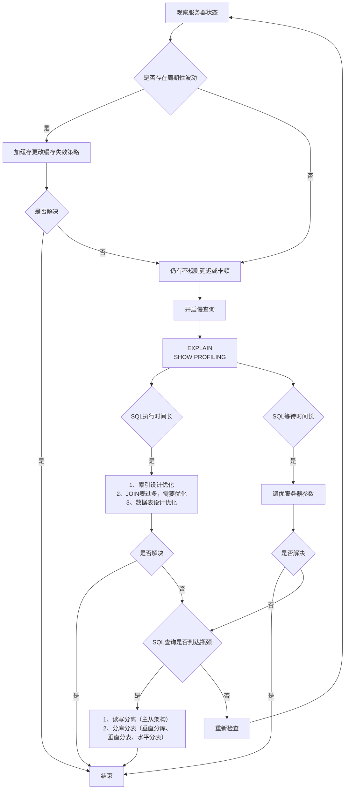

# 性能分析工具的使用

在数据库调优中，我们的目标就是`响应时间更快，吞吐量更大`。利用宏观的监控工具和微观的日志分析可以帮我们快速找到调优的思路和方式。

## 数据库服务器的优化步骤

当我们遇到数据库调优问题的时候，该如何思考呢？这里把思考的流程整理成下面这张图。



## 查看系统性能参数

在 MySQL 中，可以使用 `SHOW STATUS` 语句查询一些 MySQL 数据库服务器的**性能参数**、**执行频率**。

SHOW STATUS 语句语法

```sql
SHOW [GLOBAL|SESSION] STATUS LIKE '参数';
```

**常用性能参数**

- `Connections`：连接 MySQL 服务器的次数。
- `Uptime`：MySQL 服务器的上线时间。
- `Slow_queries`：慢查询的次数。
- `Innodb_rows_read`：Select 查询返回的行数
- `Innodb_rows_inserted`：执行 INSERT 操作插入的行数
- `Innodb_rows_updated`：执行 UPDATE 操作更新的行数
- `Innodb_rows_deleted`：执行 DELETE 操作删除的行数
- `Com_select`：查询操作的次数。
- `Com_insert`：插入操作的次数。对于批量插入的 INSERT 操作，只累加一次。
- `Com_update`：更新操作的次数。
- `Com_delete`：删除操作的次数。

示例：

```sql
-- 查询MySQL服务器的连接次数
SHOW STATUS LIKE 'Connections';

-- 查询MySQL服务器的上线时间
SHOW STATUS LIKE 'Uptime';

-- 查询MySQL服务器的慢查询次数
SHOW STATUS LIKE 'Slow_queries';
-- 慢查询次数可以结合慢查询日志找出慢查询语句，然后针对慢查询语句进行 表结构优化 和 查询语句优化
```

## 统计SQL的查询成本：last_query_cost

一条 SQL 查询语句在执行前需确定查询执行计划，若存在多种执行计划，MySQL 会计算每个执行计划的成本，选择**成本最小**的作为最终执行计划。

如果我们要查看某条 SQL 语句的查询成本，可以在执行完这条SQL语句之后，通过查看当前会话中的`last_query_cost`变量值获取当前查询的成本。它通常也是我们`评价一个查询执行效率`的常用指标。这个查询成本对应的是`SQL 语句需要读取的页的数量`。

```sql
SHOW STATUS LIKE 'last_query_cost';
```

:::details 数据准备

数据依然使用的是 索引设计原则 中的`student`表，此表有100w条数据。

此处不再赘述。

:::

如果我们想要查询 id=900001 的记录，然后看下查询成本，我们可以直接在聚簇索引上进行查找:

```sql
SELECT student_id, class_id, name, create_time FROM student_info WHERE id = 900001;
```

运行结果（1 条记录，运行时间为 0.042s）。然后再看下查询优化器的成本，实际上我们只需要检索一个页即可:

```sql
mysql> SHOW STATUS LIKE 'last_query_cost';
+-----------------+----------+
| Variable_name   | Value    |
+-----------------+----------+
| Last_query_cost | 1.000000 |
+-----------------+----------+
```

如果我们想要查询 id 在 900001 到 9000100 之间的学生记录呢？

```sql
SELECT student_id, class_id, NAME, create_time FROM student_info WHERE id BETWEEN 900001 AND 900100;
```

运行结果（100 条记录，运行时间为 0.046s）。然后再看下查询优化器的成本，这时我们大概需要进行 20 个页的查询。

```sql
mysql> SHOW STATUS LIKE 'last_query_cost';
+-----------------+-----------+
| Variable_name   | Value     |
+-----------------+-----------+
| Last_query_cost | 21.134453 |
+-----------------+-----------+
```

你能看到页的数量是刚才的 20 倍，但是查询的效率并没有明显的变化，实际上这两个 SQL 查询的时间两个 SQL 查询时间基本一致。

原因是采用顺序读取方式将页面一次性加载到缓冲池中再查找，尽管**last_query_cost（页数量）增加不少**，但通过缓冲池机制，查询时间未明显增加。

**last_query_cost使用场景**：对于比较开销非常有用，尤其是有多种查询方式可选时。


> SQL 查询是一个动态的过程，从页加载的角度来看，我们可以得到以下两点结论：
>
> 1. `位置决定效率`。如果页就在数据库`缓冲池`中，那么效率是最高的，否则还需要从`内存`或者`磁盘`中进行读取，当然针对单个页的读取来说，如果页存在于内存中，会比在磁盘中读取效率高很多。
> 2. `批量决定效率`。如果我们从磁盘中对单一页进行随机读，那么效率是很低的（差不多10ms），而采用顺序读取的方式，批量对页进行读取，平均一页的读取效率就会提升很多，甚至要快于单个页面在内存中的随机读取。
>
> 所以说，遇到I/O并不用担心，方法找对了，效率还是很高的。我们首先要考虑数据存放的位置，如果是经常使用的数据就要尽量放到`缓冲池`中，其次我们可以充分利用磁盘的吞吐能力，一次性批量读取数据，这样单个页的读取效率也就得到了提升。
