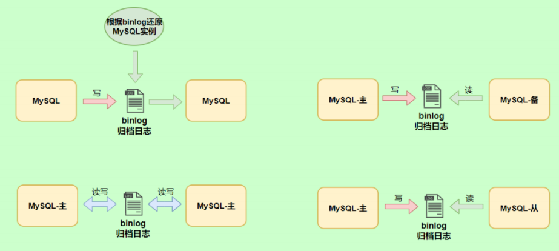
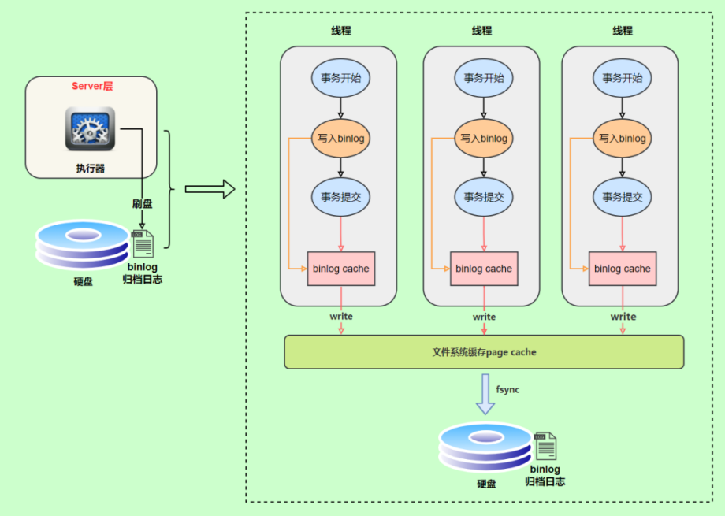
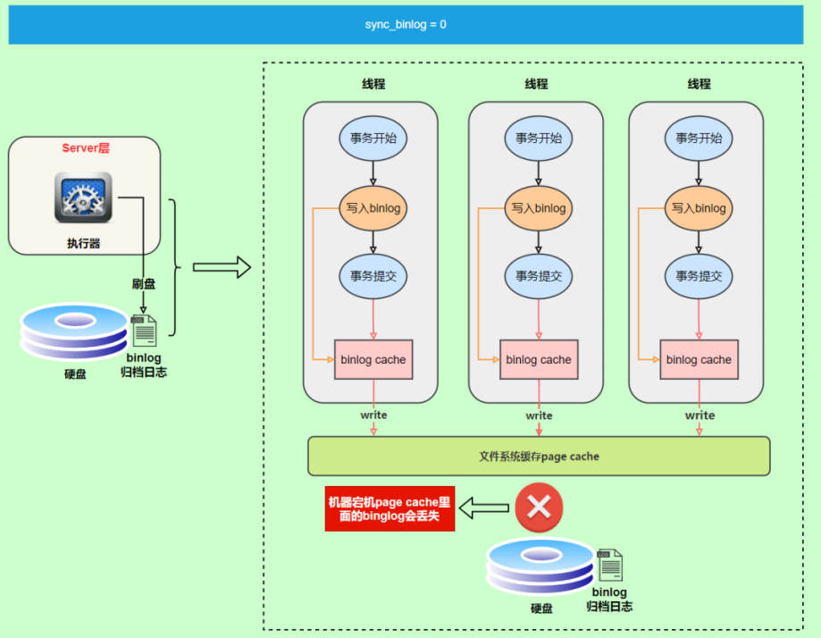
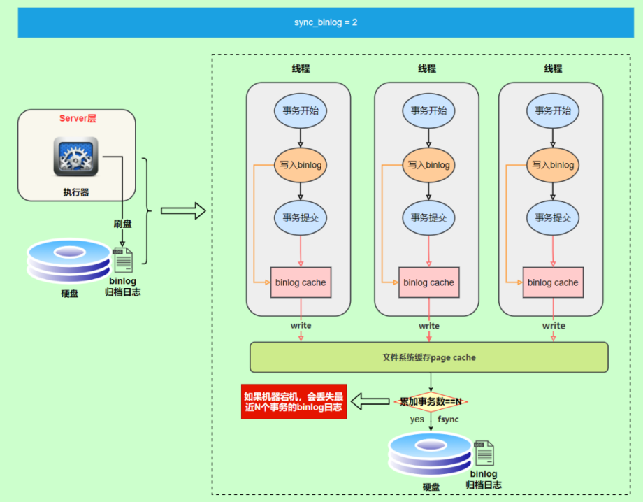
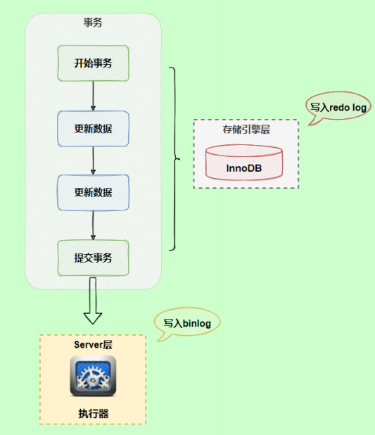
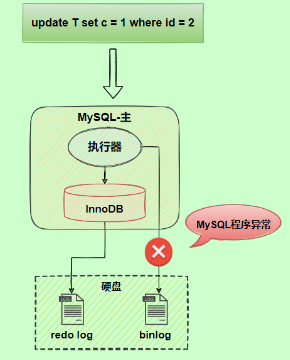
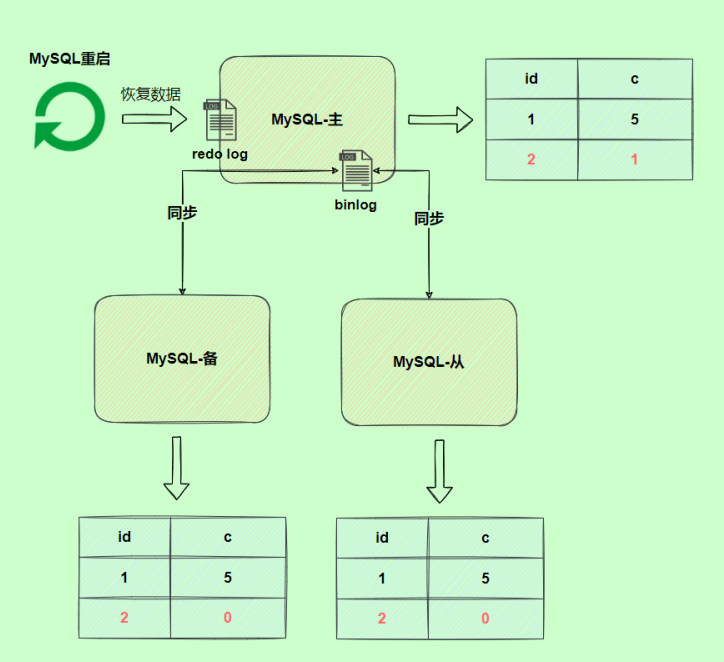
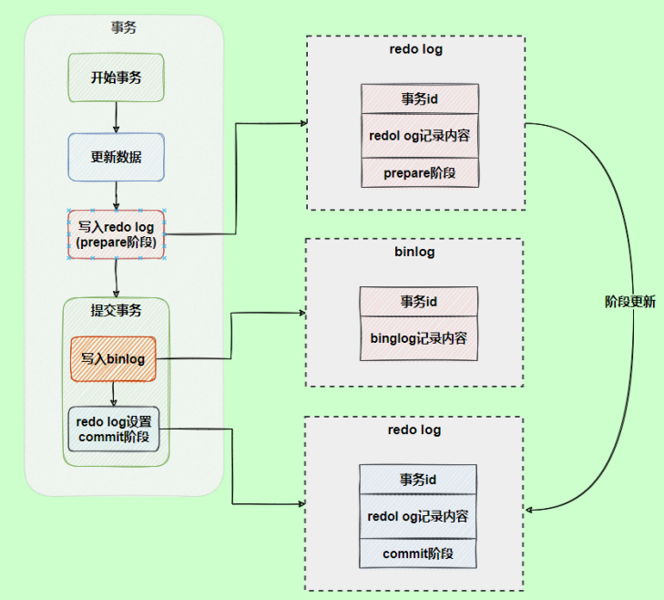
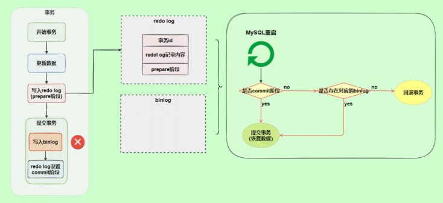
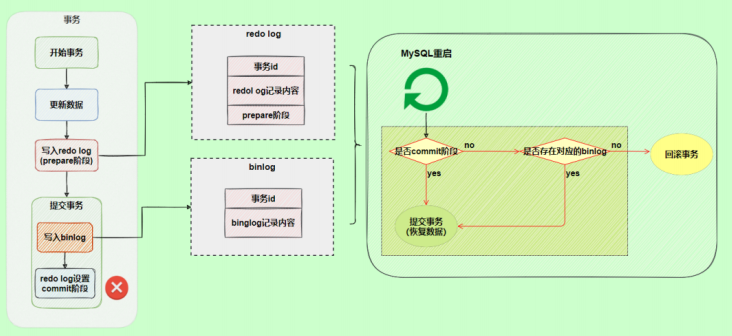

# 数据库日志

为什么需要数据库日志？

对于一个线上数据库应用系统来说，突然遭遇数据库宕机怎么办？

在这种情况下，定位宕机的原因就非常关键。我们可以查看数据库的`错误日志（error log）`。因为日志中记录了数据库运行中的诊断信息，包括了错误、警告和注释等信息。

比如：从日志中发现某个连接中的 SQL 操作发生了死循环，导致内存不足，被系统强行终止了。明确了原因，处理起来也就轻松了，系统很快就恢复了运行。

除了发现错误，日志在数据复制、数据恢复、操作审计，以及确保数据的永久性和一致性等方面，都有着不可替代的作用。

:::tip

千万不要小看日志。很多看似奇怪的问题，答案往往就藏在日志里。很多情况下，只有通过查看日志才能发现问题的原因，真正解决问题。

所以，一定要学会查看日志，养成检查日志的习惯，对提升你的数据库应用开发能力至关重要。

:::

> MySQL8.0 官网日志地址：https://dev.mysql.com/doc/refman/8.0/en/server-logs.html

## MySQL支持的日志

### 日志类型

MySQL有不同类型的日志文件，用来存储不同类型的日志，分为`二进制日志`、`错误日志`、`通用查询日志`和`慢查询日志`，这也是常用的4种。

MySQL 8又新增两种支持的日志：`中继日志`和`数据定义语句日志`。

使用这些日志文件，可以查看MySQL内部发生的事情。

- **慢查询日志**：记录所有执行时间超过`long_query_time`的所有查询，方便我们对查询进行优化。

- **通用查询日志**：记录所有连接的起始时间和终止时间，以及连接发送给数据库服务器的所有指令，对我们复原操作的实际场景、发现问题，甚至是对数据库操作的审计都有很大的帮助。

- **错误日志**：记录MySQL服务的启动、运行或停止MySQL服务时出现的问题，方便我们了解服务器的状态，从而对服务器进行维护。

- **二进制日志**：记录所有更改数据的语句，可以用于主从服务器之间的数据同步，以及服务器遇到故障时数据的无损失恢复。

- **中继日志**：用于主从服务器架构中，从服务器用来存放主服务器二进制日志内容的一个中间文件。从服务器通过读取中继日志的内容，来同步主服务器上的操作。

- **数据定义语句日志**：记录数据定义语句执行的元数据操作。

:::warning 注意

除二进制日志外，其他日志都是`文本文件`。默认情况下，所有日志文件都位于`MySQL数据目录`中。

:::

### 日志的弊端

- 日志功能会`降低MySQL数据库的性能`。例如，在查询非常频繁的 MySQL 数据库系统中，如果开启了通用查询日志和慢查询日志，MySQL 数据库会花费很多时间记录日志。

- 日志会`占用大量的磁盘空间`。对于用户量非常大、操作非常频繁的数据库，日志文件需要的存储空间设置比数据库文件需要的存储空间还要大。

## 慢查询日志（slow query log）

> [慢查询日志（slow query log）：定位执行慢的SQL](./性能分析工具的使用.md#slow-query-log)

## 通用查询日志（general query log）

通用查询日志用来`记录用户的所有操作`，包括启动和关闭MySQL服务、所有用户的连接开始时间和截止时间、发给 MySQL 数据库服务器的所有 SQL 指令等。当我们的数据发生异常时，**查看通用查询日志，还原操作时的具体场景**，可以帮助我们准确定位问题。

### 问题描述——引入为什么需要通用查询日志

在电商系统中，购买商品并且使用微信支付完成以后，却发现支付中心的记录并没有新增，此时用户再次使用支付宝支付，就会出现`重复支付`的问题。但是当去数据库中查询数据的时候，会发现只有一条记录存在。那么此时给到的现象就是只有一条支付记录，但是用户却支付了两次。

我们对系统进行了仔细检查，没有发现数据问题，因为用户编号和订单编号以及第三方流水号都是对的。可是用户确实支付了两次，这个时候，我们想到了检查通用查询日志，看看当天到底发生了什么。

查看之后，发现：1 月 1 日下午 2 点，用户使用微信支付完以后，但是由于网络故障，支付中心没有及时收到微信支付的回调通知，导致当时没有写入数据。1 月 1 日下午 2 点 30，用户又使用支付宝支付，此时记录更新到支付中心。1 月 1 日晚上 9 点，微信的回调通知过来了，但是支付中心已经存在了支付宝的记录，所以只能覆盖记录了。

由于网络的原因导致了重复支付。至于解决问题的方案就很多了，这里省略。

可以看到通用查询日志可以帮助我们了解操作发生的具体时间和操作的细节，对找出异常发生的原因极其关键。

:::warning 扩展

重复支付

:::

### 查看当前状态

```sql
mysql> SHOW VARIABLES LIKE '%general%';
+------------------+-------------------------+
| Variable_name    | Value                   |
+------------------+-------------------------+
| general_log      | OFF                     | #通用查询日志处于关闭状态
| general_log_file | /var/lib/mysql/test.log | #通用查询日志文件的名称是test.log
+------------------+-------------------------+
2 rows in set (0.03 sec)
```

说明：

- 系统变量 `general_log` 的值是 `OFF`，即通用查询日志处于关闭状态。在 MySQL 中，这一参数`默认是关闭的`。因为一旦开启记录通用查询日志，MySQL 会记录所有的连接起止和相关的 SQL 操作，这样会消耗系统资源并且占用磁盘空间。我们可以通过手动修改变量的值，在`需要的时候开启日志`。

- 通用查询日志文件的名称是 `test.log`。存储路径是 `/var/lib/mysql/`，默认也是数据路径。这样我们就知道在哪里可以查看通用查询日志的内容了。

### 启动日志

**方式 1：永久性方式**

修改 `my.cnf` 或者 `my.ini` 配置文件来设置。在 `[mysqld]` 组下加入 `log` 选项，并重启 MySQL 服务。格式如下：

```ini
[mysqld]
general_log=ON
general_log_file=[path[filename]]  #日志文件所在目录路径，filename为日志文件名
```

如果不指定目录和文件名，通用查询日志将默认存储在 MySQL 数据目录中的 `hostname.log` 文件中，`hostname` 表示主机名。

**方式 2：临时性方式**

```sql
SET GLOBAL general_log=on; # 开启通用查询日志

SET GLOBAL general_log_file=’path/filename’; # 设置日志文件保存位置

SET GLOBAL general_log=off; # 关闭通用查询日志

SHOW VARIABLES LIKE 'general_log%'; # 查看设置后情况
```

### 查看日志

通用查询日志以`文本文件`形式存储，可通过文本编辑器直接打开，且每台 MySQL 服务器的通用查询日志内容不同。

查看方式：

- Windows 系统：使用文本文件查看器；
- Linux 系统：使用 vi 工具或 gedit 工具；
- Mac OSX 系统：使用文本文件查看器或 vi 等工具。

可通过执行`SHOW VARIABLES LIKE 'general_log%';`查看通用查询日志的位置。

通过通用查询日志，我们可以了解用户对 MySQL 的操作，比如 MySQL启动信息、用户root连接服务器及执行查询表的记录等。

如下是一个通用查询日志的例子：

```shell
/usr/sbin/mysqld, Version: 8.0.26 (MySQL Community Server - GPL). started with:
Tcp port: 3306 Unix socket: /var/lib/mysql/mysql.sock
Time      Id  Command Argument
2025-11-18T07:44:58.052890Z 10  Query    SHOW VARIABLES LIKE '%general%'
2025-11-18T07:45:15.666672Z 10  Query    SHOW VARIABLES LIKE 'general_log%'
2025-11-18T07:45:28.970765Z 10  Query    select * from student
2025-11-18T07:47:38.706804Z 11  Connect  root@localhost on using Socket
2025-11-18T07:47:38.707435Z 11  Query    select @@version_comment limit 1
2025-11-18T07:48:21.384886Z 12  Connect  root@192.168.188.150 on using TCP/IP
2025-11-18T07:48:21.385253Z 12  Query    SET NAMES utf8
2025-11-18T07:48:21.385640Z 12  Query    USE test1
2025-11-18T07:48:21.386179Z 12  Query    SHOW FULL TABLES WHERE Table_Type != 'VIEW'
2025-11-18T07:48:23.901778Z 13  Connect  root@192.168.188.150 on using TCP/IP
2025-11-18T07:48:23.902128Z 13  Query    SET NAMES utf8
2025-11-18T07:48:23.905179Z 13  Query    USE test
2025-11-18T07:48:23.905825Z 13  Query    SHOW FULL TABLES WHERE Table_Type != 'VIEW'
2025-11-18T07:48:32.163833Z 14  Connect  root@192.168.188.150 on using TCP/IP
2025-11-18T07:48:32.164451Z 14  Query    SET NAMES utf8
2025-11-18T07:48:32.164840Z 14  Query    USE test
2025-11-18T07:48:40.006687Z 14  Query    select * from account
```

在通用查询日志里面，我们可以清楚地看到，什么时候开启了新的客户端登陆数据库，登录之后做了什么 SQL 操作，针对的是哪个数据表等信息。

### 停止日志

**方式1：永久性方式**

修改 `my.cnf` 或者 `my.ini` 文件，把`[mysqld]`组下的 `general_log` 值设置为 `OFF` 或者把`general_log`一项注释掉。修改保存后，再**重启 MySQL 服务**，即可生效。

```ini
[mysqld]
general_log=OFF

# 或

[mysqld]
#general_log=ON
```

**方式2：临时性方式**

使用`SET`语句停止 MySQL 通用查询日志功能：

```sql
SET GLOBAL general_log=off;
```

### 删除/刷新日志

如果数据的使用非常频繁，那么通用查询日志会占用服务器非常大的磁盘空间。数据管理员可以删除很长时间之前的查询日志，以保证 MySQL 服务器上的硬盘空间。

**手动删除文件**

查看通用查询日志的位置：

```sql
SHOW VARIABLES LIKE 'general_log%';
```

可以看出，通用查询日志的目录默认为 MySQL 数据目录。在该目录下手动删除通用查询日志`test.log`。

---

**刷新日志文件/重新生成日志文件**

使用如下命令重新生成查询日志文件，具体命令如下。刷新 MySQL 数据目录，发现创建了新的日志文件。前提一定要开启通用日志。

```shell
mysqladmin -uroot -p flush-logs
```

::: warning

通用查询日志都是使用`mysqladmin flush-logs`命令来删除重建的。

使用时，如果旧的还需要通用查询日志，请手动保存，因为该命令会覆盖掉旧的通用查询日志。

正确流程如下：

```shell
cd mysql-data-directory  #输入自己的通用日志文件所在目录
mv mysql.general.log mysql.general.log.old  #指名旧的文件名 以及 新的文件名
mysqladmin -uroot -p flush-logs
```

:::

## 错误日志（error log）

错误日志记录了 MySQL 服务器启动、停止运行的时间，以及系统启动、运行和停止过程中的诊断信息，包括`错误`、`警告`和`提示`等。

通过错误日志可以查看系统的运行状态，便于即时发现故障、修复故障。如果 MySQL 服务`出现异常`，错误日志是发现问题、解决故障的`首选`。

:::tip 说明

这里需要说明的是，有些人可能会认为直接查看通用查询日志就可以定位问题，并且它记录的更详细。其实不然

- 首先，通用查询日志记录的是用户的所有操作，包括正常的和异常的，日志较多，排查比较困难；而错误日志只记录`异常信息`，定位问题会更轻松。
- 其次，通用查询日志默认是关闭的，线上环境一般不会开启，只有在调试的时候才会开启。而**错误日志是默认开启的，且无法关闭**。

:::

### 启动日志

在MySQL数据库中，错误日志功能是`默认开启`的。而且，错误日志`无法被禁止`。

默认情况下，错误日志存储在 MySQL 数据库的数据文件夹下，名称默认为`mysqld.log`（Linux 系统）或 `hostname.err`（mac 或 unix 系统）。如果需要指定文件名，则需要在my.cnf或者my.ini中做如下配置：

```ini
[mysqld] 
log-error=[path/[filename]] #path为日志文件所在的目录路径，filename为日志文件名
```

需要注意的是，修改配置项后需要重启MySQL服务，才能生效。

### 查看日志

与通用查询日志一样，MySQL错误日志也是以`文本文件`形式存储，可通过文本编辑器直接打开。

```sql
mysql> SHOW VARIABLES LIKE 'log_err%';
+----------------------------+---------------------------------+
| Variable_name              | Value                           |
+----------------------------+---------------------------------+
| log_error                  | /var/log/mysqld.log             |
| log_error_services         | log_filter_internal; log_sink_internal |
| log_error_suppression_list |                                 |
| log_error_verbosity        | 2                               |
+----------------------------+---------------------------------+
rows in set (0.01 sec)
```

执行结果中可以看到错误日志文件是`mysqld.log`，位于 MySQL 默认的`数据目录`下。

下面我们查看一下错误日志的内容：

```shell
2025-01-04T08:44:58.307609Z 0 [System] [MY-010116] [Server] /usr/sbin/mysqld (mysqld 8.0.26) starting as process 1347
2025-01-04T08:44:58.324902Z 1 [System] [MY-013576] [InnoDB] InnoDB initialization has started.
2025-01-04T08:44:58.615451Z 1 [System] [MY-013577] [InnoDB] InnoDB initialization has ended.
2025-01-04T08:44:58.850032Z 0 [Warning] [MY-013746] [Server] A deprecated TLS version TLSv1 is enabled for channel mysql_main
```

可以看到，错误日志文件中记录了服务器启动的时间，以及存储引擎 InnoDB 启动和停止的时间等。我们在做初始化时候生成的数据库初始密码也是记录在`mysqld.log`中。

### 删除/刷新日志

对于很久以前的错误日志，数据库管理员查看这些错误日志的可能性不大，可以将这些错误日志删除，以保证 MySQL 服务器上的**硬盘空间**。

MySQL 的错误日志是以文本文件的形式存储在文件系统中的，可以**直接删除**。

**删除日志**

**方式 1**：删除操作

```shell
rm -f /var/lib/mysql/mysqld.log
```

> 在运行状态下删除错误日志文件后，MySQL 并不会自动创建日志文件。

**方式 2**：重命名文件

```shell
mv /var/log/mysqld.log /var/log/mysqld.log.old
```

---

**重建日志**

```shell
mysqladmin -uroot -p flush-logs
```

这里强调的是，直接执行上述命令，大概率不能成功的重建错误日志，会报如下错误：

```shell
mysqladmin: refresh failed; error: 'Could not open file '/var/log/mysqld.log' for error logging.'
```

查询MySQL官方文档发现如下提示：

> [!NOTE]
> For the server to recreate a given log file after you have renamed the file externally, the file location must be writable by the server. This may not always be the case. For example, on Linux, the server might write the error log as /var/log/mysqld.log, where /var/log is owned by root and not writable by mysqld. In this case, log-flushing operations fail to create a new log file.
>
> To handle this situation, you must manually create the new log file with the proper ownership after renaming the original log file. For example, execute these commands as root:
>
> ```shell
> mv /var/log/mysqld.log /var/log/mysqld.log.old
> install -omysql -gmysql -m0644 /dev/null /var/log/mysqld.log
> ```

因此，重建错误日志的正确方式如下：

```shell
install -omysql -gmysql -m0644 /dev/null /var/log/mysqld.log
mysqladmin -uroot -p flush-logs
```

**`flush-logs`指令操作**：

- MySQL 5.5.7 以前的版本，`flush-logs`将错误日志文件重命名为`filename.err_old`，并创建新的日志文件。
- 从 MySQL 5.5.7 开始，`flush-logs`只是重新打开日志文件，并不做日志备份和创建的操作。
  - 正因如此，所以我们直接执行`mysqladmin -uroot -p flush-logs`会报错打不开错误日志文件
- 如果日志文件不存在，MySQL 启动或者执行`flush-logs`时会自动创建新的日志文件。重新创建错误日志，大小为 0 字节。

### MySQL8.0对错误日志的改进

MySQL8.0 里对错误日志的改进。MySQL8.0 的错误日志可以理解为一个全新的日志，在这个版本里，接受了来自社区的广泛批评意见，在这些意见和建议的基础上生成了新的日志。

下面这些是来自社区的意见：

- 默认情况下内容过于冗长
- 遗漏了有用的信息
- 难以过滤某些信息
- 没有标识错误信息的子系统源
- 没有错误代码，解析消息需要识别错误
- 引导消息可能会丢失
- 固定格式

针对这些意见，MySQL 做了如下改变：

- 采用组件架构，通过不同的组件执行日志的写入和过滤功能
- 写入错误日志的全部信息都具有唯一的错误代码从 10000 开始
- 增加了一个新的消息分类《system》用于在错误日志中始终可见的非错误但服务器状态更改事件的消息
- 增加了额外的附加信息，例如关机时的版本信息，谁发起的关机等等
- 两种过滤方式，Internal 和 Dragnet
- 三种写入形式，经典、JSON 和 syseventlog

### 小结

通常情况下，管理员不需要查看错误日志。但是，MySQL 服务器发生异常时，管理员可以从错误日志中找到发生异常的时间、原因，然后根据这些信息来解决异常。

## 二进制日志（bin log）

binlog 可以说是 MySQL 中比较重要的日志了，在日常开发及运维过程中，经常会遇到。

binlog 即 binary log，二进制日志文件，也叫作**变更日志**（update log）。它记录了数据库所有执行的 `DDL` 和 `DML` 等数据库**更新事件**的语句，但是不包含没有修改任何数据的语句（如数据查询语句 select、show 等）。

它以`事件形式`记录并保存在`二进制文件`中。通过这些信息，我们可以再现数据更新操作的全过程。

如果想要记录所有语句（例如，为了识别有问题的查询），需要使用通用查询日志。

:::tip

**为什么bin log不记录查询语句？**

- 角度一：如果bin log记录了查询相关的操作，那么就相对于记录了所有的SQL操作了，这样的话他与通用查询日志（general query log）区别就不大了，bin log就失去了它存在的意义。

- 角度二：二进制日志主要用于数据恢复和数据复制，与查询无关，所以没有必要记录查询操作。

:::

binlog 主要应用场景：

- 一是用于`数据恢复`，如果 MySQL 数据库意外停止，可以通过二进制日志文件来查看用户执行了哪些操作，对数据库服务器文件做了哪些修改，然后根据二进制日志文件中的记录来恢复数据库服务器。
- 二是用于`数据复制`，由于日志的延续性和时效性，master 把它的二进制日志传递给 slaves 来达到 master-slave 数据一致的目的。

可以说 MySQL 数据库的`数据备份`、`主备`、`主主`、`主从`都离不开 binlog，需要依靠 binlog 来同步数据，保证数据一致性。



### 查看默认情况

查看记录二进制日志是否开启：在 `MySQL8` 中`默认`情况下，二进制文件是`开启`的。

```sql
mysql> show variables like '%log_bin%';
+---------------------------------+---------------------------------+
| Variable_name                   | Value                           |
+---------------------------------+---------------------------------+
| log_bin                         | ON                              |
| log_bin_basename                | /var/lib/mysql/binlog           |
| log_bin_index                   | /var/lib/mysql/binlog.index     |
| log_bin_trust_function_creators | OFF                             |
| log_bin_use_v1_row_events       | OFF                             |
| sql_log_bin                     | ON                              |
+---------------------------------+---------------------------------+
6 rows in set (0.00 sec)
```

说明：

- `log_bin`：表示binlog日志是否开启，ON 为开启，OFF 为关闭。在 MySQL 8 中默认开启。
- `log_bin_basename`：binlog日志的基础名称，包含路径和文件名前缀。
  - 例如这里的 /var/lib/mysql/binlog，实际生成的日志文件会以该名称为基础，加上编号后缀（如 `binlog.000001`、`binlog.000002`）。
  - 需要注意的是，每当我们**重启MySQL服务器时，MySQL 会生成一个新的 binlog 文件**，并更新索引文件。
- `log_bin_index`：二进制日志索引文件的路径和名称，该文件记录了所有二进制日志文件的列表，MySQL 通过它来管理二进制日志文件集。
  - 因为binlog会生成很多文件，所以需要索引文件来管理。
- `log_bin_trust_function_creators`：控制创建存储函数时，是否信任函数的创建者。OFF 表示不信任，此时创建存储函数需要满足一定的安全条件；ON 表示信任，可直接创建。
  - 例如，我们写了一个存储函数，当中增删改操作中包含了`NOW()`函数，master 服务器在执行这个存储函数时，会将该操作记录到 binlog 中。当slave 端执行该存储函数时，`NOW()`函数会被重新执行，进而导致主从数据不一致。因此MySQL默认不信任存储函数的创建者，所以会拒绝执行存储函数。
- `log_bin_use_v1_row_events`：是否使用版本 1 的行事件格式。OFF 表示使用当前版本（MySQL 5.6 中为版本 2）的行事件格式，一般建议保持 OFF 以获得更好的性能和兼容性。
  - 注意，此变量为只读系统变量，**已弃用**
- `sql_log_bin`：控制当前会话是否记录二进制日志。ON 表示记录，OFF 表示当前会话的操作不记录到二进制日志中。

### 日志参数设置

**方式1：永久性方式**

修改 MySQL 的 `my.cnf` 或 `my.ini` 文件可以设置二进制日志的相关参数：

```ini
[mysqld]
#启用二进制日志
log-bin=mysql-bin
binlog_expire_logs_seconds=600
max_binlog_size=100M
```

需要注意的是，修改配置项后需要重启 MySQL 服务才能生效。

说明：

- `log-bin=mysql-bin` #打开日志 (主机需要打开)，这个`mysql-bin`也可以自定义，这里也可以加上路径，如：`/home/www/mysql_bin_log/mysql-bin`

- `binlog_expire_logs_seconds`：此参数控制二进制日志文件保留的时长，单位是`秒``=，默认`2592000`（30 天）。
  - 示例：`14400`（4 小时）；`86400`（1 天）；`259200`（3 天）。

- `max_binlog_size`：控制单个二进制日志大小，当前日志文件大小超过此变量时，执行切换动作。此参数的`最大值和默认值都是 1GB`，该设置并`不能严格控制binlog文件的大小`，尤其是 binlog 比较靠近最大值而又遇到一个比较大事务时，为了保证事务的完整性，可能不做切换日志的动作，只能将该事务的所有 SQL 都记录进当前日志，直到事务结束。一般情况下可采取默认值。

:::warning 温馨提示

生产环境中，`数据库文件最好不要与日志文件放在同一个磁盘上`。这样，当数据库文件所在的磁盘发生故障时，可以使用日志文件恢复数据

---

接下来演示**设置带文件夹的bin-log日志存放目录**，线上环境按需要自行配置。

- 1、`my.cnf`或`my.ini`中的`log_bin`参数修改如下：

```ini
[mysqld]
log-bin="/var/lib/mysql/binlog/jingdianlaoge-bin"
```

- 2、**注意**：新建的文件夹需要使用`mysql`用户，使用下面的命令即可。

```shell
chown -R -v mysql:mysql binlog
```

重启 MySQL 服务之后，新的二进制日志文件将出现在`/var/lib/mysql/binlog/`文件夹下面：

```sql
mysql> show variables like '%log_bin%';
+---------------------------------+---------------------------------------------+
| Variable_name                   | Value                                       |
+---------------------------------+---------------------------------------------+
| log_bin                         | ON                                          |
| log_bin_basename                | /var/lib/mysql/jingdianlaoge-bin            |
| log_bin_index                   | /var/lib/mysql/jingdianlaoge-bin.index      |
| log_bin_trust_function_creators | OFF                                         |
| log_bin_use_v1_row_events       | OFF                                         |
| sql_log_bin                     | ON                                          |
+---------------------------------+---------------------------------------------+
6 rows in set (0.00 sec)
```

:::

---

**方式2：临时性方式**

如果不希望通过修改配置文件并重启的方式设置二进制日志的话，还可以使用如下指令

> 需要注意的是，在 mysql8 中只有会话级别的设置，没有了global级别的设置。

```sql
# global 级别 
mysql> set global sql_log_bin=0; 
ERROR 1228 (HY000): Variable 'sql_log_bin' is a SESSION variable and can`t be used with SET GLOBAL 

# session级别 
mysql> SET sql_log_bin=0; 
Query OK, 0 rows affected (0.00 sec)
```

### 查看日志

当 MySQL 创建二进制日志文件时，先创建一个以 “`filename`” 为名称、以 “`.index`” 为后缀的文件，再创建一个以 “filename” 为名称、以 “`.000001`” 为后缀的文件。

MySQL 服务重新启动一次，以 “.000001” 为后缀的文件就会增加一个，并且后缀名按 1 递增。即日志文件的个数与 MySQL 服务启动的次数相同；如果日志长度超过了`max_binlog_size的`上限（默认是 1GB），就会创建一个新的日志文件。

查看当前的二进制日志文件列表及大小。指令如下：

```sql
mysql> SHOW BINARY LOGS;
+------------------+-----------+-----------+
| Log_name         | File_size | Encrypted |
+------------------+-----------+-----------+
| mysql-bin.000001 | 156       | No        |
+------------------+-----------+-----------+
1 rows in set (0.00 sec)
```

所有对数据库的修改都会记录在 binlog 中。

需要注意的是，binlog 是二进制文件，无法直接查看，想要更直观地查看内容则需要借助`mysqlbinlog`命令工具了。

#### mysqlbinlog 工具查看日志

指令如下，在查看执行前，先执行一条 SQL 语句，如下：

```sql
update student set name='张三_back' where id=1;
```

开始查看 binlog：

```shell
mysqlbinlog "/var/lib/mysql/binlog/mysql-bin.000002"
```

> 直接执行`mysqlbinlog`命令可以看到结果，但是这是一个简单的日志文件，日志中记录了用户的一些操作，这里并没有出现具体的 SQL 语句，这是因为 binlog 关键字后面的内容是经过编码后的`二进制日志`。

我们可以使用`-v`参数，将二进制日志以`伪 SQL 的形式`表现出来。如下：

```shell{2,17,19,25-35}
mysqlbinlog -v "/var/lib/mysql/binlog/mysql-bin.000002"
#220105  9:16:37 server id 1  end_log_pos 324 CRC32 0x6b31978b  Query   thread_id=10
exec_time=0     error_code=0
SET TIMESTAMP=1641345397/*!*/;
SET @@session.pseudo_thread_id=10/*!*/;
SET @@session.foreign_key_checks=1, @@session.sql_auto_is_null=0, @@session.unique_checks=1, @@session.autocommit=1/*!*/;
SET @@session.sql_mode=1168113696/*!*/;
SET @@session.auto_increment_increment=1, @@session.auto_increment_offset=1/*!*/;
/*!\C utf8mb3 *//*!*/;
SET @@session.character_set_client=33,@@session.collation_connection=33,@@session.collation_server=255/*!*/;
SET @@session.lc_time_names=0/*!*/;
SET @@session.collation_database=DEFAULT/*!*/;
/*!80011 SET @@session.default_collation_for_utf8mb4=255*//*!*/;
BEGIN
/*!*/;
# at 324
#220105  9:16:37 server id 1  end_log_pos 391 CRC32 0x74f89890  Table_map: `test`.`student` mapped to number 85
# at 391
#220105  9:16:37 server id 1  end_log_pos 470 CRC32 0xc9920491  Update_rows: table id 85 flags: STMT_END_F
BINLOG '
dfHUYRMAAAAQwAAAICAAAAAFUAAAAAAAEACWF0Z3VpZ3UxNC5zdHVkZW50AQAw8PBDwAhgAG
AQEAAgEhkJj4dA==
dfHUYR8AAAATwAAAANYBAAAAAFUAAAAAAAEAAgAD//8AAQAAAABlvKDkuIKG5LiA54+tAAEAAAAAL5byg5LiJX2JhY2sG5LiA54+tkQSSyQ==
'/*!*/;
### UPDATE `test`.`student`
### WHERE
###   @1=1
###   @2='张三'
###   @3='一班'
### SET
###   @1=1
###   @2='张三_back'
###   @3='一班'
# at 470
#220105  9:16:37 server id 1  end_log_pos 501 CRC32 0xca01d30f  Xid = 15
COMMIT/*!*/;
```

这里一个`update`语句包含如下事件：

- Query 事件 负责开始一个事务 (BEGIN)
- Table_map 事件 负责映射需要的表
- Update_rows 事件 负责写入数据
- Xid 事件 负责结束事务

上面的命令同时显示了binlog的格式（即二进制格式），以及binlog的对应的`伪SQL`语句。如果不想显示二进制格式的语句，可以使用`--base64-output=DECODE-ROWS`参数。

```shell
# 不显示binlog格式的语句
mysqlbinlog -v --base64-output=DECODE-ROWS "/var/lib/mysql/binlog/mysql-bin.000002"
```

关于`mysqlbinlog`工具的使用技巧还有很多，例如只解析对某个库的操作或者某个时间段内的操作等。简单分享几个常用的语句，更多操作可以参考官方文档。

```shell
# 可查看参数帮助 
mysqlbinlog --no-defaults --help 

# 查看最后100行 
mysqlbinlog --no-defaults --base64-output=decode-rows -vv mysql-bin.000002 | tail -100 

# 根据position查找 
mysqlbinlog --no-defaults --base64-output=decode-rows -vv mysql-bin.000002 | grep -A20 '4939002'
```

#### show binlog events 命令查看日志

上面这种办法读取出binlog日志的全文内容比较多，不容易分辨查看到pos点信息，下面这种方式更为方便的查询命令：

```sql
mysql> show binlog events [IN 'log_name'] [FROM pos] [LIMIT [offset,] row_count];
```

- `IN 'log_name'`：指定要查询的binlog文件名（不指定就是第一个binlog文件）
- `FROM pos`：指定从哪个pos起始点开始查起（不指定就是从整个文件首个pos点开始算）
- `LIMIT [offset]`：偏移量（不指定就是0）
- `row_count`:查询总条数（不指定就是所有行）

示例：

```sql
mysql> show binlog events in 'mysql-bin.000002';
```

更多举例：

```sql
# 查询第一个最早的 binlog 日志（不指定log_name，查询的就是第一个binlog文件）
show binlog events\G;

# 指定查询mysql-bin.000002这个文件
show binlog events in 'mysql-bin.000002'\G;

# 指定查询mysql-bin.000002这个文件，从 pos 点391开始查起：
show binlog events in 'mysql-bin.000002' from 391\G;

# 指定查询mysql-bin.000002这个文件，从 pos 点391开始查起，查询 5 条（即 5 条语句）
show binlog events in 'mysql-bin.000002' from 391 limit 5\G;

# 指定查询mysql-bin.000002这个文件，从 pos 点391开始查起，偏移 2 行（即中间跳过 2 个）查询 5 条（即 5 条语句）。
show binlog events in 'mysql-bin.000002' from 391 limit 2,5\G;
```

---

上面我们这么多都是基于 binlog 的默认格式，binlog 格式查看如下：

```sql
mysql> show variables like 'binlog_format';
+---------------+-------+
| Variable_name | Value |
+---------------+-------+
| binlog_format | ROW   |
+---------------+-------+
1 rows in set (0.00 sec)
```

除此之外，binlog 还有 2 种格式，分别是**Statement**和**Mixed**

- Statement

每一条会修改数据的 SQL 都会记录在 binlog 中。

优点：不需要记录每一行的变化，减少了 binlog 日志量，节约了IO，提高性能。

- Row

5.1.5 版本的 MySQL 才开始支持 row level 的复制，它不记录 SQL 语句上下文相关信息，仅保存哪条记录被修改。

优点：row level 的日志内容会非常清楚的记录下每一行数据修改的细节。而且不会出现某些特定情况下的存储过程，或 function，以及 trigger 的调用和触发无法被正确复制的问题。

- Mixed

从 5.1.8 版本开始，MySQL 提供了 Mixed 格式，实际上就是 Statement 与 Row 的结合。

> !!!todo 此处省略，后续有详细介绍

### 使用日志恢复数据

如果MySQL服务器启用了二进制日志，在数据库出现意外丢失数据时，可以使用`mysqlbinlog`工具从指定的时间点开始（例如，最后一次备份）直到现在或另一个指定的时间点的日志中恢复数据。

`mysqlbinlog`恢复数据的语法如下：

```bash
mysqlbinlog [option] filename|mysql -uuser -ppass;
```

这个命令可以这样理解：使用`mysqlbinlog`命令来读取`filename`中的内容，然后使用`mysql`命令将这些语句恢复到数据库中。

- `filename`：是日志文件名。

- `option`：可选项，比较重要的两对option参数是`--start-date`、`--stop-date` 和 `--start-position`、`-- stop-position`。
  - `--start-date`和`--stop-date`：可以指定恢复数据库的起始时间点和结束时间点。
  - `--start-position`和`--stop-position`：可以指定恢复数据的开始位置和结束位置。

> **注意**：使用`mysqlbinlog`命令进行恢复操作时，必须是编号小的先恢复，例如`mysql-bin.000001`必须在`mysql-bin.000002`之前恢复。

案例：

现在对`student`表进行了插入、更新和删除等操作后，不小心删除了前面新增的数据，需要通过 binlog 恢复后面的新增、更新和删除的数据。

1、初始数据：

```sql
mysql> select * from student;
+----+-------+-------+
| id | name  | class |
+----+-------+-------+
|  1 | Tom1  | 一班  |
|  2 | Tom   | 一班  |
|  3 | Tom2  | 一班  |
|  7 | jerry | 一班  |
|  8 | 王五  | 二班  |
| 15 | 赵六  | 二班  |
| 17 | Tom1  | 三班  |
| 18 | Jerry | 四班  |
+----+-------+-------+
8 rows in set (0.00 sec)
```

2、插入了几条数据：

```sql
mysql> insert into student(id,name,class) values(20,'aaa','No.1');
Query OK, 1 row affected (0.01 sec)

mysql> insert into student(id,name,class) values(21,'aaa','No.1');
Query OK, 1 row affected (0.00 sec)

mysql> insert into student(id,name,class) values(22,'aaa','No.1');
Query OK, 1 row affected (0.01 sec)

mysql> select * from student;
+----+-------+-------+
| id | name  | class |
+----+-------+-------+
|  1 | Tom1  | 一班  |
|  2 | Tom   | 一班  |
|  3 | Tom2  | 一班  |
|  7 | jerry | 一班  |
|  8 | 王五  | 二班  |
| 15 | 赵六  | 二班  |
| 17 | Tom1  | 三班  |
| 18 | Jerry | 四班  |
| 20 | aaa   | No.1  |
| 21 | aaa   | No.1  |
| 22 | aaa   | No.1  |
+----+-------+-------+
11 rows in set (0.00 sec)
```

3、删除了一条记录：

```sql
mysql> delete from student where id = 20;
Query OK, 1 row affected (0.01 sec)

mysql> select * from student;
+----+-------+-------+
| id | name  | class |
+----+-------+-------+
|  1 | Tom1  | 一班  |
|  2 | Tom   | 一班  |
|  3 | Tom2  | 一班  |
|  7 | jerry | 一班  |
|  8 | 王五  | 二班  |
| 15 | 赵六  | 二班  |
| 17 | Tom1  | 三班  |
| 18 | Jerry | 四班  |
| 21 | aaa   | No.1  |
| 22 | aaa   | No.1  |
+----+-------+-------+
10 rows in set (0.00 sec)
```

4、更新了一条记录：

```sql
mysql> update student set name = 'bbb' where id = 21;
Query OK, 1 row affected (0.01 sec)
Rows matched: 1  Changed: 1  Warnings: 0

mysql> select * from student;
+----+-------+-------+
| id | name  | class |
+----+-------+-------+
|  1 | Tom1  | 一班  |
|  2 | Tom   | 一班  |
|  3 | Tom2  | 一班  |
|  7 | jerry | 一班  |
|  8 | 王五  | 二班  |
| 15 | 赵六  | 二班  |
| 17 | Tom1  | 三班  |
| 18 | Jerry | 四班  |
| 21 | bbb   | No.1  |
| 22 | aaa   | No.1  |
+----+-------+-------+
10 rows in set (0.00 sec)
```

--- 

5、误操作，不小心删除了id大于20的记录：

```sql
mysql> delete from student where id > 20;
Query OK, 2 rows affected (0.01 sec)

mysql> select * from student;
+----+-------+-------+
| id | name  | class |
+----+-------+-------+
|  1 | Tom1  | 一班  |
|  2 | Tom   | 一班  |
|  3 | Tom2  | 一班  |
|  7 | jerry | 一班  |
|  8 | 王五  | 二班  |
| 15 | 赵六  | 二班  |
| 17 | Tom1  | 三班  |
| 18 | Jerry | 四班  |
+----+-------+-------+
8 rows in set (0.00 sec)
```

接下来就需要通过binlog日志恢复误删的数据记录。

:::warning 温馨提示

我们通过binlog日志进行数据恢复的时候，又相当于对表进行了修改，所以binlog日志中会记录这些修改操作。

因此我们在恢复数据之前**建议**需要刷新日志。生成新的binlog日志，保证后续的操作不会影响到恢复的数据。

:::

**6、查看二进制日志文件列表**

```sql
mysql> SHOW BINARY LOGS;
+------------------+-----------+-----------+
| Log_name         | File_size | Encrypted |
+------------------+-----------+-----------+
| mysql-bin.000002 | 1046      | No        |
| mysql-bin.000003 | 179       | No        |
| mysql-bin.000004 | 179       | No        |
| mysql-bin.000005 | 1957      | No        |
+------------------+-----------+-----------+
4 rows in set (0.00 sec)
```

**7、刷新日志（方便恢复操作）**

建议执行`flush logs`刷新日志，重新创建一个 binlog 日志`mysql-bin.000006`，使后续操作写入新日志，保证`mysql-bin.000005`中仅包含需要恢复的操作日志。

```sql
mysql> flush logs;
Query OK, 0 rows affected (0.01 sec)

mysql> SHOW BINARY LOGS;
+------------------+-----------+-----------+
| Log_name         | File_size | Encrypted |
+------------------+-----------+-----------+
| mysql-bin.000002 | 1046      | No        |
| mysql-bin.000003 | 179       | No        |
| mysql-bin.000004 | 179       | No        |
| mysql-bin.000005 | 2006      | No        |
| mysql-bin.000006 | 150       | No        |
+------------------+-----------+-----------+
5 rows in set (0.00 sec)
```

**8、查看目标日志（`mysql-bin.000005`）的事件详情**

```sql
mysql> show binlog events in 'mysql-bin.000005';
```

执行上述命令，查看日志发现，在备份数据后首先执行的是插入数据操作，插入操作在三个事务中，且三个事务连在一起，开始 pos 是`464`，结束 pos 是`1308`。

**9、恢复插入的数据**

通过`mysqlbinlog`工具指定位置恢复数据：

```bash
/usr/bin/mysqlbinlog
--start-position=464
--stop-position=1308
--database=test
/var/lib/mysql/mysql-bin.000005 | /usr/bin/mysql -uroot -p123456 -v test
```

说明：

- `--start-position`：指定开始位置
- `--stop-position`：指定结束位置
- `--database`：指定数据库
- `/usr/bin/mysqlbinlog`：mysqlbinlog工具
- `/var/lib/mysql/mysql-bin.000005`：binlog日志文件路径
- `/usr/bin/mysql -uroot -p123456 -v test`：指定数据库连接信息

**10、验证恢复结果**

```sql
mysql> select * from student;
+----+-------+-------+
| id | name  | class |
+----+-------+-------+
|  1 | Tom1  | 一班  |
|  2 | Tom   | 一班  |
|  3 | Tom2  | 一班  |
|  7 | jerry | 一班  |
|  8 | 王五  | 二班  |
| 15 | 赵六  | 二班  |
| 17 | Tom1  | 三班  |
| 18 | Jerry | 四班  |
| 20 | aaa   | No.1  |
| 21 | aaa   | No.1  |
| 22 | aaa   | No.1  |
+----+-------+-------+
11 rows in set (0.00 sec)
```

可以看到最终结果和删除数据之前的结果一样，利用 binlog 实现了数据恢复。

> 恢复修改、恢复删除与上面类似，只不过是pos不一致，不再赘述。你可以自行演示

---

除了根据position恢复数据外，还可以根据时间范围进行恢复。

例如：恢复`2025-11-18 15:39:22`到`2025-11-18 15:40:19`时间段内的数据。

```bash
/usr/bin/mysqlbinlog 
--start-datetime="2025-11-18 15:39:22" 
--stop-datetime="2025-11-18 15:40:19" 
--database=test /var/lib/mysql/binlog/mysql-bin.000005 | /usr/bin/mysql -uroot -p123456 -v test
```

### 删除二进制日志

MySQL的二进制文件可以配置自动删除，同时MySQL也提供了安全的手动删除二进制日志的方法。

- `PURGE MASTER LOGS`只删除指定部分的binlog文件
- `RESTER MASTER`删除所有的binlog文件

#### PURGE MASTER LOGS：删除指定日志文件

语法如下：

```sql
PURGE {MASTER | BINARY} LOGS TO ‘指定日志文件名’ 
PURGE {MASTER | BINARY} LOGS BEFORE ‘指定日期’
```

**举例 1**：删除创建时间比指定日志早的所有日志

以删除创建时间比`binlog.000005`早的所有日志为例，具体步骤如下：

（1）多次重新启动 MySQL 服务，便于生成多个日志文件。然后用 SHOW 语句显示二进制日志文件列表

```sql
SHOW BINARY LOGS;
```

（2）执行`PURGE MASTER LOGS`语句删除创建时间比`binlog.000005`早的所有日志

```sql
PURGE MASTER LOGS TO "binlog.000005";
```

（3）显示二进制日志文件列表

```sql
SHOW BINARY LOGS;
```

比`binlog.000005`早的所有日志文件都已经被删除了。

---

**举例 2**：删除指定日期前创建的所有日志文件

以删除 2025 年 11 月 15 日前创建的所有日志文件为例，具体步骤如下：

（1）显示二进制日志文件列表

```sql
SHOW BINARY LOGS;
```

（2）执行`mysqlbinlog`命令查看二进制日志文件`binlog.000005`的内容

```shell
mysqlbinlog --no-defaults "/var/lib/mysql/binlog/mysql-bin.000005"
```

> 我们查看`binlog.000005`文件的内容，可看到日志创建时间。

结果可看出日志创建时间（如本次为 2025 年 11 月 18 日）。

（3）使用`PURGE MASTER LOGS`语句删除 2025 年 11 月 15 日前创建的所有日志文件

```sql
PURGE MASTER LOGS before "20251115";
```

（4）显示二进制日志文件列表

```sql
SHOW BINARY LOGS;
```

2025 年 11 月 15 日之前的二进制日志文件都已经被删除，最后一个未删除是因为当前在用，还未记录最后时间。

#### RESET MASTER：删除所有二进制日志文件

使用`RESET MASTER`语句，清空所有的 binlog 日志。MySQL 会重新创建二进制文件，新的日志文件扩展名将重新从`000001`开始编号。

:::danger

生产环境请勿使用此命令，binlog删了就真的删库跑路了，否则恐有牢狱之灾！！！

:::

**举例 1**：使用`RESET MASTER`语句删除所有日志文件

（1）重启 MySQL 服务若干次，执行 SHOW 语句显示二进制日志文件列表。

```sql
SHOW BINARY LOGS;
```

（2）执行`RESET MASTER`语句，删除所有日志文件

```sql
RESET MASTER;
```

执行完该语句后，原来的所有binlog文件都被全部删除了。

### 其他使用场景

二进制日志可以通过数据库的`全量备份`和二进制日志中保存的`增量信息`，完成数据库的`无损失恢复`。但是，如果遇到数据量大、数据库和数据表很多（比如分库分表的应用）的场景，用二进制日志进行数据恢复，是很有挑战性的，因为起止位置不容易管理。

在这种情况下，一个有效的解决办法是配置`主从数据库服务器`，甚至是`一主多从`的架构，把二进制日志文件的内容通过`中继日志`，同步到从数据库服务器中，这样就可以有效避免数据库故障导致的数据异常等问题。

## binlog进阶

### 写入机制

binlog的写入时机也非常简单，事务执行过程中，先把日志写到`binlog cache`，事务提交的时候，再把binlog cache写到binlog文件中。因为一个事务的binlog不能被拆开，无论这个事务多大，也要确保一次性写入，所以系统会给每个线程分配一个块内存作为binlog cache。

我们可以通过`binlog_cache_size`参数控制单个线程 binlog cache 大小，如果存储内容超过了这个参数，就要暂存到磁盘（Swap）。binlog 日志刷盘流程如下：



说明：

- 上图的 write，是指把日志写入到文件系统的 page cache，并没有把数据持久化到磁盘，所以速度比较快
- 上图的 fsync，才是将数据持久化到磁盘的操作

write和fsync的时机，可以由参数`sync_binlog`控制，默认是 `0`。为0的时候，表示每次提交事务都只write，由系统自行判断什么时候执行fsync。虽然性能得到提升，但是机器宕机，page cache里面的binglog 会丢失。如下图：



为了安全起见，可以设置为`1`，表示每次提交事务都会执行fsync，就如同**redo log 刷盘流程**一样。

最后还有一种折中方式，可以设置为N(N>1)，表示每次提交事务都write，但累积N个事务后才fsync。



在出现IO瓶颈的场景里，将`sync_binlog`设置成一个比较大的值，可以提升性能。同样的，如果机器宕机，会丢失最近N个事务的binlog日志。

### binlog与redolog对比

- redo log 它是`物理日志`，记录内容是“在某个数据页上做了什么修改”，属于 `InnoDB存储引擎层`产生的。
- 而 binlog 是`逻辑日志`，记录内容是语句的原始逻辑，类似于“给 ID=2 这一行的 c 字段加 1”，属于`MySQL Server层`。
- 虽然它们都属于持久化的保证，但是侧重点不同。
  - redo log 让InnoDB存储引擎拥有了**崩溃恢复**能力。
  - binlog保证了MySQL集群架构的**数据一致性**

### 两阶段提交

在执行更新语句过程，会记录redo log与binlog两块日志，以基本的事务为单位，redo log在事务执行过程中可以不断写入，而binlog只有在提交事务时才写入，所以redo log与binlog的`写入时机`不一样。  



**redo log 与 binlog 两份日志之间的逻辑不一致，会出现什么问题？**

以 update 语句为例，假设`id=2`的记录，字段`c`值是`0`，把字段`c`值更新成`1`，SQL 语句为update T set c=1 where id=2。

假设执行过程中写完 redo log 日志后，binlog 日志写期间发生了异常，会出现什么情况呢？

使用**两阶段提交**后，写入binlog时发生异常也不会有影响



由于 binlog 没写完就异常，这时候 binlog 里面没有对应的修改记录。因此，之后用 binlog 日志恢复数据时，就会少这一次更新，恢复出来的这一行 c 值是 0，而原库因为 redo log 日志恢复，这一行 c 值是 1，最终数据不一致。



为了解决两份日志之间的逻辑一致问题，InnoDB存储引擎使用**两阶段提交**方案。原理很简单，将redo log的写入拆成了两个阶段`prepare`和`commit`，这就是**两阶段提交**。



使用**两阶段提交**后，写入 binlog 时发生异常也不会有影响，因为 MySQL 根据 redo log 日志恢复数据时，发现 redo log 处于 prepare 阶段，并且没有对应 binlog 日志，就会回滚该事务。



另一个场景，redo log设置commit阶段发生异常，那会不会回滚事务呢？



并不会回滚事务，它会执行上图框住的逻辑，虽然redo log是处于prepare阶段，但是能通过事务id找到对应的binlog日志，所以MySQL认为是完整的，就会提交事务恢复数据。

## 中继日志（relay log）

**中继日志只在主从服务器架构的从服务器上存在**。从服务器为了与主服务器保持一致，要从主服务器读取二进制日志（binlog）的内容，并且把读取到的信息写入`本地的日志文件`中，这个从服务器本地的日志文件就叫`中继日志`。然后，从服务器读取中继日志，并根据中继日志的内容对从服务器的数据进行更新，完成主从服务器的`数据同步`。

搭建好主从服务器之后，中继日志默认会保存在从服务器的`数据目录`下。

文件名的格式是：`从服务器名-relay-bin.序号`（序号如：000001、000002等）。中继日志还有一个索引文件：`从服务器名-relay-bin.index`，用来定位当前正在使用的中继日志。

### 查看中继日志

中继日志与二进制日志的格式相同，可以用 `mysqlbinlog` 工具进行查看。下面是中继日志的一个片段：

```shell
SET TIMESTAMP=1618558728/*!*/;
BEGIN
/*!*/;
# at 950
#210416 15:38:48 server id 1  end_log_pos 832 CRC32 0xcc16d651  Table_map: `test`.`student` mapped to number 91
# at 1000
#210416 15:38:48 server id 1  end_log_pos 872 CRC32 0x07e4047c  Delete_rows: table id 91 flags: STMT_END_F  -- server id 1 是主服务器，意思是主服务器删了一行数据
BINLOG '
CD95YBMAAAAAMgAAAAEADAAAAAAF sAAAAAAAAAEABGR1bW8ABHR1c3QAAQMA AQEBAFHWF sw=
CD95YCABAAAAAKAAAAAGgDAAAAAAF sAAAAAAAAAEAAgAB/wABAAAAAFATkBw==
'/*!*/;
# at 1040
```

这一段的意思是，主服务器（“server id 1”）对表 test.student 进行了 2 步操作：

- 定位到表 test.student 编号是 91 的记录，日志位置是 832；
- 删除编号是 91 的记录，日志位置是 872。

### 恢复的典型错误

如果从服务器宕机，有的时候为了系统恢复，要重装操作系统，这样就可能会导致你的`服务器名称`与之前`不同`。而中继日志里是`包含从服务器名`的。在这种情况下，就可能导致你恢复从服务器的时候，无法从宕机前的中继日志里读取数据，以为是日志文件损坏了，其实是名称不对了。

解决的方法也很简单，把从服务器的名称改回之前的名称。
