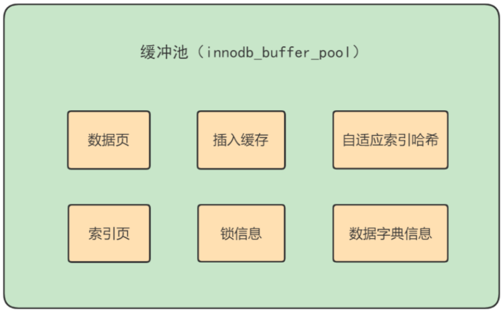
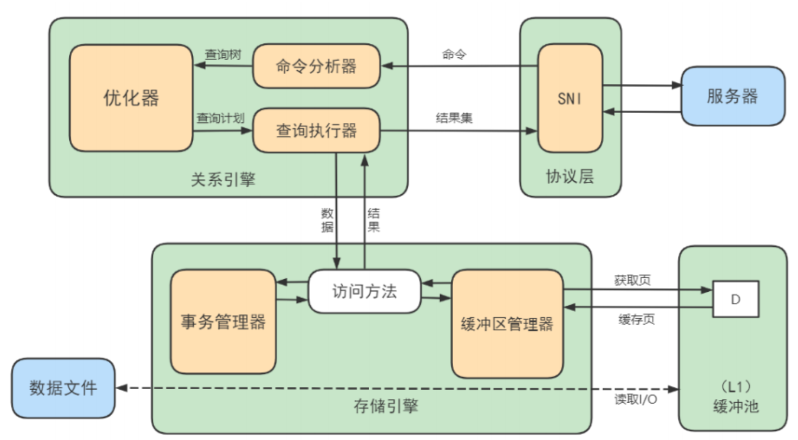
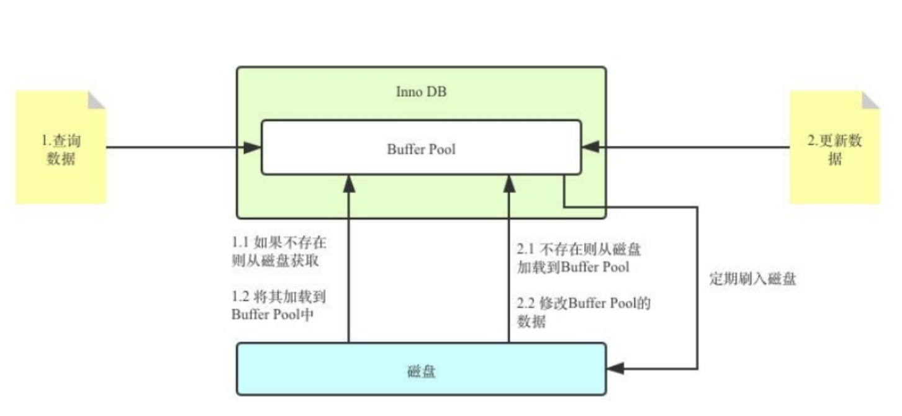

# 数据库缓冲池（buffer pool）

`InnoDB`存储引擎是以页为单位来管理存储空间的，我们进行的增删改查操作其实本质上都是在访问页面（包括读页面、写页面、创建新页面等操作）。而磁盘 I/O 需要消耗的时间很多，而在内存中进行操作，效率则会高很多，为了能让数据表或者索引中的数据随时被我们所用，DBMS 会申请`占用内存来作为数据缓冲池`，在真正访问页面之前，需要把在磁盘上的页缓存到内存中的`Buffer Pool`之后才可以访问。

这样做的好处是可以让磁盘活动最小化，从而`减少与磁盘直接进行 I/O 的时间`。要知道，这种策略对提升 SQL 语句的查询性能来说至关重要。如果索引的数据在缓冲池里，那么访问的成本就会降低很多。

## 缓冲池 vs 查询缓

**缓冲池和查询缓存是同一个东西吗？**

显然不是

### 缓冲池（Buffer Pool）

首先我们需要了解在 InnoDB 存储引擎中，缓冲池都包括了哪些。

在 InnoDB 存储引擎中有一部分数据会放到内存中，缓冲池则占了这部分内存的大部分，它用来存储各种数据的缓存，如下图所示：



从图中，你能看到 InnoDB 缓冲池包括了数据页、索引页、插入缓冲、锁信息、自适应 Hash 和数据字典信息等。

### 缓存池的重要性

对于使用 `InnoDB` 作为存储引擎的表来说，不管是用于存储用户数据的索引（包括聚簇索引和二级索引），还是各种系统数据，都是以 `页` 的形式存放在 `表空间` 中的，而所谓的表空间只不过是 InnoDB 对文件系统上一个或几个实际文件的抽象，也就是说我们的数据说到底还是存储在磁盘上的。但是各位也都知道，磁盘的速度慢的跟乌龟一样，怎么能配得上 `“快如风，疾如电”` 的CPU 呢？这里，缓冲池可以帮助我们消除 CPU 和磁盘之间的`鸿沟`。所以 InnoDB 存储引擎在处理客户端的请求时，当需要访问某个页的数据时，就会把 `完整的页的数据全部加载到内存` 中，也就是说即使我们只需要访问一个页的一条记录，那也需要先把整个页的数据加载到内存中。将整个页加载到内存中后就可以进行读写访问了，在进行完读写访问之后并不着急把该页对应的内存空间释放掉，而是将其 `缓存` 起来，这样将来有请求再次访问该页面时，就可以 `省去磁盘IO` 的开销了。

#### 缓存原则

“`位置 * 频次`”这个原则，可以帮我们对 I/O 访问效率进行优化。

首先，位置决定效率，提供缓冲池就是为了在内存中可以直接访问数据。

其次，频次决定优先级顺序。因为缓冲池的大小是有限的，比如磁盘有 200G，但是内存只有 16G，缓冲池大小只有 1G，就无法将所有数据都加载到缓冲池里，这时就涉及到优先级顺序，会`优先对使用频次高的热数据进行加载`。

#### 缓存池的预读特性

了解了缓存池的作用之后，我们还需要了解缓冲池的`预读`特性。

缓存池的作用就是提升I/O效率，而我们进行读取数据的时候存在一个“局部性原理”，也就是说我们使用了一些数据，`大概率还会使用到周围的一些数据`，因此采用“预读”的机制提前加载，可以减少未来可能的磁盘 I/O 操作

### 查询缓存

查询缓存是提前把`查询结果缓存`起来，这样下次不需要执行就可以直接拿到结果。需要说明的是，在MySQL 中的查询缓存，不是缓存查询计划，而是查询对应的结果。因为命中条件苛刻，而且只要数据表发生变化，查询缓存就会失效，因此命中率低。

## 缓冲池如何读取数据

缓冲池管理器会尽量将经常使用的数据保存起来，在数据库进行页面读操作的时候，首先会判断该页面是否在缓冲池中，如果存在就直接读取，如果不存在，就会通过内存或磁盘将页面存放到缓冲池中再进行读取。

缓存在数据库中的结构和作用如下图所示：




**如果我们执行 SQL 语句的时候更新了缓存池中的数据，那么这些数据会马上同步到磁盘上吗？**

实际上，当我们对数据库中的记录进行修改的时候，首先会修改缓冲池中页里面的记录信息，然后数据库会`以一定的频率刷新`到磁盘上。注意并不是每次发生更新操作，都会立刻进行磁盘回写。缓冲池会采用一种叫做`checkpoint 的机制`将数据回写到磁盘上，这样做的好处就是提升了数据库的整体性能。

比如，当`缓冲池不够用时`，需要释放掉一些不常用的页，此时就可以强行采用 checkpoint 的方式，将不常用的脏页回写到磁盘上，然后再从缓冲池中将这些页释放掉。这里脏页（dirty page）指的是缓冲池中被修改过的页，与磁盘上的数据页不一致。

## 查看/设置缓冲池的大小

如果你使用的是MyISAM存储引擎，它只缓存索引，不缓存数据，对应的键缓存参数为`key_buffer_size`，你可以使用它进行查看；

如果你使用的是InnoDB存储引擎，可以使用`innodb_buffer_pool_size`变量来查看缓存池的大小：

```mysql
show variables like 'innodb_buffer_pool_size';
```

默认的缓存池大小为缓冲池大小只有134217728（134217728/1024/1024=128MB）。

我们可以修改缓冲池大小，比如改为256MB，方法如下：

```mysql
set global innodb_buffer_pool_size = 268435456;
```

或者

```ini
[server] 
innodb_buffer_pool_size = 268435456
```

## 多个Buffer Pool实例

```ini
[server] 
innodb_buffer_pool_instances = 2
```

这样就表明我们要创建2个 Buffer Pool 实例。

我们看下如何查看缓冲池的个数，使用命令：

```mysql
show variables like 'innodb_buffer_pool_instances';
```

那每个`Buffer Pool`实例实际占多少内存空间呢？其实使用这个公式算出来的：

```
innodb_buffer_pool_size/innodb_buffer_pool_instances
```
也就是总共的大小除以实例的个数，结果就是每个 Buffer Pool 实例占用的大小

## 引申问题

### 黑盒下的更新数据流程

Buffer Pool是MySQL内存结构中十分核心的一个组成，你可以先把它想象成一个黑盒子。




我更新到一半突然发生错误了，想要回滚到更新之前的版本，该怎么办？连数据持久化的保证、事务回滚都做不到还谈什么崩溃恢复？

答案：**Redo Log & Undo Log**