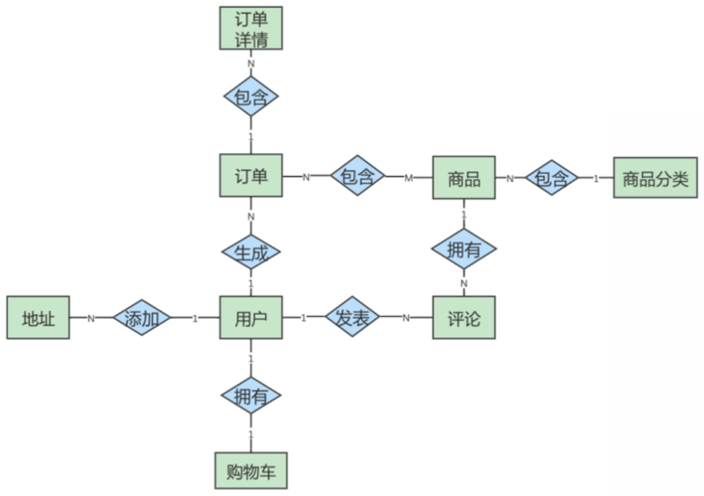
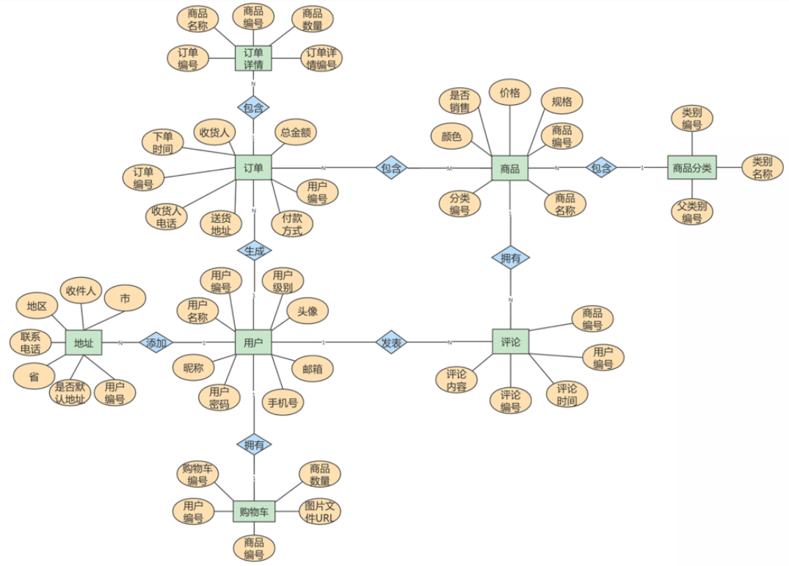
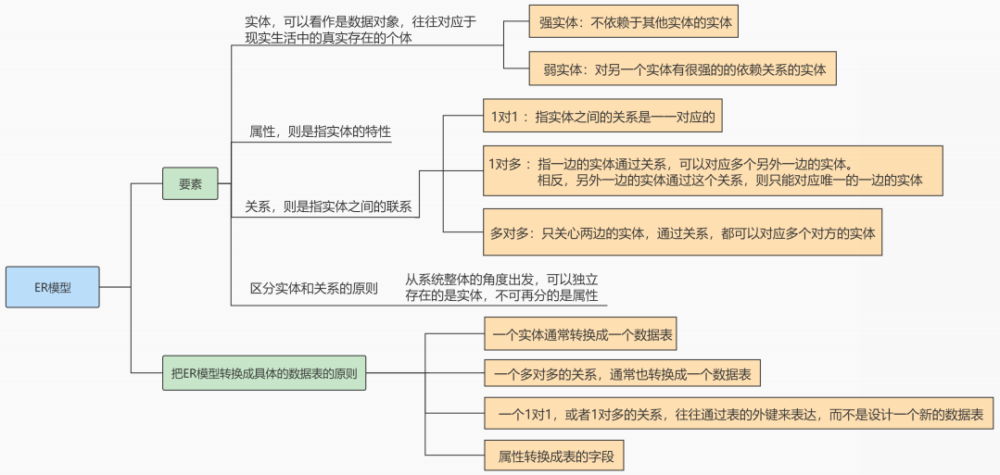

# 数据库的设计规范

## 为什么需要数据库设计

我们在设计数据表的时候，要考虑很多问题。比如：

- 用户都需要什么数据？需要在数据表中保存哪些数据？
- 如何保证数据表中数据的**正确性**，当插入、删除、更新的时候该进行怎样的**约束检查**？
- 如何降低数据表的**数据冗余度**，保证数据表不会因为用户量的增长而迅速扩张？
- 如何让负责数据库维护的人员**更方便**地使用数据库？
- 使用数据库的应用场景也各不相同，可以说针对不同的情况，设计出来的数据表可能**千差万别**。

**现实情况中，面临的场景**：当数据库运行了一段时间之后，我们才发现数据表设计的有问题。重新调整数据表的结构，就需要做数据迁移，还有可能影响程序的业务逻辑，以及网站正常的访问。

**如果是糟糕的数据库设计可能会造成以下问题**：

- 数据冗余、信息重复，存储空间浪费
- 数据更新、插入、删除的异常
- 无法正确表示信息
- 丢失有效信息
- 程序性能差

**好的数据库设计则有以下优点**：

- 节省数据的存储空间
- 能够保证数据的完整性
- 方便进行数据库应用系统的开发

总之，开始设置数据库的时候，我们就需要重视数据表的设计。为例建立`冗余较小`、`结构合理`的数据库，设计数据库时必须遵循一定的规则。

## 范式

### 范式简介

**在关系型数据库中，关于数据表设计的基本原则、规则就称为范式**。可以理解为，一张数据表的设计结构需要满足的某种设计标准的`级别`。要想设计一个结构合理的关系型数据库，必须满足一定的范式。

> 范式的英文名称是 `Normal Form`，简称 `NF`。它是英国人 E.F.Codd 在上个世纪 70 年代提出关系数据库模型后总结出来的。范式是关系数据库理论的基础，也是我们在设计数据库结构过程中所要遵循的`规则`和`指导方法`。

### 范式都包括哪些

目前关系型数据库有六种常见范式，按照范式级别，从低到高分别是：**第一范式（1NF）、第二范式（2NF）、第三范式（3NF）、巴斯-科德范式（BCNF）、第四范式（4NF）和第五范式（5NF，又称完美范式）**。

数据库的范式设计越高阶，冗余度就越低，同时高阶的范式一定符合低阶范式的要求，满足最低要求的范式是第一范式（1NF）。在第一范式的基础上进一步满足更多规范要求的称为第二范式（2NF），其余范式以次类推。

一般来说，在关系型数据库设计中，最高也就遵循到 `BCNF`，普遍还是 `3NF`。但也不绝对，有时候为了提高某些查询性能，我们还需要破坏范式规则，也就是`反规范化`

:::tip

需要说明的是，任何的事物都是有利有弊的，范式越高，冗余度越低，但是随之而来的就是查询效率的降低。所以我们需要在范式与业务逻辑中寻找平衡点。

:::

### 键和相关属性的概念

范式的定义会使用到主键和候选键，数据库中的键（Key）由一个或者多个属性组成。数据表中常用的几种键和属性的定义：

- `超键`：能唯一标识元组的属性集叫做超键。
- `候选键`：如果超键不包括多余的属性，那么这个超键就是候选键。
- `主键`：用户可以从候选键中选择一个作为主键。
- `外键`：如果数据表 R1 中的某属性集不是 R1 的主键，而是另一个数据表 R2 的主键，那么这个属性集就是数据表 R1 的外键。
- `主属性`：包含在任一候选键中的属性称为主属性。
- `非主属性`：与主属性相对，指的是不包含在任何一个候选键中的属性。

通常，我们也将候选键称之为 “`码`”，把主键也称为 “`主码`”。因为键可能是由多个属性组成的，针对单个属性，我们还可以用主属性和非主属性来进行区分。


**举例：**

这里有两个表：

```txt
球员表 (player)：球员编号 | 姓名 | 身份证号 | 年龄 | 球队编号
球队表 (team)：球队编号 | 主教练 | 球队所在地
```

- `超键`：对于球员表来说，超键就是包括球员编号或者身份证号的任意组合，比如（球员编号）（球员编号，姓名）（身份证号，年龄）等。
- `候选键`：就是最小的超键，对于球员表来说，候选键就是（球员编号）或者（身份证号）。
- `主键`：我们自己选定，也就是从候选键中选择一个，比如（球员编号）。
- `外键`：球员表中的球队编号。
- `主属性`、`非主属性`：在球员表中，主属性是（球员编号）（身份证号），其他的属性（姓名）（年龄）（球队编号）都是非主属性。

### 第一范式(1st NF)

第一范式主要是确保数据表中每个字段的值必须具有`原子性`，也就是说数据表中每个字段的值为`不可再次拆分`的最小数据单位。

我们在设计某个字段的时候，对于字段 X 来说，不能把字段 X 拆分成字段 X-1 和字段 X-2。事实上，任何的 DBMS 都会满足第一范式的要求，不会将字段进行拆分。

**举例 1**：

假设一家公司要存储员工的姓名和联系方式。它创建一个如下表：

| emp_id | emp_name | emp_address | emp_mobile           |
| ------ | -------- | ----------- | -------------------- |
| 101    | zhangsan | beijing     | 8912312390           |
| 102    | lisi     | liaoning    | 8812121212<br>9900012222 |
| 103    | wangwu   | hebei       | 7778881212           |
| 104    | zhaoliu  | shanghai    | 9999000012<br>1878120923 |

该表不符合 1NF，因为规则说 “表的每个属性必须具有原子（单个）值”，lisi 和 zhaoliu 员工的 emp_mobile 值违反了该规则。为了使表符合 1NF，我们应该有如下表数据：

| emp_id | emp_name | emp_address | emp_mobile |
| ------ | -------- | ----------- | ---------- |
| 101    | zhangsan | beijing     | 8912312390 |
| 102    | lisi     | liaoning    | 8812121212 |
| 102    | lisi     | liaoning    | 9900012222 |
| 103    | wangwu   | hebei       | 7778881212 |
| 104    | zhaoliu  | shanghai    | 9999000012 |
| 104    | zhaoliu  | shanghai    | 1878120923 |

**举例 2**：

user 表的设计不符合第一范式

| 字段名称  | 字段类型     | 是否是主键 | 说明                                |
| --------- | ------------ | ---------- | ----------------------------------- |
| id        | INT          | 是         | 主键 id                             |
| username  | VARCHAR(30)  | 否         | 用户名                              |
| password  | VARCHAR(50)  | 否         | 密码                                |
| user_info | VARCHAR(255) | 否         | 用户信息 (包含真实姓名、电话、住址) |

其中，user_info 字段为用户信息，可以进一步拆分成更小粒度的字段，不符合数据库设计对第一范式的要求。将 user_info 拆分后如下：

| 字段名称  | 字段类型     | 是否是主键 | 说明     |
| --------- | ------------ | ---------- | -------- |
| id        | INT          | 是         | 主键 id  |
| username  | VARCHAR(30)  | 否         | 用户名   |
| password  | VARCHAR(50)  | 否         | 密码     |
| real_name | VARCHAR(30)  | 否         | 真实姓名 |
| phone     | VARCHAR(12)  | 否         | 联系电话 |
| address   | VARCHAR(100) | 否         | 家庭住址 |

**举例 3**：

属性的原子性是`主观的`。

例如，Employees 关系中雇员姓名应当使用 1 个（fullname）、2 个（firstname 和 lastname）还是 3 个（firstname、middlename 和 lastname）属性表示呢？答案取决于应用程序。如果应用程序需要分别处理雇员的姓名部分（如：用于搜索目的），则有必要把它们分开。否则，不需要。

表 1：

| 姓名 | 年龄 | 地址                     |
| ---- | ---- | ------------------------ |
| 张三 | 20   | 广东省广州市三元里 78 号 |
| 李四 | 24   | 广东省深圳市龙华新区     |

表 2：

| 姓名 | 年龄 | 省   | 市   | 地址         |
| ---- | ---- | ---- | ---- | ------------ |
| 张三 | 20   | 广东 | 广州 | 三元里 78 号 |
| 李四 | 24   | 广东 | 深圳 | 龙华新区     |

### 第二范式(2nd NF)

第二范式要求，在满足第一范式的基础上，还要**满足数据表里的每一条数据记录，都是可唯一标识的。而且所有非主键字段，都必须完全依赖主键，不能只依赖主键的一部分**。如果知道主键的所有属性的值，就可以检索到任何元组（行）的任何属性的任何值。（要求中的主键，其实可以拓展替换为候选键）

**举例 1**：

`成绩表`（学号，课程号，成绩）关系中，（学号，课程号）可以决定成绩，但是学号不能决定成绩，课程号也不能决定成绩，所以 “（学号，课程号）→成绩” 就是`完全依赖关系`。

---

**举例 2**：

`比赛表 player_game`，里面包含球员编号、姓名、年龄、比赛编号、比赛时间和比赛场地等属性，这里候选键和主键都为（球员编号，比赛编号），我们可以通过候选键（或主键）来决定如下的关系：

```
(球员编号，比赛编号) → (姓名，年龄，比赛时间，比赛场地，得分)
```

但是这个数据表不满足第二范式，因为数据表中的字段之间还存在着如下的对应关系（部分依赖）：

```
(球员编号) → (姓名，年龄)
(比赛编号) → (比赛时间，比赛场地)
```

对于非主属性来说，并非完全依赖候选键。这样会产生怎样的问题呢？

1. **数据冗余**：如果一个球员可以参加 m 场比赛，那么球员的姓名和年龄就重复了 m-1 次。一个比赛也可能会有 n 个球员参加，比赛的时间和地点就重复了 n-1 次。
2. **插入异常**：如果我们想要添加一场新的比赛，但是这时还没有确定参加的球员都有谁，那么就没法插入。
3. **删除异常**：如果我要删除某个球员编号，如果没有单独保存比赛表的话，就会同时把比赛信息删除掉。
4. **更新异常**：如果我们调整了某个比赛的时间，那么数据表中所有这个比赛的时间都需要进行调整，否则就会出现一场比赛时间不同的情况。

为了避免出现上述的情况，我们可以把球员比赛表设计为下面的三张表：

| 表名                        | 属性（字段）                       |
| --------------------------- | ---------------------------------- |
| 球员 player 表              | 球员编号、姓名和年龄等属性         |
| 比赛 game 表                | 比赛编号、比赛时间和比赛场地等属性 |
| 球员比赛关系 player_game 表 | 球员编号、比赛编号和得分等属性     |

这样的话，每张数据表都符合第二范式，也就避免了异常情况的发生。

> 1NF 告诉我们字段属性需要是原子性的，而 2NF 告诉我们一张表就是一个独立的对象，一张表只表达一个意思。

### 第三范式(3rd NF)

第三范式是在第二范式的基础上，确保数据表中的每一个非主键字段都和主键字段直接相关，也就是说，**要求数据表中的所有非主键字段不能依赖于其他非主键字段**。（即，不能存在非主属性A依赖于非主属性B，非主属性B依赖于主键C的情况，即存在"A-->B-->C"的决定关系）通俗地讲，该规则的意思是所有`非主键属性`之间不能有依赖关系，必须`相互独立`。

这里的主键可以拓展为候选键。

**举例 1**：

- `部门信息表`：每个部门有部门编号（dept_id）、部门名称、部门简介等信息。
- `员工信息表`：每个员工有员工编号、姓名、部门编号。列出部门编号后就不能再将部门名称、部门简介等与部门有关的信息再加入员工信息表中。

如果不存在部门信息表，则根据第三范式（3NF）也应该构建它，否则就会有大量的数据冗余。

---

**举例 2**：

| 字段名称      | 字段类型      | 是否是主键 | 说明                |
| ------------- | ------------- | ---------- | ------------------- |
| id            | INT           | 是         | 商品主键 id（主键） |
| category_id   | INT           | 否         | 商品类别 id         |
| category_name | VARCHAR(30)   | 否         | 商品类别名称        |
| goods_name    | VARCHAR(30)   | 否         | 商品名称            |
| price         | DECIMAL(10,2) | 否         | 商品价格            |

商品类别名称依赖于商品类别编号，不符合第三范式。

修改：

表 1：符合第三范式的`商品类别表`的设计

| 字段名称      | 字段类型    | 是否是主键 | 说明            |
| ------------- | ----------- | ---------- | --------------- |
| id            | INT         | 是         | 商品类别主键 id |
| category_name | VARCHAR(30) | 否         | 商品类别名称    |

表 2：符合第三范式的`商品表`的设计

| 字段名称    | 字段类型      | 是否是主键 | 说明        |
| ----------- | ------------- | ---------- | ----------- |
| id          | INT           | 是         | 商品主键 id |
| category_id | VARCHAR(30)   | 否         | 商品类别 id |
| goods_name  | VARCHAR(30)   | 否         | 商品名称    |
| price       | DECIMAL(10,2) | 否         | 商品价格    |

商品表 goods 通过商品类别 id 字段（category_id）与商品类别表 goods_category 进行关联。

> 符合 3NF 后的数据模型通俗地讲，2NF 和 3NF 通常以这句话概括：“每个非键属性依赖于键，依赖于整个键，并且除了键别无他物”

### 小结

关于数据表的设计，有三个范式要遵循。

（1）第一范式（1NF），确保每列保持`原子性`

数据库的每一列都是不可分割的原子数据项，不可再分的最小数据单元，而不能是集合、数组、记录等非原子数据项。

（2）第二范式（2NF），确保每列都和主键`完全依赖`

尤其在复合主键的情况向下，非主键部分不应该依赖于部分主键。

（3）第三范式（3NF），确保每列都和主键`直接相关`，而不是间接相关

**范式的优点**：数据的标准化有助于消除数据库中的`数据冗余`，第三范式（3NF）通常被认为在性能、拓展性和数据完整性方面达到了最好的平衡。

**范式的缺点**：范式的使用，可能`降低查询的效率`。因为范式等级越高，设计出来的数据表就越多、越精细，数据的冗余度就越低，进行数据查询的时候就可能需要`关联多张表`，这不但代价昂贵，也可能使一些`索引策略无效`。

范式只是提出了设计的标准，实际上设计数据表时，未必一定要符合这些标准。开发中，我们会出现为了性能和读取效率违反范式化的原则，通过`增加少量的冗余`或重复的数据来提高数据库的`读性能`，减少关联查询，join表的次数，实现`空间换取时间`的目的。因此在实际的设计过程中要理论结合实际，灵活运用。

> 范式本身没有优劣之分，只有适用场景不同。**没有完美的设计，只有合适的设计**，我们在数据表的设计中，还需要根据需求将范式和反范式混合使用。

## 反范式化

### 概述

有的时候不能简单按照规范要求设计数据表，因为有的数据看似冗余，其实对业务来说十分重要。这个时候，我们就要遵循`业务优先`的原则，首先满足业务需求，再尽量减少冗余。

如果数据库中的数据量比较大，系统的 UV 和 PV 访问频次比较高，则完全按照 MySQL 的三大范式设计数据表，读数据时会产生大量的关联查询，在一定程度上会影响数据库的读性能。如果我们想对查询效率进行优化，`反范式优化`也是一种优化思路。此时，可以通过在数据表中`增加冗余字段`来提高数据库的读性能。

---

**规范化 vs 性能**

1. 为满足某种商业目标，数据库性能比规范化数据库更重要
2. 在数据规范化的同时，要综合考虑数据库的性能
3. 通过在给定的表中添加额外的字段，以大量减少需要从中搜索信息所需的时间
4. 通过在给定的表中插入计算列，以方便查询

### 反范式举例

**举例 1**：

员工的信息存储在 `employees` 表中，部门信息存储在 `departments` 表中。通过 `employees` 表中的 `department_id` 字段与 `departments` 表建立关联关系。如果要查询一个员工所在部门的名称：

```sql
select employee_id, department_name
from employees e join departments d
on e.department_id = d.department_id;
```

如果经常需要进行这个操作，连接查询就会浪费很多时间。可以在 `employees` 表中增加一个冗余字段 `department_name`，这样就不用每次都进行连接操作了。

---

**举例 2**：

反范式化的 `goods 商品信息表` 设计如下：

| 字段名称      | 字段类型      | 是否是主键 | 说明            |
| ------------- | ------------- | ---------- | --------------- |
| id            | INT           | 是         | 商品 id（主键） |
| category_id   | VARCHAR(30)A  | 否         | 商品类别 id     |
| **category_name** | VARCHAR(30)   | 否         | 商品类别名称    |
| goods_name    | VARCHAR(30)   | 否         | 商品名称        |
| price         | DECIMAL(10,2) | 否         | 商品价格        |

---

**举例 3**：

我们有 2 个表，分别是`商品流水表（trans）`和`商品信息表（goodsinfo）`。商品流水表里有 400 万条流水记录，商品信息表里有 2000 条商品记录。

商品流水表：

| transid（流水号唯一编号） | itemno（商品编号） | quantity（数量） | price（价格） | balance（金额） | transdate（交易日期） |
| ------------------------- | ------------------ | ---------------- | ------------- | --------------- | --------------------- |

商品信息表：

| itemno（商品编号） | barcode（条码） | goodsname（名称） | specification（规格） | salesprice（售价） |
| ------------------ | --------------- | ----------------- | --------------------- | ------------------ |

新的商品流水表如下所示：

| transid（流水号唯一编号） | itemno（商品编号） | goodsname（商品名称） | quantity（数量） | price（价格） | balance（金额） | date（交易日期） |
| ------------------------- | ------------------ | --------------------- | ---------------- | ------------- | --------------- | ---------------- |

### 反范式的新问题

- 存储`空间变大`了
- 一个表中字段做了修改，另一个表中冗余的字段也需要做同步修改，否则`数据不一致`
- 若采用存储过程来支持数据的更新、删除等额外操作，如果更新频繁，会非常`消耗系统资源`
- 在`数据量小`的情况下，反范式不能体现性能的优势，可能还会让数据库的设计更加`复杂`

### 反范式的适用场景

当冗余信息有价值或者能`大幅度提高查询效率`的时候，我们才会采取反范式的优化。

- **增加冗余字段的建议**

1）这个冗余字段`不需要经常进行修改`

2）这个冗余字段`查询的时候不可或缺`

- **历史快照、历史数据的需要**

在现实生活中，我们经常需要一些冗余信息，比如订单中的收货人信息，包括姓名、电话和地址等。每次发生的`订单收货信息`都属于`历史快照`，需要进行保存，但用户可以随时修改自己的信息，这时保存这些冗余信息是非常有必要的。（因为我们不可能修改了地址等信息以后，订单历史中的地址页跟着变了，这极不合理！！！）

反范式优化也常用在`数据仓库`的设计中，因为数据仓库通常`存储历史数据`，对增删改的实时性要求不强，对历史数据的分析需求强。这时适当允许数据的冗余度，更方便进行数据分析。

:::warning 扩展

简单说明一下数据仓库和数据库在使用上的区别：

- 数据库设计的目的在于`捕获数据`，而数据仓库设计的目的在于`分析数据`；
- 数据库对数据的`增删改实时性`要求强，需要存储在线的用户数据，而数据仓库存储的一般是`历史数据`；
- 数据库设计需要`尽量避免冗余`，但为了提高查询效率也允许一定的`冗余度`，而数据仓库在设计上更偏向采用反范式设计。

:::

## BCNF(巴斯范式)

人们在 3NF 的基础上进行了改进，提出了**巴斯范式（BCNF），也叫做巴斯-科德范式（Boyce-Codd Normal Form）**。

BCNF被认为没有新的设计规范加入，只是对第三范式中设计规范要求更强，使得数据库冗余度更小。所以，称为是`修正的第三范式`，或`扩充的第三范式`，因此BCNF不被称为第四范式。

若一个关系达到了第三范式，并且它只有一个候选键，或者它的每个候选键都是单属性，则该关系自然就达到了BC范式。

> 一般来说，一个数据库设计符合 3NF 或 BCNF 就可以了。

**举例1**：

我们分析如下表的范式情况：

| 仓库名 | 管理员 | 物品名    | 数量 |
| ------ | ------ | --------- | ---- |
| 北京仓 | 张三   | iphone XR | 10   |
| 北京仓 | 张三   | iphone 7  | 20   |
| 上海仓 | 李四   | iphone 7p | 30   |
| 上海仓 | 李四   | iphone 8  | 40   |

在这个表中，一个仓库只有一个管理员，同时一个管理员也只管理一个仓库。我们先来梳理下这些属性之间的依赖关系。

仓库名决定了管理员，管理员也决定了仓库名，同时（仓库名，物品名）的属性集合可以决定数量这个属性。这样，我们就可以找到数据表的候选键：

- **候选键**：是（管理员，物品名）和（仓库名，物品名），然后我们从候选键中选择一个作为**主键**，比如（仓库名，物品名）。
- **主属性**：包含在任一候选键中的属性，也就是仓库名，管理员和物品名。
- **非主属性**：数量这个属性。

**是否符合三范式**：

如何判断一张表的范式呢？我们需要根据范式的等级，从低到高来进行判断。

- 1）首先，数据表每个属性都是原子性的，符合 1NF 的要求；

- 2）其次，数据表中非主属性 “数量” 都与候选键全部依赖，（仓库名，物品名）决定数量，（管理员，物品名）决定数量。因此，数据表符合 2NF 的要求；

- 3）最后，数据表中的非主属性，不传递依赖于候选键。因此符合 3NF 的要求。

**存在的问题**：

既然数据表已经符合了 3NF 的要求，是不是就不存在问题了呢？我们来看下面的情况：

1. 增加一个仓库，但是还没有存放任何物品。根据数据表实体完整性的要求，主键不能有空值，因此会出现`插入异常`；
2. 如果仓库更换了管理员，我们就可能会`修改数据表中的多条记录`；
3. 如果仓库里的商品都卖空了，那么此时仓库名称和相应的管理员名称也会随之被删除。

你能看到，即便数据表符合 3NF 的要求，同样可能存在插入、更新和删除数据的异常情况。

**问题解决**：

首先我们需要确认造成异常的原因：主属性仓库名对于候选键（管理员，物品名）是部分依赖的关系，这样就有可能导致上面的异常情况。因此引入BCNF，**它在 3NF 的基础上消除了主属性对候选键的部分依赖或者传递依赖关系**。

如果在关系 R 中，U 为主键，A 属性是主键的一个属性，若存在 A->Y，Y 为主属性，则该关系不属于 BCNF。

根据 BCNF 的要求，我们需要把仓库管理关系 warehouse_keeper 表拆分成下面这样：

- `仓库表`：（仓库名，管理员）
- `库存表`：（仓库名，物品名，数量）

这样就不存在主属性对于候选键的部分依赖或传递依赖，上面数据表的设计就符合 BCNF。

---

**举例2**：

有一个`学生导师表`，其中包含字段：学生 ID，专业，导师，专业 GPA，这其中学生 ID 和专业是联合主键。

| StudentId | Major    | Advisor | MajGPA |
| --------- | -------- | ------- | ------ |
| 1         | 人工智能 | Edward  | 4.0    |
| 2         | 大数据   | William | 3.8    |
| 1         | 大数据   | William | 3.7    |
| 3         | 大数据   | Joseph  | 4.0    |

这个表的设计满足三范式，但是这里存在另一个依赖关系，“专业” 依赖于 “导师”，也就是说每个导师只做一个专业方面的导师，只要知道了是哪个导师，我们自然就知道是哪个专业的了。

所以这个表的部分主键 Major 依赖于非主键属性 Advisor，那么我们可以进行以下的调整，拆分成 2 个表：

学生导师表：

| StudentId | Advisor | MajGPA |
| --------- | ------- | ------ |
| 1         | Edward  | 4.0    |
| 2         | William | 3.8    |
| 1         | William | 3.7    |
| 3         | Joseph  | 4.0    |

导师表：

| Advisor | Major    |
| ------- | -------- |
| Edward  | 人工智能 |
| William | 大数据   |
| Joseph  | 大数据   |

## 第四范式

**多值依赖的概念**：

- `多值依赖`：即属性之间的一对多关系，记为`K→→A`。
- `函数依赖`：事实上是单值依赖，所以不能表达属性值之间的一对多关系。
- `平凡的多值依赖`：全集`U=K+A`，一个`K`可以对应于多个`A`，即`K→→A`。此时整个表就是一组一对多关系。
- `非平凡的多值依赖`：全集`U=K+A+B`，一个`K`可以对应于多个`A`，也可以对应于多个`B`，`A`与`B`互相独立，即`K→→A`，`K→→B`。整个表有多组一对多关系，且有：“一” 部分是相同的属性集合，“多” 部分是互相独立的属性集合。

第四范式即在满足巴斯 - 科德范式（BCNF）的基础上，**消除非平凡且非函数依赖的多值依赖**（即把同一表内的多对多关系删除）。

**举例 1**：

职工表 (职工编号，职工孩子姓名，职工选修课程)。

在这个表中，同一个职工可能会有多个职工孩子姓名。同样，同一个职工也可能会有多个职工选修课程，即这里存在着多值事实，不符合第四范式。

如果要符合第四范式，只需要将上表分为两个表，使它们只有一个多值事实，例如：`职工表一` (职工编号，职工孩子姓名)，`职工表二` (职工编号，职工选修课程)，两个表都只有一个多值事实，所以符合第四范式。

---

**举例 2**：

比如我们建立课程、教师、教材的模型。我们规定，每门课程有对应的一组教师，每门课程也有对应的一组教材，一门课程使用的教材和教师没有关系。我们建立的关系表如下：

课程 ID，教师 ID，教材 ID；这三列作为联合主键。

> 为了表述方便，我们用 Name 代替 ID，这样更容易看懂：

| Course | Teacher | Book       |
| ------ | ------- | ---------- |
| 英语   | Bill    | 人教版英语 |
| 英语   | Bill    | 美版英语   |
| 英语   | Jay     | 美版英语   |
| 高数   | William | 人教版高数 |
| 高数   | Dave    | 美版高数   |

这个表除了主键，就没有其他字段了，所以肯定满足 BC 范式，但是却存在**多值依赖**导致的异常。

假如我们下学期想采用一本新的英版高数教材，但是还没确定具体哪个老师来教，那么我们就无法在这个表中维护 Course 高数和 Book 英版高数教材的的关系。

解决办法是我们把这个多值依赖的表拆解成 2 个表，分别建立关系。这是我们拆分后的表：

| Course | Teacher |
| ------ | ------- |
| 英语   | Bill    |
| 英语   | Jay     |
| 高数   | William |
| 高数   | Dave    |

以及

| Course | Book       |
| ------ | ---------- |
| 英语   | 人教版英语 |
| 英语   | 美版英语   |
| 高数   | 人教版高数 |
| 高数   | 美版高数   |

:::warning 注意

在数据库设计层面上是这样子拆分表，但是实际开发中第四范式已经用得很少了，因为回导致我们产生大量的关联查询，反而降低了查询效率。

:::

## 第五范式、域键范式 <Badge type="info" text="了解即可"/>

除了第四范式外，我们还有更高级的第五范式（又称完美范式）和域键范式（DKNF）。

在满足第四范式（4NF）的基础上，消除不是由候选键所蕴含的连接依赖。**如果关系模式 R 中的每一个连接依赖均由 R 的候选键所隐含**，则称此关系模式符合第五范式。

函数依赖是多值依赖的一种特殊的情况，而多值依赖实际上是连接依赖的一种特殊情况。但连接依赖不像函数依赖和多值依赖可以由`语义直接导出`，而是在`关系连接运算`时才反映出来。存在连接依赖的关系模式仍可能遇到数据冗余及插入、修改、删除异常等问题。

第五范式处理的是`无损连接问题`，这个范式基本`没有实际意义`，因为无损连接很少出现，而且难以察觉。而域键范式试图定义一个`终极范式`，该范式考虑所有的依赖和约束类型，但是实用价值也是最小的，只存在理论研究中。

## 范式实战

商超进货系统中的进货单表剖析

**进货单表（改造前）**：

| listnumber（单号） | supplierid（供应商编号） | suppliername（供应商名称） | stock（仓库） | barcode（条码） | goodsname（名称） | property（属性） | quantity（数量） | importprice（进货价格） | importvalue（进货金额） |
| ------------------ | ------------------------ | -------------------------- | ------------- | --------------- | ----------------- | ---------------- | ---------------- | ----------------------- | ----------------------- |
| 100001             | 1                        | 食品厂                     | 仓库          | 0001            | 方便面            | 6 包 / 袋        | 200              | 25                      | 5000                    |
| 100001             | 1                        | 食品厂                     | 仓库          | 0002            | 棒棒糖            | 10 支 / 盒       | 400              | 9.9                     | 3960                    |
| 100002             | 2                        | 服装厂                     | 卖场          | 0003            | 西服              | 套               | 5                | 2000                    | 10000                   |
| 100003             | 1                        | 食品厂                     | 卖场          | 0002            | 棒棒糖            | 10 支 / 盒       | 200              | 15                      | 3000                    |

这个表中的字段很多，表里的数据量也很惊人。大量重复导致表变得庞大，效率极低。

> 在实际工作场景中，这种由于数据表结构设计不合理，而导致的数据重复的现象并不少见。往往是系统虽然能够运行，承载能力却很差，稍微有点流量，就会出现内存不足、CPU 使用率飙升的情况，甚至会导致整个项目失败。

### 迭代 1 次：考虑 1NF

第一范式要求：**所有的字段都是基本数据字段，不可进一步拆分**。这里需要确认，所有的列中，每个字段只包含一种数据。

这张表里，我们把 “`property`” 这一字段，拆分成 “`specification`（规格）” 和 “`unit`（单位）”，拆分后如下：

| listnumber（单号） | supplierid（供应商编号） | suppliername（供应商名称） | stock（仓库） | barcode（条码） | goodsname（名称） | specification（规格） | unit（单位） | quantity（数量） | importprice（进货价格） | importvalue（进货金额） |
| ------------------ | ------------------------ | -------------------------- | ------------- | --------------- | ----------------- | --------------------- | ------------ | ---------------- | ----------------------- | ----------------------- |
| 100001             | 1                        | 食品厂                     | 仓库          | 0001            | 方便面            | 6 包                  | 袋           | 200              | 25                      | 5000                    |
| 100001             | 1                        | 食品厂                     | 仓库          | 0002            | 棒棒糖            | 10 支                 | 盒           | 400              | 9.9                     | 3960                    |
| 100002             | 2                        | 服装厂                     | 卖场          | 0003            | 西服              | NULL                  | 套           | 5                | 2000                    | 10000                   |
| 100003             | 1                        | 食品厂                     | 卖场          | 0002            | 棒棒糖            | 10 支                 | 盒           | 200              | 15                      | 3000                    |

### 迭代 2 次：考虑 2NF

第二范式要求，在满足第一范式的基础上，**还要满足数据表里的每一条数据记录，都是可唯一标识的。而且所有字段，都必须完全依赖主键，不能只依赖主键的一部分**。

第 1 步，就是要确定这个表的主键。通过观察发现，字段 “`listnumber` (单号)”+“`barcode` (条码)” 可以唯一标识每一条记录，可以作为主键。

第 2 步，确定好了主键以后，判断哪些字段完全依赖主键，哪些字段只依赖于主键的一部分。把只依赖于主键一部分的字段拆分出去，形成新的数据表。

首先，进货单明细表里面的 “`goodsname` (名称)” “`specification` (规格)” “`unit` (单位)” 这些信息是商品的属性，只依赖于 “`barcode` (条码)”，不完全依赖主键，可以拆分出去。我们把这 3 个字段加上它们所依赖的字段 “`barcode` (条码)”，拆分形成一个新的数据表 “`商品信息表`”。

这样一来，原来的数据表就被拆分成了两个表。如下

商品信息表：

| barcode | goodsname | specification | unit |
| ------- | --------- | ------------- | ---- |
| 0001    | 方便面    | 6 包          | 袋   |
| 0002    | 棒棒糖    | 10 支         | 盒   |
| 0003    | 西服      | NULL          | 套   |

进货单表：

| listnumber | supplierid | suppliername | stock | barcode | quantity | importprice | importvalue |
| ---------- | ---------- | ------------ | ----- | ------- | -------- | ----------- | ----------- |
| 100001     | 1          | 食品厂       | 仓库  | 0001    | 200      | 25          | 5000        |
| 100001     | 1          | 食品厂       | 仓库  | 0002    | 400      | 9.9         | 3960        |
| 100002     | 2          | 服装厂       | 卖场  | 0003    | 5        | 2000        | 10000       |
| 100003     | 1          | 食品厂       | 卖场  | 0002    | 200      | 15          | 3000        |

此外，字段 “`supplierid` (供应商编号)” “`suppliername` (供应商名称)” “`stock `(仓库)” 只依赖于 “`listnumber` (单号)”，不完全依赖于主键，所以，我们可以把 “`supplierid`” “`suppliername`” “`stock`” 这 3 个字段拆出去，再加上它们依赖的字段 “`listnumber` (单号)”，就形成了一个新的表 “`进货单头表`”。剩下的字段，会组成新的表，我们叫它 “`进货单明细表`”。

原来的数据表就拆分成了 3 个表。

进货单头表：

| listnumber | supplierid | suppliername | stock |
| ---------- | ---------- | ------------ | ----- |
| 100001     | 1          | 食品厂       | 仓库  |
| 100002     | 2          | 服装厂       | 卖场  |
| 100003     | 1          | 食品厂       | 卖场  |

进货单明细表：

| listnumber | barcode | quantity | importprice | importvalue |
| ---------- | ------- | -------- | ----------- | ----------- |
| 100001     | 0001    | 200      | 25          | 5000        |
| 100001     | 0002    | 400      | 9.9         | 3960        |
| 100002     | 0003    | 5        | 2000        | 10000       |
| 100003     | 0002    | 200      | 15          | 3000        |

商品信息表（改造前）：

| barcode | goodsname | specification | unit |
| ------- | --------- | ------------- | ---- |
| 0001    | 方便面    | 6 包          | 袋   |
| 0002    | 棒棒糖    | 10 支         | 盒   |

现在，我们再来分析一下拆分后的 3 个表，保证这 3 个表都满足第二范式的要求。

第 3 步，在 “商品信息表” 中，字段 “`barcode`” 是有`可能存在重复`的，比如，用户门店可能有散装称重商品和自产商品，会存在条码共用的情况。所以，所有的字段都不能唯一标识表里的记录。这个时候，我们必须给这个表加上一个主键，比如说是`自增字段 “itemnumber”`。

现在，我们就可以把进货单明细表里面的字段 “`barcode`” 都替换成字段 “`itemnumber`”，这就得到了新的如下表。

进货单明细表：

| listnumber | itemnumber | quantity | importprice | importvalue |
| ---------- | ---------- | -------- | ----------- | ----------- |
| 100001     | 1          | 200      | 25          | 5000        |
| 100001     | 2          | 400      | 9.9         | 3960        |
| 100002     | 3          | 5        | 2000        | 10000       |
| 100003     | 2          | 200      | 15          | 3000        |

商品信息表（改造后）：

| itemnumber | barcode | goodsname | specification | unit |
| ---------- | ------- | --------- | ------------- | ---- |
| 1          | 0001    | 方便面    | 6 包          | 袋   |
| 2          | 0002    | 棒棒糖    | 10 支         | 盒   |
| 3          | 0003    | 西服      | NULL          | 套   |

拆分后的 3 个数据表就全部满足了第二范式的要求。

### 迭代 3 次：考虑 3NF

我们的进货单头表，还有数据冗余的可能。因为 “`suppliername`” 未按第三范式的原则进行拆分了。我们就进一步拆分下进货单头表。

供货商表：

| supplierid | suppliername |
| ---------- | ------------ |
| 1          | 食品厂       |
| 2          | 服装厂       |

进货单头表：

| listnumber | supplierid | stock |
| ---------- | ---------- | ----- |
| 100001     | 1          | 仓库  |
| 100002     | 2          | 卖场  |

这2个表都满足第三范式的要求了。

### 反范式化：业务优先的原则

在进货单明细表中，`quantity * importprice = importvalue`，“`importprice`”、“`quantity`” 和 “`importvalue`” 可以通过任意两个计算出第三个来，这就存在冗余字段。如果严格按照第三范式的要求，现在我们应该进行进一步优化。优化的办法是删除其中一个字段，只保留另外 2 个，这样就没有冗余数据了。

可是，**真的可以这样做吗**？要回答这个问题，我们就要先了解下实际工作中的`业务优先原则`。

所谓的业务优先原则，就是指一切以业务需求为主，技术服务于业务。**完全按照理论的设计不一定就是最优，还要根据实际情况来决定**。这里我们就来分析一下不同选择的利与弊。

对于 `quantity * importprice = importvalue`，看起来 “`importvalue`” 似乎是冗余字段，但并不会导致数据不一致。可是，如果我们把这个字段取消，是会影响业务的。

因为有的时候，供货商会经常进行一些促销活动，按金额促销，那他们拿来的进货单只有金额，没有价格。而 “`importprice`” 反而是通过 “`importvalue`÷`quantity`” 计算出来的，经过四舍五入，会产生较大的误差。这样日积月累，最终会导致查询结果出现较大偏差，影响系统的可靠性。

**举例**：进货金额 (`importvalue`) 是 25.5 元，数量 (`quantity`) 是 34，那么进货价格 (`importprice`) 就等于 25.5÷34=0.74 元，但是如果用这个计算出来的进货价格 (`importprice`) 来计算进货金额，那么，进货金额 (`importvalue`) 就等于 0.74×34=25.16 元，其中相差了 25.5-25.16=0.34 元。

所以，本着业务优先的原则，在不影响系统可靠性的前提下，可以容忍一定的数据冗余，保留 “`importvalue`”“`importprice`” 和 “`quantity`”。

因此，最后我们可以把进货单表拆分成下面的 4 个表：

供货商表：

| supplierid | suppliername |
| ---------- | ------------ |
| 1          | 食品厂       |
| 2          | 服装厂       |

进货单头表：

| listnumber | supplierid | stock |
| ---------- | ---------- | ----- |
| 100001     | 1          | 仓库  |
| 100002     | 2          | 卖场  |

进货单明细表：

| listnumber | itemnumber | quantity | importprice | importvalue |
| ---------- | ---------- | -------- | ----------- | ----------- |
| 100001     | 1          | 200      | 25          | 5000        |
| 100001     | 2          | 400      | 9.9         | 3960        |
| 100002     | 3          | 5        | 2000        | 10000       |
| 100003     | 2          | 200      | 15          | 3000        |

商品信息表：

| itemnumber | barcode | goodsname | specification | unit |
| ---------- | ------- | --------- | ------------- | ---- |
| 1          | 0001    | 方便面    | 6 包          | 袋   |
| 2          | 0002    | 棒棒糖    | 10 支         | 盒   |
| 3          | 0003    | 西服      | NULL          | 套   |

这样一来，我们就避免了冗余数据，而且还能够满足业务的需求，这样的数据表设计，才是合格的设计。

## ER模型

> 数据库设计是牵一发而动全身的。那有没有什么办法提前看到数据库的全貌呢？
>
>
>
> 比如需要哪些数据表，数据表中应该有哪些字段，数据表与数据表之间有什么关系，通过什么字段进行连接，等等。这样我们才能进行整体的梳理和设计。

ER模型也叫做`实体关系模型`，是用来描述现实生活中客观存在的事物、事物的属性，以及事物之间关系的一种数据模型。**在开发基于数据库的信息系统的设计阶段，通常使用ER模型来描述信息需要和信息特性，帮助我们理清业务逻辑，从而设计出优秀的数据库。**

### ER模型包括那些要素？

**ER模型中有三个要素，分别是实体、属性和关系**。

- `实体`，可以看做是数据对象，往往对应于现实生活中的真实存在的个体。
  - 在 ER 模型中，用`矩形`来表示。
  - 实体分为两类，分别是`强实体`和`弱实体`。强实体是指不依赖于其他实体的实体；弱实体是指对另一个实体有很强的依赖关系的实体。

- `属性`，则是指实体的特性。比如超市的地址、联系电话、员工数等。
  - 在 ER 模型中用`椭圆形`来表示。

- `关系`，则是指实体之间的联系。比如超市把商品卖给顾客，就是一种超市与顾客之间的联系。
  - 在 ER 模型中用`菱形`来表示。

:::warning 注意

实体和属性不容易区分。这里提供一个原则：我们要从系统整体的角度出发去看，**可以独立存在的是实体，不可再分的是属性**。也就是说，属性不能包含其他属性。

:::

## 关系的类型

在 ER 模型的 3 个要素中，关系又可以分为 3 种类型，分别是 一对一、一对多、多对多。

- `一对一`：指实体之间的关系是一一对应的
  - 比如个人与身份证信息之间的关系就是一对一的关系。一个人只能有一个身份证信息，一个身份证信息也只属于一个人。

- `一对多`：指一边的实体通过关系，可以对应多个另外一边的实体。相反，另外一边的实体通过这个关系，则只能对应唯一的一边的实体
  - 比如说，新建一个班级表，每个班级都有多个学生，每个学生则对应一个班级，班级对学生就是一对多的关系。

- `多对多`：指关系两边的实体都可以通过关系对应多个对方的实体
  - 比如在进货模块中，供货商与超市之间的关系就是多对多的关系，一个供货商可以给多个超市供货，一个超市也可以从多个供货商那里采购商品。
  - 再比如一个选课表，有许多科目，每个科目有很多学生选，而每个学生又可以选择多个科目，这就是多对多的关系。

### 建模分析

ER 模型看起来比较麻烦，但对把控项目整体非常重要。若只是开发小应用，简单设计几个表或许够用，可一旦要设计有一定规模的应用，在项目初始阶段建立完整的 ER 模型就非常关键。开发应用项目的实质，其实就是`建模`。

我们设计的案例是`电商业务`，由于电商业务太过庞大且复杂，所以做了业务简化，比如针对 SKU（StockKeepingUnit，库存量单位）和 SPU（Standard Product Unit，标准化产品单元）的含义，**直接使用了 SKU，没有提及 SPU 概念**。本次电商业务设计总共有 8 个实体，如下所示：

- 地址实体
- 用户实体
- 购物车实体
- 评论实体
- 商品实体
- 商品分类实体
- 订单实体
- 订单详情实体

其中，`用户`和`商品分类`是**强实体**，因为它们不需要依赖其他任何实体；其他属于弱实体，因为它们虽可独立存在，但都依赖用户实体。了解这些要素后，就可以给电商业务创建 ER 模型了。如下：



在该 ER 模型中，地址和用户之间是一对多的关系，商品和商品详情是一对一的关系，商品和订单是多对多的关系。这个 ER 模型包含了 8 个实体之间的 8 种关系：

1. 用户可以在电商平台添加多个地址；
2. 用户只能拥有一个购物车；
3. 用户可以生成多个订单；
4. 用户可以发表多条评论；
5. 一件商品可以有多个评论；
6. 每一个商品分类包含多种商品；
7. 一个订单可以包含多个商品，一个商品可以在多个订单里；
8. 订单中包含多个订单详情，因为一个订单中可能包含不同种类的商品。

### ER模型的细化

有了这个 ER 模型，我们就可以从整体上理解电商业务了。

但该模型仅展示了电商业务的框架，只包含订单、地址、用户、购物车、评论、商品、商品分类和订单详情这八个实体及其之间的关系，还不能对应到具体的表以及表与表之间的关联。需要把`属性`加上，用`椭圆`来表示，这样 ER 模型就更加完整了。

因此，我们需要进一步设计 ER 模型的各个局部，即细化电商的具体业务流程，然后将其综合到一起，形成一个完整的 ER 模型，以帮助我们理清数据库的设计思路。

接下来，我们再分析一下各个实体的属性如下：

1. `地址实体`：包括用户编号、省、市、地区、收件人、联系电话、是否是默认地址。
2. `用户实体`：包括用户编号、用户名称、昵称、用户密码、手机号、邮箱、头像、用户级别。
3. `购物车实体`：包括购物车编号、用户编号、商品编号、商品数量、图片文件 url。
4. `订单实体`：包括订单编号、收货人、收件人电话、总金额、用户编号、付款方式、送货地址、下单时间。
5. `订单详情实体`：包括订单详情编号、订单编号、商品名称、商品编号、商品数量。
6. `商品实体`：包括商品编号、价格、商品名称、分类编号、是否销售、规格、颜色。
7. `评论实体`：包括评论 id、评论内容、评论时间、用户编号、商品编号。
8. `商品分类实体`：包括类别编号、类别名称、父类别编号。

这样细分之后，就可以重新设计电商业务的 ER 模型了。ER图模型如下：




### ER 模型图转换成数据表

通过绘制 ER 模型，已经理清了业务逻辑，现在要进行重要的一步：把绘制好的 ER 模型转换成具体的数据表，转换原则如下：

1.  一个`实体`通常转换成一个`数据表`；
2.  一个`多对多的关系`，通常也转换成一个`数据表`；
3.  一个`1 对 1`，或者`1 对多`的关系，往往通过表的`外键`来表达，而不是设计一个新的数据表；
4.  `属性`转换成表的`字段`。

下面结合前面的 ER 模型，具体讲解一下如何运用这些转换原则，把 ER 模型转换成具体的数据表，从而将抽象的数据模型落实到具体的数据库设计中。

#### 1. 一个实体转换成一个数据表

**先看强实体转换成数据表**：

`用户实体`转换为用户表（`user_info`），代码如下：

```sql
CREATE TABLE `user_info` (
  `id` bigint(20) NOT NULL AUTO_INCREMENT COMMENT '编号',
  `user_name` varchar(200) DEFAULT NULL COMMENT '用户名称',
  `nick_name` varchar(200) DEFAULT NULL COMMENT '用户昵称',
  `passwd` varchar(200) DEFAULT NULL COMMENT '用户密码',
  `phone_num` varchar(200) DEFAULT NULL COMMENT '手机号',
  `email` varchar(200) DEFAULT NULL COMMENT '邮箱',
  `head_img` varchar(200) DEFAULT NULL COMMENT '头像',
  `user_level` varchar(200) DEFAULT NULL COMMENT '用户级别',
  PRIMARY KEY (`id`)
) ENGINE=InnoDB AUTO_INCREMENT=4 DEFAULT CHARSET=utf8 COMMENT='用户表';
```

`商品分类实体`转换为商品分类表，由于商品分类可以有一级分类和二级分类（比如一级分类有家居、手机等，二级分类可根据手机一级分类分为手机配件、运营商等），这里把商品分类实体规划为两张表，分别是`一级分类表`和`二级分类表`，之所以证明规划是因为一级分类和二级分类都是有限的，存储为两张表业务结构更加清晰。

一级分类表（ `base_category1` ）：

```sql
CREATE TABLE `base_category1` (
  `id` bigint(20) NOT NULL AUTO_INCREMENT COMMENT '编号',
  `name` varchar(10) NOT NULL COMMENT '分类名称',
  PRIMARY KEY (`id`) USING BTREE
) ENGINE=InnoDB AUTO_INCREMENT=1 DEFAULT CHARSET=utf8 ROW_FORMAT=DYNAMIC COMMENT='一级分类表';
```

二级分类表（ `base_category2`）：

```sql
CREATE TABLE `base_category2` (
  `id` bigint(20) NOT NULL AUTO_INCREMENT COMMENT '编号',
  `name` varchar(200) NOT NULL COMMENT '二级分类名称',
  `category1_id` bigint(20) DEFAULT NULL COMMENT '一级分类编号',
  PRIMARY KEY (`id`) USING BTREE
) ENGINE=InnoDB AUTO_INCREMENT=1 DEFAULT CHARSET=utf8 ROW_FORMAT=DYNAMIC COMMENT='二级分类表';
```

:::details 那么如果规划为一张表呢？

那么如果规划为一张表，表结构如下：

```sql
CREATE TABLE `base_category` (
  `id` bigint(20) NOT NULL AUTO_INCREMENT COMMENT '编号',
  `name` varchar(200) NOT NULL COMMENT '分类名称',
  `category_parent_id` bigint(20) DEFAULT NULL COMMENT '父分类编号',
  PRIMARY KEY (`id`) USING BTREE
) ENGINE=InnoDB AUTO_INCREMENT=1 DEFAULT CHARSET=utf8 ROW_FORMAT=DYNAMIC COMMENT='分类表';
```

这样分类的话，查询一级分类时需要判断父分类编号是否为空，插入二级分类时若也为空，容易造成`业务数据混乱`；且查询二级分类时`IS NOT NULL`条件无法使用到索引，同时该设计不符合第二范式（因为父分类编号并不依赖分类编号 ID，父分类编号可有多条数据为 NULL），所以需要进行表的拆分。因此，无论从`业务需求`还是`数据库表的规范`来看，都应该拆分为两张表。

:::


**下面我们再把弱实体转换成数据表**：

`地址实体`转换为地址表（`user_address`），如下所示：

```sql
CREATE TABLE `user_address` (
  `id` bigint(20) NOT NULL AUTO_INCREMENT COMMENT '编号',
  `province` varchar(500) DEFAULT NULL COMMENT '省',
  `city` varchar(500) DEFAULT NULL COMMENT '市',
  `user_address` varchar(500) DEFAULT NULL COMMENT '具体地址',
  `user_id` bigint(20) DEFAULT NULL COMMENT '用户id',
  `consignee` varchar(40) DEFAULT NULL COMMENT '收件人',
  `phone_num` varchar(40) DEFAULT NULL COMMENT '联系方式',
  `is_default` varchar(1) DEFAULT NULL COMMENT '是否是默认',
  PRIMARY KEY (`id`)
) ENGINE=InnoDB AUTO_INCREMENT=1 DEFAULT CHARSET=utf8 COMMENT='用户地址表';
```

`订单实体`转换为订单表（`order_info`），如下所示（实际业务中订单信息会非常多，这里做了简化）：

```sql
CREATE TABLE `order_info` (
  `id` bigint(20) NOT NULL AUTO_INCREMENT COMMENT '编号',
  `consignee` varchar(100) DEFAULT NULL COMMENT '收货人',
  `consignee_tel` varchar(20) DEFAULT NULL COMMENT '收件人电话',
  `total_amount` decimal(10,2) DEFAULT NULL COMMENT '总金额',
  `user_id` bigint(20) DEFAULT NULL COMMENT '用户id',
  `payment_way` varchar(20) DEFAULT NULL COMMENT '付款方式',
  `delivery_address` varchar(1000) DEFAULT NULL COMMENT '送货地址',
  `create_time` datetime DEFAULT NULL COMMENT '下单时间',
  PRIMARY KEY (`id`) USING BTREE
) ENGINE=InnoDB AUTO_INCREMENT=1 DEFAULT CHARSET=utf8 ROW_FORMAT=DYNAMIC COMMENT='订单表';
```

`订单详情实体`转换为订单详情表（`order_detail`），如下所示（用于体现多对多关系，见下节）。

```sql
CREATE TABLE `order_detail` (
  `id` bigint(20) NOT NULL AUTO_INCREMENT COMMENT '订单详情编号',
  `order_id` bigint(20) DEFAULT NULL COMMENT '订单编号',
  `sku_id` bigint(20) DEFAULT NULL COMMENT 'sku_id',
  `sku_name` varchar(200) DEFAULT NULL COMMENT 'sku名称',
  `sku_num` varchar(200) DEFAULT NULL COMMENT '购买个数',
  `create_time` datetime DEFAULT NULL COMMENT '操作时间',
  PRIMARY KEY (`id`) USING BTREE
) ENGINE=InnoDB AUTO_INCREMENT=1 DEFAULT CHARSET=utf8 ROW_FORMAT=DYNAMIC COMMENT='订单明细表';
```

`购物车实体`转换为购物车表（`cart_info`），如下所示

```sql
CREATE TABLE `cart_info` (
  `cart_id` bigint(20) NOT NULL AUTO_INCREMENT COMMENT '编号',
  `user_id` varchar(200) DEFAULT NULL COMMENT '用户id',
  `sku_id` bigint(20) DEFAULT NULL COMMENT 'skuid',
  `sku_num` int(11) DEFAULT NULL COMMENT '数量',
  `img_url` varchar(500) DEFAULT NULL COMMENT '图片文件',
  PRIMARY KEY (`id`) USING BTREE
) ENGINE=InnoDB AUTO_INCREMENT=1 DEFAULT CHARSET=utf8 ROW_FORMAT=DYNAMIC COMMENT='购物车表';
```

`评论实体`转换为评论表（`sku_comments`），如下所示

```sql
CREATE TABLE `sku_comments` (
  `comment_id` bigint(20) NOT NULL AUTO_INCREMENT COMMENT '评论编号',
  `user_id` bigint(20) DEFAULT NULL COMMENT '用户编号',
  `sku_id` decimal(10,0) DEFAULT NULL COMMENT '商品编号',
  `comment` varchar(2000) DEFAULT NULL COMMENT '评论内容',
  `create_time` datetime DEFAULT NULL COMMENT '评论时间',
  PRIMARY KEY (`id`) USING BTREE
) ENGINE=InnoDB AUTO_INCREMENT=45 DEFAULT CHARSET=utf8 ROW_FORMAT=DYNAMIC COMMENT='商品评论表';
```

`商品实体`转换为商品表（`sku_info`），如下所示

```sql
CREATE TABLE `sku_info` (
  `sku_id` bigint(20) NOT NULL AUTO_INCREMENT COMMENT '商品编号(itemID)',
  `price` decimal(10,0) DEFAULT NULL COMMENT '价格',
  `sku_name` varchar(200) DEFAULT NULL COMMENT 'sku名称',
  `sku_desc` varchar(2000) DEFAULT NULL COMMENT '商品规格描述',
  `category3_id` bigint(20) DEFAULT NULL COMMENT '三级分类id（冗余）',
  `color` varchar(2000) DEFAULT NULL COMMENT '颜色',
  `is_sale` tinyint(3) NOT NULL DEFAULT '0' COMMENT '是否销售（1：是 0：否）',
  PRIMARY KEY (`id`) USING BTREE
) ENGINE=InnoDB AUTO_INCREMENT=45 DEFAULT CHARSET=utf8 ROW_FORMAT=DYNAMIC COMMENT='商品表';
```


#### 2. 一个多对多的关系转换成一个数据表

这个 ER 模型中的多对多关系有 1 个，即`商品`和`订单`之间的关系，同品类的商品可以出现在不同的订单中，不同的订单也可以包含同一类型的商品，所以它们之间的关系是多对多。针对这种情况需要设计一个独立的表来表示，这种表一般称为`中间表`。

我们可以设计一个独立的`订单详情表`，来代表商品和订单之间的包含关系。这个表关联到 2 个实体，分别是订单、商品。所以，表中必须要包括这 2 个实体转换成的表的主键。除此之外，还要包括该关系自有的属性：商品数量，商品下单价格以及商品名称。

```sql
CREATE TABLE `order_detail` (
  `id` bigint(20) NOT NULL AUTO_INCREMENT COMMENT '订单详情编号',
  `order_id` bigint(20) DEFAULT NULL COMMENT '订单编号',
  `sku_id` bigint(20) DEFAULT NULL COMMENT 'sku_id',
  `sku_name` varchar(200) DEFAULT NULL COMMENT 'sku名称',
  `sku_num` varchar(200) DEFAULT NULL COMMENT '购买个数',
  `create_time` datetime DEFAULT NULL COMMENT '操作时间',
  PRIMARY KEY (`id`) USING BTREE
) ENGINE=InnoDB AUTO_INCREMENT=1 DEFAULT CHARSET=utf8 ROW_FORMAT=DYNAMIC COMMENT='订单明细表';
```


#### 3. 通过外键来表达 1 对多的关系

在上面的表设计中，可以用外键来表达 1 对多的关系。比如在商品评论表`sku_comments`中，分别把`user_id`、`sku_id`定义成外键，可使用如下语句设置外键：

```sql
CONSTRAINT fk_comment_user FOREIGN KEY (user_id) REFERENCES user_info (id),

CONSTRAINT fk_comment_sku FOREIGN KEY (sku_id) REFERENCES sku_info (sku_id)
```

外键约束主要是在数据库层面上`保证数据的一致性`，但由于插入和更新数据需要检查外键，理论上`性能会有所下降`，对性能是负面的影响。

>  实际项目中不建议使用外键，一方面是**降低开发的复杂度**（有外键的话主从表类的操作必须先操作主表），另外是有外键在**处理数据的时候非常麻烦**。在电商平台，由于**并发业务量比较大**，所以一般不设置外键，以免影响数据库**性能**。

在应用层面做数据的`一致性检查`，本来就是一个正常的功能需求。如学生选课的场景，课程肯定不是输入的，而是通过下拉或查找等方式从系统中进行选取，就能够保证是合法的课程 ID，因此就不需要靠数据库的外键来检查了。

#### 4. 把属性转换成表的字段

在刚刚的设计中，也完成了把属性都转换成了表的字段，比如把商品属性转换成了商品信息表中的字段

```sql
CREATE TABLE `sku_info` (
  `sku_id` bigint(20) NOT NULL AUTO_INCREMENT COMMENT '商品编号(itemID)',
  `price` decimal(10,0) DEFAULT NULL COMMENT '价格',
  `sku_name` varchar(200) DEFAULT NULL COMMENT 'sku名称',
  `sku_desc` varchar(2000) DEFAULT NULL COMMENT '商品规格描述',
  `category3_id` bigint(20) DEFAULT NULL COMMENT '三级分类id（冗余）',
  `color` varchar(2000) DEFAULT NULL COMMENT '颜色',
  `is_sale` tinyint(3) NOT NULL DEFAULT '0' COMMENT '是否销售（1：是 0：否）',
  PRIMARY KEY (`id`) USING BTREE
) ENGINE=InnoDB AUTO_INCREMENT=45 DEFAULT CHARSET=utf8 ROW_FORMAT=DYNAMIC COMMENT='商品表';
```

到这里，我们通过创建`电商项目业务流程`的 ER 模型，再把 ER 模型转换成具体的数据表的过程，完成了利用 ER 模型设计电商项目数据库的工作。

其实，任何一个基于数据库的应用项目，都可以通过这种`先建立 ER 模型`，再`转换成数据表`的方式，完成数据库的设计工作。创建 ER 模型不是目的，目的是把业务逻辑梳理清楚，设计出优秀的数据库。建议不要为了建模而建模，要利用创建 ER 模型的过程来整理思路，这样创建 ER 模型才有意义。


