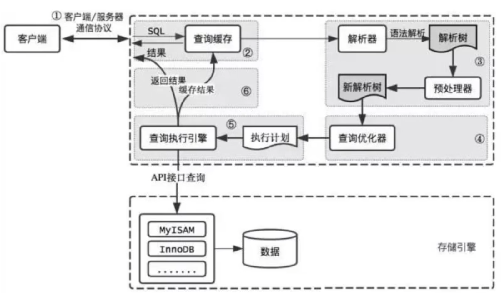
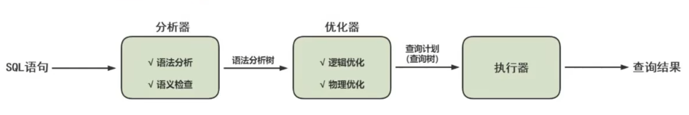

# 简述一条SQL在MySQL中的执行过程？



**MySQL的查询流程**

**1、查询缓存**：Server如果在查询缓存中发现了这条SQL语句，就直接将结果返回给客户端；如果没有，就进入解析器阶段。

```sql
query_cache_type -- 通过设置这个变量来开启缓存，1开启 2关闭（默认）
show status like '%Qcache%'; -- 查询缓存命中
```

但是查询缓存的效率往往不高，所以MySQL8.0之后就移除了这个功能。

**2、解析器**：在解析器中对SQL语句进行语法分析、语义分析。

SQL语句的分析分为**词法分析**与**语法分析**。

分析器首先会做“**词法分析**“，你输入的SQL语句包含多个字符串和空格组成。MySQL需要识别出里面的字符串分别是什么，代码什么。

接着做”**语法分析**“。根据词法分析的结果，语法分析器（比如：Bison）会根据语法规则，判断你输入的这个SQL语句是否**满足MySQL语法。**如果你输入的SQL语句不对，就会收到一个`You have an error in Your SQL syntax`的错误提醒。

如果SQL语句正确，则会生成一个语法树。

**3、优化器**：在优化器中会确定SQL语句的执行路径，比如是根据全表检索，还是根据索引检索等。

经过了解析器，MySQL就知道你要做什么了。在开始执行之前，还要经过优化器的处理。**一条查询可以有很多种执行方式，最后都返回相同的结果。优化器的作用就是找到这其中最好的执行计划。**

在查询优化器中，可以分为**逻辑查询**优化阶段和**物理查询**优化阶段。

-   逻辑查询优化就是通过改变SQL语句的内容来使得SQL查询更高效，同时为物理查询优化提供更多的候选执行计划。通常采用的方式是对SQL语句进行**等价变换**，对查询进行**重写**，而查询重写的数据基础就是关系代数。对条件表达式进行等价谓词重写、条件简化，对视图进行重写，对子查询进行优化，对连接语义进行了外连接消除、嵌套连接消除等。
-   物理查询优化是基于关系代数进行的查询重写，而关系代数的每一步都对应物理计算，这些物理计算往往存在多种算法，因此需要计算各种物理路径的代价，从而选择代价最小的作为执行计划。在这个阶段里，对于单表和多表连接的操作，需要高效地使用索引，提升查询效率

**4、执行器**

截止到现在，还没有真正的读写真实的表，仅仅只是产出了一个执行计划，于是就进行了**执行器阶段。**

在执行之前需要判断用户是否**具备权限**。如果没有，就会返回权限错误。如果具备，就执行SQL查询并返回结果。

在MySQL8.0以下版本，如果设置了查询缓存，就会将结果进行缓存。

如果有权限，就打开表继续执行。打开表的时候，执行器就会根据表的引擎定义，调用存储引擎API对表进行读写。存储引擎API只是抽象接口，下面还有个**存储引擎层**，具体实现还是要看表选择的存储引擎。


至此，SQL语句就执行完成了。对于有索引的表，执行的逻辑也差不多。

SQL语句在MySQL中的执行流程是：`SQL语句 ==> 查询缓存 ==> 解析器 ==> 优化器 ==> 执行器`


