# 索引优化与查询优化

都有哪些维度可以进行数据库调优？简言之：

- 索引失效、没有充分利用到索引 —— 索引建立
- 关联查询太多 JOIN（设计缺陷或不得已的需求）—— SQL 优化（可以考虑反范式，做一些字段冗余减少多表JOIN）
- 服务器调优及各个参数设置（缓冲、线程数等）—— 调整 my.cnf
- 数据过多 —— 分库分表

关于数据库调优的知识点非常分散。不同的 DBMS，不同的公司，不同的职位，不同的项目遇到的问题都不尽相同。

这里我们分为三个模块来拆分：

- 索引优化与查询优化
- [数据库的设计规范](./数据库设计规范.md)
- [数据库其他调优策略](./数据库其他调优策略.md)

虽然 SQL 查询优化的技术有很多，但是大方向上完全可以分成`物理查询优化`和`逻辑查询优化`两大块

- 物理查询优化是通过`索引`和`表连接方式`等技术来进行优化，这里重点需要掌握索引的使用。
- 逻辑查询优化就是通过`SQL等价变换`提升查询效率，直白一点就是说，换一种查询写法执行效率可能更高。

## 索引失效案例

:::details 数据准备

学员表 插 50万 条， 班级表 插 1万 条

**步骤 1：建表**：

```sql
CREATE TABLE `class` (
  `id` INT(11) NOT NULL AUTO_INCREMENT,
  `className` VARCHAR(38) DEFAULT NULL,
  `address` VARCHAR(48) DEFAULT NULL,
  `monitor` INT NULL,
  PRIMARY KEY (`id`)
) ENGINE=INNODB AUTO_INCREMENT=1 DEFAULT CHARSET=utf8;

CREATE TABLE `student` (
  `id` INT(11) NOT NULL AUTO_INCREMENT,
  `stuno` INT NOT NULL,
  `name` VARCHAR(28) DEFAULT NULL,
  `age` INT(3) DEFAULT NULL,
  `classId` INT(11) DEFAULT NULL,
  PRIMARY KEY (`id`),
  CONSTRAINT `fk_class_id` FOREIGN KEY (`classId`) REFERENCES `t_class` (`id`)
) ENGINE=INNODB AUTO_INCREMENT=1 DEFAULT CHARSET=utf8;
```

**步骤 2：设置参数**：

命令开启：允许创建函数设置：

```sql
set global log_bin_trust_function_creators=1;  # 不加global只是当前窗口有效。
```

**步骤 3：创建函数**：

保证每条数据都不同。

```sql
#随机产生字符串函数

DELIMITER //
CREATE FUNCTION rand_string(n INT) RETURNS VARCHAR(255)
BEGIN
  DECLARE chars_str VARCHAR(100) DEFAULT 'abcdefghijklmnopqrstuvwxyzABCDEFGHIJKLMNOPQRSTUVWXYZ';
  DECLARE return_str VARCHAR(255) DEFAULT '';
  DECLARE i INT DEFAULT 0;
  WHILE i < n DO
    SET return_str =CONCAT(return_str,SUBSTRING(chars_str,FLOOR(1+RAND()*52),1));
    SET i = i + 1;
  END WHILE;
  RETURN return_str;
END //
DELIMITER ;

# 假如要删除
# drop function rand_string;
```

随机产生班级编号函数

```sql
#用于随机产生指定范围的编号

DELIMITER //
CREATE FUNCTION rand_num (from_num INT ,to_num INT) RETURNS INT(11)
BEGIN
  DECLARE i INT DEFAULT 0;
  SET i = FLOOR(from_num+RAND()*(to_num - from_num+1)) ;
  RETURN i;
END //
DELIMITER ;

#假如要删除
#drop function rand_num;
```

**步骤 4：创建存储过程**：

```sql
#创建往student表中插入数据的存储过程

DELIMITER //
CREATE PROCEDURE insert_stu(START INT, max_num INT)
BEGIN
  DECLARE i INT DEFAULT 0;
  SET autocommit = 0;  #设置手动提交事务
  REPEAT  #循环
    SET i = i + 1;  #赋值
    INSERT INTO student (stuno, name, age, classId ) VALUES
    ((START+i),rand_string(6),rand_num(1,58),rand_num(1,1000));
    UNTIL i = max_num
  END REPEAT;
  COMMIT;  #提交事务
END //
DELIMITER ;

#假如要删除
#drop PROCEDURE insert_stu;
```

创建往class表中插入数据的存储过程

```sql
#执行存储过程，往class表添加随机数据

DELIMITER //
CREATE PROCEDURE insert_class(max_num INT)
BEGIN
  DECLARE i INT DEFAULT 0;
  SET autocommit = 0;
  REPEAT;
    SET i = i + 1;
    INSERT INTO class (className, address, monitor) VALUES
    (rand_string(8),rand_string(10),rand_num(1,100000));
    UNTIL i = max_num
  END REPEAT;
  COMMIT;
  END //
  DELIMITER ;
END //
DELIMITER ;

#假如要删除
#drop PROCEDURE insert_class;
```

**步骤 5：调用存储过程**：

class

```sql
#执行存储过程，往class表添加1万条数据
CALL insert_class(10000);
```

stu

```sql
#执行存储过程，往stu表添加50万条数据
CALL insert_stu(100000,500000);
```

**步骤 6：删除某表上的索引**：

说明：在后续的测试中，可以使用这个存储过程来删除表中索引，便于测试每个案例

创建存储过程

```sql
DELIMITER //
CREATE PROCEDURE `proc_drop_index`(dbname VARCHAR(200),tableName VARCHAR(200))
BEGIN
    DECLARE done INT DEFAULT 0;
    DECLARE ct INT DEFAULT 0;
    DECLARE _index VARCHAR(200) DEFAULT '';
    DECLARE _cur CURSOR FOR SELECT index_name FROM information_schema.STATISTICS WHERE table_schema=dbname AND table_name=tableName AND seq_in_index>0 AND index_name <>'PRIMARY' ;
    #每个游标必须使用不同的declare continue handler for not found set done=1来控制游标的结束
    DECLARE CONTINUE HANDLER FOR NOT FOUND set done=2 ;
    #若没有数据返回,程序继续,并将变量done设为2
    OPEN _cur;
    FETCH _cur INTO _index;
    WHILE _index<>'' DO
        SET @str = CONCAT("drop index ",_index," on ",tableName);
        PREPARE sql_str FROM @str ;
        EXECUTE sql_str;
        DEALLOCATE PREPARE sql_str;
        SET _index='';
        FETCH _cur INTO _index;
    END WHILE;
    CLOSE _cur;
END //
DELIMITER ;
```

执行存储过程

```sql
// 删除指定数据库中指定表上的索引
CALL proc_drop_index('dbname', 'tablename');
```

:::

MySQL中`提高性能`的一个最有效的方式是对数据表`设计合理的索引`。索引提供了访问高效数据的方法，并且加快查询的速度，因此索引对查询的速度有着至关重要的影响。

- 使用索引可以`快速地定位`表中的某条记录，从而提高数据库查询的速度，提高数据库的性能。
- 如果查询时没有使用索引，查询语句就会`扫描表中的所有记录`。在数据量大的情况下，这样查询的速度会很慢。

大多数情况下都（默认）采用`B+树`来构建索引。只是空间列类型的索引使用`R-树`，并且MEMORY表还支持`Hash索引`。

:::warning 注意

MyISAM存储引擎中的B+树，数据和索引是分开存储的，不存在聚簇索引的概念。

下面讨论的场景都是基于InnoDB存储引擎展开的

:::

其实，用不用索引，最终都是**优化器**说了算。优化器是基于什么的优化器？

基于`cost开销(CostBaseOptimizer)`，它不是基于`规则(Rule-BasedOptimizer)`，也不是基于`语义`。怎么样开销小就怎么来。

另外，**SQL语句是否使用索引，跟数据库版本、数据量、数据选择度都有关系。**

### 全值匹配我最爱

系统中经常出现的 SQL 语句如下：

```sql
EXPLAIN SELECT SQL_NO_CACHE * FROM student WHERE age=30;
EXPLAIN SELECT SQL_NO_CACHE * FROM student WHERE age=30 and classId=4;
EXPLAIN SELECT SQL_NO_CACHE * FROM student WHERE age=30 and classId=4 AND name = 'abcd';
```

建立索引前执行（关注执行时间）

```sql
mysql> SELECT SQL_NO_CACHE * FROM student WHERE age=30 and classId=4 AND name = 'abcd';
Empty set, 1 warning (0.28 sec)
```

建立索引

```sql
CREATE INDEX idx_age ON student(age);
CREATE INDEX idx_age_classid ON student(age,classId);
CREATE INDEX idx_age_classid_name ON student(age,classId,name);
```

建立索引后执行

```sql
mysql> SELECT SQL_NO_CACHE * FROM student WHERE age=30 and classId=4 AND name = 'abcd';
Empty set, 1 warning (0.01 sec)
```

可以看到，创建索引前的查询时间是`0.28`秒，创建索引后的查询时间是`0.01`秒，索引帮助我们极大的提高了查询效率。

### 最佳左前缀法则

> 什么是最左前缀原则：[MySQL索引最左前缀匹配原则？](./MySQL索引最左前缀匹配原则？.md)

在MySQL建立联合索引时会遵守最佳左前缀匹配原则，即最左优先，在检索数据时从联合索引的最左边开始匹配。

举例：索引 idx_age_classid_name 还能否正常使用？

```sql
-- 在只有 idx_age_classid_name 联合索引的情况下

-- 仅仅利用上了索引中的age字段，因为跳过了classId字段，所以后面的字段都无法被使用
EXPLAIN SELECT SQL_NO_CACHE * FROM student WHERE student.age=30 AND student.name = 'abcd';

-- 没有利用上索引，因为跳过了age字段
EXPLAIN SELECT SQL_NO_CACHE * FROM student WHERE student.classid=1 AND student.name = 'abcd';

-- 完全匹配索引（尽管条件中字段顺序与索引建立时的顺序不同，但是我们有优化器）
EXPLAIN SELECT SQL_NO_CACHE * FROM student WHERE classid=4 AND student.age=30 AND student.name = 'abcd';
```

**结论**：

MySQL可以为多个字段创建索引，一个索引可以包括16个字段。对于多列索引，**过滤条件要使用索引必须按照索引建立时的顺序，依次满足，一旦跳过某个字段，索引后面的字段都无法被使用**。如果查询条件中没有使用这些字段中第1个字段时，多列（或联合）索引不会被使用。

#### 阿里规约

<span style="color: var(--alibaba-qiangzhi-text-color);">【强制】</span>页面搜索严禁左模糊或者全模糊，如果需要请走搜索引擎来解决。

<span style="color: var(--alibaba-shuoming-text-color);">说明：</span>索引文件具有 B-Tree 的最左前缀匹配特性，如果左边的值未确定，那么无法使用此索引

### 主键插入顺序

对于一个使用`InnoDB`存储引擎的表来说，在我们没有显示的创建索引时，表中的数据实际上都是存储在`聚簇索引`的叶子节点的。而记录又存储在数据页中的，数据页和记录又是按照记录`主键值从小到大`的顺序进行排序，所以如果我们`插入`的记录的`主键值是依次增大`的话，那我们每插满一个数据页就换到下一个数据页继续插，而如果我们插入的`主键值忽小忽大`的话，则可能会造成`页面分裂`和`记录移位`。

> [什么是InnoDB的页分裂和页合并](./什么是InnoDB的页分裂和页合并.md)

假设某个数据页存储的记录满了，它存储的主键值在1-100之间：

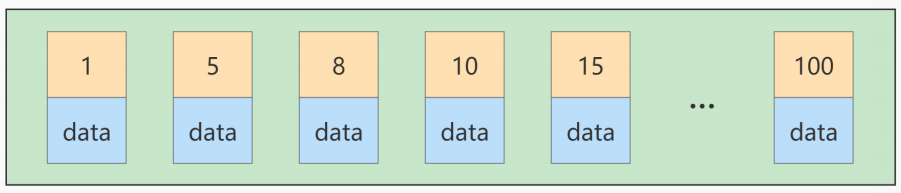

如果此时再插入一条主键值为 9 的记录，那它插入的位置就如下图：


可这个数据页已经满了，再插进来咋办呢？我们需要把当前`页面分裂`成两个页面，把本页中的一些记录移动到新创建的这个页。

**页面分裂和记录移位意味着什么？**

意味着：性能损耗！所以如果我们想尽量避免这样无谓的性能损耗，最好让插入的记录的`主键值依次递增`，这样就不会发生这样的性能损耗了。

所以我们建议：让主键具有`AUTO_INCREMENT`，让存储引擎自己为表生成主键，而不是我们手动插入，比如：person_info表：

```sql
CREATE TABLE person_info(
  id INT UNSIGNED NOT NULL AUTO_INCREMENT,
  name VARCHAR(100) NOT NULL,
  birthday DATE NOT NULL,
  phone_number CHAR(11) NOT NULL,
  country varchar(100) NOT NULL,
  PRIMARY KEY (id),
  KEY idx_name_birthday_phone_number (name(10), birthday, phone_number)
);
```

我们自定义的主键列id拥有AUTO_INCREMENT属性，在插入记录时存储引擎会自动为我们填入自增的主键值。这样的主键占用空间小，顺序写入，减少页分裂。

### 计算、函数导致索引失效

**函数导致索引失效**：

```sql
-- 创建索引
CREATE INDEX idx_name ON student(NAME);

-- 索引生效
EXPLAIN SELECT SQL_NO_CACHE * FROM student WHERE student.name LIKE 'abc%';

-- 索引失效
EXPLAIN SELECT SQL_NO_CACHE * FROM student WHERE LEFT(student.name,3) = 'abc';
```

**计算导致索引失效**：

```sql
-- 创建索引
CREATE INDEX idx_sno ON student(stuno);

-- 索引生效
EXPLAIN SELECT SQL_NO_CACHE id, stuno, NAME FROM student WHERE stuno = 90000;

-- 索引失效
EXPLAIN SELECT SQL_NO_CACHE id, stuno, NAME FROM student WHERE stuno+1 = 900001;
```

:::warning 误区

你可能会错误的认为下面的这个查询条件是索引失效的：

```sql
-- 将查询到的age+1
EXPLAIN SELECT SQL_NO_CACHE id, stuno, age+1 NAME FROM student WHERE stuno = 90000;
```

我刚开始学习MySQL的时候就犯过这样子的错误，他其实索引是生效的！！！

:::

### 类型转换导致索引失效

```sql
-- 创建索引
CREATE INDEX idx_name ON student(NAME);

-- 索引失效，name=123 发生类型转换
EXPLAIN SELECT SQL_NO_CACHE * FROM student WHERE name=123;

-- 索引生效
EXPLAIN SELECT SQL_NO_CACHE * FROM student WHERE name='123';
```

:::tip

在设计实体类属性时，一定要与数据库字段类型相对应。否则，就会出现类型转换，导致索引失效的情况。

:::

### 范围条件右边的列索引失效

这里的范围条件指的是`>、<、>=、<=、BETWEEN`等操作。

```sql
-- 创建索引，并且确保没有其他索引干扰
create index idx_age_name_classid on student(age,classid,name);

-- 索引部分生效，name字段没有利用上索引
EXPLAIN SELECT SQL_NO_CACHE * FROM student
WHERE student.age=30 AND student.classId>20 AND student.name = 'abc';

-- 这样子写也是一样的，对优化器来讲与上面一样，没有区别
EXPLAIN SELECT SQL_NO_CACHE * FROM student
WHERE student.age=30 AND student.name = 'abc' AND student.classId>20;
```

在生产中，如果像这类的查询条件比较多，可以将范围查询字段放置在联合索引最后，充分利用索引，例如：

```sql
create index idx_age_name_classid on student(age,name,classid);
```

> 应用开发中范围查询，例如：金额查询，日期查询往往都是范围查询。应将查询条件放置where语句最后。（同时，创建的联合索引中，务必把范围涉及到的字段写在最后）

### 不等于(!=或<>)索引失效 {#not-equals-index-invalidation}

```sql
-- 为 name 字段创建索引
CREATE INDEX idx_name ON student(NAME);

-- 索引失效
EXPLAIN SELECT SQL_NO_CACHE * FROM student WHERE student.name <> 'abc';
-- 或
EXPLAIN SELECT SQL_NO_CACHE * FROM student WHERE student.name != 'abc';
```

### is null可以使用索引，is not null无法使用索引

```sql
-- 当age字段存在索引

-- IS NULL：可以触发索引
EXPLAIN SELECT SQL_NO_CACHE * FROM student WHERE age IS NULL;

-- IS NOT NULL：无法触发索引
EXPLAIN SELECT SQL_NO_CACHE * FROM student WHERE age IS NOT NULL;
```

> 拓展：同理，在查询中使用`not like`也无法使用索引，导致全表扫描

:::tip 经验技巧

最好在设计数据表的时候就将`字段设置为 NOT NULL 约束`，比如你可以将INT类型的字段，默认值设置为0。将字符类型的默认值设置为空字符串('')

:::

### like以通配符%开头索引失效 {#like-wildcard-index-invalidation}

在使用 LIKE 关键字进行查询的查询语句中，如果匹配字符串的第一个字符为`%`，索引就不会起作用。只有`%`不在第一个位置，索引才会起作用。

```sql
-- 创建索引，并且确保没有其他索引干扰
CREATE INDEX idx_name ON student(name);

-- 索引失效
EXPLAIN SELECT SQL_NO_CACHE * FROM student WHERE name LIKE '%ab%';

-- 索引生效
EXPLAIN SELECT SQL_NO_CACHE * FROM student WHERE name LIKE 'abc%';
```

#### 阿里规约

<span style="color: var(--alibaba-qiangzhi-text-color);">【强制】</span>页面搜索严禁左模糊或者全模糊，如果需要请走搜索引擎来解决。

<span style="color: var(--alibaba-shuoming-text-color);">说明：</span>索引文件具有 B-Tree 的最左前缀匹配特性，如果左边的值未确定，那么无法使用此索引

### OR前后存在非索引的列，索引失效

在WHERE子句中，如果在OR前的条件列进行了索引，而在OR后的条件列没有进行索引，那么索引会失效。也就是说，**OR前后的两个条件中的列都是索引时，查询中才使用索引。**

```sql
-- 假设age、name字段有索引，classid没有
-- 索引失效
EXPLAIN SELECT SQL_NO_CACHE * FROM student WHERE age = 10 OR classid = 100;

-- 索引生效
EXPLAIN SELECT SQL_NO_CACHE * FROM student WHERE age = 10 OR name = 'Abel';
```

### 数据库和表的字符集统一使用utf8mb4

统一使用utf8mb4( 5.5.3版本以上支持)兼容性更好，统一字符集可以避免由于字符集转换产生的乱码。不同的`字符集`进行比较前需要进行`转换`会造成索引失效。

### 总结

> [MySQL常见索引失效的情况？](./MySQL常见索引失效的情况？.md)

**一般性建议**：

- 对于单列索引，尽量选择针对当前 query 过滤性更好的索引
- 在选择组合索引的时候，当前 query 中过滤性最好的字段在索引字段顺序中的位置越靠前越好。
- 在选择组合索引的时候，尽量选择能够包含当前 query 中的 where 子句中更多字段的索引。
- 在选择组合索引的时候，如果某个字段可能出现范围查询时，尽量把这个字段放在索引次序的最后面。

总之，书写 SQL 语句时，尽量避免造成索引失效的情况。

## 关联查询优化

:::details 数据准备

```sql
-- 分类
CREATE TABLE IF NOT EXISTS `type` (
  `id` INT(10) UNSIGNED NOT NULL AUTO_INCREMENT,
  `card` INT(10) UNSIGNED NOT NULL,
  PRIMARY KEY (`id`)
);

-- 图书
CREATE TABLE IF NOT EXISTS `book` (
  `bookid` INT(10) UNSIGNED NOT NULL AUTO_INCREMENT,
  `card` INT(10) UNSIGNED NOT NULL,
  PRIMARY KEY (`bookid`)
);

-- 向分类表中添加 20 条记录（请手动执行以下SQL20次）
INSERT INTO type (card) VALUES (FLOOR (1 + (RAND () * 20)));

-- 向图书表中添加 20 请手动执行以下SQL20次）
INSERT INTO book (card) VALUES (FLOOR (1 + (RAND () * 20)));
```

:::

### 外连接

外连接包括左外连接、右外连接和满外连接。而MySQL中不支持满外连接，需要使用UNION 来模拟满外连接。

因此外连接优化，只需考虑左外连接和右外连接的优化。而右外连接可以改造为左外连接，反之亦然。

故而左外连接为例：

```sql
EXPLAIN SELECT SQL_NO_CACHE * FROM `type` LEFT JOIN book ON type.card = book.card;
```

执行结果：

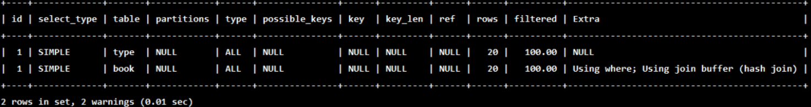

观察发现，type为`ALL`

为【被驱动表】添加索引优化，重新执行：

```sql
ALTER TABLE book ADD INDEX Y ( card);  #【被驱动表】，可以避免全表扫描

EXPLAIN SELECT SQL_NO_CACHE * FROM `type` LEFT JOIN book ON type.card = book.card;
```

执行结果：

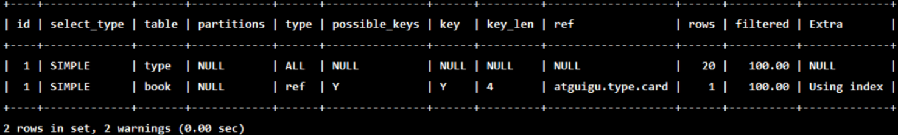

可以看到第二行的 type 变为了 `ref`，rows 也变成了 1，优化比较明显。这是由左连接特性决定的。

LEFT JOIN 条件用于确定如何从右表搜索行，左边一定都有，所以 右边是我们的关键点，一定需要建立索引。

:::tip

在上面这个例子中，左表没有筛选条件的情况下，针对左外连接来讲，除了内连接（交集部分）的数据外，左表中不满足条件的数据也需要。此时，【驱动表】的type为`ALL`也是可以的。

意思是驱动表中逐一取出一条数据，然后去被驱动表匹配。

但，如果说连接连接条件中只能有一个字段有索引，则应该优先考虑在【被驱动表】的字段上建立索引，`避免被驱动表全表扫描`。

:::

接下来，我们为【驱动表】也建立一个索引：

```sql
ALTER TABLE `type` ADD INDEX X (card);  #【驱动表】，无法避免全表扫描

EXPLAIN SELECT SQL_NO_CACHE * FROM `type` LEFT JOIN book ON type.card = book.card;
```

执行结果：

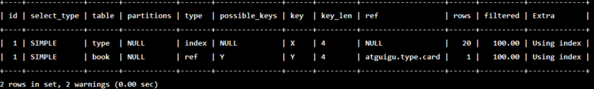

:::warning

`type.card = book.card`多表连接条件中的字段类型必须一致，否则会出现类型转换，导致索引失效。

因此在设计多表连接时，请务必保持连接字段类型一致。

:::

再接着，我们删除【被驱动表】的索引：

```sql
DROP INDEX Y ON book;

EXPLAIN SELECT SQL_NO_CACHE * FROM `type` LEFT JOIN book ON type.card = book.card;
```

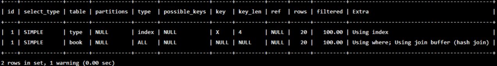

从结果上可以发现，第二行的 type 变为了 `ALL`。所以，在（左）外连接中，左表始终为【驱动表】，右表始终为【被驱动表】，优化器无权决定哪个表作为驱动表。

### 内连接 {#inner-join}

在测试之前，我们县抛出结论：

- 结论1：对于内连接来说，**查询优化器可以决定谁来作为驱动表，谁作为被驱动表出现**。
- 结论2：对于内连接来说，如果表的连接条件中只能有一个字段有索引，则有索引的字段所在的表会被作为【被驱动表】
- 结论3：对于内连接来说，在两个表的连接条件都存在索引的情况下，会选择小表作为【驱动表】。（`小表驱动大表`）

首先删除索引，避免上面外连接示例中创建的索引的干扰

```sql
drop index X on type;
drop index Y on book;（如果已经删除了可以不用再执行该操作）
```

> 注意：换成 inner join（MySQL 会自动选择驱动表）

```sql
EXPLAIN SELECT SQL_NO_CACHE * FROM type INNER JOIN book ON type.card=book.card;
```

执行结果：

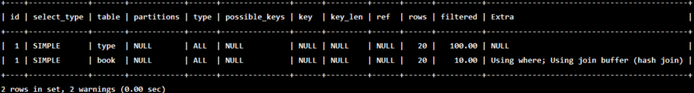

为【被驱动表】添加索引：

```sql
ALTER TABLE book ADD INDEX Y (card);

EXPLAIN SELECT SQL_NO_CACHE * FROM type INNER JOIN book ON type.card=book.card;
```

执行结果：

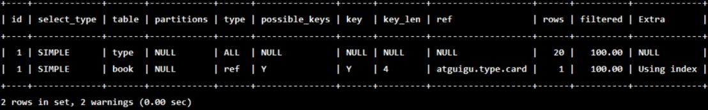

接着，为【驱动表】添加索引：

```sql
ALTER TABLE `type` ADD INDEX X (card);

EXPLAIN SELECT SQL_NO_CACHE * FROM type INNER JOIN book ON type.card=book.card;
```

执行结果：

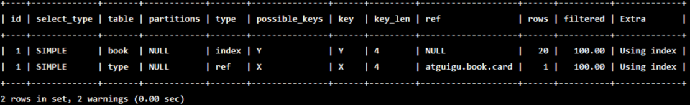

:::tip

如上结果可以推出结论1：对于内连接来说，**查询优化器可以决定谁来作为驱动表，谁作为被驱动表出现**。

上面这个例子中，优化器就将type作为了被驱动表，book作为驱动表。

:::

再接着，我们删除【驱动表】的索引：

```sql
DROP INDEX X ON type;

EXPLAIN SELECT SQL_NO_CACHE * FROM type INNER JOIN book ON type.card=book.card;
```

执行结果：

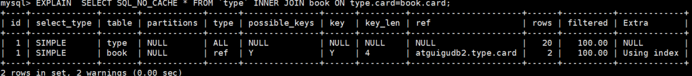

:::tip

如上结果可以推出结论2：对于内连接来说，如果表的连接条件中只能有一个字段有索引，则有索引的字段所在的表会被作为【被驱动表】

:::

再接着，我们为【驱动表】中添加20条数据，并建立一个索引，此时type中数据记录为40条，book中数据记录为20条：

```sql
INSERT INTO type (card) VALUES (FLOOR (1 + (RAND () * 20))); -- 执行20次

ALTER TABLE `type` ADD INDEX X (card);

EXPLAIN SELECT SQL_NO_CACHE * FROM type INNER JOIN book ON type.card=book.card; 
```

执行结果：

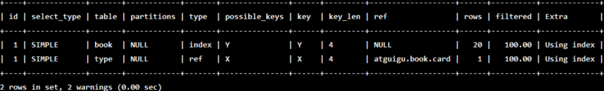

从结果发现，由于type表中数据大于book表，所以优化器将book作为被驱动表，type作为驱动表。

:::tip

如上结果可以推出结论3：对于内连接来说，在两个表的连接条件都存在索引的情况下，会选择小表作为【驱动表】。（`小表驱动大表`）

上面这个例子中，type中有40条记录，book中有20条记录，优化器就将type作为了被驱动表，book作为驱动表。

:::

### JOIN语句原理

join方式连接多个表，本质就是各个表之间数据的**循环匹配**。MySQL5.5 版本之前，MySQL 只支持一种表间关联方式，就是嵌套循环 (Nested Loop Join)。如果关联表的数据量很大，则 join 关联的执行时间会非常长。在 MySQL5.5 以后的版本中，MySQL 通过引入 BNLJ 算法来优化嵌套执行。

#### 明确：驱动表和被驱动表

驱动表就是主表，被驱动表就是从表、非驱动表。

**对于内连接来说**：

```sql
SELECT * FROM A JOIN B ON ...
```

**A 一定是驱动表吗？**

不一定，优化器会根据你查询语句做优化，决定先查哪张表。先查询的那张表就是驱动表，反之就是被驱动表。通过 explain 关键字可以查看。

**对于外连接来说**：

```sql
SELECT * FROM A LEFT JOIN B ON ...
-- 或
SELECT * FROM B RIGHT JOIN A ON ...
```

通常，大多数人会认为A是驱动表，B是被驱动表。

但是也未必，实测如下：

```sql
CREATE TABLE a(f1 INT, f2 INT, INDEX(f1))ENGINE=INNODB;
CREATE TABLE b(f1 INT, f2 INT)ENGINE=INNODB;

INSERT INTO a VALUES(1,1),(2,2),(3,3),(4,4),(5,5),(6,6);
INSERT INTO b VALUES(3,3),(4,4),(5,5),(6,6),(7,7),(8,8);

SELECT * FROM b;

#测试1
EXPLAIN SELECT * FROM a LEFT JOIN b ON(a.f1=b.f1) WHERE (a.f2=b.f2);

#测试2
EXPLAIN SELECT * FROM a LEFT JOIN b ON(a.f1=b.f1) AND (a.f2=b.f2);

#测试3
EXPLAIN SELECT * FROM a JOIN b ON(a.f1=b.f1) OR (a.f2=b.f2);
```

#### Simple Nested-Loop Join（简单嵌套循环连接）

算法相当的的简单，从表A中取出一条记录，遍历B，与表B中的所有记录进行匹配，如果匹配成功，则返回结果，以此类推，驱动表A中的每一条记录都要与表B中的每条记录进行匹配。

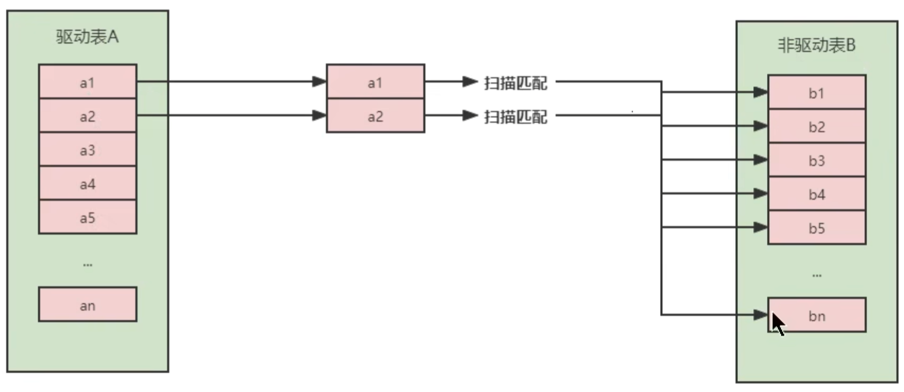

可以看到这种方式效率是非常低的，以上述表 A 数据 100 条，表 B 数据 1000 条计算，则 A*B = 10 万次。开销统计如下：

| 开销统计           | SNLJ  |
| ------------------ | ----- |
| 外表扫描次数：     | 1     |
| 内表扫描次数：     | A     |
| 读取记录数：       | A+B*A |
| JOIN 比较次数：    | B*A   |
| 回表读取记录次数： | 0     |

当然 MySQL 肯定不会这么粗暴的去进行表的连接，所以就出现了后面的两种对 Nested-Loop Join 优化算法。

#### Index Nested-Loop Join（索引嵌套循环连接）

Index Nested-Loop Join其优化的思路主要是为了`减少内层表数据的匹配次数`，所以要求被驱动表上必须`有索引`才行。

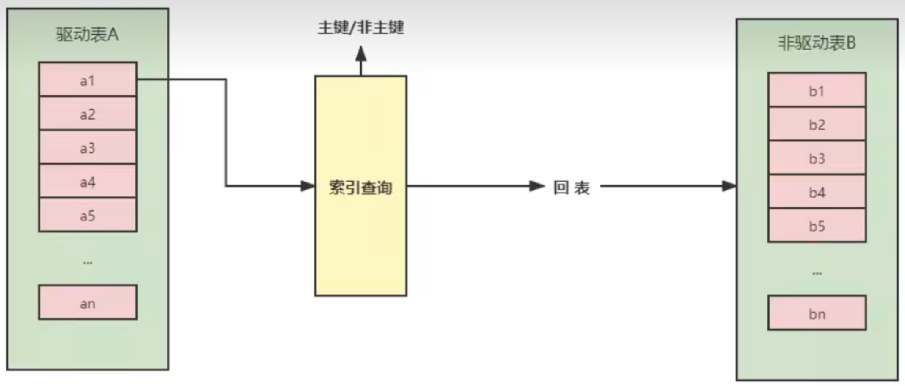

驱动表中的每条记录通过被驱动表的索引进行访问，因为索引查询的成本是比较固定的，故 MySQL 优化器都倾向于使用记录数少的表作为驱动表（外表）。

| 开销统计           | SNLJ  | INLJ                   |
| ------------------ | ----- | ---------------------- |
| 外表扫描次数：     | 1     | 1                      |
| 内表扫描次数：     | A     | 0                      |
| 读取记录数：       | A+B*A | A+B(match)             |
| JOIN 比较次数：    | B*A   | A*Index(Height)        |
| 回表读取记录次数： | 0     | B(match) (if possible) |

如果被驱动表加索引，效率是非常高的，但如果索引不是主键索引，所以还得进行一次回表查询。相比，被驱动表的索引是主键索引，效率会更高。

#### Block Nested-Loop Join（块嵌套循环连接）{#block-nested-loop-join}

如果存在索引，那么会使用index的方式进行join，如果join的列没有索引，被驱动表要扫描的次数太多了。每次访问被驱动表，其表中的记录都会被加载到内存中，然后再从驱动表中取一条与其匹配，匹配结束后清除内存，然后再从驱动表中加载一条记录，然后把被驱动表的记录再加载到内存匹配，这样周而复始，大大增加了IO的次数。为了减少被驱动表的IO次数，就出现了`Block Nested-Loop Join`的方式。

不再是逐条获取驱动表的数据，而是一块一块的获取，引入了`join buffer缓冲区`，将驱动表join相关的部分数据列（大小受join buffer的限制）缓存到join buffer中，然后全表扫描被驱动表，被驱动表的每一条记录一次性和join buffer中的所有驱动表记录进行匹配（内存中操作），将简单嵌套循环中的多次比较合并成一次，降低了被驱动表的访问频率。

:::warning 注意

- 这里缓存的不只是关联表的列，select 后面的列也会缓存起来。
- 在一个有 N 个 join 关联的 sql 中会分配 N-1 个 join buffer。所以查询的时候尽量减少不必要的字段，可以让 join buffer 中可以存放更多的列。

:::

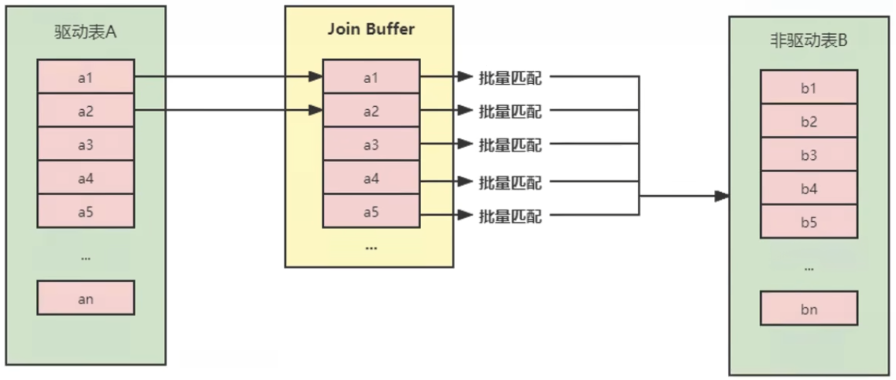

| 开销统计           | SNLJ  | INLJ                   | BNLJ                                            |
| ------------------ | ----- | ---------------------- | ----------------------------------------------- |
| 外表扫描次数：     | 1     | 1                      | 1                                               |
| 内表扫描次数：     | A     | 0                      | A * used_column_size / join_buffer_size+1       |
| 读取记录数：       | A+B*A | A+B(match)             | A+B * (A * used_column_size / join_buffer_size) |
| JOIN 比较次数：    | B*A   | A*Index(Height)        | B*A                                             |
| 回表读取记录次数： | 0     | B(match) (if possible) | 0                                               |

参数设置：

- **block_nested_loop**通过 `show variables like '%optimizer_switch%'` 查看`block_nested_loop`状态。默认是开启的。
- **join_buffer_size**驱动表能不能一次加载完，要看 join buffer 能不能存储所有的数据，默认情况下 `join_buffer_size=256k`。

```sql
mysql> show variables like '%join_buffer%';
+------------------+--------+
| Variable_name    | Value  |
+------------------+--------+
| join_buffer_size | 262144 |
+------------------+--------+
1 row in set (0.00 sec)
```

join_buffer_size 的最大值在 32 位系统可以申请 4G，而在 64 位操作系统下可以申请大于 4G 的 Join Buffer 空间。（64位Windows除外，其大值会被截断为4GB并发出警告）

#### Join 小结

1. **整体效率比较**：INLJ > BNLJ > SNLJ

2. 永远用**小结果集驱动大结果集** (其本质就是减少外层循环的数据数量)（小的度量单位指的是 `表行数 * 每行大小`）

    ```sql
    -- 下面两个sql，t1只查询了一个字段b，t2查询了很多个字段，此时推荐t1作为驱动表
    select t1.b,t2.* from  t1 straight_join t2 on (t1.b=t2.b) where t2.id<=100; #推荐
    select t1.b,t2.* from  t2 straight_join t1 on (t1.b=t2.b) where t2.id<=100; #不推荐
    
    -- 原因是在相同大小的情况下，将它放在Join Buffer中，可以放更多的记录条数
    ```

3. 为被驱动表匹配的条件增加索引 (减少内层表的循环匹配次数)

4. 增大 join buffer size 的大小 (一次缓存的数据越多，那么内层包的扫表次数就越少)

5. 减少驱动表不必要的字段查询 (字段越少，join buffer 所缓存的数据就越多)

#### Hash Join

**从MySQL的8.0.20版本开始将废弃BNLJ，因为从MySQL8.0.18版本开始就加入了hash join默认都会使用hash join**

- Nested Loop：对于被连接的数据子集较小的情况下，Nested Loop是个较好的选择。
- Hash Join是做`大数据集连接`时的常用方式，优化器使用两个表中较小（相对较小）的表利用Join Key在内存中建立`散列值`，然后扫描较大的表并探测散列值，找出与Hash表匹配的行。
  - 这种方式适用于较小的表完全可以放入内存中的情况，这样总成本就是访问两个表的成本之和。
  - 在表很大的情况下并不能完全放入内存，这时优化器会将它分割成`若干不同的分区`，不能放入内存的部分就把该分区写入磁盘的临时段，此时要求有较大的临时段从而尽量提高I/O的性能。
  - 它能够很好的工作于没有索引的大表和并行查询的环境中，并提供最好的性能。Hash Join只能应用于等值连接，这是由Hash的特点决定的。

| 类别     | Nested Loop                                                  | Hash Join                                                    |
| -------- | ------------------------------------------------------------ | ------------------------------------------------------------ |
| 使用条件 | 任何条件                                                     | 等值连接（=）                                                |
| 相关资源 | CPU、磁盘 I/O                                                | 内存、临时空间                                               |
| 特点     | 当有高选择性索引或进行限制性搜索时效率比较高，能够快速返回第一次的搜索结果。 | 当缺乏索引或者索引条件模糊时，Hash Join 比 Nested Loop 有效。在数据仓库环境下，如果表的记录数多，效率高。 |
| 缺点     | 当索引丢失或者查询条件限制不够时，效率很低；当表的记录数多时，效率低。 | 为建立哈希表，需要大量内存。第一次的结果返回较慢             |

:::warning 注意

根据MySQL官方描述，非等值条件也可以使用Hash Join，因此以上表格仅供参考

:::

#### 小结

- LEFT JOIN时，选择小表作为驱动表，`大表作为被驱动表`。减少外层循环的次数
- INNER JOIN时，MySQL会自动将`小结果集的表选为驱动表`。请相信MySQL的优化策略。
- 能够直接多表关联的尽量直接关联，不要使用子查询。（减少查询的趟数）
- 不建议使用子查询，建议将子查询SQL拆开结合程序多次查询，或使用JOIN代替子查询。
  - 因为衍生表建不了索引

## 子查询优化

**子查询是MySQL的一项重要的功能，可以帮助我们通过一个SQL语句实现比较复杂的查询。但是，子查询的执行效率不高。**

原因：

- ① 执行子查询时，MySQL需要为内层查询语句的查询结果`建立一个临时表`，然后外层查询语句从临时表中查询记录。查询完毕后，再`撤销这些临时表`。这样会消耗过多的CPU和IO资源，产生大量的慢查询。

- ② 子查询的结果集存储的临时表，不论是内存临时表还是磁盘临时表都`不会存在索引`，所以查询性能会受到一定的影响。

- ③ 对于返回结果集比较大的子查询，其对查询性能的影响也就越大。

**在MySQL中，可以使用连接（JOIN）查询来替代子查询**。连接查询`不需要建立临时表`，其`速度比子查询要快`，如果查询中使用索引的话，性能就会更好。

举例 1：查询学生表中是班长的学生信息

```sql
#创建班级表中班长的索引
CREATE INDEX idx_monitor ON class(monitor);

-- 使用子查询
EXPLAIN SELECT * FROM student stu1
WHERE stu1.`stuno` IN (
  SELECT monitor
  FROM class c
  WHERE monitor IS NOT NULL
);

-- 使用多表查询（推荐）
EXPLAIN SELECT stu1.* FROM student stu1 JOIN class c
ON stu1.`stuno` = c.`monitor`
WHERE c.`monitor` IS NOT NULL;
```

举例 2：取所有不为班长的同学

```sql
-- 使用子查询（不推荐）
EXPLAIN SELECT SQL_NO_CACHE a.*
FROM student a
WHERE a.stuno NOT IN (
        SELECT monitor FROM class b
        WHERE monitor IS NOT NULL);

-- 使用多表查询（推荐）
EXPLAIN SELECT SQL_NO_CACHE a.*
FROM student a LEFT OUTER JOIN class b
ON a.stuno =b.monitor
WHERE b.monitor IS NULL;
```

分别执行两条 SQL 语句，可以发现查询时间分别为1分26.74秒、22.83秒，可以发现多表查询的执行效率明显高于子查询。

> 结论：尽量不要使用`NOT IN`或者 `NOT EXISTS`，用`LEFT JOIN xxx ON xx WHERE xx IS NULL`替代

## 排序优化

**在 WHERE 条件字段上加索引，但是为什么在 ORDER BY 字段上还要加索引呢？**

在 MySQL 中，支持两种排序方式，分别是 `FileSort` 和 `Index` 排序。

- Index 排序中，索引可以保证数据的有序性，不需要再进行排序，`效率更高`。
- FileSort 排序则一般在`内存中`进行排序，`占用 CPU 较多`。如果待排结果较大，会产生临时文件 I/O 到磁盘进行排序的情况，效率较低。

:::warning 注意

不能片面的认为Index排序一定比FileSort排序效率高，这是不对的。

在一些极端情况下，FileSort 排序反而会比 Index 排序效率高。

:::

**优化建议**：

1. SQL 中，可以在 WHERE 子句和 ORDER BY 子句中使用索引，目的是在 WHERE 子句中 `避免全表扫描`，在 ORDER BY 子句`避免使用 FileSort 排序`。当然，某些情况下全表扫描，或者 FileSort 排序不一定比索引慢。但总的来说，我们还是要避免，以提高查询效率。
2. 尽量使用 Index 完成 ORDER BY 排序。如果 WHERE 和 ORDER BY 后面是相同的列就使用单索引列；如果不同就使用联合索引。
3. 无法使用 Index 时，需要对 FileSort 方式进行调优。
4. 当【范围条件】和【group by 或者 order by】的字段出现二选一时，优先观察条件字段的过滤数量，如果过滤的数据足够多，而需要排序的数据并不多时，优先把索引放在范围字段上。反之，亦然。

**测试**：

删除 student 表和 class 表中已创建的索引。避免对接下来的测试产生影响。

```sql
#方式1：
DROP INDEX idx_monitor ON class;

DROP INDEX idx_cid ON student;
DROP INDEX idx_age ON student;
DROP INDEX idx_name ON student;
DROP INDEX idx_age_name_classid ON student;
DROP INDEX idx_age_classid_name ON student;

#方式2：
call proc_drop_index('test','student');
```

以下是否能使用到索引，能否去掉`using filesort`

过程一：

```sql
EXPLAIN SELECT SQL_NO_CACHE * FROM student ORDER BY age,classid;
```

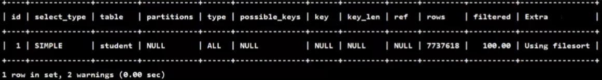

```sql
EXPLAIN SELECT SQL_NO_CACHE * FROM student ORDER BY age,classid LIMIT 10;
```

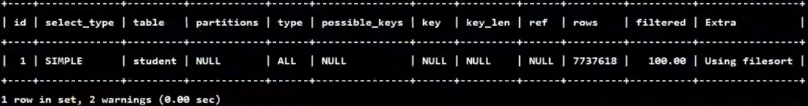

过程二：order by时不加limit，索引失效

```sql
#创建索引
CREATE INDEX idx_age_classid_name ON student(age,classid,name);

#不加limit，索引失效
EXPLAIN SELECT SQL_NO_CACHE * FROM student ORDER BY age,classid;
```

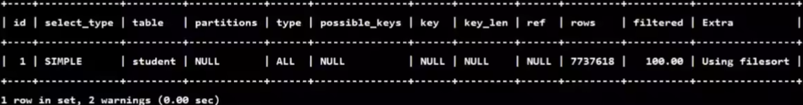

**为什么索引失效呢？**

因为如果根据age,classid在索引中进行查找，然后还需要进行回表，如果数据量很大，优化器认为直接走全表扫描的效率可能会更高。

```sql
#加limit过滤条件，使用上索引了
EXPLAIN SELECT SQL_NO_CACHE * FROM student ORDER BY age,classid LIMIT 10;
```

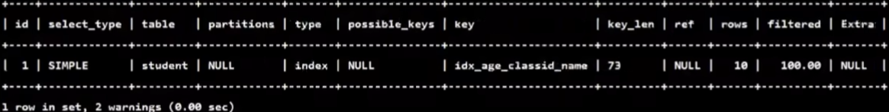

因为此时加上了limit条件，优化器认为仅仅是10条数据进行回表的代价（成本）比全表扫描更小，因此使用索引。

过程三：order by时顺序错误，索引失效

```sql
#创建索引age,classid,stuno
CREATE  INDEX idx_age_classid_stuno ON student (age,classid,stuno);

#以下哪些索引失效？
EXPLAIN  SELECT * FROM student ORDER BY classid LIMIT 10; -- 索引失效，不符合索引最左前缀

EXPLAIN  SELECT * FROM student ORDER BY classid,name LIMIT 10; -- 索引失效，不符合索引最左前缀

EXPLAIN  SELECT * FROM student ORDER BY age,classid,stuno LIMIT 10; -- 使用了索引

EXPLAIN  SELECT * FROM student ORDER BY age,classid LIMIT 10; -- 使用了索引

EXPLAIN  SELECT * FROM student ORDER BY age LIMIT 10; -- 使用了索引
```

过程四：order by时规则不一致，索引失效（顺序错，不索引；方向反，不索引）

```sql
-- 存在索引 idx_age_classid_stuno (age,classid,stuno)

EXPLAIN  SELECT * FROM student ORDER BY age DESC, classid ASC LIMIT 10; -- 索引失效，age降序

EXPLAIN  SELECT * FROM student ORDER BY classid DESC, NAME DESC LIMIT 10; -- 索引失效，不符合索引最左前缀

EXPLAIN  SELECT * FROM student ORDER BY age ASC,classid DESC LIMIT 10; -- 索引失效，calssid降序

EXPLAIN  SELECT * FROM student ORDER BY age DESC, classid DESC LIMIT 10; -- 使用了索引，Extra字段：Backward index scan
```

> 结论：ORDER BY子句，尽量使用index方式排序，避免使用FileSort方式排序。

过程五：无过滤，不索引

```sql
-- 存在索引 idx_age_classid_stuno (age,classid,stuno)

EXPLAIN  SELECT * FROM student WHERE age=45 ORDER BY classid; -- 使用了索引

EXPLAIN  SELECT * FROM student WHERE age=45 ORDER BY classid,name; -- 使用了索引

EXPLAIN  SELECT * FROM student WHERE classid=45 order by age; -- 索引失效，不符合索引最左前缀

EXPLAIN  SELECT * FROM student WHERE classid=45 order by age LIMIT 10; -- 使用了索引，由优化器决定使用索引
```

```sql
INDEX a_b_c(a,b,c)

order by 能使用索引最左前缀
- ORDER BY a
- ORDER BY a,b
- ORDER BY a,b,c
- ORDER BY a DESC,b DESC,c DESC

如果WHERE使用索引的最左前缀定义为常量，则order by 能使用索引
- WHERE a = const ORDER BY b,c
- WHERE a = const AND b = const ORDER BY c
- WHERE a = const ORDER BY b,c
- WHERE a = const AND b > const ORDER BY b,c

不能使用索引进行排序
- ORDER BY a ASC,b DESC,c DESC /* 排序不一致 */
- WHERE g = const ORDER BY b,c /*丢失a索引*/
- WHERE a = const ORDER BY c /*丢失b索引*/
- WHERE a = const ORDER BY a,d /*d不是索引的一部分*/
- WHERE a in (...) ORDER BY b,c /*对于排序来说，多个相等条件也是范围查询*/
```

### filesort算法：双路排序和单路排序

排序的字段如果不在索引中，则需要使用FileSort算法进行排序。有两种算法：**双路排序**和**单路排序**。

**双路排序（慢）**

- MySQL 4.1 之前是使用双路排序，字面意思就是`两次扫描磁盘`，最终得到数据，读取行指针和order by列，对他们进行排序，然后扫描已经排序好的列表，按照列表中的值重新从列表中读取对应的数据输出

- 从磁盘取排序字段，在 buffer 进行排序，再从磁盘取其他字段。

取一批数据，要对磁盘进行两次扫描，众所周知，IO是很耗时的，所以在 mysql4.1 之后，出现了第二种改进的算法，就是单路排序。

**单路排序（快）**

从磁盘读取查询需要的`所有列`，按照order by列在 buffer 对它们进行排序，然后扫描排序后的列表进行输出，它的效率更快一些，避免了第二次读取数据。并且把随机 IO 变成了顺序 IO，但是它会使用更多的空间，因为它把每一行都保存在内存中了。

---

**结论及引申出的问题**

- 由于单路是后出的，总体而言好过双路

- 但是用单路有问题
  - 在sort_buffer中，单路比多路要`多占用很多空间`，因为单路是把所有字段都取出，所以有可能取出的数据的总大小超出了`sort_buffer`的容量，导致每次只能取sort_buffer容量大小的数据，进行排序（创建 tmp 文件，多路合并），排完再取sort_buffer容量大小，再排…… 从而多次 I/O。
  - 单路本来想省一次 I/O 操作，`反而导致了大量的 I/O 操作`，反而得不偿失。

**优化策略**

**1. 尝试提高 sort_buffer_size**

不管用哪种算法，提高这个参数都会提高效率，要根据系统的能力去提高，因为这个参数是针对每个进程（connection）的 1M-8M 之间调整。MySQL5.7，InnoDB 存储引擎默认值是 1048576 字节，1MB。

```sql
SHOW VARIABLES LIKE '%sort_buffer_size%';
```

**2. 尝试提高 max_length_for_sort_data**

- 提高这个参数，会增加用改进算法的概率。

```sql
SHOW VARIABLES LIKE '%max_length_for_sort_data%';  #默认1024字节
```

- 但是如果设的太高，数据总容量超出sort_buffer_size的概率就增大，明显症状是高的磁盘 I/O 活动和低的处理器使用率。如果需要返回的列的总长度大于max_length_for_sort_data，使用双路算法，否则使用单路算法。1024-8192 字节之间调整

**3. Order by 时select \*是一个大忌。最好只 Query 需要的字段**。原因：

- 当 Query 的字段大小总和小于`max_length_for_sort_data`，而且排序字段不是TEXT|BLOB 类型时，会用改进后的算法 —— 单路排序，否则用老算法 —— 多路排序。
- 两种算法的数据都有可能超出sort_buffer_size的容量，超出之后，会创建 tmp 文件进行合并排序，导致多次 I/O，但是用单路排序算法的风险会更大一些，所以要 提高 `sort_buffer_size`。

## GROUP BY优化

- group by 使用索引的原则几乎跟order by一致 ，group by 即使没有过滤条件用到索引，也可以直接使用索引。
- group by 先排序再分组，遵照索引建的最佳左前缀法则
- 当无法使用索引列，可以增大`max_length_for_sort_data`和`sort_buffer_size`参数的设置
- where效率高于having，能写在where限定的条件就不要写在having中了
- 减少使用order by，和业务沟通能不排序就不排序，或将排序放到程序端去做。Order by、group by、distinct这些语句较为耗费CPU，数据库的CPU资源是极其宝贵的。
- 包含了order by、group by、distinct这些查询的语句，where条件过滤出来的结果集请保持在1000行以内，否则SQL会很慢。

## 分页查询优化

一般分页查询时，通过创建覆盖索引能够比较好地提高性能。一个常见又非常头疼的问题就是`limit 2000000,10`，此时需要 MySQL 排序前 2000010 记录，仅仅返回 2000000 - 2000010 的记录，其他记录丢弃，查询排序的代价非常大。

```sql
EXPLAIN SELECT * FROM student LIMIT 2000000,10;
```

**优化思路一**

在索引上完成排序分页操作，最后根据主键关联回原表查询所需要的其他列内容。

```sql
EXPLAIN SELECT * FROM student t,(SELECT id FROM student ORDER BY id LIMIT 2000000,10) a
WHERE t.id = a.id;
```

**优化思路二**

该方案适用于主键自增的表，可以把Limit 查询转换成某个位置的查询。

```sql
EXPLAIN SELECT * FROM student WHERE id > 2000000 LIMIT 10;
```

:::warning 思考

有的人可能会疑惑，如果主键不是顺序自增的，例如：1、2、3、7、8……这样的，那么我吗查询出来的数据就不是真正的第2000000条记录到第2000010条记录

确实有这么一个问题存在

但是我们更关系的是数据是否重复，比如第100页、第99页，只要它们的数据不重复，并且分页查询的时候不漏掉显示，每一条记录都能够显示即可

:::

## 优先考虑覆盖索引

### 什么是覆盖索引

**理解方式一**：索引是高效找到行的一个方法，但是一般数据库也能使用索引找到一个列的数据，因此它不必读取整个行。毕竟索引叶子节点存储了它们索引的数据；当能通过读取索引就可以得到想要的数据，那就不需要读取行了。**一个索引包含了满足查询结果的数据就叫做覆盖索引。**

**理解方式二**：非聚簇复合索引的一种形式，它包括在查询里的SELECT、JOIN和WHERE子句用到的所有列（即建索引的字段正好是覆盖查询条件中所涉及的字段）。

简单说就是，`索引列+主键`包含`SELECT 到 FROM之间查询的列`。

> [MySQL的覆盖索引？](./MySQL的覆盖索引？.md)

举例1：

```sql
#创建索引
CREATE INDEX idx_age_name ON student (age,name);

EXPLAIN SELECT * FROM student WHERE age <> 20; -- 索引失效

EXPLAIN SELECT id,age,name FROM student WHERE age <> 20; -- 使用了索引
```

:::info 打破——不等于(!=或<>)索引失效

关于第二条查询语句，你可能会有疑问，不是说WHERE后面使用了[不等于(!=或<>)索引失效](#not-equals-index-invalidation)吗？

是的，一般情况下WHERE后面的条件使用了不等于，索引就会失效，这是我们总结经验得到的

但是，查询优化器是逐利的（逐的是执行成本），因为这条查询语句的查询字段刚好都在索引列中，也就是所谓的**覆盖索引**，优化器认为直接走索引，不需要回表，执行成本更低，所以优化器就选择了索引。

:::

举例2：

```sql
EXPLAIN SELECT * FROM student WHERE name LIKE '%abc'; -- 索引失效

#创建索引
CREATE INDEX idx_age_name ON student (age,NAME);


EXPLAIN SELECT id,age,NAME FROM student WHERE name LIKE '%abc'; -- 使用了索引
```

:::info 打破——like以通配符%开头索引失效

关于第二条查询语句，使用了索引，与举例1同理，也是因为查询优化器认为直接走索引，不需要回表，执行成本更低，所以优化器就选择了索引。

:::

### 覆盖索引的利弊

**好处：**

- **避免 Innodb 表进行索引的二次查询（回表）**

Innodb 是以聚集索引的顺序来存储的，对于 Innodb 来说，二级索引在叶子节点中所保存的是行的主键信息，如果是用二级索引查询数据，在查找到相应的键值后，还需通过主键进行二次查询才能获取我们真实所需要的数据。在覆盖索引中，二级索引的键值中可以获取所要的数据，`避免了对主键的二次查询，减少了 IO 操作`，提升了查询效率。

- **可以把随机 IO 变成顺序 IO 加快查询效率**

由于覆盖索引是按键值的顺序存储的，对于 IO 密集型的范围查找来说，对比随机从磁盘读取每一行的数据 IO 要少的多，因此利用覆盖索引在访问时也可以把磁盘的 随机读取的 IO 转变成索引查找的 顺序 IO。
由于覆盖索引可以减少树的搜索次数，显著提升查询性能，所以使用覆盖索引是一个常用的性能优化手段。

**弊端：**

- `索引字段的维护`总是有代价的。因此，在建立冗余索引来支持覆盖索引时就需要权衡考虑了。这是业务DBA，或者称为业务数据架构师的工作。

## 索引条件下推（ICP）

### 使用前后对比

Index Condition Pushdown（ICP）是 MySQL 5.6 中新特性，是一种在存储引擎层**使用索引过滤数据**的优化方式。

- 如果没有 ICP，存储引擎会遍历索引以定位基表中的行，并将它们返回给 MySQL 服务器，由 MySQL 服务器评估 WHERE 后面的条件是否保留行。
- 启用 ICP 后，如果部分 WHERE 条件可以仅使用索引中的列进行筛选，则 MySQL 服务器会把这部分 WHERE 条件放到存储引擎筛选。然后，存储引擎通过使用索引条目来筛选数据，并且只有在满足这一条件时才从表中读取行。
  - 好处：ICP 可以减少存储引擎必须访问基表的次数和 MySQL 服务器必须访问存储引擎的次数。
  - 但是，ICP 的 加速效果 取决于在存储引擎内通过 ICP 筛选 掉的数据的比例。

:::tip 提示

我相信，大多数人第一次接触ICP，看到上面的概念，可能就蒙蔽了。但实际上我们已经接触过他了

在性能分析工具的使用中，我们使用EXPLAIN时，可以看到Extra列有时候包含`Using index condition``的字样，这就是索引条件下推（ICP）优化的典型特征。

具体查看：[Using index condition](./性能分析工具的使用.md#using-index-condition)

:::

### ICP 的开启 / 关闭

默认情况下启用索引条件下推。可以通过设置系统变量 `optimizer_switch` 控制 `index_condition_pushdown`

```sql
#打开索引下推
SET optimizer_switch = 'index_condition_pushdown=off';

#关闭索引下推
SET optimizer_switch = 'index_condition_pushdown=on';
```

当使用索引条件下推时，`EXPLAIN` 语句输出结果中 `Extra` 列内容显示为 `Using index condition`。

### ICP 使用案例

> 具体案例可以查看：[索引下推——MySQL官方示例](./什么是索引下推？.md#icp-example)

### ICP 的使用条件 {#icp-condition}

- 如果表访问的类型为 range、ref、eq_ref和ref_or_null 可以使用 ICP
- ICP 可以用于 `InnoDB` 和 `MyISAM` 表，包括分区表 InnoDB 和 MyISAM 表
- 对于 `InnoDB` 表，ICP 仅用于 `二级索引`。ICP 的目标是减少全行读取次数，从而减少 I/O 操作。
  - ICP不能用于聚簇索引，因为ICP的主要目标是为例减少回表，而聚簇索引中本身就包含用户完整的数据，因此不需要回表
- 当 SQL 使用覆盖索引时，不支持 ICP。因为这种情况下使用 ICP 不会减少 I/O。
- 相关子查询的条件不能使用 ICP

## 其它查询优化策略

### EXISTS和IN的区分

索引是个前提，其实选择与否还会要看表的大小。你可以将选择的标准理解为`小表驱动大表`。

### COUNT(\*)与COUNT(具体字段)效率

**环节1：**`COUNT(*)`和`COUNT(1)`都是对所有结果进行`COUNT`，`COUNT(*)`和`COUNT(1)`本质上并没有区别（二者执行时间可能略有差别，不过你还是可以把它俩的执行效率看成是相等的）。如果有WHERE子句，则是对所有符合筛选条件的数据行进行统计；如果没有WHERE子句，则是对数据表的数据行数进行统计。

**环节2：**如果是MyISAM存储引擎，统计数据表的行数只需要`O(1)`的复杂度，这是因为每张MyISAM的数据表都有一个meta信息存储了`row_count`值，而一致性则是由表级锁来保证的。

如果是InnoDB存储引擎，因为InnoDB支持事务，采用行级锁和MVCC机制，所以无法像MyISAM一样，维护一个row_count变量，因此需要采用`扫描全表`，是`O(n)`的复杂度，进行循环+计数的方式来完成统计。

**环节3：**在InnoDB引擎中，如果采用`COUNT(具体字段)`来统计数据行数，要尽量采用二级索引。因为主键采用的索引是聚簇索引，聚簇索引包含的信息多，明显会大于二级索引（非聚簇索引）。对于`COUNT(*)`和`COUNT(1)`来说，它们不需要查找具体的行，只是统计行数，系统会`自动`采用占用空间更小的二级索引来进行统计。

如果有多个二级索引，会使用key_len小的二级索引进行扫描。当没有二级索引的时候，才会采用主键索引来进行统计。

### 关于SELECT(\*)

在表查询中，建议明确字段，不要使用 * 作为查询的字段列表，推荐使用SELECT <字段列表> 查询。原因：

① MySQL 在解析的过程中，会通过`查询数据字典`将"*"按序转换成所有列名，这会大大的耗费资源和时间。

② 无法使用`覆盖索引`

### LIMIT 1对优化的影响

针对的是会扫描全表的 SQL 语句，如果你可以确定结果集只有一条，那么加上`LIMIT 1`的时候，当找到一条结果的时候就不会继续扫描了，这样会加快查询速度。

如果数据表已经对字段建立了唯一索引，那么可以通过索引进行查询，不会全表扫描的话，就不需要加上`LIMIT 1`了。

### 多使用COMMIT

只要有可能，在程序中尽量多使用 COMMIT，这样程序的性能得到提高，需求也会因为 COMMIT 所释放的资源而减少。

COMMIT 所释放的资源：

- 回滚段上用于恢复数据的信息

- 被程序语句获得的锁

- redo / undo log buffer 中的空间

- 管理上述 3 种资源中的内部花费
