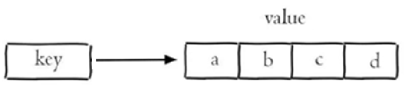

# Redis常见五大数据类型？

## **口语化**

redis 的基础数据类型，主要有五种，string ，hash，list，set 和 zset。平时最常用的就是 string，可以缓存内容、做分布式锁等等，其次就是 hash，比如缓存一些对象结构的数据，hash 就比较合理。假设缓存一个个人信息，姓名，年龄，头像这些。传统的 string 需要进行序列化转 json，hash 则可以直接拿到。zset 也用过，主要是做排行榜功能，利用分数的特性进行排序。

>   重点：string 的分布式锁、hash 存储对象、zset 做排行榜


Redis存储的是key-value结构的数据，其中key是字符串类型，value有5种常用的数据类型：

-   字符串(string)：普通字符串，Redis中最简单的数据类型
-   哈希(hash)：也叫散列，类似于Java中的HashMap结构
-   列表(list)：按照插入顺序排序，可以有重复元素，类似于Java中的LinkedList
-   集合(set)：无序集合，没有重复元素，类似于Java中的HashSet
-   有序集合(sorted set/zset)：集合中每个元素关联一个分数(score)，根据分数升序排序，没有重复元素
    -   与Java中的TreeSet有些类似，但底层数据结构却差别很大


## **字符串(string)**

字符串是 Redis 中最简单和最常用的数据类型。

可以用来存储如字符串、整数、浮点数、图片（图片的base64编码或图片的路径）、序列化后的对象等

每个键（key）对应一个值（value），一个键最大能存储512MB的数据

Redis 中字符串类型常用命令：

-   **SET** key value 					         设置指定key的值（添加或修改）
-   **GET** key                                        获取指定key的值
-   **SETEX** key seconds value         设置指定key的值，并将 key 的过期时间设为 seconds 秒
-   **SETNX** key value                        只有在 key    不存在时设置 key 的值
-   **MSET**                                            批量添加多个String类型的键值对
-   **MGET**                                           根据多个key获取多个String类型的value
-   **INCR**                                            让一个整型的key自增1
-   **INCRBY**                                       让一个整型的key自增并指定步长，例如：incrby num 2 让num值自增2
-   **INCRBYFLOAT**                           让一个浮点类型的数字自增并指定步长

更多命令可以参考Redis中文网：https://www.redis.net.cn

## **哈希(hash)**

Redis hash 是一个string类型的 field 和 value 的映射表，类似于Java中的Map<String, Object>。

Hash特别适合用于存储对象，如用户信息、商品详情等

每个Hash可以存储 2^32 - 1个键值对


常用命令：

-   **HSET** key field value             将哈希表 key 中的字段 field 的值设为 value
-   **HGET** key field                       获取存储在哈希表中指定字段的值
-   **HDEL** key field                       删除存储在哈希表中的指定字段
-   **HKEYS** key                              获取哈希表中所有字段
-   **HVALS** key                              获取哈希表中所有值
-   HMSET：批量添加多个hash类型key的field的值
-   HMGET：批量获取多个hash类型key的field的值
-   HGETALL：获取一个hash类型的key中的所有的field和value
-   HINCRBY:让一个hash类型key的字段值自增并指定步长
-   HSETNX：添加一个hash类型的key的field值，前提是这个field不存在，否则不执行

示例：

```shell
HSET user:1000 name "John"
HGET user:1000 name
```

**列表(list)**

Redis 列表是一个有序的字符串列表，可以从两端压入或弹出元素，支持在列表的头部或尾部添加元素。

列表最多可存储2^32 - 1个元素

类似于Java中的LinkedList，特征也与LinkedList类似：

-   有序
-   元素可以重复
-   插入和删除快
-   查询速度一般

**适用场景**：朋友圈点赞列表，评论列表等

常用命令：

-   **LPUSH** key value1 [value2]         将一个或多个值插入到列表头部（左侧）
-   **LPOP** key                                        移除并返回列表左侧的第一个元素，没有则返回nil
-   **LRANGE** key start stop                获取列表指定范围内的元素
-   **RPUSH** key element ...                 向列表右侧插入一个或多个元素
-   **RPOP** key                                       移除并获取列表最后一个元素（右侧）
-   **LLEN** key                                        获取列表长度
-   **BRPOP** key1 [key2 ] timeout       移出并获取列表的最后一个元素， 如果列表没有元素会阻塞列表直到等待超    时或发现可弹出元素为止



示例：

```shell
LPUSH mylist "world"
LPUSH mylist "hello"
LRANGE mylist 0 -1
```

##  **集合(set)**

Redis set 是string类型的无序集合。集合成员是唯一的，这就意味着集合中不能出现重复的数据

集合适用于去重和集合运算（如交集、并集、差集）

set的添加、删除、查找操作的复杂度都是O(1)。

类似于Java中的HashSet可以看做是一个value为null的HashMap。因为也是一个hash表，因此具备与HashSet类似的特征：

-   无序
-   元素不可重复
-   查找快
-   支持交集、并集、差集等功能

常用命令：

-   **SADD** key member1 [member2]            向集合添加一个或多个成员
-   **SMEMBERS** key                                         返回集合中的所有成员
-   **SISMEMBER** key member                       判断一个元素是否存在于set中
-   **SCARD** key                                                  获取集合的成员数
-   **SINTER** key1 [key2]                                   返回给定所有集合的交集
-   **SUNION** key1 [key2]                                 返回所有给定集合的并集
-   **SREM** key member1 [member2]            移除集合中一个或多个成员


示例：

```shell
SADD myset "hello"
SADD myset "world"
SMEMBERS myset
```

## **有序集合(sorted set/zset)**

zset和Set一样也是string类型元素的集合，且不允许重复的成员。有序集合类似于集合，但每个元素都会关联一个double类型的分数（score），redis正是通过分数来为集合中的成员进行从小到大的排序

与Java中的TreeSet有些类似，但底层数据结构却差别很大。SortedSet中的每一个元素都带有一个score属性，可以基于score属性对元素排序，底层的实现是一个**跳表（SkipList）加 hash表**

SortedSet具备下列特性：

-   可排序
-   元素不重复
-   查询速度快

常用命令：

-   **ZADD** key score1 member1 [score2 member2]     向有序集合添加一个或多个成员
-   **ZRANGE** key start stop [WITHSCORES]                     通过索引区间返回有序集合中指定区间内的成员
-   **ZINCRBY** key increment member                              有序集合中对指定成员的分数加上增量 increment
-   **ZREM** key member [member ...]                                移除有序集合中的一个或多个成员


## **通用命令**

Redis的通用命令是不分数据类型的，都可以使用的命令：

-   KEYS pattern 		查找所有符合给定模式( pattern)的 key 
-   EXISTS key 		检查给定 key 是否存在
-   TYPE key 		返回 key 所储存的值的类型
-   DEL key 		该命令用于在 key 存在是删除 key
