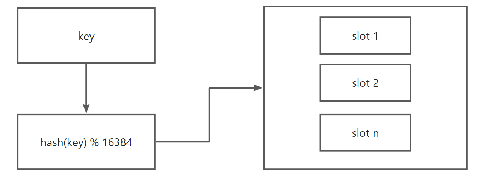

## 什么情况下会出现数据库和缓存不一致的问题？:star:


#

#

#

#


#


#

## 缓存击穿、雪崩、穿透的区别？


## **如果有大量的key需要设置同一时间过期，一般需要注意什么？**


#

## Redis的发布订阅功能？


## 什么是分布式锁？分布式锁的特点？

口语化

在某时刻，只能有一个线程获取到锁，在失去连接或者异常情况，锁也能够释放。

常见的分布式锁有三种：基于mysql实现、基于redis实现、基于zookeeper实现。

mysql本身就带有锁机制，但性能一般，所以使用mysql作为分布式锁比较少见

redis作为分布式锁就非常常见了，主要是利用**setnx**这个方法，如果插入key成功，则表示获得到了锁，插入失败则表示无法获得到锁。业务完成后，通过**del**来释放锁。利用这套逻辑来实现分布式锁。

zookeeper也是企业级开发中较好的一个实现分布式锁的方案，但是一般我们的项目到会使用到redis做缓存，因此使用redis做分布式锁就自然而然了。


>   分布式锁：满足分布式系统或集群模式下多进程可见并且互斥的锁。
>
>   分布式锁的核心思想就是让大家都使用同一把锁，只要大家使用的是同一把锁，那么我们就能锁住线程，不让线程进行，让程序串行执行，这就是分布式锁的核心思路

那么分布式锁他应该满足一些什么样的条件呢？

-   **可见性**：多个线程都能看到相同的结果

 注意：这个地方说的可见性并不是并发编程中指的内存可见性，只是说**多个进程之间都能感知到变化的意思**

-   **互斥**：互斥是分布式锁的最基本的条件，使得程序串行执行
-   **容错性**：即使某个持有锁的客户端崩溃或失去连接，锁也能够被其他客户端重新获取
-   **高可用**：程序不易崩溃，时时刻刻都保证较高的可用性
-   **高性能**：由于加锁本身就让性能降低，所有对于分布式锁本身需要他就较高的加锁性能和释放锁性能
-   **安全性**：安全也是程序中必不可少的一环

常见的分布式锁有三种

-   1）Mysql：mysql本身就带有锁机制，但是由于mysql性能本身一般，所以采用分布式锁的情况下，其实使用mysql作为分布式锁比较少见
-   2）Redis：redis作为分布式锁是非常常见的一种使用方式，现在企业级开发中基本都使用redis或者zookeeper作为分布式锁，利用**setnx**这个方法，如果插入key成功，则表示获得到了锁，如果有人插入成功，其他人插入失败则表示无法获得到锁，利用这套逻辑来实现分布式锁
-   3）Zookeeper：zookeeper也是企业级开发中较好的一个实现分布式锁的方案

**分布式锁的实现方式**

-   **基于数据库**

使用数据库的SELECT ... FOR UPDATE 语句或类似的行级锁机制来实现分布式锁。优点是实现简单，缺点是性能较低，依赖于数据库的高可用性。高并发情况下也会对数据库造成非常大的压力。

```sql
-- 获取锁
SELECT * FROM locks WHERE resource = 'resource_name' FOR UPDATE;

-- 释放锁
DELETE FROM locks WHERE resource = 'resource_name';
```

-   **基于Redis**

Redis 提供了原子操作和高性能的特性，非常适合用来实现分布式锁。通常使用**SETNX**命令来实现

```java
// 获取锁
String result = jedis.set("lock_key", "lock_value", "NX", "PX", 30000);
if ("OK".equals(result)) {
    // 锁获取成功
}

// 释放锁
if (lock_value.equals(jedis.get("lock_key"))) {
    jedis.del("lock_key");
}
```

**基于 Zookeeper**

Zookeeper 提供了分布式协调服务，可以用来实现分布式锁。通过创建临时顺序节点来实现锁机制。

```java
// 创建一个临时顺序节点
String path = zookeeper.create("/locks/lock-", null, ZooDefs.Ids.OPEN_ACL_UNSAFE, CreateMode.EPHEMERAL_SEQUENTIAL);

// 检查是否获取到锁
List<String> children = zookeeper.getChildren("/locks", false);
Collections.sort(children);
if (path.equals("/locks/" + children.get(0))) {
    // 获取到锁
}
```


## 如何实现分布式锁？

**核心思路**

我们利用redis 的**setnx** 方法，当有多个线程进入时，我们就利用该方法，第一个线程进入时，redis 中就有这个key 了，返回了1，如果结果是1，则表示他抢到了锁，那么他去执行业务，然后再删除锁，退出锁逻辑，没有抢到锁的哥们，等待一定时间后重试即可


**版本一**

setnx、expire命令二者组合实现一个最简单的锁。setnx成功，则证明抢到锁，然后使用expire设置一个过期时间，防止死锁

```java
//加锁
if（redisClient.setnx(lockKey,lockValue)）{
    //设置过期时间
    redisClient.expire（lockKey，1000）;
    try{
        //业务请求
        do something  
    }catch(){
    
    }finally{
       //释放锁
       redisClient.del(lockKey);
    }
}
```

那么问题来了。setnx 与 expire 不是原子的。假设刚执行完setnx，服务挂了，或重启，总之就是没执行expire，那么就变成死锁了。

**版本二**

针对版本一的原子性问题，很容易想到了lua脚本

将setnx和expire写成lua命令，可以解决这个问题。

那么还有没有基于api的简单方式呢。

set有一个扩展命令。这个命令是原子的。

```
SET key value [EX seconds][PX milliseconds][NX|XX]
```

于是可以这样做

```java
//加锁
if（redisClient.set(lockKey,lockValue,"NX","EX", 1000)）{
    try{
        //业务请求
        do something  
    }catch(){
    
    }finally{
       //释放锁
       redisClient.del(lockKey);
    }
}
```

到这里，同时增加过期时间，防止死锁，此方法可以**保证加锁和增加过期时间具有原子性**

已经解决了加锁问题，那么释放锁是否有问题呢。

如果仅仅的使用lockKey删除，那是不是意味着多个线程的key一样，如果线程A没有执行完，锁过期了。线程B执行，加锁后，结果A执行完，把B的锁释放了。这就是A删错了人。

所以在此基础上要在释放锁在一个文章。增加唯一key标识的校验。

**版本三**

```java
//加锁
if（redisClient.set(lockKey,uuid,"NX","EX", 1000)）{
    try{
        //业务请求
        do something  
    }catch(){
    
    }finally{
       //释放锁
        if(uuid.equals(redisClient.get(lockKey);){
             redisClient.del(lockKey);
        }
      
    }
}
```

同样的释放锁，不是原子的，也可以使用lua脚本进行解决。

至此，版本三基本已经可以满足大多数场景的使用了。

那么假设。锁释放了，业务还没执行完怎么办。这就轮到了看门狗机制和reddisson框架上场了


## 为什么Redis实现分布式锁不合适？还是有很多公司在用？

**口语化**

关于问题这个可以从几个方面来说

第一：使用分布式锁的目的是为了保证同一个时间只有一个JVM进程可以对共享资源进行操作

第二，根据锁的用途可以细分为两类。一类是允许多个客户端操作共享资源，称之为共享锁，这种锁一般是对共享资源具有幂等性操作的场景，主要是为了防止重复操作共享资源而频繁加锁带来的性能开销。另一类是只允许一个客户端操作共享资源，称之为排他锁，这种锁一般是用在对共享资源具有非幂等性操作的场景，也就是说需要保证在同一时刻只有一个进程或线程能够访问共享资源。

目前使用分布式锁最常用的中间件是redis和zookeeper。

redis可以通过两种方式实现

第一是通过redis提供的SET key value \[EX seconds]\[PX milliseconds][NX|XX] 命令，它是set命令的扩展命令，能够保证加锁和设置过期时间的原子性。

第二是基于Redisson客户端实现分布式锁，redisson提供了分布式锁的封装方法，我们只需要调用api中的lock、unlock方法，即可实现分布式锁。因为redisson在所有的指令都是通过lua脚本执行，保证了原子性。其次，redssion通过watch dog机制来实现锁的续期，从而避免死锁等问题


基于zookeeper实现的方式有很多种

使用比较多的方式是通过有序节点来实现，具体来说，就是每个线程去竞争锁的时候去zookeeper中创建一个有序节点，然后根据有序节点的顺序来表示获取锁的成功状态。


redis和zookeeper实现分布式锁都有它的优缺点

redis方案

-   获取锁的方式简单粗暴，如果获取锁失败，就会不断尝试获取锁，比较消耗性能。
-   redis是AP模型，在集群模式中由于一致性会导致锁出现一些问题，即便是有redlock算法来实现，在某一些场景下也无法保证100%的可靠性

不过实际开发中，使用redis实现分布式还是比较常见的，而且大部分情况下，不会遇到这种极端复杂的场景。最重要的是，redis性能很高，在高并发场景下比较合适

redis方案

-   zookeeper实现分布式锁，zookeeper天生设计定位就是**分布式协调**，强一致性。锁的模型健壮、简单易用、适合做分布式锁。

-   如果获取不到锁，只需要添加一个监听器就可以了，不用一直轮询，性能消耗较小


对我个人而言，我比较推崇zookeeper来实现分布式锁，因为对于分布式锁实现场景来说，它应该符合CP模型，但是redis是AP模型，所有在这个点上，zookeeper会更加合适一点。至于为什么还有很多公司使用redis作为分布式锁，因为它们的业务体量不大，而且能够接受它的缺点


>   1998年，加州大学的计算机科学家 Eric Brewer 提出，分布式系统有三个指标：
>
>   -   **C**onsistency（一致性）用户访问分布式系统中的任意节点，得到的数据必须一致
>   -   **A**vailability（可用性）用户访问分布式系统时，读或写操作总能成功。
>       -   只能读不能写，或者只能写不能读，或者两者都不能执行，就说明系统弱可用或不可用
>   -   **P**artition tolerance （分区容错性）就是分区，就是当分布式系统节点之间出现网络故障导致节点之间无法通信的情况
>
>   它们的第一个字母分别是 `C`、`A`、`P`。Eric Brewer认为任何分布式系统架构方案都不可能同时满足这3个目标，这个结论就叫做 CAP 定理。
>
>   
>
>   **矛盾**
>
>   在分布式系统中，网络不能100%保证畅通，也就是说网络分区的情况一定会存在。而我们的系统必须要持续运行，对外提供服务。所以分区容错性（`P`）是硬性指标，所有分布式系统都要满足。而在设计分布式系统时要取舍的就是一致性（`C`）和可用性（`A`）了。
>
>   具体参考：[CAP定理](https://gitee.com/ninghongkang/cloud-study-2024/blob/master/doc/13-%E5%BE%AE%E6%9C%8D%E5%8A%A1%E9%9D%A2%E8%AF%95%E9%A2%98/README.md#11cap%E5%AE%9A%E7%90%86)


## **看门狗机制的原理是什么？**

## Redis实现分布式锁有什么问题吗？


## 分布式锁在未执行完逻辑之前就过期了怎么办？


## **redlock的分布式锁是什么？**


## Redis的setnx和setex的区别？


## Redis的持久化机制？| Redis有哪些持久化方式？

**口语化**

redis主要提供了两种持久化方式，rdb 和 aof，它们也可以混合使用。**rdb** 主要是在**指定的时间间隔**内生成数据集的**快照**，并将其保存到磁盘上，生成一个 rdb 格式的二进制文件，容易备份，恢复速度快，适合用于灾难恢复。aof持久化方式是记录每一个写操作到日志文件中，Redis会将这些写操作以追加的方式写入到aof文件中。每次恢复的时候，进行重放。aof 相比 rdb 就是文件会大一些，恢复速度慢一些，但是数据丢失风险小。在实际中，一般可以选择混合互补的方式使用。

>   rdb，aof，混合持久化


Redis 提供了 2 个不同形式的持久化方式：

-   RDB（Redis DataBase）
-   AOF（Append Only File）

>   Redis 4.0引入了**混合持久化模式**

**RDB（Redis DataBase）**

在指定的**时间间隔**内将内存中的数据集**快照**写入磁盘（ 也就是行话讲的 snapshot 快照），默认是生成一个名为`dump.rdb`的文件，它恢复时是将快照文件直接读到内存里。

RDB的配置可以在redis.conf文件中进行。例如：

```shell
save 900 1      # 如果900秒（15分钟）内至少有1个键发生变化，就触发一次RDB快照
save 300 10     # 如果300秒（5分钟）内至少有10个键发生变化，就触发一次RDB快照
save 60 10000   # 如果60秒（1分钟）内至少有10000个键发生变化，就触发一次RDB快照
```

**优点**

1、RDB文件是一个紧凑的二进制文件，可以很容易地进行备份。

2、 恢复速度快，适合用于灾难恢复。

3、 对Redis性能影响较小，因为生成RDB文件的工作是在子进程中进行的。

**缺点**

1、 数据持久化的频率较低，可能会丢失最近一次快照之后的数据。

2、 生成RDB快照时，可能会消耗较多的CPU和内存资源。因为Fork 的时候，内存中的数据被克隆了一份，大致 2 倍的膨胀性需要考虑


**AOF（Append Only File）**

**以日志的形式来记录每个写操作（增量保存）**，将 Redis 执行过的所有写指令记录下来 (读操作不记录)， **只许追加文件但不可以改写文件**，redis 启动之初会读取该文件重新构建数据。

日志文件默认名为`appendonly.aof`

换言之，redis 重启的话就根据日志文件的内容将写指令从前到后执行一次以完成数据的恢复工作。

AOF的配置可以在redis.conf文件中进行。例如：

```shell
appendonly yes         # 启用AOF持久化
appendfilename "appendonly.aof"
appendfsync everysec   # 每秒钟同步一次AOF文件
# 其他选项：
# appendfsync always  # 每个写操作都同步到AOF文件，性能较差但数据最安全
# appendfsync no      # 由操作系统决定何时同步，性能最好但数据安全性较差
```

**AOF同步频率**

-   appendfsync always：**始终同步，每次 Redis 的写入都会立刻记入日志**；性能较差但数据完整性比较好。
-   appendfsync everysec：**每秒同步，每秒记入日志一次，如果宕机，本秒的数据可能丢失**。
-   appendfsync no：redis 不主动进行同步，**把同步时机交给操作系统**。性能最好，可靠性较差，可能会丢失大量数据。

**优点**：

1、数据恢复更可靠，AOF可以记录每一个写操作，数据丢失风险较小。

2、AOF文件是可读的文本文件，方便分析和调试。

**缺点**：

1、 AOF文件比RDB文件大，占用更多的磁盘空间，恢复速度较慢。

2、 持久化频率高时，可能会影响Redis性能。

3、 需要定期进行AOF重写（rewrite），以避免文件过大。


**混合持久化（Hybrid Persistence）**

混合持久化模式结合了RDB和AOF的优点。在Redis 4.0及以上版本中，混合持久化模式在生成新的AOF文件时，会首先创建一个RDB快照，然后在快照之后追加AOF日志。

这种方式可以在保证数据恢复速度的同时，减少数据丢失的风险。

混合持久化的配置可以在redis.conf文件中进行

```shell
aof-use-rdb-preamble yes  # 启用混合持久化模式
```

**优点**：

1、 结合了RDB和AOF的优点，既能快速恢复数据，又能减少数据丢失的风险。


官方推荐两个都启用：

-   如果对数据不敏感，可以选单独用 RDB。
-   不建议单独用 AOF，因为可能会出现 Bug。
-   如果只是做纯内存缓存，可以都不用

**官网建议**

-   RDB 持久化方式能够在指定的时间间隔能对你的数据进行快照存储。
-   AOF 持久化方式记录每次对服务器写的操作，当服务器重启的时候会重新执行这些命令来恢复原始的数据，AOF 命令以 redis 协议追加保存每次写的操作到文件末尾。Redis 还能对 AOF 文件进行后台重写，使得 AOF 文件的体积不至于过大。
-   只做缓存：如果你只希望你的数据在服务器运行的时候存在，你也可以不使用任何持久化方式。
-   同时开启两种持久化方式：
    -   在这种情况下，当 redis 重启的时候会优先载入 AOF 文件来恢复原始的数据，因为在通常情况下 AOF 文件保存的数据集要比 RDB 文件保存的数据集要完整。
    -   RDB 的数据不实时，同时使用两者时服务器重启也只会找 AOF 文件。那要不要只使用 AOF 呢？建议不要，因为 RDB 更适合用于备份数据库 (AOF 在不断变化不好备份)，快速重启，而且不会有 AOF 可能潜在的 bug，留着作为一个万一的手段。
-   性能建议：
    -   因为 RDB 文件只用作后备用途，建议只在 Slave 上持久化 RDB 文件，而且只要 15 分钟备份一次就够了，只保留 save 900 1 这条规则。
    -   如果使用 AOF，好处是在最恶劣情况下也只会丢失不超过两秒数据，启动脚本较简单，只 load 自己的 AOF 文件就可以了。
    -   aof 代价：一是带来了持续的 IO，二是 AOF rewrite 的最后，将 rewrite 过程中产生的新数据写到新文件造成的阻塞几乎是不可避免的。
    -   只要硬盘许可，应该尽量减少 AOF rewrite 的频率，AOF 重写的基础大小默认值 64M 太小了，可以设到 5G 以上。默认超过原大小 100% 大小时重写可以改到适当的数值。 


## rdb的优势与劣势?

**rdb优势**

-   数据恢复快

RDB文件是一个紧凑的二进制文件，包含了某一时刻的数据快照。在需要恢复数据时，只需加载这个文件到内存即可即可。

-   性能影响小

RDB快照的生成是在子进程中进行的，不影响主流程和命令读取。

-   适合备份与灾难恢复

容易地将这些文件复制到远程服务器或云存储中，确保数据的安全性。

-   完整性

RDB文件在生成时是一个完整的快照，即使在文件生成过程中发生故障，Redis也会丢弃不完整的文件。

**rdb劣势**

-   数据丢失

RDB快照是定期生成的，在两次快照之间的数据变更不会被保存。如果Redis在生成下一次快照之前崩溃，这些变更的数据将会丢失。加上rdb基本不会频繁进行，所以还增加了丢失可能性。

-   资源消耗

-   RDB快照是在子进程中生成的，但这个过程仍然需要大量的CPU和内存资源，尤其是在数据量很大的情况下。生成快照时，子进程会读取Redis的所有数据并写入磁盘，这可能会导致较高的I/O负载。


## aof的优势和劣势？

**aof优势**

-   更安全的持久化 

AOF通过记录每个写操作来确保数据的持久性。你可以配置AOF的同步策略，例如每秒同步一次（appendfsync everysec），这样即使Redis崩溃，也只会丢失最近一秒的数据。这种方式比RDB快照更安全，因为RDB可能会丢失自上次快照以来的所有数据。

-   更好的可读性

AOF文件是一个可读的文本文件，记录了所有的写操作命令。这使得AOF文件非常容易理解和修改。在紧急情况下，你可以手动编辑AOF文件来修复数据问题。

-   多种同步策略

appendfsync always：**始终同步，每次 Redis 的写入都会立刻记入日志**；性能较差但数据完整性比较好。

appendfsync everysec：**每秒同步，每秒记入日志一次，如果宕机，本秒的数据可能丢失**。

appendfsync no：redis 不主动进行同步，**把同步时机交给操作系统**。性能最好，可靠性较差，可能会丢失大量数据。

**aof劣势**

-   文件体积大

AOF记录了每一个写操作，随着时间的推移，AOF文件可能会变得非常大。因此要进行AOF重写，rewrite 的最后，将 rewrite 过程中产生的新数据写到新文件造成的阻塞几乎是不可避免的。

-   恢复速度慢

恢复数据时，Redis需要重放AOF文件中的所有写操作。这意味着恢复速度取决于AOF文件的大小和写操作的数量，可能会比RDB恢复慢很多。

-   性能开销

频繁的写操作会导致AOF文件不断增长，这需要更多的I/O操作，可能会影响Redis的性能。特别是在appendfsync always模式下，每个写操作都需要同步到磁盘，对性能影响较大。


## Redis生成rdb的时候，是如何处理正常请求的？


## Redis的red lock？


## Redis主从有哪几种常见的拓扑结构？


## **redis主从复制的核心原理？**


## **Redis的从服务器的作用？**


## **Redis中的管道有什么用**


## 原生批处理命令(mset、mget)与Pipeline的区别？


## 如果Redis扛不住了怎么办？


## **redis的同步机制是什么?**

## Redis的Cluster模式和Sentinel模式的区别是什么？


## Redis集群脑裂？


## 使用Redis集群时，通过key如何定位到对应节点？

**口语化回答**

​	这个问题主要是涉及到哈希槽（slot）的概念。Redis集群会将键划分成16384（2^14-1）个槽。每个槽分配一个或多个节点。比如一个集群，三个节点，每个节点负责一定范围的槽。当 key 来了的时候，首先做 hash 算法获得数值后，与 16384 进行取模。得到的值就是槽的位置，然后再根据槽的编号，就可以找到对应的节点。

**要点**

slot 机制，取模 hash 槽，16384，节点范围（0~16383）机制

**哈希槽机制**

Redis集群将整个键空间划分为16384个哈希槽。每个键根据其哈希值被映射到其中一个哈希槽上，每个哈希槽被分配给一个节点或多个节点（主从复制的场景）。计算过程如下：

1.  **计算哈希值**：Redis使用MurmurHash算法**对键进行哈希计算**，得到一个整数哈希值。
2.  **映射到哈希槽**：将哈希值对16384取模（即`hash(key) % 16384）`，得到对应的哈希槽编号。
3.  **定位节点**：根据哈希槽编号找到负责该哈希槽的节点。



看了上面的图，你对 slot 有了解了，那么你会产生疑问，slot 又是如何和 redis 节点进行关联的呢？

**哈希槽分配**

集群的配置时，哈希槽会被分配给不同的节点。每个节点负责一定范围的哈希槽。例如，节点A可能负责哈希槽0-5000，节点B负责哈希槽5001-10000，节点C负责哈希槽10001-16383。这样就实现了集群、节点、slot 三者联动。

如下是使用Docker部署Redis三主三从集群的案例，让你更加理解哈希槽的分配情况：

[docker中部署三主三从redis集群](./docs/docker中部署三主三从redis集群.md)

**客户端需要查找某个键的实现**

当客户端需要查找某个键时，流程如下：

1.  **计算哈希槽**：客户端根据键计算出对应的哈希槽编号。
2.  **查找节点**：客户端查询集群的哈希槽分配表，找到负责该哈希槽的节点。
3.  **发送请求**：客户端将请求发送到对应的节点，获取或存储数据。

一般这种都需要我们操心，很多都帮我们封装好了，如下：

```java
import redis.clients.jedis.HostAndPort;
import redis.clients.jedis.JedisCluster;
import java.util.HashSet;
import java.util.Set;

public class RedisClusterExample {
    public static void main(String[] args) {
        // 定义集群节点
        Set<HostAndPort> nodes = new HashSet<>();
        nodes.add(newHostAndPort("127.0.0.1", 7000));
        nodes.add(newHostAndPort("127.0.0.1", 7001));
        nodes.add(newHostAndPort("127.0.0.1", 7002));

        // 创建JedisCluster对象
        JedisCluster jedisCluster=new JedisCluster(nodes);

        // 存储键值对
        jedisCluster.set("mykey", "myvalue");

        // 获取键值对
        String value= jedisCluster.get("mykey");
        System.out.println("Value for 'mykey': " + value);

        // 关闭JedisCluster连接
        jedisCluster.close();
    }
}
```


## Redis为什么不复用c语言的字符串？


## 如何快速实现一个布隆过滤器？


## 如何快速实现一个排行榜？


## 如何用Redis统计海量UV？


## 如何使用Redis记录用户连续登录多少天？


## 如何解决热点key？


## 什么是redis bigKey？如何解决？


## redis哨兵机制？


## **什么情况下redis哨兵模式会产生数据丢失?**


## Redis的lua脚本？


## Redis的pipeline？


## Redis的过期策略？


## Redis的内存淘汰策略？

**口语化**

Redis 的内存淘汰策略是指当 Redis 内存使用达到上限（`maxmeory`参数配置阈值，默认是服务器的最大内存）时，redis会根据配置的内存淘汰策略把访问频繁不高的key从内存中移除掉，以腾出更多的内存空间。

Redis的内存淘汰策略一个有8种，我认为可以将它们分为5类：

-   1、**采用LRU策略**，就是把不经常使用的key直接淘汰掉
-   2、**采用LFU策略**，它在LRU的算法上做了一些优化，增加了数据的访问频次，从而确保淘汰的数据的非热点的 
-   3、**随机策略**，就是随机删除一些key
-   4、**ttl策略**，就是从设置了过期时间的key里面挑选出过期时间最近的一些key进行优先淘汰
-   5、**直接报错**，当内存不够时，直接抛出异常，这是默认的出来策略

>   扩展
>
>   另一种分类的方式，将8种淘汰策略细分为两大类，即**开启数据淘汰**和**不开启数据数据淘汰**两大类，然后开启
>
>   数据淘汰的这一类又可以细分为**基于过期时间的淘汰策略**和**全部数据的淘汰策略**。

这些策略可以在`redis.conf`文件中进行配置。我们可以根据缓存的类型和缓存使用的场景选择合适的淘汰策略

最后，我们使用缓存的时候**建议设置缓存的过期时间**。因为我们直到缓存的大概过期时间，从而更好地利用内存


Redis 的内存淘汰策略是指当 Redis 内存使用达到上限时，如何选择键进行删除以释放内存。以下是 Redis 支持的主要内存淘汰策略：

1. **noeviction**

-   **描述**：当内存达到上限时，如果需要新增数据，则直接返回错误，不淘汰任何数据。
-   **适用场景**：适用于对数据完整性要求较高的场景，不能丢失任何数据。

2. **allkeys-lru**

-   **描述**：从所有键中淘汰最近最少使用的（LRU, Least Recently Used）键。
-   **适用场景**：适用于缓存场景，优先保留最近访问的数据。

3. **volatile-lru**

-   **描述**：仅从设置了过期时间的键中淘汰最近最少使用的键。
-   **适用场景**：适用于带有 TTL 的缓存数据，优先淘汰不常用的数据。

4. **allkeys-random**

-   **描述**：从所有键中随机选择键进行淘汰。
-   **适用场景**：适用于对淘汰顺序无特殊要求的场景。

5. **volatile-random**

-   **描述**：仅从设置了过期时间的键中随机选择键进行淘汰。
-   **适用场景**：适用于带有 TTL 的缓存数据，且对淘汰顺序无特殊要求。

6. **allkeys-lfu**

-   **描述**：从所有键中淘汰最近最不常使用的（LFU, Least Frequently Used）键。
-   **适用场景**：适用于缓存场景，优先保留使用频率高的数据。

7. **volatile-lfu**

-   **描述**：仅从设置了过期时间的键中淘汰最近最不常使用的键。
-   **适用场景**：适用于带有 TTL 的缓存数据，优先淘汰使用频率低的数据。

8. **volatile-ttl**

-   **描述**：仅从设置了过期时间的键中淘汰剩余生存时间（TTL）最短的键。
-   **适用场景**：适用于带有 TTL 的缓存数据，优先淘汰即将过期的数据。

**配置方式**

在 Redis 配置文件 `redis.conf` 中，通过 `maxmemory-policy` 参数设置内存淘汰策略。例如：

```shell
maxmemory-policy allkeys-lru
```

**注意事项**

1.  **内存限制**：只有当 Redis 的内存使用达到 `maxmemory` 设置的限制时，才会触发淘汰策略。
2.  **数据持久化**：某些淘汰策略可能会导致数据丢失，因此需要根据业务需求选择合适的策略。
3.  **监控与调优**：通过 Redis 提供的监控工具（如 `INFO` 命令），观察内存使用情况和淘汰行为，及时调整策略


## Redis key过期了，为什么内存没释放？

**口语化**

当redis中的key过期时，虽然这个key在逻辑上已经过期了，但redis并不会立即释放对应的内存空间。

由于redis采用了**定期删除**和**惰性删除**的方式来删除key，这两种机制意味着redis中的**key过期清理并不是实时的**，所有即使key过期了redis也不会立即删除它们。

只有在执行定期删除和访问（触发惰性删除）时，才会进行清理操作。

因此，一些过期的key可能会在一段时间内仍然存在于redis中，直到触发了相应的清理机制。


**定时删除**：redis会每隔一段时间执行一次定期删除操作。在每次执行定时删除的时候，redis会随机抽取一部分key，并检查它们是否已经过期了，如果发现有过期的key，就直接删除，并释放对应的内存空间。

>   这种机制保证了redis能够定期清理掉过期的key，并不保证所有过期的key会被立即清理掉

**惰性删除**：指的是当一个key被访问时，redis会检测key是否已经过期，如果过期了则直接删除，并释放对应的内存空间

 


## **redis的内存用完了会发生什么？**


## 删除key的命令会阻塞redis吗？

删除key的命令在某些情况下可能会阻塞Redis，具体取决于使用的命令和数据结构的大小：

-   **DEL**: 这个命令会立即删除给定的key。如果key关联的是一个大的字符串值或者是一个包含大量元素的数据结构（如哈希表、列表、集合等），那么删除操作可能会花费较长时间，从而阻塞Redis。
-   **UNLINK**: 从Redis 4.0开始引入的这个命令与DEL类似，但它**不会阻塞服务器**。UNLINK将key的删除操作放入一个单独的线程中进行，立即返回，因此即使key关联了较大的数据结构，也不会阻塞主线程。
-   **EXPIRE**: 设置key的过期时间，不是立即删除key，因此不会直接导致阻塞。

总结来说，`DEL`命令可能会因为删除大对象而阻塞Redis，而`UNLINK`是一个非阻塞的替代方案。对于非常大的数据结构，建议使用`UNLINK`以避免潜在的性能问题。


## Redis和memached的区别？


## 什么是Redis跳表？


## Redis存在线程安全吗？为什么？


## RDB和AOF的实现原理？以及优缺点？


## Redis和MySQL如何保证数据一致性？

**缓存与数据一致性问题**

辩证两个情况

1、直接和缓存做交互，完全信任缓存

2、和缓存做交互，如果缓存没有，则去和数据库查

但是当数据变更的时候，如何把缓存变到最新，使我们下面要讨论的问题

**1、更新了数据库，再更新缓存**

假设数据库更新成功，缓存更新失败，在缓存失效和过期的时候，读取到的都是老数据缓存。

**2、更新缓存，更新数据库**

缓存更新成功了，数据库更新失败，是不是读取的缓存的都是错误的。

以上两种，全都不推荐。

**3、先删除缓存，再更新数据库**

有一定的使用量。即使数据库更新失败。缓存也可以会刷。

存在的问题是什么？

高并发情况下！！

比如说有两个线程，一个是 A 线程，一个是 B 线程。

A 线程把数据删了，正在更新数据库，这个时候 B 线程来了，发现缓存没了，又查数据，又放入缓存。缓存里面存的就一直是老数据了。

**延迟双删。更新完数据库之后，我再删一次**。


**扩展思路**

1、消息队列补偿

删除失败的缓存，作为消息打入 mq，mq 消费者进行监听，再次进行重试刷缓存。

2、canal

监听数据库的变化，做一个公共服务，专门来对接缓存刷新。优点业务解耦，业务太多冗余代码复杂度。


还有就是强一致性


## **redis常见性能问题和解决方案?**

## **jedis与redisson对比有什么优缺点？**

## **redis key的过期时间和永久有效分别怎么设置?**

## **redis回收进程如何工作的?**

## 什么是redis哈希槽的概念？


## 为什么Redis集群的最大槽数是16384个？

>   本题与为什么HashMap中的链表长度为什么是8 很像

**口语化**

一般来说，中间件的某个**特定阈值**的设计，都是经过相关的**计算和测试**，**得到的比较合适的值**

对于redis中的hash solt为什么是16384我认为有以下几个考虑因素：

1、对网络通信开销的平衡

redis集群中的每个节点会发送心跳信息，而心跳包中会携带节点的完整配置，它能够以幂等的方式来更新配置，如果采用16384个插槽，而每个插槽信息会占用的位数是1，因此每个节点需要维护的配置信息占用空间大小就是`16384/节点数量/8 KB`。

假设3个节点的集群，那么每个节点需要维护的配置信息占用空间大小是2KB。

其次，CRC16算法产生的hash值有16位，如果按照 2^16 计算，得到 65536这个槽，那就会导致每个节点维护的配置信息占用8KB。8KB看起来不大，但是这个心跳包每秒都需要把当前节点的信息同步到集群中的其他节点。相比于16384个插槽，整体增加了4倍。带来了极大的网络带宽浪费，且这个浪费并没有带来更好的效果。

2、集群规模的限制

redis集群不太可能扩展到超过1000个主节点，太多的节点可能会导致网络拥堵等问题。

因此在这个限制下，采用16384个插槽比较合适。

3、16384个插槽可以确保每个master节点都有足够的插槽，同时也可以保证插槽的数目不会过多或过少，从而保证了redis集群的稳定性和高性能。


**槽位（Slot）的概念**

-   在 Redis 集群模式下，键空间被划分为 **16384 个槽位**。
-   每个键通过哈希算法（如 CRC16）映射到一个具体的槽位。
-   不同的槽位可以分配到不同的节点上，从而实现数据的分布式存储。

**为什么选择 16384？**

(1) **平衡粒度与性能**

-   **粒度足够细**：16384 个槽位意味着每个槽位可以容纳大量的键值对。假设集群中有 100 万个键，平均每个槽位只需要存储约 61 个键（1,000,000 / 16384 ≈ 61）。这种粒度既不会过于粗略，也不会过于精细。
-   **性能开销可控**：如果槽位数量过多（例如几百万），会导致集群元数据（如槽位分布信息）占用更多内存，并增加网络通信开销。而 16384 是一个合理的折中值。

(2) **二进制对齐**

-   16384 是 2 的 14 次方（(2^{14} = 16384)），符合计算机科学中的二进制对齐原则。
-   这种设计使得计算和存储更加高效，例如可以通过位运算快速处理槽位相关的逻辑。

(3) **历史惯例**

-   在 Redis 集群的设计初期，开发者选择了 16384 作为默认槽数，并沿用至今。
-   这个值在实际应用中表现良好，能够满足大多数场景的需求。

**槽数的限制**

-   **最小槽数**：Redis 集群要求至少有 16 个槽位。
-   **最大槽数**：硬编码限制为 16384。
-   如果需要更大的键空间分布，可以通过分片或其他方式扩展，但单个集群的槽位数仍然限制为 16384。

**槽数对集群的影响**

(1) **数据分布**

-   槽位的数量决定了数据在集群中的分布粒度。更多的槽位意味着更细粒度的分布，但也增加了管理复杂性。
-   16384 个槽位已经足够支持大多数生产环境下的数据分布需求。

(2) **故障恢复**

-   在节点故障或重新分片时，槽位是迁移的基本单位。较小的槽位数量会降低迁移的复杂性，而 16384 是一个合理的上限。

(3) **网络开销**

-   集群中的槽位分布信息需要定期同步到所有节点。槽数越多，同步的数据量越大，网络开销也越高。
-   16384 是一个在性能和功能之间取得平衡的值。

**总结**

Redis 集群的最大槽数为 16384，这是基于以下因素的综合考虑：

-   数据分布的粒度与性能之间的平衡。
-   二进制对齐带来的计算效率提升。
-   历史惯例和实际应用中的验证。


## **Redis如何实现延时队列**

## **看门狗机制的原理是什么？**


## 看门狗一直续期，那客户端挂了怎么办？

看门狗机制，他会在用户没有指定锁的超时时间的时候，设定一个默认的超时时间（30s）,会每隔一段时间（默认是锁的过期时间的1/3，即10秒）检查锁的状态，锁做续期，他会有一个后台线程，定时的给锁续期。


因为watch dog的续期，是没有次数和时长的限制的，也就是说，如果没有主动解锁，那么他就会一直续期下去。

那么，就会有人提出这样的问题：

​	1、一直续期，别人不是拿不到锁了吗？

​	2、一旦客户端挂了但是锁还没释放怎么办？

​	3、如果解锁失败了，怎么办？


**一直续期，别人不是拿不到锁了吗？**

上面这几个问题你可能不知道答案，那下面这几个你一定知道答案：

​	分布式锁的目的是什么？防止并发。

​	锁续期的条件是什么？还没解锁。

​	什么情况下会没解锁？任务没执行完。

那么，如果一个任务没执行完，我就一直给他续期，让他不断地延长锁时长，防止并发，有毛病吗？没有啊！

如果你就是不想一直续期，那你就自己指定一个超时时间就行了。就不要用他的续期机制就好了。


**一旦客户端挂了但是锁还没释放怎么办？**

如果，应用集群中的一台机器，拿到了分布式锁，但是在执行的过程中，他挂了，还没来得及把锁释放，那么会有问题么？

因为我们知道，锁的续期是Redisson实现的，而Redisson的后台任务是基于JVM运行的，也就是说，如果这台机器挂了，那么Redisson的后台任务也就没办法继续执行了。

那么他也就不会会再继续续期了，那么到了期限之后，锁就会自动解除了。这样就可以避免因为一个实例宕机导致分布式锁的不可用。


**如果解锁失败了，怎么办？**

具体看下一个题

总之，Redisson底层源码确保了解锁是否抛出异常都会执行后续逻辑，即将任务从Map（EXPIRATION_RENEWAL_MAP）移除，确保续期的任务停止


## 看门狗解锁失败，会不会导致一直续期下去？

> 不会的，因为在解锁过程中，不管是解锁失败了，还是解锁时抛了异常，都还是会把本地的续期任务停止，避免下次续期。


具体实现如下：


```java
@Override
public void unlock() {
    try {
        get(unlockAsync(Thread.currentThread().getId()));
    } catch (RedisException e) {
        if (e.getCause() instanceof IllegalMonitorStateException) {
            throw (IllegalMonitorStateException) e.getCause();
        } else {
            throw e;
        }
    }
}
```

这是redisson中解锁方法的入口，这里调用了unlockAsync方法，传入了当前线程的ID

```java
@Override
public RFuture<Void> unlockAsync(long threadId) {
    return getServiceManager().execute(() -> unlockAsync0(threadId));
}

private RFuture<Void> unlockAsync0(long threadId) {
    CompletionStage<Boolean> future = unlockInnerAsync(threadId);
    CompletionStage<Void> f = future.handle((opStatus, e) -> {
        cancelExpirationRenewal(threadId);

        if (e != null) {
            if (e instanceof CompletionException) {
                throw (CompletionException) e;
            }
            throw new CompletionException(e);
        }
        if (opStatus == null) {
            IllegalMonitorStateException cause = new IllegalMonitorStateException("attempt to unlock lock, not locked by current thread by node id: "
                    + id + " thread-id: " + threadId);
            throw new CompletionException(cause);
        }

        return null;
    });

    return new CompletableFutureWrapper<>(f);
}
```

这里就是unlock的核心逻辑了。主要看两个关键步骤：

```java
CompletionStage<Boolean> future = unlockInnerAsync(threadId);
CompletionStage<Void> f = future.handle((opStatus, e) -> {
});
```

第一步是执行解锁的动作，第二部是执行解锁后的操作。注意看，这里用到了一个CompletionStage，并且通过handle方法进行了后续的操作。


> CompletionStage 是 Java 8 引入的一个接口，位于 `java.util.concurrent` 包中。它代表了一个异步操作的阶段，这个阶段在某个任务的计算完成时会执行。CompletionStage 提供了一种非阻塞的方式来处理一系列的异步操作步骤。每一个操作步骤都可以以 CompletionStage 的形式表示，这些步骤可以串行执行，也可以并行执行或者应用某种组合。通过这种方式，CompletionStage 提供了强大的异步编程模型，允许开发者以链式调用的方式来组织复杂的异步逻辑。

CompletionStage的**handle** 方法提供了一种机制来处理前一个阶段的结果或异常，**无论该阶段是正常完成还是异常完成**。他的方法签名如下：

```java
<T> CompletionStage<T> handle(BiFunction<? super T, Throwable, ? extends T> fn);
```

handle 方法接收一个 BiFunction，这个函数有两个参数：计算的结果（如果计算成功完成）和抛出的异常（如果计算失败）。这使得 handle 方法可以在一个地方同时处理操作的成功和失败情况。

+ 如果前一个阶段成功完成，handle 方法中的函数将被调用，其中的异常参数（Throwable）将为 null，而结果参数将携带操作的结果。
+ 如果前一个阶段失败或抛出异常，handle 方法同样会被调用，但这次结果参数将为 null，而异常参数将携带相应的异常信息。


那么也就是说，**CompletionStage 的 handle 方法允许你在前一个操作无论是成功完成、失败，还是抛出异常的情况下，都能够执行 handle 方法中定义的逻辑。**

**所以，不管上面的unlockInnerAsync过程中，解锁是否成功，是否因为网络原因等出现了异常，后续的代码都能正常执行。**

那后续的代码是什么呢？

```java
CompletionStage<Void> f = future.handle((opStatus, e) -> {
    cancelExpirationRenewal(threadId);

    if (e != null) {
        if (e instanceof CompletionException) {
            throw (CompletionException) e;
        }
        throw new CompletionException(e);
    }
    if (opStatus == null) {
        IllegalMonitorStateException cause = new IllegalMonitorStateException("attempt to unlock lock, not locked by current thread by node id: "
                + id + " thread-id: " + threadId);
        throw new CompletionException(cause);
    }

    return null;
});

```

这段代码**一上来就调用了cancelExpirationRenewal**：


```java
protected void cancelExpirationRenewal(Long threadId) {
    ExpirationEntry task = EXPIRATION_RENEWAL_MAP.get(getEntryName());
    if (task == null) {
        return;
    }
    
    if (threadId != null) {
        task.removeThreadId(threadId);
    }

    if (threadId == null || task.hasNoThreads()) {
        Timeout timeout = task.getTimeout();
        if (timeout != null) {
            timeout.cancel();
        }
        EXPIRATION_RENEWAL_MAP.remove(getEntryName());
    }
}

```

逻辑挺简单的，就是从EXPIRATION_RENEWAL_MAP中把当前线程移除掉。

这里我们就要知道，**续期是需要依赖EXPIRATION_RENEWAL_MAP的**，如果某个线程不在EXPIRATION_RENEWAL_MAP里面了，就不会再被续期了。


所以，如果解锁过程中失败了，redisson也能保证不会再被续期了。除非移除EXPIRATION_RENEWAL_MAP的这个动作也失败了，但是从本地的map中移除一个key失败的概率还是极低的。


## 怎么保证Redis的高并发高可用

首先可以搭建主从集群，再加上使用redis中的哨兵模式，哨兵模式可以实现主从集群的自动故障恢复，里面就包含了对主从服务的监控、自动故障恢复、通知；如果master故障，Sentinel会将一个slave提升为master。当故障实例恢复后也以新的master为主；同时Sentinel也充当Redis客户端的服务发现来源，当集群发生故障转移时，会将最新信息推送给Redis的客户端，所以一般项目都会采用哨兵的模式来保证redis的高并发高可用


## Redis什么情况下会变慢？

 **内存不足** 

Redis 是一个内存数据库，当数据量超过可用内存时，系统可能会开始交换内存到磁盘，这会显著降低性能。

解决方法：确保系统有足够的内存。使用 Redis 的内存淘汰策略（如 LRU、LFU）来管理内存。考虑使用 Redis 集群来分散内存负载。

 **大量慢查询** 

慢查询会阻塞 Redis 的事件循环，导致其他请求变慢。

解决方法：使用SLOWLOG命令监控和优化慢查询，尽量避免在 Redis 中执行复杂的查询操作。

**网络延迟** 

网络延迟会增加请求和响应之间的时间，导致整体性能下降。

解决方法：确保 Redis 服务器和客户端之间的网络连接稳定，使用本地缓存减少网络请求。

**大批量操作** 

大批量的操作如MSET、MGET、LRANGE等会占用大量的 CPU 和内存资源。

解决方法：将大批量操作拆分成小批量操作。使用管道（pipeline）来批量发送命令，减少网络往返次数。

**大键值对（Big Keys）** 

存储和操作大键值对（如大字符串、大列表、大集合等）会占用大量内存和 CPU 资源。

解决方法：尽量避免存储大键值对，将大键值对拆分成多个小键值对。

**数据结构选择不当** 

不合理的数据结构选择会影响 Redis 的性能。

解决方法：根据实际需求选择合适的数据结构。参考 Redis 官方文档了解各数据结构的性能特性。


## 如何基于Redisson实现一个延迟队列

基于 Redisson 实现延迟队列是一种高效且简单的方式。

Redisson 是一个用于 Redis 的 Java 客户端，提供了许多高级功能，包括分布式锁、分布式集合和延迟队列等

Redisson 提供了 `RDelayedQueue` 接口来实现延迟队列功能，它是种基于zset结构实现的延时队列，它允许以指定的延迟时长将元素放到目标队列中。

>   其实就是在zset的基础上增加了一个基于内存的延迟队列。当我们要添加一个数据到延迟队列的时候，redisson会把数据+超时时间放到zset中，并且起一个延时任务，当任务到期的时候，再去zset中把数据取出来，返回给客户端使用。

```xml
<dependency>
    <groupId>org.redisson</groupId>
    <artifactId>redisson</artifactId>
    <version>3.23.5</version> <!-- 请根据需要选择最新版本 -->
</dependency>
```

创建 Redisson 客户端实例，连接到 Redis 服务器：

```java
@Configuration
public class RedissonConfig {
    
    @Bean(destroyMethod="shutdown")
    public RedissonClient redisson() throws IOException {
        Config config = new Config();
		config.useSingleServer().setAddress("redis://127.0.0.1:6379");
		RedissonClient redisson = Redisson.create(config);
        return redisson;
    }
}
```

示例

```java
import org.redisson.api.RBlockingDeque;
import org.redisson.api.RDelayedQueue;
import org.redisson.api.RedissonClient;
import org.springframework.beans.factory.annotation.Autowired;
import org.springframework.stereotype.Component;
import java.time.LocalDateTime;
import java.time.format.DateTimeFormatter;
import java.util.concurrent.TimeUnit;

@Component
public class RedissonOrderDelayQueue {
    @Autowired
    RedissonClient redisson;

    public void addTaskToDelayQueue(String orderId) {
      
        RBlockingDeque<String> blockingDeque = redisson.getBlockingDeque("orderQueue");
        RDelayedQueue<String> delayedQueue = redisson.getDelayedQueue(blockingDeque);

        System.out.println(LocalDateTime.now().format(DateTimeFormatter.ofPattern("yyyy-MM-dd HH:mm:ss")) + "添加任务到延时队列里面");
        delayedQueue.offer(orderId, 3, TimeUnit.SECONDS);
        delayedQueue.offer(orderId, 6, TimeUnit.SECONDS);
        delayedQueue.offer(orderId, 9, TimeUnit.SECONDS);
    }


   public String getOrderFromDelayQueue() {
        RBlockingDeque<String> blockingDeque = redisson.getBlockingDeque("orderQueue");
        RDelayedQueue<String> delayedQueue = redisson.getDelayedQueue(blockingDeque);
        String orderId = blockingDeque.take();
        return orderId;
    }

}
```

使用`offer` 方法将消息添加到延迟队列RDelayedQueue中，使用`take`方法从RQueue中获取消息，如果没有消息可用，该方法会阻塞等待，直到消息到达。

我们使用 RDelayedQueue 的 offer 方法将元素添加到延迟队列，并指定延迟的时间。当元素的延迟时间到达时，Redisson 会将元素从 RDelayedQueue 转移到关联的 RBlockingDeque 中。

使用 RBlockingDeque 的 take 方法从关联的 RBlockingDeque 中获取元素。这是一个阻塞操作，如果没有元素可用，它会等待直到有元素可用。

所以，为了从延迟队列中取出元素，使用 RBlockingDeque 的 take 方法，因为 Redisson 的 RDelayedQueue 实际上是通过转移元素到关联的 RBlockingDeque 来实现延迟队列的。