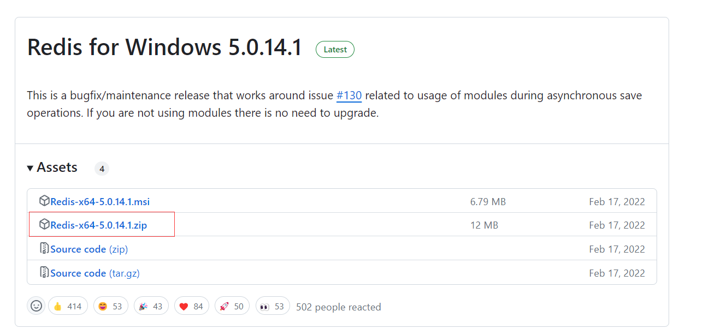
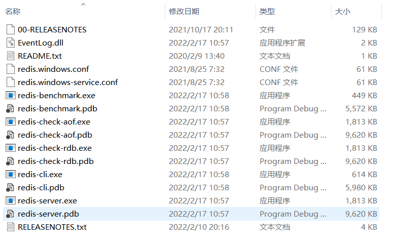
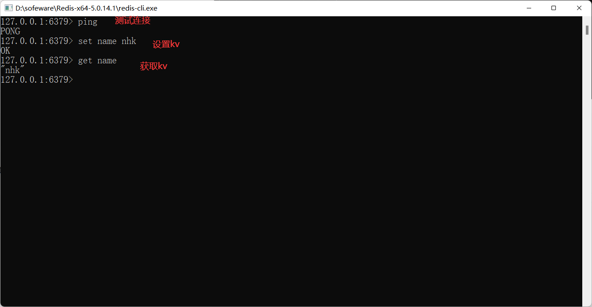

# Redis简介与安装

## 0 NoSQL概述

### 0.1 NoSQL简介

NoSQL（**Not Only SQL**），译为 ”不仅仅是SQL“，泛指的是**非关系型数据库**。

NoSQL不依赖业务逻辑方式存储，而以简单的 key - value 模式存储。因此大大增加了数据库的扩展能力。

- 不遵循SQL标准
- 不支持ACID
- 远超SQL的性能

### 0.2 NoSQL适用场景

- 对数据高并发的读写
- 海量数据的读写
- 对数据高扩展性

### 0.3 NoSQL不适用场景

- 需要事务的支持
- 基于sql的结构化查询存储，处理复杂的关系，需要加**即席**查询
- 用不着sql，用了sql也不行的，可以考虑NoSQL

### 0.4 常见 NoSQL

#### KV数据库

**Memcache**

- 很早出现的NoSQL数据库

- 数据都存储在内存中，一般不持久化

- 支持简单的key-value模式，**支持类型单一**

- 一般是做为缓存数据库辅助持久化的数据库

**Redis**

- 几乎覆盖了Memcached 的绝大部分功能

- 数据都在内存中，**支持持久化**，主要功能是备份恢复
- 处理支持简单的key-value模式，还**支持多种数据结构，例如 list、set、hash、zset等**

#### 文档型数据库

**MongoDB**

- 高性能、开源、模式自由（schema free）的**文档型数据库**
- 数据都在内存中，如果内存不足，把不常用的数据保存到磁盘中
- 虽然是key-value模式，但是对 value（尤其是json）提供了丰富的查询功能
- 可以根据数据的特点**代替RDBMS**，成为独立的数据库，或者配合RDBMS，存储特定的数据

#### 列存储数据库

**HBase**

#### 图关系数据库

Neo4J

## 1 Redis概述

官网： https://redis.io/

中文网：http://www.redis.cn/

window下载地址：https://github.com/tporadowski/redis/releases

注意：window版本已停更

### 1.1 Redis简介

- Redis（**Re**mote **Di**ctionary **S**erver）即**远程字典服务**。 是一个**开源的 key-value 存储系统**。
- 一个**开源**的使用 [ANSI C](https://baike.baidu.com/item/ANSI C/7657277?fr=aladdin) 语言编写、支持网络、可基于内存亦可持久化的日志型、Key - Value **数据库**，并提供多种语言的 API
- 和 Memcached 类似，但它支持存储的 value 类型相对更多
  - 包括 **string (字符串)、list (链表)、set (集合)、zset (sorted set 有序集合) 和 hash（哈希类型）**
  - 这些数据类型都支持 push/pop、add/remove 及取交集并集和差集及更丰富的操作，而且这些操作都是==原子==性的。
- 在此基础上，Redis 支持各种不同方式的**排序**
- 与 memcached 一样，为了保证效率，**数据都是缓存在内存中**。
  - **持久化机制**：区别的是 Redis 会**周期性**的**把更新的数据写入磁盘**或者把修改操作写入追加的记录文件。
- 并且在此基础上实现了 master-slave (主从) 同步。

### 1.2 应用场景

- 配合关系型数据库做**高速缓存**
  - 高频次，热门访问的数据，降低数据库 IO。
  - 分布式架构，做 session 共享。
- 多样的数据结构存储持久化数据

### 1.3 相关技术

Redis 使用的是单线程 + 多路 IO 复用技术

- 多路复用是指使用一个线程来检查多个文件描述符（Socket）的就绪状态，比如调用 select 和 poll 函数，传入多个文件描述符，如果有一个文件描述符就绪，则返回，否则阻塞直到超时。得到就绪状态后进行真正的操作可以在同一个线程里执行，也可以启动线程执行（比如使用线程池）。

- **串行 vs 多线程 + 锁（memcached） vs 单线程 + 多路 IO 复用 (Redis)**（与 Memcache 三点不同：支持多数据类型，支持持久化，单线程 + 多路 IO 复用） 。

官方表示：Redis是基于内存操作的，CPU不是Redis的性能瓶颈，**Redis的性能瓶颈是根据机器的内存和网络带宽**，既然可以使用单线程来实现，就使用单线程了！！！

Redis是C语言写的，官方提供的数据为 100000+ 的QPS，完全不必同样是key-value的Memecache差！！！

**Redis 为什么单线程还这么快？**

误区1：高性能的服务器一定是多线程的

误区2：多线程一定比单线程效率高（多线程存在CPU上下文切换）

核心：redis是将所有的数据都放在内存中的，所以说使用单线程去操作效率就是最高的，多线程（CPU上下文切换：耗时操作！！！），对于内存系统来说，如果没有上下文切换效率就是最高的！！多次读写都是在一个CPU上，在内存情况下，这个就是最佳的方案。

> [Redis为什么那么快？](../Redis为什么那么快？.md)

## 2 Redis的安装

### 2.1 window安装

#### 1）下载压缩包

https://github.com/tporadowski/redis/releases



#### 2）解压即可

#### 3）解压后的目录介绍



- **redis-server.exe**：服务端程序，提供 Redis 服务。
- **redis-cli.exe**: 客户端程序，通过它连接 Redis 服务并进行操作。
- **redis-check-dump.exe**：RDB 文件修复工具。
- **redis-check-aof.exe**：AOF 文件修复工具。
- **redis-benchmark.exe**：性能测试工具，用以模拟同时由 N 个客户端发送 M 个 SETs/GETs 查询（类似于 Apache 的 ab 工具）。
- **redis.windows.conf**： 配置文件，将 Redis 作为普通软件使用的配置，命令行关闭则 Redis 关闭。
- **redis.windows-service.conf**：配置文件，将 Redis 作为系统服务的配置。

#### 4）开启Redis，双击redis-server.exe即可


#### 5）使用redis客户端连接redis



#### 总结

您可以使用 [大多数的编程语言](http://www.redis.cn/clients.html) 来使用Redis.

​    Redis 使用 **ANSI C** 编写并且能在绝大Linux系统上运行，基于BSD协议，对OS X没有外部依赖. 我们支持Linux 和 OS X两种系统的开发和测试，我们推荐使用**Linux部署**. Redis 可以像SmartOS一样运行在Solaris系统中， 但是我们会*最大力度*的支持它. 官方不支持Windos版本的Redis,但微软开发和维护着[支持win-64 的Redis](https://github.com/MSOpenTech/redis)版本.

上面总结来源：http://www.redis.cn/topics/introduction

### 2.2 Linux安装

下载地址：http://download.redis.io/releases/redis-6.0.8.tar.gz

#### 1）上传Redis安装包

将redis压缩包上传到 /opt/software目录中

```shell
[root@nhk software]# pwd 
/opt/software
[root@nhk software]# ll | grep redis
-rw-r--r--. 1 root root 2247528 Oct 29 10:32 redis-6.0.8.tar.gz
```

#### 2）解压Redis压缩包

```shell
[root@nhk software]# tar -zxvf redis-6.0.8.tar.gz 

# 查看目录
[root@nhk software]# ll redis-6.0.8
total 276
-rw-rw-r--.  1 root root 96706 Sep 10  2020 00-RELEASENOTES
-rw-rw-r--.  1 root root    51 Sep 10  2020 BUGS
-rw-rw-r--.  1 root root  2381 Sep 10  2020 CONTRIBUTING
-rw-rw-r--.  1 root root  1487 Sep 10  2020 COPYING
drwxrwxr-x.  6 root root   124 Sep 10  2020 deps
-rw-rw-r--.  1 root root    11 Sep 10  2020 INSTALL
-rw-rw-r--.  1 root root   151 Sep 10  2020 Makefile
-rw-rw-r--.  1 root root  6888 Sep 10  2020 MANIFESTO
-rw-rw-r--.  1 root root 20987 Sep 10  2020 README.md
-rw-rw-r--.  1 root root 84642 Sep 10  2020 redis.conf		# redis配置文件
-rwxrwxr-x.  1 root root   275 Sep 10  2020 runtest
-rwxrwxr-x.  1 root root   280 Sep 10  2020 runtest-cluster
-rwxrwxr-x.  1 root root   761 Sep 10  2020 runtest-moduleapi
-rwxrwxr-x.  1 root root   281 Sep 10  2020 runtest-sentinel
-rw-rw-r--.  1 root root 10743 Sep 10  2020 sentinel.conf
drwxrwxr-x.  3 root root  4096 Sep 10  2020 src
drwxrwxr-x. 11 root root   182 Sep 10  2020 tests
-rw-rw-r--.  1 root root  3055 Sep 10  2020 TLS.md
drwxrwxr-x.  9 root root  4096 Sep 10  2020 utils
```

#### 3）安装C语言的编译环境

```shell
[root@nhk software]# yum install gcc-c++

[root@nhk software]# gcc -v

....

gcc version 4.8.5 20150623 (Red Hat 4.8.5-44) (GCC) 
```

#### 4）执行make命令进行编译

进入redis根目录，执行make命令进行编译

```shell
[root@nhk redis-6.0.8]# pwd
/opt/software/redis-6.0.8
[root@nhk redis-6.0.8]# make
```

执行make可能会报错 make[1]: *** [server.o] Error 1

原因： gcc 版本过低，yum 安装的 gcc 是 4.8.5 的。需要升级 gcc

解决办法升级gcc：

```shell
yum -y install centos-release-scl

yum -y install devtoolset-9-gcc devtoolset-9-gcc-c++ devtoolset-9-binutils

scl enable devtoolset-9 bash

#修改环境变量
echo "source /opt/rh/devtoolset-9/enable" >> /etc/profile

gcc -v
```

make执行完显示如下信息说明Redis编译完成

```shell
    CC connection.o
    CC tls.o
    CC sha256.o
    CC timeout.o
    CC setcpuaffinity.o
    LINK redis-server
    INSTALL redis-sentinel
    CC redis-cli.o
    LINK redis-cli
    CC redis-benchmark.o
    LINK redis-benchmark
    INSTALL redis-check-rdb
    INSTALL redis-check-aof

Hint: It's a good idea to run 'make test' ;)

make[1]: Leaving directory `/opt/software/redis-6.0.8/src'
[root@nhk redis-6.0.8]# 
```

```shell
[root@nhk redis-6.0.8]# make install
cd src && make install
make[1]: Entering directory `/opt/software/redis-6.0.8/src'

Hint: It's a good idea to run 'make test' ;)

    INSTALL install
    INSTALL install
    INSTALL install
    INSTALL install
    INSTALL install
make[1]: Leaving directory `/opt/software/redis-6.0.8/src'
```

#### 5）Redis默认的安装路径`/usr/local/bin`

```shell
[root@nhk bin]# pwd
/usr/local/bin
[root@nhk bin]# ll
total 96260
-rwxr-xr-x. 1 root root 59699273 Dec  5 08:54 docker-compose
-rwxr-xr-x. 1 root root  4740344 Dec  7 07:34 redis-benchmark
-rwxr-xr-x. 1 root root  9686728 Dec  7 07:34 redis-check-aof
-rwxr-xr-x. 1 root root  9686728 Dec  7 07:34 redis-check-rdb
-rwxr-xr-x. 1 root root  5060184 Dec  7 07:34 redis-cli
lrwxrwxrwx. 1 root root       12 Dec  7 07:34 redis-sentinel -> redis-server
-rwxr-xr-x. 1 root root  9686728 Dec  7 07:34 redis-server
```

#### 6）redis.conf

将解压后的目录（/opt/software/redis-6.0.8）中的redis.conf 文件拷贝至 /usr/local/bin 中

```shell
[root@nhk bin]# pwd
/usr/local/bin
[root@nhk bin]# mkdir redis-config
[root@nhk bin]# cp /opt/software/redis-6.0.8/redis.conf ./redis-config/
[root@nhk bin]# ll redis-config/
total 84
-rw-r--r--. 1 root root 84642 Dec  7 07:39 redis.conf	# 之后就使用这个配置文件进行启动
```

#### 7）后台启动Redis

Redis默认不是后台启动的，因此需要修改配置文件

```shell
[root@nhk redis-config]# pwd
/usr/local/bin/redis-config
[root@nhk redis-config]# ll
total 84
-rw-r--r--. 1 root root 84642 Dec  7 07:39 redis.conf
[root@nhk redis-config]# vim redis.conf 
```

修改如下：

```shell
daemonize yes
```

**启动Redis**

```shell
[root@nhk bin]# pwd
/usr/local/bin
[root@nhk bin]# redis-server redis-config/redis.conf 	# 通过指定配置文件启动redis
```

查看Redis进程

```shell
[root@nhk bin]# ps -ef | grep redis
root       8518      1  0 07:42 ?        00:00:00 redis-server 127.0.0.1:6379
root       8524   7690  0 07:43 pts/0    00:00:00 grep --color=auto redis
```

#### 8）Redis客户端连接Redis

```shell
[root@nhk bin]# redis-cli -p 6379
127.0.0.1:6379> ping
PONG
127.0.0.1:6379> set name nhk
OK
127.0.0.1:6379> get name
"nhk"
```

#### 9）关闭Redis服务

```shell
127.0.0.1:6379> SHUTDOWN		# 关闭redis
not connected> exit				# 退出
[root@nhk bin]# 


# 再次查看Redis进程
[root@nhk bin]# ps -ef | grep redis
root       8597   7690  0 07:45 pts/0    00:00:00 grep --color=auto redis
```

## 3 Redis性能测试

redis-benchmark 是一个压力测试工具！！！

官方自带的性能测试工具

redis-benchmark命令参数选项：

| 选项             | 描述                                                         | 默认值                  |
| ---------------- | ------------------------------------------------------------ | ----------------------- |
| `-h <hostname>`    | 指定服务器主机名                                             | (default 127.0.0.1)     |
| `-p <port>`        | 指定服务器端口                                               | (default 6379)          |
| `-s <socket>`      | 指定服务器 socket                                            |                         |
| `-c <clients>`     | 指定并发连接数                                               | (default 50)            |
| `-n <requests>`    | 指定请求数                                                   | default 100000          |
| `-d <size>`        | 以字节的形式指定 SET/GET 值的数据大小                        | (default 3)             |
| `-k <boolean>`     | 1=keep alive 0=reconnect                                     | (default 1)             |
| `-r <keyspacelen>` | Use random keys for SET/GET/INCR, <br>random values for SADD<br>random members and scores for ZADD.， |                         |
| `-P <numreq>`      | 通过管道传输`<numreq>`请求                                     | Default 1 (no pipeline) |
| `-q`               | 强制退出redis，仅显示 query/sec值                            |                         |
| `--csv`            | 以 csv 格式输出                                              |                         |
| `-l`               | 生成循环，永久执行测试                                       |                         |
| `-t <tests>`       | 仅运行逗号分隔的测试命令列表                                 |                         |
| -I               | lde模式。仅卡带N个idle连接并等待                             |                         |

演示：

```shell
[root@nhk bin]# pwd
/usr/local/bin
[root@nhk bin]# redis-server redis-config/redis.conf 

# 测试100个并发连接，100000个请求
[root@nhk bin]# redis-benchmark -h localhost -p 6379 -c 100 -n 100000
```

下面对测试内容进行分析

```shell
[root@nhk bin]# redis-benchmark -h localhost -p 6379 -c 100 -n 100000
====== PING_INLINE ======
  100000 requests completed in 0.63 seconds	#对我们的10万个请求进行写入测试
  100 parallel clients	#100个并发客户端
  3 bytes payload	#每次写入3个字节
  keep alive: 1		#只有一台服务器来处理这些请求
  host configuration "save": 900 1 300 10 60 10000
  host configuration "appendonly": no
  multi-thread: no

0.00% <= 0.1 milliseconds
0.15% <= 0.2 milliseconds
46.86% <= 0.3 milliseconds
85.38% <= 0.4 milliseconds
93.50% <= 0.5 milliseconds
95.72% <= 0.6 milliseconds
96.95% <= 0.7 milliseconds
97.69% <= 0.8 milliseconds
98.29% <= 0.9 milliseconds
98.75% <= 1.0 milliseconds
99.09% <= 1.1 milliseconds
99.36% <= 1.2 milliseconds
99.60% <= 1.3 milliseconds
99.72% <= 1.4 milliseconds
99.78% <= 1.5 milliseconds
99.82% <= 1.6 milliseconds
99.84% <= 1.7 milliseconds
99.84% <= 1.8 milliseconds
99.86% <= 1.9 milliseconds
99.86% <= 2 milliseconds
99.90% <= 5 milliseconds
99.95% <= 6 milliseconds
100.00% <= 6 milliseconds		#表示所有请求在6ms内处理完成
159489.64 requests per second	#每秒处理159489.64次请求

====== PING_BULK ======
  100000 requests completed in 0.62 seconds
  100 parallel clients
  3 bytes payload
  keep alive: 1
  host configuration "save": 900 1 300 10 60 10000
  host configuration "appendonly": no
  multi-thread: no

98.53% <= 1 milliseconds
100.00% <= 1 milliseconds
160256.41 requests per second

====== SET ======
  100000 requests completed in 0.58 seconds
  100 parallel clients
  3 bytes payload
  keep alive: 1
  host configuration "save": 900 1 300 10 60 10000
  host configuration "appendonly": no
  multi-thread: no

98.80% <= 1 milliseconds
99.98% <= 2 milliseconds
100.00% <= 2 milliseconds
172117.05 requests per second

====== GET ======
  100000 requests completed in 0.62 seconds
  100 parallel clients
  3 bytes payload
  keep alive: 1
  host configuration "save": 900 1 300 10 60 10000
  host configuration "appendonly": no
  multi-thread: no

98.76% <= 1 milliseconds
99.94% <= 2 milliseconds
100.00% <= 2 milliseconds
161550.89 requests per second

====== INCR ======
  100000 requests completed in 0.58 seconds
  100 parallel clients
  3 bytes payload
  keep alive: 1
  host configuration "save": 900 1 300 10 60 10000
  host configuration "appendonly": no
  multi-thread: no

99.20% <= 1 milliseconds
99.90% <= 2 milliseconds
99.98% <= 3 milliseconds
100.00% <= 3 milliseconds
171821.30 requests per second

====== LPUSH ======
  100000 requests completed in 0.58 seconds
  100 parallel clients
  3 bytes payload
  keep alive: 1
  host configuration "save": 900 1 300 10 60 10000
  host configuration "appendonly": no
  multi-thread: no

98.94% <= 1 milliseconds
99.96% <= 2 milliseconds
100.00% <= 2 milliseconds
173310.22 requests per second

====== RPUSH ======
  100000 requests completed in 0.59 seconds
  100 parallel clients
  3 bytes payload
  keep alive: 1
  host configuration "save": 900 1 300 10 60 10000
  host configuration "appendonly": no
  multi-thread: no

98.79% <= 1 milliseconds
99.98% <= 2 milliseconds
100.00% <= 2 milliseconds
168918.92 requests per second

====== LPOP ======
  100000 requests completed in 0.56 seconds
  100 parallel clients
  3 bytes payload
  keep alive: 1
  host configuration "save": 900 1 300 10 60 10000
  host configuration "appendonly": no
  multi-thread: no

99.56% <= 1 milliseconds
100.00% <= 1 milliseconds
178890.88 requests per second

====== RPOP ======
  100000 requests completed in 0.60 seconds
  100 parallel clients
  3 bytes payload
  keep alive: 1
  host configuration "save": 900 1 300 10 60 10000
  host configuration "appendonly": no
  multi-thread: no

98.79% <= 1 milliseconds
99.90% <= 2 milliseconds
100.00% <= 2 milliseconds
167504.19 requests per second

====== SADD ======
  100000 requests completed in 0.58 seconds
  100 parallel clients
  3 bytes payload
  keep alive: 1
  host configuration "save": 900 1 300 10 60 10000
  host configuration "appendonly": no
  multi-thread: no

99.29% <= 1 milliseconds
99.98% <= 2 milliseconds
100.00% <= 2 milliseconds
170940.17 requests per second

====== HSET ======
  100000 requests completed in 0.62 seconds
  100 parallel clients
  3 bytes payload
  keep alive: 1
  host configuration "save": 900 1 300 10 60 10000
  host configuration "appendonly": no
  multi-thread: no

99.02% <= 1 milliseconds
99.89% <= 2 milliseconds
99.96% <= 3 milliseconds
100.00% <= 3 milliseconds
160256.41 requests per second

====== SPOP ======
  100000 requests completed in 0.60 seconds
  100 parallel clients
  3 bytes payload
  keep alive: 1
  host configuration "save": 900 1 300 10 60 10000
  host configuration "appendonly": no
  multi-thread: no

98.97% <= 1 milliseconds
100.00% <= 2 milliseconds
100.00% <= 2 milliseconds
167224.08 requests per second

====== ZADD ======
  100000 requests completed in 0.58 seconds
  100 parallel clients
  3 bytes payload
  keep alive: 1
  host configuration "save": 900 1 300 10 60 10000
  host configuration "appendonly": no
  multi-thread: no

99.13% <= 1 milliseconds
99.94% <= 2 milliseconds
100.00% <= 2 milliseconds
173010.38 requests per second

====== ZPOPMIN ======
  100000 requests completed in 0.59 seconds
  100 parallel clients
  3 bytes payload
  keep alive: 1
  host configuration "save": 900 1 300 10 60 10000
  host configuration "appendonly": no
  multi-thread: no

98.99% <= 1 milliseconds
99.98% <= 2 milliseconds
100.00% <= 2 milliseconds
168634.06 requests per second

====== LPUSH (needed to benchmark LRANGE) ======
  100000 requests completed in 0.55 seconds
  100 parallel clients
  3 bytes payload
  keep alive: 1
  host configuration "save": 900 1 300 10 60 10000
  host configuration "appendonly": no
  multi-thread: no

99.13% <= 1 milliseconds
99.90% <= 2 milliseconds
99.94% <= 8 milliseconds
99.96% <= 9 milliseconds
100.00% <= 9 milliseconds
181159.42 requests per second

====== LRANGE_100 (first 100 elements) ======
  100000 requests completed in 1.67 seconds
  100 parallel clients
  3 bytes payload
  keep alive: 1
  host configuration "save": 900 1 300 10 60 10000
  host configuration "appendonly": no
  multi-thread: no

85.12% <= 1 milliseconds
97.72% <= 2 milliseconds
99.41% <= 3 milliseconds
99.95% <= 4 milliseconds
100.00% <= 4 milliseconds
59916.12 requests per second

====== LRANGE_300 (first 300 elements) ======
  100000 requests completed in 4.15 seconds
  100 parallel clients
  3 bytes payload
  keep alive: 1
  host configuration "save": 900 1 300 10 60 10000
  host configuration "appendonly": no
  multi-thread: no

0.08% <= 1 milliseconds
26.13% <= 2 milliseconds
91.20% <= 3 milliseconds
96.90% <= 4 milliseconds
98.74% <= 5 milliseconds
99.43% <= 6 milliseconds
99.80% <= 7 milliseconds
99.93% <= 8 milliseconds
99.99% <= 9 milliseconds
100.00% <= 9 milliseconds
24102.19 requests per second

====== LRANGE_500 (first 450 elements) ======
  100000 requests completed in 6.05 seconds
  100 parallel clients
  3 bytes payload
  keep alive: 1
  host configuration "save": 900 1 300 10 60 10000
  host configuration "appendonly": no
  multi-thread: no

0.02% <= 1 milliseconds
0.97% <= 2 milliseconds
35.06% <= 3 milliseconds
86.27% <= 4 milliseconds
94.15% <= 5 milliseconds
96.54% <= 6 milliseconds
98.06% <= 7 milliseconds
99.02% <= 8 milliseconds
99.40% <= 9 milliseconds
99.57% <= 10 milliseconds
99.72% <= 11 milliseconds
99.81% <= 12 milliseconds
99.87% <= 13 milliseconds
99.90% <= 14 milliseconds
99.90% <= 17 milliseconds
99.90% <= 18 milliseconds
99.92% <= 19 milliseconds
99.93% <= 20 milliseconds
99.95% <= 21 milliseconds
99.96% <= 22 milliseconds
99.97% <= 23 milliseconds
99.97% <= 24 milliseconds
99.98% <= 25 milliseconds
99.99% <= 33 milliseconds
100.00% <= 34 milliseconds
100.00% <= 34 milliseconds
16526.19 requests per second

====== LRANGE_600 (first 600 elements) ======
  100000 requests completed in 7.41 seconds
  100 parallel clients
  3 bytes payload
  keep alive: 1
  host configuration "save": 900 1 300 10 60 10000
  host configuration "appendonly": no
  multi-thread: no

0.00% <= 1 milliseconds
0.06% <= 2 milliseconds
2.05% <= 3 milliseconds
64.19% <= 4 milliseconds
92.93% <= 5 milliseconds
97.38% <= 6 milliseconds
98.64% <= 7 milliseconds
99.10% <= 8 milliseconds
99.42% <= 9 milliseconds
99.60% <= 10 milliseconds
99.69% <= 11 milliseconds
99.74% <= 12 milliseconds
99.77% <= 13 milliseconds
99.79% <= 14 milliseconds
99.80% <= 15 milliseconds
99.82% <= 16 milliseconds
99.84% <= 17 milliseconds
99.85% <= 18 milliseconds
99.87% <= 19 milliseconds
99.90% <= 20 milliseconds
99.90% <= 21 milliseconds
99.91% <= 22 milliseconds
99.91% <= 23 milliseconds
99.93% <= 24 milliseconds
99.93% <= 25 milliseconds
99.94% <= 26 milliseconds
99.94% <= 27 milliseconds
99.95% <= 28 milliseconds
99.96% <= 29 milliseconds
99.96% <= 30 milliseconds
99.97% <= 31 milliseconds
99.97% <= 32 milliseconds
99.98% <= 33 milliseconds
99.98% <= 34 milliseconds
99.99% <= 35 milliseconds
100.00% <= 36 milliseconds
100.00% <= 36 milliseconds
13488.00 requests per second

====== MSET (10 keys) ======
  100000 requests completed in 0.93 seconds
  100 parallel clients
  3 bytes payload
  keep alive: 1
  host configuration "save": 900 1 300 10 60 10000
  host configuration "appendonly": no
  multi-thread: no

82.16% <= 1 milliseconds
99.69% <= 2 milliseconds
100.00% <= 2 milliseconds
107181.13 requests per second


[root@nhk bin]# 
```

