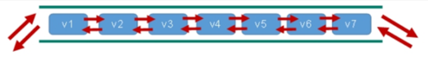
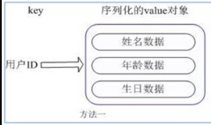
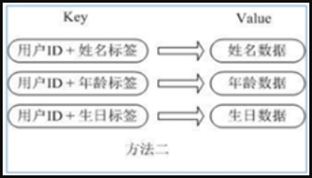
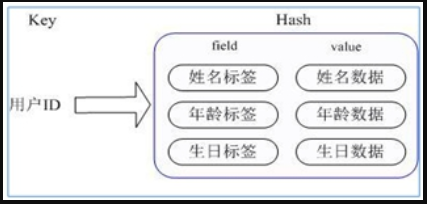

# Redis 常用五大数据类型

redis常见数据类型操作命令参考： http://www.redis.cn/commands.html

## 1 Redis 字符串 (String)

### 1.1 简介

-   String 是 Redis 最基本的类型，你可以理解成与 Memcached 一模一样的类型，一个 key 对应一个 value。

-   **String 类型是二进制安全的**。意味着 Redis 的 string 可以包含任何数据。比如 jpg 图片或者序列化的对象。

-   String 类型是 Redis 最基本的数据类型，**一个 Redis 中字符串 value 最多可以是 512M**。

### 1.2 数据结构

**String 的数据结构为简单动态字符串** (Simple Dynamic String, 缩写 SDS)，是可以修改的字符串，内部结构实现上**类似于 Java 的 ArrayList，采用预分配冗余空间的方式来减少内存的频繁分配.**


如图中所示，内部为当前字符串实际分配的空间 capacity 一般要高于实际字符串长度 len。当字符串长度小于 1M 时，扩容都是加倍现有的空间，如果超过 1M，扩容时一次只会多扩 1M 的空间。需要注意的是字符串最大长度为 512M。

**string类似的使用场景**：value可以是字符串，还可以是数字

-   计数器（例如：某直播间的人数）
-   统计多单位的数量
-   粉丝数
-   对象缓存存储

### 1.3 常用命令

#### SET

```shell
# 添加键值对 key value
set key value [EX seconds|PX milliseconds|KEEPTTL] [NX|XX]

NX：当数据库中key不存在时，可以将key-value 添加数据库
XX：当数据库中key存在时，可以将key-value 添加数据库，与NX参数互斥
EX：key的超时秒数
PX：key的超时毫秒数，与EX互斥
```

#### GET

```shell
# 查看key对应的值
GET key
```

演示：

```shell
127.0.0.1:6379> set k1 v100
OK
127.0.0.1:6379> set k2 v200
OK
127.0.0.1:6379> keys *			# 查看所有key
1) "k2"
2) "k1"
127.0.0.1:6379> get k1
"v100"
127.0.0.1:6379> set k1 v1100	# 覆盖、修改
OK
127.0.0.1:6379> get k1
"v1100"
```

#### APPEND

```shell
# 将给定的value追加到原来值的后面
# 	如果当前key不存在，就相对于set
APPEND key value
```

演示：

```shell
127.0.0.1:6379> get k1
"v1100"
127.0.0.1:6379> APPEND k1 abc
(integer) 8			# 返回修改后的 value 的长度
127.0.0.1:6379> get k1
"v1100abc"

127.0.0.1:6379> append name nhk		# 如果当前key不存在，就相对于set
(integer) 3
127.0.0.1:6379> get name
"nhk"
```

#### STRLEN

```shell
# 获取指定key对应的值的长度
STRLEN key
```

演示：

```shell
127.0.0.1:6379> get k1
"v1100abc"
127.0.0.1:6379> STRLEN k1
(integer) 8
```

#### SETNX

```shell
# 只有在key不存在时，设置key的值（常用于分布式锁中）
# SETNX（set if not exists）
SETNX key value
```

演示：

```shell
127.0.0.1:6379> SETNX k1 v100	
(integer) 0				# 返回0表示设置失败
127.0.0.1:6379> SETNX k3 v300	# 如果k3不存在，则创建
(integer) 1
```

#### SETEX

```shell
# 设置键值的同时，设置过期时间，单位秒	
# SETEX（set with expire）
SETEX key seconds value
```

演示：

```shell
127.0.0.1:6379> SETEX k3 30 "hello"		# 设置k3的值为hello，30s后过期
OK
127.0.0.1:6379> get k3
"hello"
127.0.0.1:6379> ttl k3
(integer) 21

127.0.0.1:6379> ttl k3
(integer) -2
```

#### GETSET 

```shell
# 以新换旧，用新的值替换旧的值，且返回旧值
# 	 当值不存在时则创建
GETSET key value
```

演示：

```shell
127.0.0.1:6379> SETEX age 20 18
OK
127.0.0.1:6379> ttl age
(integer) 19
127.0.0.1:6379> ttl age
(integer) 17
127.0.0.1:6379> GETSET age 999	
"18"		# 返回旧的值


127.0.0.1:6379> GETSET db redis	# 如果值不存在，则返回nil
(nil)
127.0.0.1:6379> get db
"redis"
127.0.0.1:6379> getset db mongodb	# 如果存在值，获取原来的值，并设置新的值（更新操作）
"redis"
```

#### INCR/DECR

```shell
# 将 key 中存储的数字增 1
# 	只能对数字值进行操作，如果为空，新增值为1
INCR key
```

```shell
# 将 key 中存储的数字减 1
#	只能对数字值进行操作，如果为空，新增值为-1
DECR key
```

演示：

```shell
127.0.0.1:6379> SET k4 500
OK
127.0.0.1:6379> INCR k4		# 自增1
(integer) 501
127.0.0.1:6379> DECR k4		# 自减1
(integer) 500
127.0.0.1:6379> get k4
"500"
```

#### INCRBY/DECRBY

```shell
# 将 key 中存储的数字进行增减。自定义步长 increment/decrement
INCRBY key increment

DECRBY key decrement
```

演示：

```shell
127.0.0.1:6379> INCRBY k4 10	# 自增 10
(integer) 510
127.0.0.1:6379> get k4
"510"
127.0.0.1:6379> DECRBY k4 20	# 自减 20
(integer) 490
127.0.0.1:6379> get k4
"490"
```

#### GETRANGE

```shell
# 截取字符串范围 range
# 	类似 java 中的 substring，前包，后包
GETRANGE key start end
```

演示：

```shell
127.0.0.1:6379> set k1 "hello,redis"
OK
127.0.0.1:6379> get k1
"hello,redis"
127.0.0.1:6379> GETRANGE k1 0 4		# 查看部分 [0,4]  注意：这里是前后都闭
"hello"
127.0.0.1:6379> GETRANGE k1 0 -1	# 查看全部字符串，和 get k1 一样
"hello,redis"
```

#### SETRANGE

```shell
# 替换指定位置开始的字符串 
#	用 value 覆写 key 所储存的字符串值，从 offset 开始（索引从0开始）
SETRANGE key offset value
```

演示

```shell
127.0.0.1:6379> set k2 abcdefg
OK
127.0.0.1:6379> get k2
"abcdefg"
127.0.0.1:6379> SETRANGE k2 2 xxx	# 替换指定位置开始的字符串 
(integer) 7
127.0.0.1:6379> get k2
"abxxxfg"
```

#### MSET

```shell
# 同时设置一个或多个 key-value对
MSET key value [key value ...]
```

#### MGET

```shell
MGET key [key ...]
```

演示：

```shell
127.0.0.1:6379> MSET k1 v1 k2 v2 k3 v3
OK
127.0.0.1:6379> MGET k1 k2 k3
1) "v1"
2) "v2"
3) "v3"


```

#### MSET

```shell
MSETNX key value [key value ...]
```

演示：

```shell
127.0.0.1:6379> MSETNX k1 v1 k4 v4		# k1存在，k4不存在，结果返回0，说明是原子性操作
(integer) 0
```

**原子性**（要么全部成功，要么全部失败）

所谓原子操作是指不会被线程调度机制打断的操作

这种操作一旦开始，就一直运行到结束，中间不会有任何 contextswitch （切换到另一个线程）

（1）在单线程中，能够在单条指令中完成的操作都可以认为是“原子操作”，因为中断只能发生于指令之间。
（2）在多线程中，不能被其它进程（线程）打断的操作就叫原子操作。

Redis 单命令的原子性主要得益于 Redis 的单线程。

```shell
# 同时设置一个或多个 key-value对
MSET key value [key value ...]
```

```shell
# 同时获取一个或多个 value
MGET key [key ...]
```

```shell
# 同时设置一个或多个 key-value对，当且仅当所有给定 key都不存在（要么全部成功，要么全部失败）
MSETNX key value [key value ...]
```

**原子性，有一个失败则都失败**

演示：

```shell
127.0.0.1:6381> FLUSHDB
OK
127.0.0.1:6381> MSET k1 v1 k2 v2 k3 v3
OK
127.0.0.1:6381> KEYS *
1) "k2"
2) "k1"
3) "k3"
127.0.0.1:6381> MGET k1 k2 k3
1) "v1"
2) "v2"
3) "v3"
127.0.0.1:6381> MSETNX k11 v11 k12 v12 k13 v13
(integer) 1
127.0.0.1:6381> KEYS *
1) "k1"
2) "k3"
3) "k2"
4) "k11"
5) "k13"
6) "k12"
127.0.0.1:6381> MSETNX k13 v13 k14 v14 k15 v15
(integer) 0		# 返回0，表示失败，因为key k13 在当前数据库中存在
```


最后再说一种巧妙设计

```shell
# 对象 
set user:1 {name:zhangsan,age:23}	# 设置一个 user:1 对象，值为 json字符串保存一个对象

# 下面这里的key是一个巧妙的设计， user:{id}:{field}，在redis中这种设计是允许的
127.0.0.1:6379> MSET user1:name zhangsan user1:1:age 2
OK
127.0.0.1:6379> MGET user1:name user1:1:age
1) "zhangsan"
2) "2"
```


## 2 Redis 列表（List)

### 2.1 简介

**单键多值**：Redis 列表是简单的字符串列表，按照插入顺序排序。你可以添加一个元素到列表的头部（左边）或者尾部（右边）。

它的底层实际是个==双向链表==，对两端的操作性能很高，通过索引下标的操作中间的节点性能会较差。



### 2.2 数据结构

List 的数据结构为快速链表 quickList。

首先在列表元素较少的情况下会使用一块连续的内存存储，这个结构是 ziplist，也即是压缩列表。它将所有的元素紧挨着一起存储，分配的是一块连续的内存。

当数据量比较多的时候才会改成 quicklist。因为普通的链表需要的附加指针空间太大，会比较浪费空间。比如这个列表里存的只是 int 类型的数据，结构上还需要两个额外的指针 prev 和 next。


Redis 将链表和 ziplist 结合起来组成了 quicklist。也就是将多个 ziplist 使用双向指针串起来使用。这样既满足了快速的插入删除性能，又不会出现太大的空间冗余。

### 2.3 常用命令

记住：

​	在redis中，我们可以把list玩成栈、队列、阻塞队列等

​	所以的list的命令都是以 l 开头的

#### LPUSH/RPUSH

```shell
# 从左边插入一个或多个值
LPUSH key element [element ...]
# 从右边插入一个或多个值
RPUSH key element [element ...]
```

演示：

```shell
127.0.0.1:6379> LPUSH list one	# 将one插入到list最左边（头部）
(integer) 1
127.0.0.1:6379> LPUSH list two
(integer) 2
127.0.0.1:6379> LPUSH list three
(integer) 3
127.0.0.1:6379> LPUSH list four five
(integer) 5
127.0.0.1:6379> LRANGE list 0 -1	# 查看list中所有值
1) "five"
2) "four"
3) "three"
4) "two"
5) "one"

127.0.0.1:6379> RPUSH list six	# 将six插入到list最右边（尾部）
(integer) 6
127.0.0.1:6379> LRANGE list 0 -1
1) "five"
2) "four"
3) "three"
4) "two"
5) "one"
6) "six"
```

#### LPOP/RPOP

```shell
#移除元素
# 从左边吐出一个值
LPOP key
# 从右边吐出一个值
RPOP key

# 说明：值在键在，值光键亡
```

演示：

```shell
127.0.0.1:6379> LRANGE list 0 -1
1) "five"
2) "four"
3) "three"
4) "two"
5) "one"
6) "six"
127.0.0.1:6379> LPOP list	# 移除list最左边元素
"five"
127.0.0.1:6379> RPOP list	# 移除list最右边元素
"six"
127.0.0.1:6379> LRANGE list 0 -1
1) "four"
2) "three"
3) "two"
4) "one"
```

#### LINDEX

```shell
# 按照索引下标获取元素（从左到右）
LINDEX key index
```

演示：

```shell
127.0.0.1:6379> LRANGE list 0 -1
1) "four"
2) "three"
3) "two"
4) "one"
127.0.0.1:6379> LINDEX list 0	# 获取list下标0（从左到右）
"four"
127.0.0.1:6379> LINDEX list 1	# 获取list下标1（从左到右）
"three"
```

#### RPOPLPUSH

```shell
# 从source列表中的右边取出一个值，插入到destination的左边
RPOPLPUSH source destination
```

演示：

```shell
127.0.0.1:6379> LRANGE list 0 -1
1) "four"
2) "three"
3) "two"
4) "one"
127.0.0.1:6379> RPOPLPUSH list list2	# 将list最右边的值移除并插入到list2的最左边
"one"
127.0.0.1:6379> LRANGE list 0 -1
1) "four"
2) "three"
3) "two"
127.0.0.1:6379> LRANGE list2 0 -1
1) "one"
```

#### LRANGE

```shell
# 按照索引下表获取元素（从左到右）
LRANGE key start stop
```

演示：

```shell
127.0.0.1:6379> LRANGE list 0 1		# 查看list中下标0到下标1的值
1) "four"
2) "three"
127.0.0.1:6379> LRANGE list 0 -1	# 查看list中下标0到下标-1的值（即list中所有值）
1) "four"
2) "three"
3) "two"
```

#### LLEN

```shell
# 获取列表长度
LLEN key
```

演示：

```shell
127.0.0.1:6379> LRANGE list 0 -1
1) "four"
2) "three"
3) "two"
127.0.0.1:6379> LLEN list	# 获取list的长度
(integer) 3
```

#### LINSERT

```shell
# 在 pivot 的 前面|后面 插入值element
LINSERT key BEFORE|AFTER pivot element
```

演示：

```shell
127.0.0.1:6379> LRANGE list 0 -1
1) "four"
2) "three"
3) "two"
127.0.0.1:6379> LINSERT list BEFORE three e1	# 在list中的three前插入e1
(integer) 4
127.0.0.1:6379> LRANGE list 0 -1
1) "four"
2) "e1"
3) "three"
4) "two"
127.0.0.1:6379> LINSERT list AFTER three e2		# 在list中的three后插入e2
(integer) 5
127.0.0.1:6379> LRANGE list 0 -1
1) "four"
2) "e1"
3) "three"
4) "e2"
5) "two"
```

#### LREM

```shell
# 从左边删除count个element
LREM key count element
```

演示：

```shell
127.0.0.1:6379> FLUSHDB
OK
127.0.0.1:6379> LPUSH list one two three three
(integer) 4
127.0.0.1:6379> LRANGE list 0 -1
1) "three"
2) "three"
3) "two"
4) "one"
127.0.0.1:6379> LREM list 1 one		# 从list左边删除1个one（精确匹配）
(integer) 1
127.0.0.1:6379> LRANGE list 0 -1
1) "three"
2) "three"
3) "two"
127.0.0.1:6379> LREM list 2 three	# 从list左边删除1个one（精确匹配）
(integer) 2
127.0.0.1:6379> LRANGE list 0 -1
1) "two"
```

#### LTRIM 

```shell
# 类似于trim
# 通过下标截取指定长度，会改变key对应的list
LTRIM key start stop
```

演示：

```shell
127.0.0.1:6379> FLUSHDB
OK
127.0.0.1:6379> RPUSH mylist hello
(integer) 1
127.0.0.1:6379> RPUSH mylist hello1
(integer) 2
127.0.0.1:6379> RPUSH mylist hello2
(integer) 3
127.0.0.1:6379> RPUSH mylist hello3
(integer) 4
127.0.0.1:6379> LRANGE mylist 0 -1
1) "hello"
2) "hello1"
3) "hello2"
4) "hello3"
127.0.0.1:6379> LTRIM mylist 1 2	# 截取mylist中下标1到下标2的值
OK
127.0.0.1:6379> LRANGE mylist 0 -1
1) "hello1"
2) "hello2"
```

#### LSET

```shell
# 将列表key下标为index的值替换为element
# 如果index位置不存在元素，会报错(error) ERR index out of range

LSET key index element
```

演示：

```shell
127.0.0.1:6379> LRANGE mylist 0 -1
1) "hello1"
2) "hello2"
127.0.0.1:6379> LSET mylist 1 "hello world"		# 将mylist中下标1位置的元素替换为 hello world
OK
127.0.0.1:6379> LRANGE mylist 0 -1
1) "hello1"
2) "hello world"
```

#### EXISTS

```shell
EXISTS key [key ...]
```

演示：

```shell
127.0.0.1:6379> EXISTS list		# 判断 list是否存在
(integer) 0		# 0表示不存在
127.0.0.1:6379> lset list 0 e1	# lset将list中指定下标的值进行替换，list不存在时会报错
(error) ERR no such key
127.0.0.1:6379> LPUSH list e1
(integer) 1
127.0.0.1:6379> EXISTS list
(integer) 1
```


## 3 Redis 集合（Set）

### 3.1 简介

-   Redis set 对外提供的功能与 list 类似，是一个列表的功能，特殊之处在于 set 是可以**自动排重**的，当你需要存储一个列表数据，又不希望出现重复数据时，set 是一个很好的选择，并且 set 提供了判断某个成员是否在一个 set 集合内的重要接口，这个也是 list 所不能提供的。

-   Redis 的 Set 是 string 类型的**无序集合**。它**底层其实是一个 value 为 null 的 hash 表**，所以**添加，删除，查找的 复杂度都是 O (1)**。
    -   这一点类似与Java中的Hashset，Hashset底层也是一个value为null的hash表（HashMap）
    -   Hashset 也是无序、不可重复的集合

-   一个算法，随着数据的增加，执行时间的长短，如果是 O (1)，数据增加，查找数据的时间不变。

### 3.2 数据结构

-   Set 数据结构是 dict 字典，字典是用哈希表实现的。

-   Java 中 HashSet 的内部实现使用的是 HashMap，只不过所有的 value 都指向同一个对象。Redis 的 set 结构也是一样，它的内部也使用 hash 结构，所有的 value 都指向同一个内部值。


### 3.3 常用命令

记住：set的命令都是 s 开头

#### SADD

```shell
# 将一个或多个 member 元素加入到集合key中，已经存在的member元素会被忽略
SADD key member [member ...]
```

演示：

```shell
127.0.0.1:6379> SADD myset v1 v2 v3 v3	# 向 myset中插入多个元素（会自动去重）
(integer) 3
127.0.0.1:6379> SMEMBERS myset
1) "v2"
2) "v3"
3) "v1"
```

#### SMEMBERS

```shell
# 取出该集合中的所有的值
SMEMBERS key
```

演示：

```shell
127.0.0.1:6379> SMEMBERS myset
1) "v2"
2) "v3"
3) "v1"
```

#### SISMEMBER

```shell
# 判断集合key中是否包含值member，有则返回1，无则返回0
# 类似于java中的 contains
SISMEMBER key member
```

演示：

```shell
127.0.0.1:6379> SISMEMBER myset v1
(integer) 1
127.0.0.1:6379> SISMEMBER myset v4
(integer) 0
```

#### SCARD

```shell
# 返回集合key的元素个数
SCARD key
```

演示：

```shell
127.0.0.1:6379> SCARD myset
(integer) 3
```

#### SREM

```shell
# 删除集合key中的某些元素
SREM key member [member ...]
```

演示：

```shell
127.0.0.1:6379> SREM myset v1 v2	# 移除myset中v1 v2
(integer) 2
127.0.0.1:6379> SMEMBERS myset 		# 查看myset中所有元素
1) "v3"
```

#### SPOP

```shell
# 随机从集合中吐出一个值
# 类似于random
SPOP key [count]
```

演示：

```shell
127.0.0.1:6379> SADD k2 v1 v2 v3 v4
(integer) 4
127.0.0.1:6379> SPOP k2 	# 随机抽取去k2集合中的一个元素
"v1"
127.0.0.1:6379> SPOP k2 	# 随机抽取去k2集合中的一个元素
"v2"
127.0.0.1:6379> SMEMBERS k2	# 查看k2集合中所有元素
1) "v4"
2) "v3"
```

#### SRANDMEMBER

```shell
# 随机中集合key中取出count个值。
# 说明：
#	与spop不同，不会删除集合中的元素
SRANDMEMBER key [count]
```

演示：

```shell
127.0.0.1:6379> SRANDMEMBER k2 2	# 随机取出两个元素
1) "v4"
2) "v3"
127.0.0.1:6379> SMEMBERS k2			# 随机取出两个元素
1) "v4"
2) "v3"
```

#### SMOVE

```shell
# 把集合source中的一个值value，移动到另一个集合destination中
SMOVE source destination member
```

演示：

```shell
127.0.0.1:6379> FLUSHDB
OK
127.0.0.1:6379> SADD k1 v1 v2 v3 
(integer) 3
127.0.0.1:6379> SADD k2 v3 v4 v5 
(integer) 3
127.0.0.1:6379> SMOVE k1 k2 v3	# 将k1集合中元素v3移动到k2集合
(integer) 1
127.0.0.1:6379> SMOVE k1 k2 v2	# 将k1集合中元素v2移动到k2集合
(integer) 1
127.0.0.1:6379> SMEMBERS k1
1) "v1"
127.0.0.1:6379> SMEMBERS k2		# k2中并没有多加一个 v3，因为Set集合中值不可重复
1) "v2"
2) "v5"
3) "v4"
4) "v3"
```

#### SINTER

```shell
# 返回两个集合的 交集 元素
SINTER key [key ...]
```

演示：

```shell
127.0.0.1:6379> FLUSHDB 
OK
127.0.0.1:6379> SADD k1 a
(integer) 1
127.0.0.1:6379> SADD k1 b
(integer) 1
127.0.0.1:6379> SADD k1 c
(integer) 1
127.0.0.1:6379> SADD k2 c d e
(integer) 3

127.0.0.1:6379> SINTER k1 k2	# 交集
1) "c"
```

#### SUNION

```shell
# 返回两个集合的 并集 元素
SUNION key [key ...]
```

演示：

```shell
127.0.0.1:6379> SMEMBERS k1
1) "b"
2) "c"
3) "a"
127.0.0.1:6379> SMEMBERS k2
1) "d"
2) "e"
3) "c"
127.0.0.1:6379> SUNION k1 k2	# 并集
1) "b"
2) "a"
3) "c"
4) "e"
5) "d"
```

####  SDIFF

```shell
# 返回两个集合的 差集 元素
SDIFF key [key ...]
```

演示：

```shell
127.0.0.1:6379> SMEMBERS k1
1) "b"
2) "c"
3) "a"
127.0.0.1:6379> SMEMBERS k2
1) "d"
2) "e"
3) "c"
127.0.0.1:6379> SDIFF k1 k2		# 查看k1集合中与k2集合中的差集
1) "b"
2) "a"
```


## 4 Redis 哈希（Hash）

### 4.1 简述

-   Redis hash 是一个键值对集合。

-   **Redis hash 是一个 string 类型的 field 和 value 的映射表，hash 特别适合用于存储对象**。

-   类似 Java 里面的 Map<String,Object>。


例如，用户 ID 为查找的 key，存储的 value 用户对象包含姓名，年龄，生日等信息，如果用普通的 key/value 结构来存储，主要有以下 2 种存储方式：

方法一：




缺点：每次修改用户的某个属性需要，先反序列化改好后再序列化回去（就是先将字符串转化为对象，修改后，再转化为字符串）。开销较大。

方法二：




缺点：用户 ID 数据冗余。

我们推荐如下这种方式，方法三：



通过 key (用户 ID) + field (属性标签) 就可以操作对应属性数据了，既不需要重复存储数据，也不会带来序列化和并发修改控制的问题。

### 4.2 数据结构

-   Hash 类型对应的数据结构是两种：ziplist（压缩列表），hashtable（哈希表）。当 field-value 长度较短且#个数较少时，使用 ziplist，否则使用 hashtable。

### 4.3 常用命令

#### HSET

```shell
# 给指定集合key中的 field键赋值value
HSET key field value [field value ...]
```

演示：

```shell
127.0.0.1:6379> FLUSHDB
OK
127.0.0.1:6379> HSET user:1001 id 1		# set一个具体的key-value
(integer) 1
127.0.0.1:6379> HSET user:1001 name zhangsan
(integer) 1
```

#### HGET

```shell
# 从指定集合key中取出field对应的value
HGET key field
```

演示：

```shell
127.0.0.1:6379> HGET user:1001 id	# 获取一个字段的值
"1"
127.0.0.1:6379> HGET user:1001 name
"zhangsan"
127.0.0.1:6379> HGET user:1001 age	# 查找不存在的field
(nil)
```

#### HMSET

```shell
# 批量设置hash的值
HMSET key field value [field value ...]
```

演示：

```shell
127.0.0.1:6379> HMSET user:1002 id 2 name lisi age 18	# 批量增加
OK
127.0.0.1:6379> HVals user:1002
1) "2"
2) "lisi"
3) "18"
127.0.0.1:6379> HMSET user:1001 id 11 name zhangsan11	# 批量修改
OK
127.0.0.1:6379> HVals user:1001
1) "11"
2) "zhangsan11"
```

#### HEXISTS

```shell
# 查看指定集合key中，给定域field是否存在
HEXISTS key field
```

演示：

```shell
127.0.0.1:6379> HEXISTS user:1001 id	# 查找存在的field
(integer) 1
127.0.0.1:6379> HEXISTS user:1001 age	# 查找不存在的field
(integer) 0
```

#### HKEYS

```shell
# 列出集合key中hash的所有field
HKEYS key
```

演示：

```shell
127.0.0.1:6379> HKEYS user:1001
1) "id"
2) "name"
```

#### HVALS

```shell
# 列出集合key中hash的所有value
HVALS key
```

演示：

```shell
127.0.0.1:6379> HVALS user:1001
1) "11"
2) "zhangsan11"
```

#### HGETALL

```shell
# 获取全部数据
HGETALL key
```

演示：

```shell
127.0.0.1:6379> HGETALL user:1001
1) "id"		
2) "11"		
3) "name"
4) "zhangsan11"
```

#### HINCRBY

```shell
# 为集合key中的field的值加上增量increment
HINCRBY key field increment
```

演示：

```shell
127.0.0.1:6379> HVALS user:1002
1) "2"
2) "lisi"
3) "18"
127.0.0.1:6379> HINCRBY user:1002 age 20
(integer) 38
127.0.0.1:6379> HVALS user:1002
1) "2"
2) "lisi"
3) "38"
```

#### HSETNX

```shell
# 将集合key中hash的field的值设置为value， 当且仅当域field不存在
HSETNX key field value
```

演示：

```shell
127.0.0.1:6379> HVALS user:1002
1) "2"
2) "lisi"
3) "38"
127.0.0.1:6379> HSET user:1002 age 20		# age存在，不会改变
(integer) 0
127.0.0.1:6379> HSET user:1002 gender 1
(integer) 1
127.0.0.1:6379> HKEYS user:1002
1) "id"
2) "name"
3) "age"
4) "gender"
127.0.0.1:6379> HVALS user:1002
1) "2"
2) "lisi"
3) "20"
4) "1"
```

#### HDEL

```shell
# 删除hash指定的key字段！对应的value也会消失
HDEL key field [field ...]
```

演示：

```shell
127.0.0.1:6379> HKEYS user:1001
1) "id"
2) "name"
127.0.0.1:6379> HDEL user:1001 id	# 删除id字段
(integer) 1
127.0.0.1:6379> HKEYS user:1001		#查看user:1001的所有字段
1) "name"
```

#### HLEN

```shell
# 查看hash的字段长度
HLEN key
```

演示：

```shell
127.0.0.1:6379> HKEYS user:1002	# 查看 user:1002 所有的字段
1) "id"
2) "name"
3) "age"
4) "gender"
127.0.0.1:6379> HLEN user:1002	# 查看 user:1002 的字段长度
(integer) 4
```


## 5 Redis 有序集合 Zset（Sorted set）

### 5.1 简介

-   Redis **有序集合 zset** 与普通集合 set 非常相似，是一个**没有重复元素的字符串集合**。

-   不同之处是有序集合的每个成员都关联了一个评分（score），这个评分（score）被用来按照从最低分到最高分的方式排序集合中的成员。集合的成员是唯一的，但是评分可以是重复了 。

-   因为元素是有序的，所以你也可以很快的根据评分（score）或者次序（position）来获取一个范围的元素。

-   访问有序集合的中间元素也是非常快的，因此你能够使用有序集合作为一个没有重复成员的智能列表。

### 5.2 数据结构

-   SortedSet (zset) 是 Redis 提供的一个非常特别的数据结构
    -   一方面它等价于 Java 的数据结构 Map<String, Double>，可以给每一个元素 value 赋予一个权重 score
    -   另一方面它又类似于 TreeSet，内部的元素会按照权重 score 进行排序，可以得到每个元素的名次，还可以通过 score 的范围来获取元素的列表。

-   zset 底层使用了两个数据结构：
    -   hash，hash 的作用就是关联元素 value 和权重 score，保障元素 value 的唯一性，可以通过元素 value 找到相应的 score 值。
        -   value 类似于 hash 的 field
        -   score 类似于 hash 的 value
    -   跳跃表，跳跃表的目的在于给元素 value 排序，根据 score 的范围获取元素列表。

#### 5.2.1 跳跃表

**简介**

有序集合在生活中比较常见，例如根据成绩对学生排名，根据得分对玩家排名等。对于有序集合的底层实现，可以用数组、平衡树、链表等。数组不便元素的插入、删除；平衡树或红黑树虽然效率高但结构复杂；链表查询需要遍历所有效率低。Redis 采用的是跳跃表，跳跃表效率堪比红黑树，实现远比红黑树简单。

**实例**

对比有序链表和跳跃表，从链表中查询出 51：

**有序链表**


要查找值为 51 的元素，需要从第一个元素开始依次查找、比较才能找到。共需要 6 次比较。

**跳跃表**


从第 2 层开始，1 节点比 51 节点小，向后比较；

21 节点比 51 节点小，继续向后比较，后面就是 NULL 了，所以从 21 节点向下到第 1 层；

在第 1 层，41 节点比 51 节点小，继续向后，61 节点比 51 节点大，所以从 41 向下；

在第 0 层，51 节点为要查找的节点，节点被找到，共查找 4 次。

从此可以看出跳跃表比有序链表效率要高。


### 5.3 常用命令

#### ZADD

```shell
# 将一个或多个 member 元素及其 score值加入到有序集key当中
ZADD key [NX|XX] [CH] [INCR] score member [score member ...]
```

演示：

```shell
127.0.0.1:6379> ZADD topn 200 java 300 c++ 400 mysql 500 php 
(integer) 4
```

#### ZRANGE

```shell
# 返回有序集 key 中，下标在＜start>＜stop>之间的元素，带 WITHSCORES，可以让分数一起和值返回到结果集
ZRANGE key start stop [WITHSCORES]
```

演示：

```shell
127.0.0.1:6379> ZRANGE topn 0 -1 
1) "java"
2) "c++"
3) "mysql"
4) "php"

127.0.0.1:6379> ZRANGE topn 0 -1 withscores
1) "java"
2) "200"
3) "c++"
4) "300"
5) "mysql"
6) "400"
7) "php"
8) "500"
```

#### ZREVRANGE

```shell
# 从大到小进行排序
ZREVRANGE key start stop [WITHSCORES]
```

演示：

```shell
127.0.0.1:6379> ZREVRANGE topn 0 -1
1) "php"
2) "mysql"
3) "c++"
4) "java"
```


#### ZRANGEBYSCORE

```shell
# 返回有序集 key 中，所有 score 值介于 min 和 max 之间（包括等于 min 或 max）的成员
# 有序集成员按 score值递增（从小到大）次序排列
ZRANGEBYSCORE key min max [WITHSCORES] [LIMIT offset count]
```

演示：

```shell
127.0.0.1:6379> ZRANGEBYSCORE topn 300 500
1) "c++"
2) "mysql"
3) "php"
```

#### ZREVRANGEBYSCORE

```shell
# 同上，改为从大到小排列
ZREVRANGEBYSCORE key max min [WITHSCORES] [LIMIT offset count]
```

演示：

```shell
127.0.0.1:6379> ZREVRANGEBYSCORE topn 500 200 
1) "php"
2) "mysql"
3) "c++"
4) "java"
127.0.0.1:6379> ZREVRANGEBYSCORE topn 500 200 withscores
1) "php"
2) "500"
3) "mysql"
4) "400"
5) "c++"
6) "300"
7) "java"
8) "200"
```

#### ZINCRBY

```shell
# 为元素member加上 增量increment
ZINCRBY key increment member
```

演示：

```shell
127.0.0.1:6379> ZINCRBY topn 50 java	# 为元素java增加50的score
"250"
127.0.0.1:6379> ZRANGE topn 0 -1 withscores	
1) "java"
2) "250"
3) "c++"
4) "300"
5) "mysql"
6) "400"
7) "php"
8) "500"
```

#### ZCARD

```shell
# 统计有序集合中的元素个数
ZCARD key
```

演示：

```shell
127.0.0.1:6379> ZCARD topn
(integer) 4
```

#### ZCOUNT

```shell
# 统计该集合，分数区间内的元素个数
ZCOUNT key min max
```

演示：

```shell
127.0.0.1:6379> ZCOUNT topn 200 300
(integer) 2
127.0.0.1:6379> ZCOUNT topn 200 400
(integer) 3
```

#### ZRANK

```shell
# 返回该值在集合中的排名，从0开始
ZRANK key member
```

演示：

```shell
127.0.0.1:6379> ZRANGE topn 0 -1 withscores
1) "java"
2) "250"
3) "c++"
4) "300"
5) "mysql"
6) "400"
7) "php"
8) "500"
127.0.0.1:6379> ZRANK topn mysql	# 返回元素mysql中集合中的排名（从0开始）
(integer) 2
```

#### ZREM

```shell
# 删除该集合下，指定值的元素
ZREM key member [member ...]
```

演示：

```shell
127.0.0.1:6379> ZRANGE topn 0 -1 withscores
1) "java"
2) "250"
3) "c++"
4) "300"
5) "mysql"
6) "400"
7) "php"
8) "500"
127.0.0.1:6379> ZREM topn php	# 删除集合中php元素
(integer) 1
127.0.0.1:6379> ZRANGE topn 0 -1 withscores
1) "java"
2) "250"
3) "c++"
4) "300"
5) "mysql"
6) "400"
```
