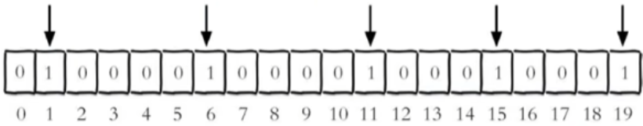
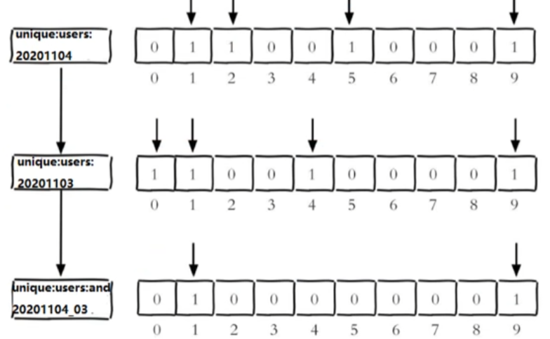

# Redis 6 中的新数据类型

## 1 Redis Bitmaps

### 1.1 简述

- Redis 提供了 Bitmaps 这个 “数据类型” 可以实现对**位**的操作
- **Bitmaps 本身不是一种数据类型**， 实际上它就是字符串（key-value） ， 但是它可以==对字符串的位进行操作==。
- Bitmaps 单独提供了一套命令， 所以在 Redis 中使用 Bitmaps 和使用字符串的方法不太相同。
  - 可以把 Bitmaps 想象成一个以位为单位的数组， 数组的每个单元只能存储 0 和 1， 数组的下标在 Bitmaps 中叫做偏移量，如下图所示。


### 1.2 常用命令

#### SETBIT

```shell
SETBIT key offset value
```

演示：

每个独立用户是否访问过网站存放在Bitmaps 中，将访问的用户记做1，没有访问的用户记做0，用偏移量作为用户的id。

设置键的第 offset 个位的值（从0算起），假设现在有20个用户，userid=1，6，11,15，19的用户对网站进行了访问，那么当前 Bitmaps 初始化结果如图：



unique:users:20201106表示2020-11-06这天独立访问用户的bitmaps

```shell
127.0.0.1:6379> FLUSHDB
OK
127.0.0.1:6379> SETBIT unique:users:20201106 1 1
(integer) 0
127.0.0.1:6379> SETBIT unique:users:20201106 6 1
(integer) 0
127.0.0.1:6379> SETBIT unique:users:20201106 11 1
(integer) 0
127.0.0.1:6379> SETBIT unique:users:20201106 15 1
(integer) 0
127.0.0.1:6379> SETBIT unique:users:20201106 19 1
(integer) 0
```

注意：

很多应用的用户 id以一个指定数字（例如10000）开头，直接将用户 id和Bitmaps 的偏移量对应势必会造成一定的浪费，通常的做法是每次做 setbit 操作时将用户id 减去这个指定数字。

在第一次初始化 Bitmaps 时，假如偏移量非常大，那么整个初始化过程执行会比较慢，可能会造成 Redis 的阻塞

#### GETBIT

```shell
# 获取Bitmaps中某个偏移量的值（从0开始）
GETBIT key offset
```

演示：

获取id=8的用户是否在2020-11-06这天访问过网址。返回0说明没有访问过

```shell
127.0.0.1:6379> GETBIT unique:users:20201106 8
(integer) 0
127.0.0.1:6379> GETBIT unique:users:20201106 1
(integer) 1
127.0.0.1:6379> GETBIT unique:users:20201106 100	# id=100的用户根本不存在，所以也返回0
(integer) 0
```

#### BITCOUNT

```shell
# 统计字符串从 start 字节到 end 字节比特值为1的数量
BITCOUNT key [start end]
```

统计**字符串**被设置为1的 bit 数。一般情况下，给定的整个字符串都会被进行计数，通过指定额外的 start 或end 参数，可以让计数只在特定的位上进行。start 和 end 参数的设置，都可以使用负数值：比如-1 表示最后一个位，而-2 表示倒数第二个位，start、end 是指 bit 组的字节的下标数，二者皆包含。

演示：

计算2022-11-06这天的独立访问用户数量

```shell
127.0.0.1:6379> BITCOUNT unique:users:20201106 
(integer) 5
```

计算用户id在第1个字节到第3个字节之间的独立访问用户数，对应的用户id是 11，15，19

```shell
127.0.0.1:6379> BITCOUNT unique:users:20201106 1 3
(integer) 3
```

举例：K1 【01000001 01000000 000000000 0100001】，对应【0, 1.2,3】

bitcount K1 1 2：统计下标1、2字节组中bit=1的个数，即01000000 00000000 ==> bitcount K1 K2 ==> 1

bitcount K1 13：统计下标1、2字节组中bit=1的个数，即 01000000 00000000 00100001 ==> bitcount K1 1 3

bitcount K1 0-2：统计下标0到下标倒数第2，字节组中 bit=1 的个数，即01000001 01000000 00000000 ==> bitcount K1 0 -2 ==> 3

:::warning 注意
​
redis 的 setbit 设置或清除的是 bit 位置，而 bitcount 计算的是byte 位置

:::

#### BITOP

```shell
# bitop是一个符合操作，它可以做多个Bitmpas的and（交集）、or（并集）、not（非）、xor（异或）操作，并将结果保存在destkey中
BITOP operation destkey key [key ...]
```

演示：

先插入数据

2022-11-04日访问网址的 userid=1，2，5，9

```shell
127.0.0.1:6379> SETBIT unique:users:20201104 1 1
(integer) 0
127.0.0.1:6379> SETBIT unique:users:20201104 2 1
(integer) 0
127.0.0.1:6379> SETBIT unique:users:20201104 5 1
(integer) 0
127.0.0.1:6379> SETBIT unique:users:20201104 9 1
(integer) 0
```

2022-11-03日访问网址的 userid=0，1，4，9

```shell
127.0.0.1:6379> SETBIT unique:users:20201103 0 1
(integer) 0
127.0.0.1:6379> SETBIT unique:users:20201103 1 1
(integer) 0
127.0.0.1:6379> SETBIT unique:users:20201103 4 1
(integer) 0
127.0.0.1:6379> SETBIT unique:users:20201103 9 1
(integer) 0
```

测试：

计算出这两天都访问过网址的用户的数量

```shell
127.0.0.1:6379> BITOP and unique:users:and:20201104_03 unique:users:20201103 unique:users:20201104
(integer) 2
127.0.0.1:6379> BITCOUNT unique:users:and:20201104_03
(integer) 2
```



测试：

计算出任意一天都访问过网址的用户的数量（例如：月活跃就是类似这种）

可以使用or求并集

```shell
127.0.0.1:6379> BITOP or unique:users:or:20201104_03 unique:users:20201103 unique:users:20201104
(integer) 2
127.0.0.1:6379> BITCOUNT unique:users:or:20201104_03
(integer) 6
```

### 1.3 Bitmaps 与 set 对比

假设网站有 1 亿用户， 每天独立访问的用户有 5 千万， 如果每天用集合类型和 Bitmaps 分别存储活跃用户可以得到表：

set 和 Bitmaps 存储一天活跃用户对比			

| 数据类型 | 每个用户 id 占用空间 | 需要存储的用户量 | 全部内存量                |
| -------- | -------------------- | ---------------- | ------------------------- |
| 集合     | 64 位                | 50000000         | 64 位 * 50000000 = 400MB  |
| Bitmaps  | 1 位                 | 100000000        | 1 位 * 100000000 = 12.5MB |


很明显， 这种情况下使用 Bitmaps 能节省很多的内存空间， 尤其是随着时间推移节省的内存还是非常可观的。

set 和 Bitmaps 存储独立用户空间对比	

| 数据类型 | 一天   | 一个月 | 一年  |
| -------- | ------ | ------ | ----- |
| 集合     | 400MB  | 12GB   | 144GB |
| Bitmaps  | 12.5MB | 375MB  | 4.5GB |

但 Bitmaps 并不是万金油， 假如该网站每天的独立访问用户很少， 例如只有 10 万（大量的僵尸用户） ， 那么两者的对比如下表所示， 很显然， 这时候使用 Bitmaps 就不太合适了， 因为基本上大部分位都是 0。

set 和 Bitmaps 存储一天活跃用户对比（用户比较少）		

| 数据类型 | 每个 userid 占用空间 | 需要存储的用户量 | 全部内存量                |
| -------- | -------------------- | ---------------- | ------------------------- |
| 集合     | 64 位                | 100000           | 64 位 * 100000 = 800KB    |
| Bitmaps  | 1 位                 | 100000000        | 1 位 * 100000000 = 12.5MB |


## 2 HyperLogLog

### 2.1 简洁

在工作当中，我们经常会遇到与统计相关的功能需求，比如统计网站 PV（PageView 页面访问量），可以使用 Redis 的 incr、incrby 轻松实现。

但像 UV（UniqueVisitor 独立访客）、独立 IP 数、搜索记录数等需要去重和计数的问题如何解决？这种求集合中不重复元素个数的问题称为基数问题。

解决基数问题有很多种方案：

（1）数据存储在 MySQL 表中，使用 distinct count 计算不重复个数。

（2）使用 Redis 提供的 hash、set、bitmaps 等数据结构来处理。

以上的方案结果精确，但随着数据不断增加，导致占用空间越来越大，对于非常大的数据集是不切实际的。能否能够降低一定的精度来平衡存储空间？Redis 推出了 HyperLogLog。

**Redis HyperLogLog 是用来做基数统计的算法，HyperLogLog 的优点是：在输入元素的数量或者体积非常非常大时，计算基数所需的空间总是固定的、并且是很小的。**

在 Redis 里面，每个 HyperLogLog 键只需要花费 12 KB 内存，就可以计算接近 2^64 个不同元素的基数。这和计算基数时，元素越多耗费内存就越多的集合形成鲜明对比。

但是，因为 HyperLogLog 只会根据输入元素来计算基数，而不会储存输入元素本身，所以 HyperLogLog 不能像集合那样，返回输入的各个元素。

>   什么是基数？
>
>   ​	比如数据集 {1, 3, 5, 7, 5, 7, 8}，那么这个数据集的基数集为 {1, 3, 5 ,7, 8}，基数 (不重复元素) 为 5。 基数估计就是在误差可接受的范围内，快速计算基数。

### 2.2 常用命令

#### PFADD

```shell
# 添加指定元素到HyperLogLog中
PFADD key element [element ...]
```

演示：

```shell
127.0.0.1:6379> PFADD hll1 redis	# 执行命令后HLL估计的近似基数发生变化，则返回1，否则返回0
(integer) 1
127.0.0.1:6379> PFADD hll1 mysql
(integer) 1
127.0.0.1:6379> PFADD hll1 redis
(integer) 0
```

#### PFCOUNT

```shell
# 计算HLL的近似基础，可以计算多个HLL。比如用HLL存储每天的UV，计算一周的UV可以使用7天的UV合并进行计算
PFCOUNT key [key ...]
```

演示：

```shell
127.0.0.1:6379> PFADD hll1 redis
(integer) 1
127.0.0.1:6379> PFADD hll1 mysql
(integer) 1
127.0.0.1:6379> PFADD hll1 redis
(integer) 0
127.0.0.1:6379> PFCOUNT hll1 
(integer) 2

127.0.0.1:6379> PFADD hll2 redis
(integer) 1
127.0.0.1:6379> PFADD hll2 mongodb
(integer) 1
127.0.0.1:6379> PFCOUNT hll1 hll2
(integer) 3
```

#### PFMERGE

```shell
# 将一个或多个 HLL 合并后的结果存储到另一个 HLL中，比如每月活跃用户可以使用没有的活跃用户合并计算得到
PFMERGE destkey sourcekey [sourcekey ...]
```

演示：

```
127.0.0.1:6379> PFCOUNT hll1 hll2
(integer) 3
127.0.0.1:6379> 
127.0.0.1:6379> PFMERGE hll3 hll1 hll2
OK
127.0.0.1:6379> PFCOUNT hll3
(integer) 3
```


## 3 Geospatial

### 3.1 简介

Redis 3.2 中增加了对 GEO 类型的支持。GEO，Geographic，地理信息的缩写。

该类型，就是元素的 2 维坐标，在地图上就是经纬度。

redis 基于该类型，提供了经纬度设置，查询，范围查询，距离查询，经纬度 Hash 等常见操作。

常见的命令有：

- GEOADD：添加一个地理空间信息，包含：经度（longitude）、纬度（latitude）、值（member）
- GEODIST：计算指定的两个点之间的距离并返回
- GEOHASH：将指定member的坐标转为hash字符串形式并返回
- GEOPOS：返回指定member的坐标
- GEORADIUS：指定圆心、半径，找到该圆内包含的所有member，并按照与圆心之间的距离排序后返回。**6.以后已废弃**
- GEOSEARCH：在指定范围内搜索member，并按照与指定点之间的距离排序后返回。范围可以是圆形或矩形。**6.2.新功能**
- GEOSEARCHSTORE：与GEOSEARCH功能一致，不过可以把结果存储到一个指定的key。 **6.2.新功能**

### 3.2 常用命令

#### GEOADD

```shell
# 添加地理位置（经度、维度、名称）
GEOADD key longitude latitude member [longitude latitude member ...]
```

演示：

```shell
127.0.0.1:6379> GEOADD china:city 121.47 31.23 shanghai
(integer) 1
127.0.0.1:6379> GEOADD china:city 106.50 29.53 chongqing 114.05 22.52 shenzhen 116.38 39.90 beijing
(integer) 3
```

说明：

​	两级无法直接添加，一般都会下载城市数据，直接通过Java程序一次性导入。

​	有效的经度从-180 度到 180度。有效的纬度从 -85.05112878 度到85.05112878 度。

​	当坐标位置超出指定范围时，该命令将会返回一个错误。

​	已经添加的数据，是无法再次往里面添加的。

#### GEOPOS

```shell
# 获得指定地区的坐标值
GEOPOS key member [member ...]
```

演示：

```shell
127.0.0.1:6379> GEOPOS china:city shanghai
1) 1) "121.47000163793563843"
   2) "31.22999903975783553"
```

#### GEODIST

```shell
# 获取两个位置之间的直线距离
GEODIST key member1 member2 [m|km|ft|mi]
```

演示：

```shell
127.0.0.1:6379> GEODIST china:city beijing shanghai km
"1068.1535"
127.0.0.1:6379> GEODIST china:city beijing shanghai m
"1068153.5181"
```

说明：

​	m 表示单位为 米（默认值）

​	km 表示单位为 千米

​	mi 表示单位为 英里

​	ft 表示单位为 英尺

#### GEORADIUS

```shell
# 以给定的经纬度为中心，找出某一半径内的元素
GEORADIUS key longitude latitude radius m|km|ft|mi [WITHCOORD] [WITHDIST] [WITHHASH] [COUNT count] [ASC|DESC] [STORE key] [STOREDIST key]

# 说明：
# longitude 经度
# latitude 纬度
# radius 半经 
```

演示：

```shell
127.0.0.1:6379> GEORADIUS china:city 110 30 1000 km
1) "chongqing"
2) "shenzhen"
```

#### GEOSEARCH

```shell
# 有如下数据
-	北京南站（116.378248 39.865275）
-	北京站（116.42803 39.903738）
-	北京西站（116.322287 39.893729）
127.0.0.1:6379> GEOADD g1 116.378248 39.865275 bjnz 116.42803 39.903738 bjz 116.322287 39.893729 bjxz
(integer) 3

# 1.计算北京西站到北京站的距离
127.0.0.1:6379> GEODIST g1 bjxz bjz m
"9091.5648"
127.0.0.1:6379> GEODIST g1 bjxz bjz km
"9.0916"

# 2.搜索北京天安门（116.397904 39.909005）福建10km的所有火车站，并按照升序排序
127.0.0.1:6379> GEORADIUS g1 116.397904 39.909005 10 km
1) "bjz"
2) "bjnz"
3) "bjxz"
127.0.0.1:6379> GEORADIUS g1 116.397904 39.909005 10 km WITHDIST
1) 1) "bjz"
   2) "2.6361"
2) 1) "bjnz"
   2) "5.1452"
3) 1) "bjxz"
   2) "6.6723"
127.0.0.1:6379> GEOSEARCH g1 FROMLONLAT 116.397904 39.909005 BYRADIUS 10 km
1) "bjz"
2) "bjnz"
3) "bjxz"
127.0.0.1:6379> GEOSEARCH g1 FROMLONLAT 116.397904 39.909005 BYRADIUS 10 km WITHDIST
1) 1) "bjz"
   2) "2.6361"
2) 1) "bjnz"
   2) "5.1452"
3) 1) "bjxz"
   2) "6.6723"
```
