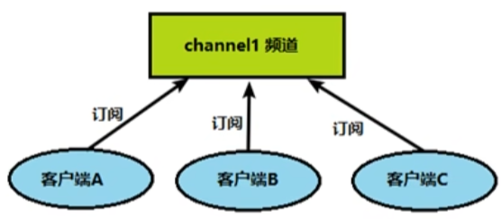
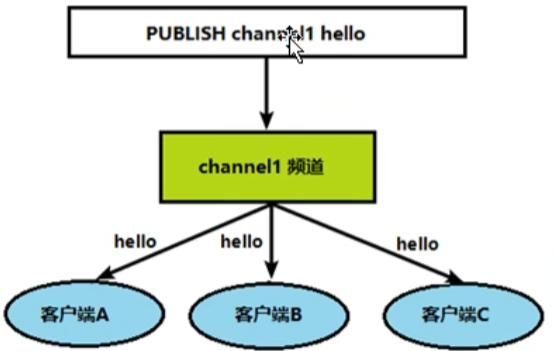

# Redis 的发布和订阅

## 什么是发布和订阅

-   Redis 发布订阅 (pub/sub) 是一种消息通信模式：发送者 (pub) 发送消息，订阅者 (sub) 接收消息。

-   Redis 客户端可以订阅任意数量的频道。

## Redis 的发布和订阅

客户端可以订阅频道如下图：


当给这个频道发布消息后，消息就会发送给订阅的客户端：




## 发布订阅命令行实现

打开一个客户端订阅 channel1：

```shell
127.0.0.1:6381> SUBSCRIBE channel1 			# 输入该命令以后，窗口阻塞等待
Reading messages... (press Ctrl-C to quit)
1) "subscribe"
2) "channel1"
3) (integer) 1
```


打开另一个客户端，给 channel1 发布消息 hello：

```shell
127.0.0.1:6381> PUBLISH channel1 hello
(integer) 1
```

打开第一个客户端可以看到发送的消息：

```shell
127.0.0.1:6381> SUBSCRIBE channel1 
Reading messages... (press Ctrl-C to quit)
1) "subscribe"
2) "channel1"
3) (integer) 1
1) "message"
2) "channel1"
3) "hello"
```

注意：

​	发布的消息没有持久化，如果在订阅的客户端收不到消息 hello，只能收到订阅后发布的消息