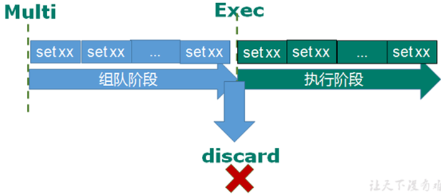
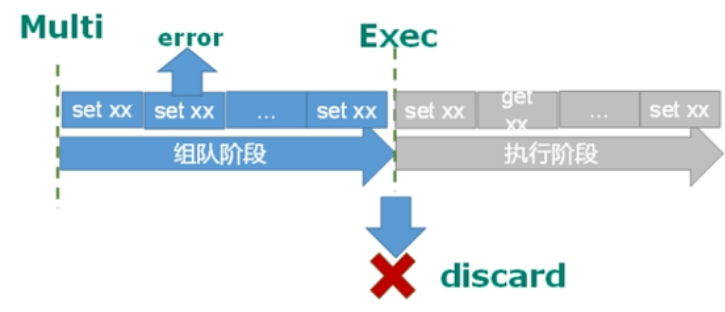
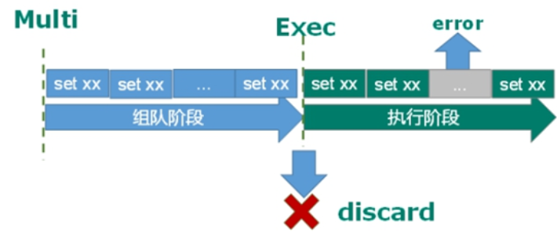
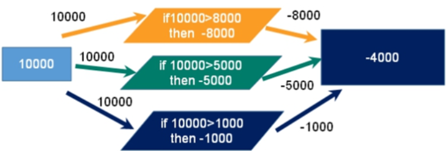
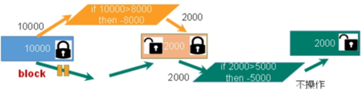
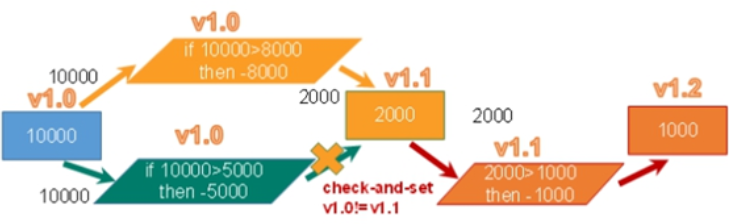
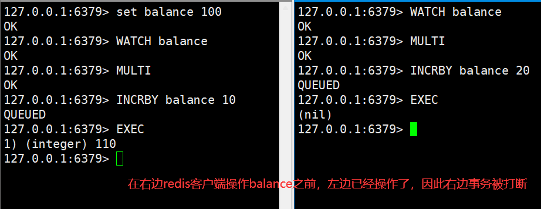
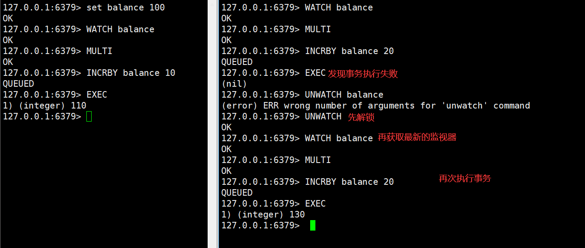

# Redis 事务

## 1 Redis 事务定义

Redis 事务是一个单独的隔离操作：**事务中的所有命令都会序列化、按顺序地执行**。事务在执行的过程中，不会被其他客户端发送来的命令请求所打断。

Redis 事务的主要作用就是**串联多个命令**防止别的命令插队。

注意：

​	**==Redis单条命令保证原子性，但是事务不保证原子性==**

## 2 Multi、Exec、discard

Redis 事务中有 Multi、Exec 和 discard 三个指令，在 Redis 中，从输入 Multi 命令开始，输入的命令都会依次进入命令队列中，但不会执行，直到输入 Exec 后，Redis 会将之前的命令队列中的命令依次执行。而组队的过程中可以通过 discard 来放弃组队。



案例说明：

```shell
127.0.0.1:6379> MULTI
OK
127.0.0.1:6379> set k1 v1
QUEUED
127.0.0.1:6379> set k2 v2
QUEUED
127.0.0.1:6379> EXEC
1) OK					# 组队成功，提交成功
2) OK
```

```shell
127.0.0.1:6379> MULTI
OK
127.0.0.1:6379> set m1 v1
QUEUED
127.0.0.1:6379> set m2
(error) ERR wrong number of arguments for 'set' command		# 组队阶段报错
127.0.0.1:6379> set m3 v3
QUEUED
127.0.0.1:6379> EXEC	# 提交失败
(error) EXECABORT Transaction discarded because of previous errors.
```

```shell
127.0.0.1:6379> MULTI
OK
127.0.0.1:6379> set k1 v1
QUEUED
127.0.0.1:6379> INCR k1
QUEUED
127.0.0.1:6379> set k2 v2
QUEUED	
127.0.0.1:6379> EXEC	# 组队成功，提交有成功有失败情况
1) OK
2) (error) ERR value is not an integer or out of range
3) OK
```

```shell
127.0.0.1:6379> MULTI
OK
127.0.0.1:6379> set a1 v1
QUEUED
127.0.0.1:6379> set a2 v2
QUEUED
127.0.0.1:6379> DISCARD			# 组队成功，但是最终放弃组队（取消事务）
OK
```

## 3 事务的错误处理

组队中某个命令出现了报告错误，执行时整个的所有队列都会被取消

类比：编译时异常，事务中所有的命令都不会被执行



```shell
127.0.0.1:6379> MULTI	# 开启事务
OK
127.0.0.1:6379> set b1 v1 	# 组队阶段
QUEUED
127.0.0.1:6379> set b2 v2
QUEUED
127.0.0.1:6379> set b3		# 组队阶段报错
(error) ERR wrong number of arguments for 'set' command
127.0.0.1:6379> EXEC		# 执行事务，发现报错
(error) EXECABORT Transaction discarded because of previous errors.

# 验证组队中某个命令出现了报告错误，执行时整个的所有队列都会被取消
# 只要为空，就验证成功
127.0.0.1:6379> keys *
(empty array)
```

如果执行阶段某个命令报出了错误，则只有报错的命令不会被执行，而其他的命令都会执行，==不会回滚==。

类比：运行时异常，错误命令抛出异常，其他命令正常执行



```shell
127.0.0.1:6379> MULTI	# 开启事务
OK
127.0.0.1:6379> set c1 v1	# 组队阶段
QUEUED
127.0.0.1:6379> INCR c1		# 组队阶段，让c1对应的值自增1，但是 v1不是数字，自增会报错
QUEUED
127.0.0.1:6379> set c2 v2
QUEUED
127.0.0.1:6379> EXEC	# 执行，发现报错
1) OK
2) (error) ERR value is not an integer or out of range
3) OK

# 验证如果执行阶段某个命令报出了错误，则只有报错的命令不会被执行，而其他的命令都会执行，不会回滚
# 只要能查询到 c1、c2 那就证明其他命令没有回滚
127.0.0.1:6379> KEYS *
1) "c2"
2) "c1"
```

## 4 为什么要做成事务

想想一个场景：有很多人有你的账户，同时去参加双十一抢购。

### 5 事务冲突的问题

#### 例子

一个请求想给金额减 8000；

一个请求想给金额减 5000；

一个请求想给金额减 1000。

最终我们可以发现，总共金额是 10000，如果请求全部执行，那最后的金额变为 - 4000，很明显不合理。



#### 悲观锁


**悲观锁 (Pessimistic Lock)**，顾名思义，就是很悲观，每次去拿数据的时候都认为别人会修改，所以每次在拿数据的时候都会上锁，这样别人想拿这个数据就会 block 直到它拿到锁。

**传统的关系型数据库里边就用到了很多这种锁机制，比如行锁，表锁等，读锁，写锁**等，==都是在做操作之前先上锁==。

小结：

​	很悲观，任务无论什么时候都会出问题，无论做什么都会加锁！！效率低

#### 乐观锁


**乐观锁 (Optimistic Lock)**，顾名思义，就是很乐观，每次去拿数据的时候都认为别人不会修改，所以不会上锁，但是在更新的时候会判断一下在此期间别人有没有去更新这个数据，可以使用版本号等机制。

**乐观锁适用于多读的应用类型，这样可以提高吞吐量**。Redis 就是利用这种 `check-and-set `机制实现事务的。

小结：

​	很乐观，认为什么时候都不会出现问题，所以不会上锁！！！更新数据的时候去判断，在此期间是否有人修改过这个数据

​	通过version版本机制

​	更新的时候会去比对version  

#### WATCH key [key …]

在执行 multi 之前，先执行 watch key1 [key2]，可以监视一个 (或多个) key ，如果在事务**执行之前这个 (或这些) key 被其他命令所改动，那么事务将被打断。**

演示：



#### unwatch

取消 WATCH 命令对所有 key 的监视。

如果在执行 WATCH 命令之后，EXEC 命令或 DISCARD 命令先被执行了的话，那么就不需要再执行 UNWATCH 了。



## 6 Redis 事务三特性

- 单独的隔离操作 ：事务中的所有命令都会序列化、按顺序地执行。事务在执行的过程中，不会被其他客户端发送来的命令请求所打断。

- 没有隔离级别的概念 ：队列中的命令没有提交之前都不会实际被执行，因为事务提交前任何指令都不会被实际执行。

- 不保证原子性 ：事务中如果有一条命令执行失败，其后的命令仍然会被执行，没有回滚 。
  - 但是Redis单条命令保证原子性
