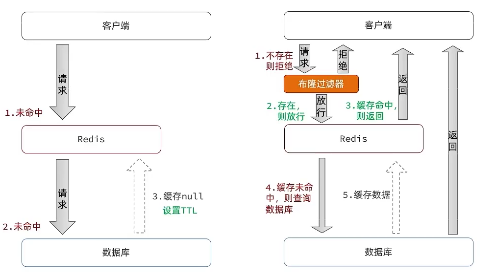

# 什么是缓存穿透？

## **口语化**

缓存穿透的最核心就是当**高并发请求**来的时候，但是 **key 在缓存中不存在**的时候，就会请求数据库，如果**数据库还是没有**的话，就会返回，但是这个时候，由于没有数据，也不会存入到缓存中，下次请求过来还会重复这个操作。如果说这个 key 一直没有数据，就会不断的打到数据库中。这就是缓存穿透。

缓存穿透主要可以通过**缓存空值、布隆过滤器**的方式来进行解决。常用的就是缓存空值，当数据库也查询不到的时候，在缓存中将空值写入，这样后面的请求就会命中缓存，不会造成数据库的大压力。布隆过滤器比较适合一些固定值，来进行初步的过滤，这样可以减少误判率，同时减轻压力


产生原因：客户端请求的数据在缓存与数据库中都**不存在**，缓存中不存在，就会去查数据库，数据库也不存在，每次请求都会访问数据库，如果这个请求并发量比较大，就会压垮数据库

## 解决方案

-   缓存空值
    -   思路：对于不存在的数据也在redis中建立空缓存，并设置一个较短的TTL
    -   优点：实现简单，维护方便
    -   缺点：1）额外的内存消耗；2）短期的数据不一致问题
-   布隆过滤器
    -   思路：利用布隆过滤算法，在请求进入Redis之前先判断是否存在，如果不存在直接拒绝请求
    -   优点：内存占用少
    -   缺点：1）实现复杂；2）存在误判的可能性
-   其他方案：
    -   做好数据的基础格式校验
    -   增强id的复杂度，避免被猜测id规律
    -   加强用户权限校验
    -   做好热点参数限流

### **缓存空对象**

当数据库中查不到数据时，缓存一个空对象（例如一个标记为空或不存在的对象），并给这个空对象设置一个较短的过期时间。这样，下次再查询该数据时，就可以直接从缓存中拿到空对象，从而避免了不必要的数据库查询。

缺点：

-   额外的内存消耗：需要缓存层提供更多的内存空间来缓存这些空对象，当空对象很多时，会浪费更多的内存
-   短期的数据不一致问题：会导致缓存层和存储层的数据不一致，即使设置了较短的过期时间，也会在这段时间内造成数据不一致问题。比如缓存还是空对象，这个时候数据库已经有值了。这种引入复杂性，当数据库值变化的时候，要清空缓存。



```java
String key = "hotkey";
String value = redis.get(key);
if (value == null) {
    value = database.query(key);
    if (value == null) {
        // 缓存空结果，设置短过期时间
        redis.set(key, "", 60);  // 60秒过期
    } else {
        redis.set(key, value, 3600);  // 1小时过期
    }
}
```

### **使用布隆过滤器**

布隆过滤器用于检测一个元素是否在集合中。访问缓存和数据库之前，先判断布隆过滤器里面有没有这个 key

>   布隆过滤器其实采用的是哈希思想来解决这个问题，通过一个庞大的二进制数组，走哈希思想去判断当前这个要查询的这个数据是否存在
>
>   如果布隆过滤器判断存在，则放行，这个请求会去访问redis，哪怕此时redis中的数据过期了，但是数据库中一定存在这个数据，在数据库中查询出来这个数据后，再将其放入到redis中
>
>   假设布隆过滤器判断这个数据不存在，则直接返回

比较适合数据 key 相对固定的场景。可以减少误识别率。


```java
BloomFilter<String> bloomFilter = new BloomFilter<>(expectedInsertions, falsePositiveProbability);
// 初始化布隆过滤器，插入所有可能存在的键
for (String key : allPossibleKeys) {
    bloomFilter.put(key);
}

// 查询时使用布隆过滤器
String key = "hotkey";
if (!bloomFilter.mightContain(key)) {
    // 布隆过滤器判断不存在，直接返回
    return null;
} else {
    // 布隆过滤器判断可能存在，查询缓存和数据库
    String value = redis.get(key);
    if (value == null) {
        value = database.query(key);
        redis.set(key, value, 3600);  // 1小时过期
    }
    return value;
}
```

### **缓存预热**

在系统启动时，提前将热门数据加载到缓存中，可以避免因为请求热门数据而导致的缓存穿透问题。需要根据系统的实际情况和业务需求来判断是否需要对缓存进行预热。比如在一些高并发的系统下，提前预热可以大大减少毛刺的产生，以及提高性能和系统稳定。

缓存预热的经典代码:

```java
@Component
public abstract class AbstractCache {

    public void initCache(){}

    public <T> T getCache(String key){
        return null;
    }

    public void clearCache(){}

    public void reloadCache(){
        clearCache();
        initCache();
    }
}

@Component
public class InitCache implements CommandLineRunner {

    @Override
    public void run(String... args) throws Exception {
        //我要知道哪些缓存需要进行一个预热
        ApplicationContext applicationContext = SpringContextUtil.getApplicationContext();
        Map<String, AbstractCache> beanMap = applicationContext.getBeansOfType(AbstractCache.class);
        //调用init方法
        if(beanMap.isEmpty()){
            return;
        }
        for(Map.Entry<String,AbstractCache> entry : beanMap.entrySet()){
            AbstractCache abstractCache = (AbstractCache) SpringContextUtil.getBean(entry.getValue().getClass());
            abstractCache.initCache();
        }
    }
}

@Component
public class CategoryCache extends AbstractCache {

    private static final String CATEGORY_CACHE_KEY = "CATEGORY";

    @Autowired
    private RedisUtil redisUtil;

    @Autowired
    private RedisTemplate redisTemplate;

    @Override
    public void initCache() {
        //跟数据库做联动了，跟其他的数据来源进行联动
        redisUtil.set("category","知识");
    }

    @Override
    public <T> T getCache(String key) {
        if(!redisTemplate.hasKey(key).booleanValue()){
            reloadCache();
        }
        return (T) redisTemplate.opsForValue().get(key);
    }

    @Override
    public void clearCache() {
        redisTemplate.delete(CATEGORY_CACHE_KEY);
    }
}
```
