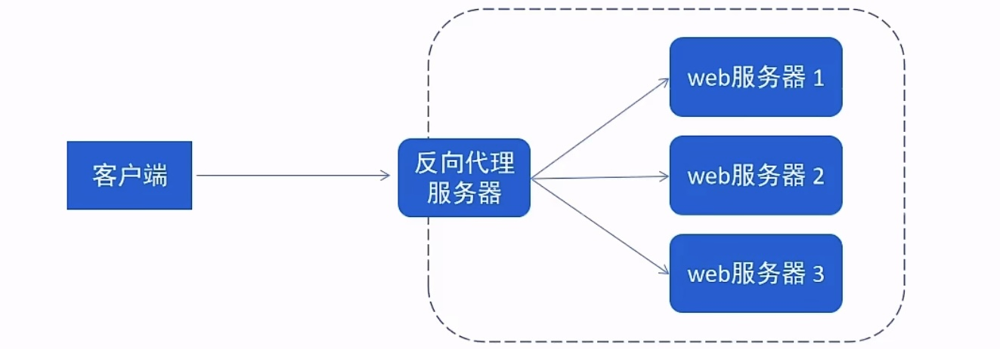
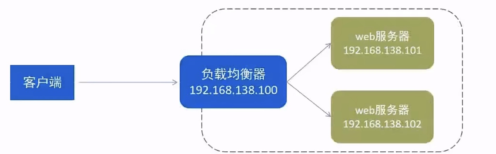

## token是用来鉴权的，session是用来干什么的？

使用JWT进行用户认证和授权，而Session在一定程度上起到了辅助作用。 让我们详细讨论JWT和Session在这种结合模式中的各自作用以及为什么需要Session。

**JWT的作用**

-   **用户认证**：JWT包含了用户的身份信息和权限信息（JWT本质就是一个带有用户信息的字符串），客户端每次请求时将JWT发送给服务器，服务器通过验证JWT来确认用户身份。

-   **无状态性**：JWT不需要在服务器端存储用户会话信息，因此服务器可以是无状态的，便于扩展和负载均衡。

**Session的作用**

-   **附加的安全层**：即使JWT是无状态的，但在某些应用场景中，仅依赖JWT可能存在一些安全问题，例如Token的泄露或滥用。Session可以作为一个额外的安全层，确保Token即使有效，也必须在服务器的Session管理器中存在对应的会话。

-   **管理Token的生命周期**：通过Session，可以更方便地管理Token的生命周期，例如强制用户重新登录、手动注销Token等操作。

-   **控制“记住我”功能**：如果用户选择了“记住我”选项，Session可以记录这个状态，并在JWT过期后，通过Session来决定是否允许继续使用旧的Token。

**为什么需要创建Session**

尽管JWT可以在无状态环境中使用，但Session的引入带来了以下好处：

1.  **防止Token滥用**：通过在服务器端验证Session，可以确保即使Token有效，也必须是经过服务器端认证的，从而防止Token被恶意使用。
2.  **支持用户主动注销**：当用户选择注销时，可以直接删除服务器端的Session记录，确保Token即使没有过期，也无法再被使用。
3.  **提供更精细的控制**：通过Session，可以实现更精细的权限控制和用户状态管理，例如强制下线、会话过期时间控制等。
4.  **状态追踪**：在某些场景下，追踪用户状态是必要的，例如监控用户的活跃度、登录历史等，这些信息可以通过Session进行管理。

**结合JWT和Session的优势**

结合使用JWT和Session，可以同时利用两者的优点，实现安全性和扩展性的平衡：

1.  **无状态认证**：JWT可以实现无状态认证，便于系统的水平扩展和负载均衡。
2.  **状态管理和安全性**：Session可以提供额外的状态管理和安全性，确保Token的使用更加安全可靠


以下是一个简化的代码示例，展示了如何在用户登录时创建JWT和Session：

```java
public LoginResponse login(String username, String password) throws AuthException {
    // 验证用户名和密码
    User user = userService.authenticate(username, password);
    if (user == null) {
        throw new AuthException("Invalid username or password");
    }

    // 生成JWT Token
    String token = createJwt(user.getId(), user.getRoles());

    // 创建会话
    sessionManagerApi.createSession(token, user);

    // 返回Token
    return new LoginResponse(token);
}

public void createSession(String token, User user) {
    LoginUser loginUser = new LoginUser();
    loginUser.setToken(token);
    loginUser.setUserId(user.getId());
    loginUser.setRoles(user.getRoles());

    sessionManagerApi.saveSession(token, loginUser);
}
```

在请求验证时，首先验证JWT的有效性，然后检查Session中是否存在对应的会话：

```java
@Override
public DefaultJwtPayload validateToken(String token) throws AuthException {
    try {
        // 1. 先校验jwt token本身是否有问题
        JwtContext.me().validateTokenWithException(token);

        // 2. 获取jwt的payload
        DefaultJwtPayload defaultPayload = JwtContext.me().getDefaultPayload(token);

        // 3. 如果是7天免登陆，则不校验session过期
        if (defaultPayload.getRememberMe()) {
            return defaultPayload;
        }

        // 4. 判断session里是否有这个token
        LoginUser session = sessionManagerApi.getSession(token);
        if (session == null) {
            throw new AuthException(AUTH_EXPIRED_ERROR);
        }

        return defaultPayload;
    } catch (JwtException jwtException) {
        if (JwtExceptionEnum.JWT_EXPIRED_ERROR.getErrorCode().equals(jwtException.getErrorCode())) {
            throw new AuthException(AUTH_EXPIRED_ERROR);
        } else {
            throw new AuthException(TOKEN_PARSE_ERROR);
        }
    } catch (io.jsonwebtoken.JwtException jwtSelfException) {
        throw new AuthException(TOKEN_PARSE_ERROR);
    }
}
```

**总结**

​	在这个场景中，JWT用于无状态的用户认证，提供便捷和扩展性；

​	Session作为辅助，提供额外的安全性和状态管理。通过这种结合，可以充分利用两者的优点，确保系统既具备高扩展性，又能提供细致的安全控制。


# Nginx

## Nginx的常用命令？

-   查看版本

```
./nginx -v
```

-   **检查配置文件正确性**

```
./nginx -t
```

-   启动命令

```
./nginx
```

-   停止

```
./nginx -s stop
```

示例：

```shell
[root@nhk sbin]# ./nginx 	
[root@nhk sbin]# ps -ef | grep nginx	# 查看相关进程
root       6020      1  0 02:07 ?        00:00:00 nginx: master process ./nginx
nobody     6021   6020  0 02:07 ?        00:00:00 nginx: worker process
root       6023   5890  0 02:08 pts/0    00:00:00 grep --color=auto nginx
[root@nhk sbin]# ./nginx -s stop
[root@nhk sbin]# ps -ef | grep nginx
root       6036   5890  0 02:08 pts/0    00:00:00 grep --color=auto nginx
```

-   **重新加载配置文件**

```
./nginx -s reload
```

## Nginx配置文件结构？

Nginx配置文件（conf/nginx.conf）整体分三部分：

-   **全局块**
-   **events块**
-   http块
    -   http全局块
    -   Server块
        -   Server全局块
        -   location块

注意：http块可以配置多个Server块，每个Server块可以配置多个location块

```shell
worker_processes  1;

events {
    worker_connections  1024;
}

http {
    include       mime.types;
    default_type  application/octet-stream;

    sendfile        on;
  
    keepalive_timeout  65;

    server {
        listen       80;
        server_name  localhost;

 
        location / {
            root   html;
            index  index.html index.htm;
        }

        error_page   500 502 503 504  /50x.html;
        location = /50x.html {
            root   html;
        }
    }

}
```


## 开发中Nginx的具体应用？

### 部署静态资源

Nginx可以作为静态web服务器来部習静态资源。静态资源指在服务端真实存在并且能够直接展示的一些文件，比如常见的html页面、CSS文件、js文件、图片、视频等资源。

相对于Tomcat，Nginx处理静态资源的能力更加高效，所以在生产环境下，一般都会将静态资源部署到Nginx中

将静态资源部署到Nginx非常简单，只需要**将文件复制到Nginx安装目录下的html目录中**即可。

nginx.conf部分解读如下：

```md
server {
    listen       80;	#监听端口
    server_name  localhost;	#服务名称

    location / {		#匹配客户端请求url
    root   html;		#指定静态资源根目录
    index  index.html index.htm;	#指定默认首页
	}

}
```

###  反向代理

-   正向代理

是一个位于客户端和原始服务器（origin server）之间的服务器，为了从原始服务器取得内容，客户端向代理发送一个请求并指定目标（原始服务器），然后代理向原始服务器转交请求并将获得的内容返回给客户端。

正向代理的典型用途是为在防火墙内的局域网客户端提供访问internet的途径。

正向代理**一般是在==客户端设置代理服务器==，通过代理服务器转发请求，最终访问到目标服务器**


-   反向代理

位于用户与目标服务器之间，但是对于用户而言，反向代理服务器就相当于目标服务器，即用户直接访问反向代理服务器就可以获得目标服务器的资源，反向代理服务器负责将请求转发给目标服务器。

用户不需要知道目标服务器的地址，也无需在用户端做任何设定。



反向代理示例：

```shell
server {
    listen       80;
    server_name  localhost;

    location / {
    	proxy_pass http://192.168.188.150:8080 	#反向代理配置，将请求转发到指定服务
	}
}
```

两者区别

-   正向代理需要知道代理服务器的地址（即需要在客户端进行设置）
    -   比如我们要访问YouTube，我们可以在香港买一台代理服务器，我们访问香港的代理服务器，由代理服务器去国外访问YouTube。最终返回给我们
-   反向代理的话，客户端不需要进行任何设置。反向代理服务器就相当于目标服务器


###  负载均衡

早期的网站流量和业务功能都比较简单，单台服务器就可以满足基本需求，但是随着互联网的发展，业务流量越来越大并且业务逻辑也越来越复杂，单台服务器的性能及单点故障问题就凸显出来了，因此需要多台服务器组成应用集群，进行性能的水平扩展以及避免单点故障出现。

-   应用集群：将同一应用部署到多台机器上，组成应用集群，接收负载均衡器分发的请求，进行业务处理并返回响应数据
-   负载均衡器：将用户请求根据对应的**负载均衡算法分发到应用集群中的一台服务器进行处理**



负载均衡示例：

```shell
# 配置负载均衡
upstream targetserver{	#upstream指令可以设定一组服务器
    server 192.168.138.101:8080	weight=10;	#weight权重越大，分发概率越大
    server 192.168.138.102:8080	weight=5;
}
server {
    listen       8080;
    server_name  localhost;

    location / {
    	proxy_pass http://targetserver 	#反向代理配置，将请求转发到指定服务
	}
}
```

## 如何实现负载均衡？

可以通过upstream指令定义一组后端服务器，并在location块中使用proxy_pass指向这个upstream组。

常见的负载均衡算法有轮询、加权、ip哈希等，可以在upstream中进行设置


## 负责均衡策略

| 名称       | 说明             |
| ---------- | ---------------- |
| 轮询       | **默认**         |
| weight     | 权重方式         |
| ip_hash    | 依据ip分配方式   |
| least_conn | 依据最少连接方式 |
| url_hash   | 依据url分配方式  |
| fair       | 依据响应时间方式 |

示例：

```shell
# 配置负载均衡
upstream targetserver{	#upstream指令可以设定一组服务器
    server 192.168.138.101:8080	weight=10;	#weight权重越大，分发概率越大
    server 192.168.138.102:8080	weight=5;
}
server {
    listen       8080;
    server_name  localhost;

    location / {
    	proxy_pass http://targetserver 	#反向代理配置，将请求转发到指定服务
	}
}
```


## Nginx如何处理重定向？

使用return指令实现重定向

例如：return 301 https://www.example.com 表示 301 永久重定向到指定的URL


## Nginx中的虚拟主机（Virtual Host）是什么？如何配置？

虚拟主机是在一台服务器上运行多个网站的方法

**如何配置**

通过配置不同的server块，根据域名或端口等条件来区分不同的网站。可以通过 server_name 指令指定域名，然后配置相关的路径和处理规则


## Nginx如何处理SSL证书？

首先需要获取SSL证书（公钥和私钥），然后在Nginx的配置中使用 ssl_certificate 和 ssl_certificate_key 指令指定证书和密钥的路径，同时配置相关的SSL协议和加密套件等参数。


## Nginx中的upstream模块有什么用？

upstream模块用于定义后端服务器组，以便在反向代理或负载均衡场景中使用，实现将请求分发到多个后端服务器。

```shell
# 配置负载均衡
upstream targetserver{	#upstream指令可以设定一组服务器
    server 192.168.138.101:8080	weight=10;	#weight权重越大，分发概率越大
    server 192.168.138.102:8080	weight=5;
}
```


## Nginx中的location指令有什么用？

location指令用于匹配请求的URL路径，并定义对该路径的处理方式。如代理、重定向、返回文件等。

```shell
location / {
	proxy_pass http://targetserver 	#反向代理配置，将请求转发到指定服务
}
```


## Nginx如何实现缓存？

可以使用proxy_cache指令来配置缓存策略，包括缓存的键、缓存时间、缓存大小等。


## 说说常见的HTTP状态码？

| 类别       | 状态码范围 | 描述                   |
| :--------- | :--------- | :--------------------- |
| 信息性响应 | 1xx        | 请求已被接收，继续处理 |
| 成功响应   | 2xx        | 请求成功处理           |
| 重定向响应 | 3xx        | 客户端需采取进一步操作 |
| 客户端错误 | 4xx        | 客户端错误             |
| 服务器错误 | 5xx        | 服务器错误             |

**成功响应 (2xx)**

-   **200 OK**：请求成功，响应体中包含所请求的资源。
-   **201 Created**：请求成功并且服务器创建了新的资源，通常用于 `POST` 请求。
-   **204 No Content**：请求成功，但响应体为空，通常用于 `DELETE` 或 `PUT` 请求后不需要返回数据的情况。
-   **206 Partial Content**：服务器已成功处理部分 GET 请求，响应体中包含部分内容（例如分段下载）。

**重定向响应 (3xx)**

-   **301 Moved Permanently**：请求的资源已永久移动到新位置，客户端应使用新的 URI 进行后续请求。
-   **302 Found**：请求的资源临时从不同的 URI 响应请求，客户端应使用新的 URI 进行后续请求。
-   **304 Not Modified**：资源未修改，客户端可以使用缓存版本，通常用于条件请求（如带有 `If-Modified-Since` 头的请求）。
-   **307 Temporary Redirect**：请求的资源临时从不同的 URI 响应请求，但客户端不应改变请求方法（例如 `POST` 请求仍应保持为 `POST`）。
-   **308 Permanent Redirect**：请求的资源已永久移动到新位置，客户端应使用新的 URI 进行后续请求，且不应改变请求方法。

**客户端错误 (4xx)**

-   **400 Bad Request**：服务器无法理解请求，通常是因为客户端发送的请求语法有误。
-   **401 Unauthorized**：请求需要用户认证，通常用于需要身份验证的 API。
-   **403 Forbidden**：服务器理解请求，但拒绝执行，通常是因为权限不足。
-   **404 Not Found**：服务器找不到请求的资源，可能是路径错误或资源不存在。
-   **405 Method Not Allowed**：请求方法不被允许，例如对只读资源使用 `POST` 方法。
-   **409 Conflict**：由于冲突，请求无法完成，通常用于并发编辑场景。
-   **429 Too Many Requests**：客户端在给定时间内发送了过多请求，触发了限流机制。

**服务器错误 (5xx)**

这些状态码表示服务器在处理请求时发生了错误。

-   **500 Internal Server Error**：服务器遇到了意外情况，无法完成请求。
-   **501 Not Implemented**：服务器不支持请求的方法或功能。
-   **502 Bad Gateway**：服务器作为网关或代理，从上游服务器收到了无效响应。
-   **503 Service Unavailable**：服务器暂时无法处理请求，通常是由于过载或维护。
-   **504 Gateway Timeout**：服务器作为网关或代理，未能及时从上游服务器获取响应。


## URL地址末尾加不加”/“有什么区别

https://juejin.cn/post/7468112128928350242

**URL（统一资源定位符）** ：用于唯一标识互联网资源，如网页、图片、API等。

