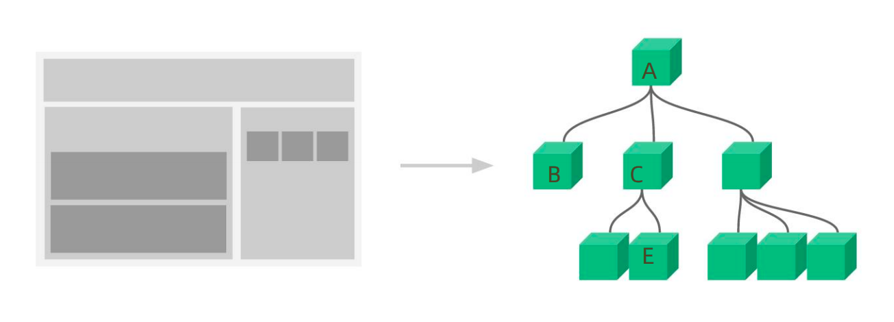
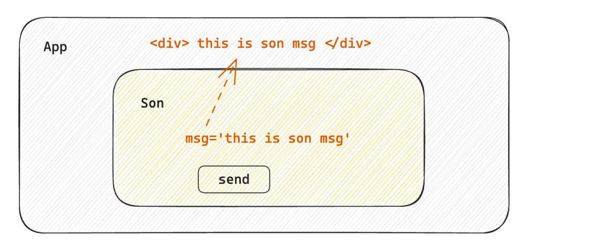
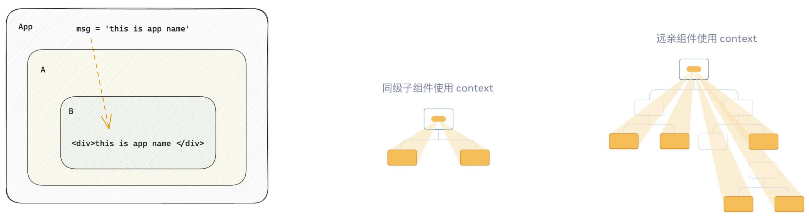

# 组件通信

组件通信就是`组件之间的数据传递`, 根据组件嵌套关系的不同，有不同的通信手段和方法



- A-B 父子通信
- B-C 兄弟通信
- A-E 跨层通信

:::tip
React中组件通信的方式较少，比Vue少得多
:::


## 父传子


**实现步骤**

- 父组件传递数据 - 在子组件标签上绑定属性
- 子组件接收数据 - 子组件通过`props`参数接收数据

```jsx
function Son(props){
  return <div>{ props.name }</div>
}


function App(){
  const name = 'this is app name'
  return (
    <div>
       <Son name={name}/>
    </div>
  )
}
```

:::tip
`props`参数可以搭配`es6`的解构使用，如下：
```jsx
function Son({ name }){
  return <div>{ name }</div>
}

```
:::


### props说明

props可以传递任意的合法数据，比如数字、字符串、布尔值、数组、对象、函数、JSX


:::warning 注意
`props`是只读对象

子组件只能读取`props`中的数据，不能直接进行修改, 父组件的数据只能由父组件修改
:::

### props实现具名插槽效果

:::tip
利用`props`传递JSX，我们可以在React中实现类似于Vue中具名插槽的效果
:::

```jsx
function Son(props) {
  return (
    <div>
      <div>{props.name}</div>
      {/* 此处props.li属性可以实现类似于Vue的具名插槽 */}
      {props.li}
    </div>
  )
}


function App() {
  const name = 'this is app name'
  return (
    <>
      <Son name={name} li=
        {
          <ul>
            <li>张三</li>
            <li>李四</li>
            <li>王五</li>
          </ul>
        }
      />
    </>
  )
}
```


### 特殊的prop chilren

当我们把内容嵌套在组件的标签内部时，组件会自动在名为`children`的`prop`属性中接收该内容

:::tip
利用`children`，我们可以在React中实现类似于Vue中默认插槽的效果
:::

```jsx
function Son(props) {
  return (
    <div>
      <div>{props.name}</div>
      {/* 此处children属性可以实现类似于Vue的default solt */}
      {props.children}
    </div>
  )
}


function App() {
  const name = 'this is app name'
  return (
    <>
      <Son name={name}>
        <ul>
          <li>张三</li>
          <li>李四</li>
          <li>王五</li>
        </ul>
      </Son>
    </>
  )
}
```


## 子传父



子传父核心思路：在子组件中调用父组件中的函数并传递参数

:::tip
可以通过`props`向子组件传递函数，子组件调用函数即可完成子传父

在React并没有提供类似于Vue的`emit`自定义事件

尽管Vue中有`emit`，但是我们还是可以通过传递函数的方式完成子传父
:::

```jsx
function Son({ onGetMsg }) {
  const sonMsg = 'this is son msg'

  const handleSend = () => {
    onGetMsg(sonMsg)
  }

  return (
    <div>
      {/* 在子组件中执行父组件传递过来的函数 */}
      <button onClick={handleSend}>send</button>
    </div>
  )
}


function App() {
  const getMsg = (msg) => {
    console.log(msg)
  }

  return (
    <>
      {/* 传递父组件中的函数到子组件 */}
      <Son onGetMsg={getMsg} />
    </>
  )
}
```
:::warning 建议
尽管我们通过`props`传递函数时`props`的变量名不做要求

但是我们为了语义清晰，通过会以`onXxx`作为`props`的变量名，这样我们可以很清晰的知道他是一个函数
:::


## 兄弟组件通信


:::tip
实现思路: 借助 `状态提升` 机制，通过共同的父组件进行兄弟之间的数据传递

- A组件先通过子传父的方式把数据传递给父组件App
- App拿到数据之后通过父传子的方式再传递给B组件
:::

```jsx
import { useState } from "react"

function A({ onGetAName }) {
  const name = 'this is A name'

  const sendHandle = () => {
    // 2.A组件调用函数将name传递给父组件
    onGetAName(name)
  }

  return (
    <div>
      this is A compnent,
      {name}
      <button onClick={sendHandle}>send</button>
    </div>
  )
}

function B({ name }) {
  return (
    <div>
      this is B compnent,
      {name}
    </div>
  )
}

function App() {
  const [name, setName] = useState('')
  const getAName = (name) => {
    setName(name)
  }

  return (
    <>
      this is App
      {/* 1.传递父组件中的函数到子组件A */}
      <A onGetAName={getAName} />
      {/* 3.将name以props参数传递到子组件B */}
      <B name={name} />
    </>
  )
}
```

## 跨层组件通信



**实现步骤**

- 使用 `createContext` 方法创建一个上下文对象Ctx
- 在顶层组件（App）中通过 `Ctx.Provider` 组件提供数据
- 在底层组件（B）中通过 `useContext` 钩子函数获取消费数据

```jsx
import { createContext, useContext } from "react"

function A() {
  return (
    <div>
      this is A component
      <B />
    </div>
  )
}

function B() {
  // 3.在底层组件 通过useContext钩子函数使用数据
  const msg = useContext(MsgContext)

  return (
    <div>
      this is B compnent,{msg}
    </div>
  )
}

// 1.使用 createContext方法创建一个上下文对象Ctx
const MsgContext = createContext('default value')

function App() {
  const msg = 'this is app msg'
  return (
    <>
      {/* 2.在顶层组件 通过Provider组件提供数据 */}
      <MsgContext.Provider value={msg}>
        <A />
      </MsgContext.Provider>
    </>
  )
}
```

:::tip
这种跨层组件通信的方式，你可以理解为**发布订阅**，有所区别的是只能由后代组件消费数据

Vue中有提供类似的组件通信方式，事件总线$bus
:::