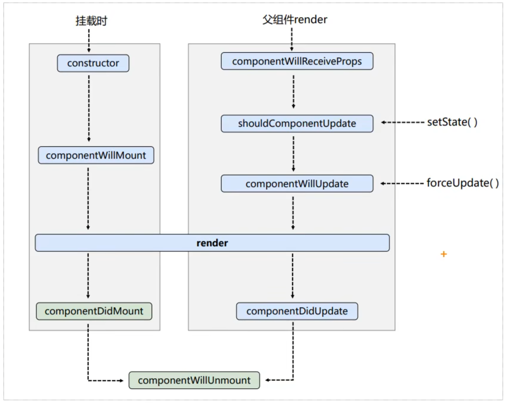
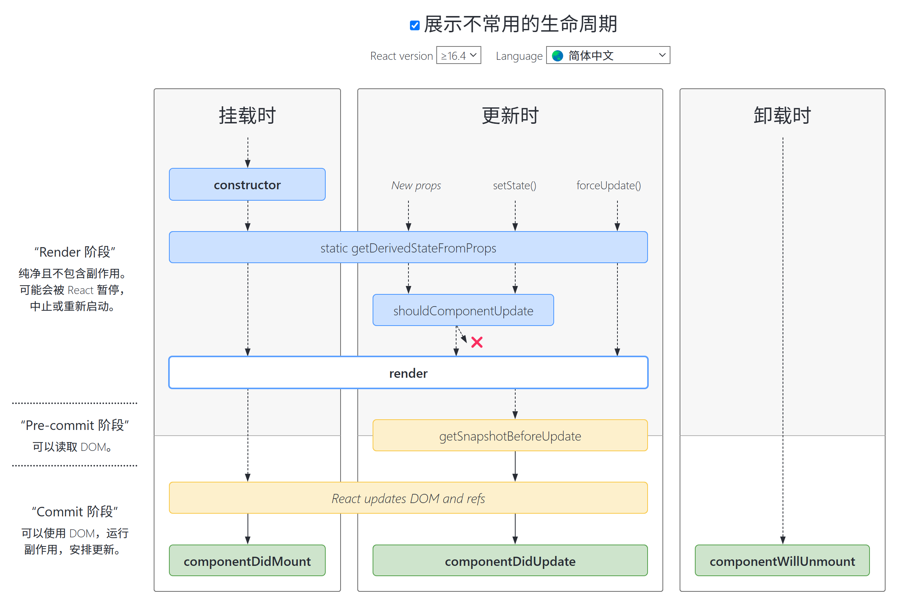

# React生命周期

参考：https://projects.wojtekmaj.pl/react-lifecycle-methods-diagram/

:::tip

生命周期回调函数 === 生命周期钩子函数 === 生命周期函数 === 生命周期钩子

:::

在学习React生命周期之前，我们先来理解以下几个概念：
- 1.组件从创建到死亡它会经历一些特定的阶段
- 2.React组件中包含一系列勾子函数，会在特定的时刻调用
- 3.我们可以在定义组件时，在特定的生命周期回调函数中，做些特定的操作


React组件的生命周期可以分为三个阶段：

1. **初始化阶段**（Mounting）：当组件实例被创建并插入到DOM中时，会触发一系列的方法。
2. **更新阶段**（Updating）：当组件的props或state发生变化时，会再次执行一系列方法以重新渲染组件。
3. **卸载阶段**（Unmounting）：当组件从DOM中被移除时，会调用一个方法来清理工作。

## 旧生命周期



初始化阶段：由`ReactDOM.render()`触发——初始渲染

- `constructor()`：构造函数，用于初始化状态`this.state`和其他属性
- `componentWillMount()`
- `render()` ==> 必写的钩子，负责返回要渲染的内容
- `componentDidMount()` ==> 常用，类比`vue2 mounted` `vue3 onMounted`
  - 一般在该钩子函数中做一些【初始化操作】，如开启定时器、发起ajax请求、订阅消息等

更新阶段：由组件内部 `this.setState()` 或 `父组件render()` 触发

- `shouldComponentUpdate()`
- `componentWillUpdate()`
- `render()` ==> 必写的钩子
- `componentDidUpdate()`

卸载阶段：由`ReactDOM.unmountComponentAtNode()`触发

- `componentWillUnmount()` ==> 常用，类比`vue2 beforeDestroy` `vue3 onBeforeUnmount`
  - 一般在该钩子函数中做一些【收尾操作】，如关闭定时器、取消订阅消息等

补充：

- `forceUpdate()` 强制更新组件。即在状态数据不改变、不触发`shouldComponentUpdate()`情况下，强制更新组件

- `componentWillReceiveProps()` 当接收的props发生变化时触发。
      ！！！注意，初始渲染时，传入的props不会引起此钩子函数的触发

:::details 演示

```jsx
class Container extends React.Component {
  state = {num: -1}

  reset = () => {
    this.setState({num: 0})
  }

  render() {
    console.log('Container--render')
    return (
      <div style={{backgroundColor: 'yellow'}}>
        <h1>这是一个求和案例</h1>
        <button onClick={this.reset}>重置count</button>
        <Count count={this.state.num}/>
      </div>
    )

  }
}

// 创建组件
class Count extends React.Component {

  constructor(props) {
    super(props)
    console.log('Count--constructor')
    this.state = {count: 0}
  }

  // count++回调
  add = () => {
    this.setState({count: this.state.count+1})
  }  
  // 卸载组件回调
  death = () => {
    ReactDOM.unmountComponentAtNode(document.getElementById('root'))
  }
  // 强制更新回调
  // 应用场景：不改变state数据，强制更新组件（绕过shouldComponentUpdate生命周期 ）
  force = () => {
    console.log('Count--force')
    this.forceUpdate()
  }

  // 组件将要挂载之前钩子
  componentWillMount(){
    console.log('Count--componentWillMount')
  
  }

  // 组件挂载完毕
  componentDidMount() {
    console.log('Count--componentDidMount')
  }

  // 组件接收新的props
  // ！！！注意，组件初次渲染时传递的props不会触发这个钩子，props改变时触发
  componentWillReceiveProps(nextProps) {
    console.log('Count--componentWillReceiveProps')
    this.setState({count: nextProps.count})
  }

  

  // 组件更新之前：控制组件更新的“阀门”，此时state改变了，但还未渲染到页面上
  // ！！！这个钩子即使不写，默认返回true，组件会更新
  shouldComponentUpdate(nextProps, nextState) {
    console.log('Count--shouldComponentUpdate')
    // debugger;
    if(nextState.count > 5){
      return false
    }
    return true
  }

  // 组件将要更新钩子
  componentWillUpdate(nextProps, nextState) {
    console.log('Count--componentWillUpdate')
  }


  // 组件更新完毕钩子
  componentDidUpdate() {
    console.log('Count--componentDidUpdate')
    
  }

  // 组件卸载之前执行
  componentWillUnmount() {
    console.log('Count--componentWillUnmount')
  }

  // 执行时机：初始化渲染、状态更新之后
  render() {
    console.log('Count--render')
    return (
      <div style={{backgroundColor: 'blue'}}>
        <h2>count：{this.state.count}</h2>
        <button onClick={this.add}>count++</button>
        <button onClick={this.death}>卸载组件</button>
        <button onClick={this.force}>不更改状态数据，强制更新</button>
      </div>
    )
  }
}

// 渲染组件
ReactDOM.render(<Container /> , document.getElementById('root'))
```

:::

## 新生命周期



初始化阶段：由`ReactDOM.render()`触发——初始渲染

- `constructor()`：构造函数，用于初始化状态`this.state`和其他属性
- `static getDerivedStateFromProps()`
- `render()` ==> 必写的钩子，负责返回要渲染的内容
- `componentDidMount()` ==> 常用，类比`vue2 mounted` `vue3 onMounted`
  - 一般在该钩子函数中做一些【初始化操作】，如开启定时器、发起ajax请求、订阅消息等

更新阶段：由组件内部 `this.setState()` 或 `父组件render()` 触发

- `static getDerivedStateFromProps(props, state)`：在组件创建和接收新的props后调用，返回一个对象来更新state，或者返回null不更新任何东西。
- `shouldComponentUpdate()`：在更新前触发，可根据需要返回false阻止更新
- `render()` ==> 必写的钩子
- `getSnapshotBeforeUpdate(prevProps, prevState)`：在更新DOM之前调用，可用于保存DOM状态，如滚动位置
- `componentDidUpdate(prevProps, prevState, snapshot)`：更新完成后调用，可用于处理更新后的操作，如数据保存、动画效果等

卸载阶段：由`ReactDOM.unmountComponentAtNode()`触发

- `componentWillUnmount()` ==> 常用，类比`vue2 beforeDestroy` `vue3 onBeforeUnmount`
  - 一般在该钩子函数中做一些【收尾操作】，如关闭定时器、取消订阅消息等

:::details 演示

```jsx
class Container extends React.Component {
  state = {num: -1}

  reset = () => {
    this.setState({num: 0})
  }

  render() {
    console.log('Container--render')
    return (
      <div style={{backgroundColor: 'yellow'}}>
        <h1>这是一个求和案例</h1>
        <button onClick={this.reset}>重置count</button>
        <Count count={this.state.num}/>
      </div>
    )

  }
}

// 创建组件
class Count extends React.Component {

  constructor(props) {
    super(props)
    console.log('Count--constructor')
    this.state = {count: 0}
  }

  // count++回调
  add = () => {
    this.setState({count: this.state.count+1})
  }  
  // 卸载组件回调
  death = () => {
    ReactDOM.unmountComponentAtNode(document.getElementById('root'))
  }
  // 强制更新回调
  // 应用场景：不改变state数据，强制更新组件（绕过shouldComponentUpdate生命周期 ）
  force = () => {
    console.log('Count--force')
    this.forceUpdate()
  }

  // 组件将要挂载之前钩子
  UNSAFE_componentWillMount(){
    console.log('Count--componentWillMount')
  
  }

  // 组件挂载完毕
  componentDidMount() {
    console.log('Count--componentDidMount')
  }

  // 组件接收新的props
  // ！！！注意，组件初次渲染时传递的props不会触发这个钩子，props改变时触发
  UNSAFE_componentWillReceiveProps(nextProps) {
    console.log('Count--componentWillReceiveProps')
    this.setState({count: nextProps.count})
  }


  // 组件更新之前：控制组件更新的“阀门”，此时state改变了，但还未渲染到页面上
  // ！！！这个钩子即使不写，默认返回true，组件会更新
  shouldComponentUpdate(nextProps, nextState) {
    console.log('Count--shouldComponentUpdate')
    // debugger;
    if(nextState.count > 5){
      return false
    }
    return true
  }

  // 组件将要更新钩子
  UNSAFE_componentWillUpdate(nextProps, nextState) {
    console.log('Count--componentWillUpdate')
  }


  // 组件更新完毕钩子
  componentDidUpdate() {
    console.log('Count--componentDidUpdate')
    
  }

  // 组件卸载之前执行
  componentWillUnmount() {
    console.log('Count--componentWillUnmount')
  }

  // 执行时机：初始化渲染、状态更新之后
  render() {
    console.log('Count--render')
    return (
      <div style={{backgroundColor: 'blue'}}>
        <h2>count：{this.state.count}</h2>
        <button onClick={this.add}>count++</button>
        <button onClick={this.death}>卸载组件</button>
        <button onClick={this.force}>不更改状态数据，强制更新</button>
      </div>
    )
  }
}

// 渲染组件
ReactDOM.render(<Count /> , document.getElementById('root'))
```

:::details 演示

:::danger

React在逐渐的废弃componentWillMount、componentWillUpdate、componentWillReceiveProps三个钩子，在React v17中彻底移除。为了向后兼容，React提供了一个新的命名规则：在旧的钩子名称前加上`UNSAFE_`前缀。这样做的目的是提醒开发者这些旧的生命周期方法将被废弃，并鼓励他们使用更新的生命周期方法来替代它们。例如：

- `UNSAFE_componentWillMount()`：在组件挂载之前调用，用于初始化数据。
- `UNSAFE_componentWillReceiveProps(nextProps)`：在组件接收到新的props之前调用，用于响应prop的变化。
- `UNSAFE_componentWillUpdate(nextProps, nextState)`：在组件更新之前调用，用于响应state的变化。

:::

## 生命周期对比

React从v16.3开始，对生命周期的钩子进行了渐进式的调整，废弃了一些旧的钩子，新增了新的钩子。

废弃了三个钩子函数

- `componentWillMount`
- `componentWillUpdate`
- `componentWillReceiveProps`
  
新增了两个钩子函数

- `getDerivedStateFromProps`
- `getSnapshotBeforeUpdate`

### 为什么废弃这三个钩子？

React的更新流程分为：render阶段、commit阶段。

componentWillMount、componentWillUpdate、componentWillReceiveProps三个钩子都是在render阶段执行的。

在 fiber 架构应用之前，render阶段是不能被打断的。当页面逐渐复杂之后，就有可能会阻塞页面的渲染，于是引入了fiber架构。在应用 fiber 架构之后，低优先级任务的render阶段是可以被高优先级打断的。

打断之后就可能出现一些问题，在render阶段执行的生命周期函数可能被多次执行。

componentWillMount、componentWillUpdate、componentWillReceiveProps三个钩子，如果我们在其中执行一些副作用操作，如发起ajax请求，就有可能导致一个请求被执行多次，这显然不合理。

而React又没办法强迫开发者不在这些钩子中执行副作用操作，于是就新增了一个**静态函数**`static getDerivedStateFromProps(props, state)`来解决这个问题

:::tip
通过静态函数`static getDerivedStateFromProps(props, state)`，取代被废弃的几个钩子，这样开发者就无法再通过`this`获取到组件的实例，也不能发起ajax请求以及调用`this.setState`。

它的本质就是强迫开发者无法在render之前做一些副作用操作。间接强制我们无法进行这些不合理不规范的操作，从而避免生命周期被滥用。

:::

### 扩展

其实一般情况下我们也不会在render之前做一些副作用操作

例如我们使用vue时，一般都是在`vue2 mounted` `vue3 onMounted`钩子中发起ajax请求

在React中，我们一般会在`componentDidMount()`钩子中发起ajax请求

在无状态组件中，我们一般会在`useEffect()`钩子中发起ajax请求


## getDerivedStateFromProps

:::warning

！！！这个钩子使用场景及其罕见，一般不写

！！！注意，state的值在任何时候都取决于props，才用这个钩子

:::

getDerivedStateFromProps 触发时机

- `constructor`之后
- `New props`之后
- `set­State()`之后
- `forceUpdate()`强制更新之后

```jsx
class Count extends React.Component {

  constructor(props) {
    super(props)
    console.log('Count--constructor')
    this.state = {count: 0}
  }

  // count++回调
  add = () => {
    this.setState({count: this.state.count+1})
  }  
  // 卸载组件回调
  death = () => {
    ReactDOM.unmountComponentAtNode(document.getElementById('root'))
  }
  // 强制更新回调
  // 应用场景：不改变state数据，强制更新组件（绕过shouldComponentUpdate生命周期 ）
  force = () => {
    console.log('Count--force')
    this.forceUpdate()
  }

  // 得到一个派生的state对象，从props
  // ！！！注意，state的值在任何时候都取决于props，才用这个钩子
  static getDerivedStateFromProps(props, state) {
    console.log('Count--getDerivedStateFromProps')
    // 必须返回 state 或 null
    return {count: props.count}
  }
  /* 
  派生状态会导致代码冗余，并使组件难以维护
  */


  // 组件挂载完毕
  componentDidMount() {
    console.log('Count--componentDidMount')
  }


  // 组件更新之前：控制组件更新的“阀门”，此时state改变了，但还未渲染到页面上
  // ！！！这个钩子即使不写，默认返回true，组件会更新
  shouldComponentUpdate(nextProps, nextState) {
    console.log('Count--shouldComponentUpdate')
    // debugger;
    if(nextState.count > 5){
      return false
    }
    return true
  }

  // 组件更新完毕钩子
  componentDidUpdate() {
    console.log('Count--componentDidUpdate')
    
  }

  // 组件卸载之前执行
  componentWillUnmount() {
    console.log('Count--componentWillUnmount')
  }

  // 执行时机：初始化渲染、状态更新之后
  render() {
    console.log('Count--render')
    return (
      <div style={{backgroundColor: 'blue'}}>
        <h2>count：{this.state.count}</h2>
        <button onClick={this.add}>count++</button>
        <button onClick={this.death}>卸载组件</button>
        <button onClick={this.force}>不更改状态数据，强制更新</button>
      </div>
    )
  }
}

// 渲染组件
ReactDOM.render(<Count count={199} /> , document.getElementById('root'))
```

## getSnapshotBeforeUpdate

getSnapshotBeforeUpdate 触发时机：
- 在最新一次渲染输出（提交到DOM节点）之前调用

它使得组件能在发生更改之前从DOM中捕获一些信息（例如，滚动位置）

！！！返回值传递给componentDidUpdate()

```jsx
class Count extends React.Component {

  constructor(props) {
    super(props)
    console.log('Count--constructor')
    this.state = {count: 0}
  }

  // count++回调
  add = () => {
    this.setState({count: this.state.count+1})
  }  
  // 卸载组件回调
  death = () => {
    ReactDOM.unmountComponentAtNode(document.getElementById('root'))
  }
  // 强制更新回调
  // 应用场景：不改变state数据，强制更新组件（绕过shouldComponentUpdate生命周期 ）
  force = () => {
    console.log('Count--force')
    this.forceUpdate()
  }

  // 得到一个派生的state对象，从props
  // ！！！注意，state的值在任何时候都取决于props，才用这个钩子
  static getDerivedStateFromProps(props, state) {
    console.log('Count--getDerivedStateFromProps')
    // 必须返回 state 或 null
    // return {count: props.count}
    return null
  }
  /* 
  派生状态会导致代码冗余，并使组件难以维护
  */


  // 组件挂载完毕
  componentDidMount() {
    console.log('Count--componentDidMount')
  }


  // 组件更新之前：控制组件更新的“阀门”，此时state改变了，但还未渲染到页面上
  // ！！！这个钩子即使不写，默认返回true，组件会更新
  shouldComponentUpdate(nextProps, nextState) {
    console.log('Count--shouldComponentUpdate')
    // debugger;
    if(nextState.count > 5){
      return false
    }
    return true
  }

  // 在最新一次渲染输出（提交到DOM节点）之前调用
  // ！！！返回值传递给componentDidUpdate()
  getSnapshotBeforeUpdate(prevProps, prevState) {
    console.log('Count--getSnapshotBeforeUpdate')
    // 必须返回 snapshot（快照） 或 null
    return 'snapshot'
  }


  // 组件更新完毕钩子
  componentDidUpdate(prevProps, prevState, snapshotValue) {
    console.log('Count--componentDidUpdate', prevProps, prevState, snapshotValue)
    
  }

  // 组件卸载之前执行
  componentWillUnmount() {
    console.log('Count--componentWillUnmount')
  }

  // 执行时机：初始化渲染、状态更新之后
  render() {
    console.log('Count--render')
    return (
      <div style={{backgroundColor: 'blue'}}>
        <h2>count：{this.state.count}</h2>
        <button onClick={this.add}>count++</button>
        <button onClick={this.death}>卸载组件</button>
        <button onClick={this.force}>不更改状态数据，强制更新</button>
      </div>
    )
  }
}

// 渲染组件
ReactDOM.render(<Count count={199} /> , document.getElementById('root'))
```