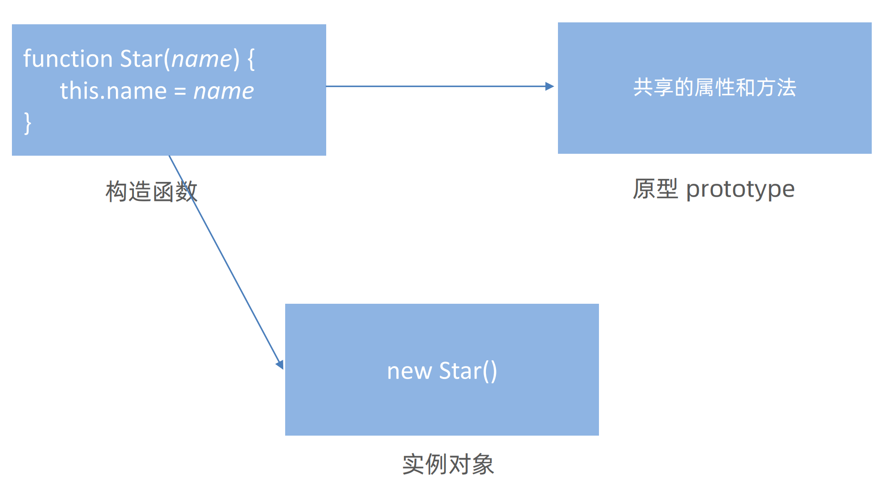
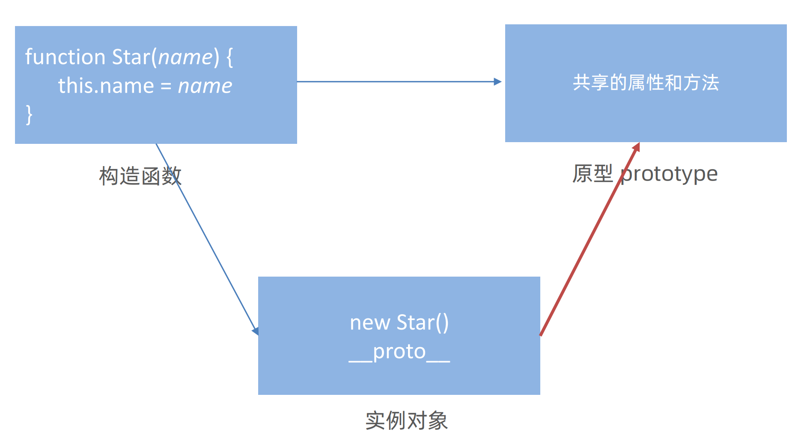
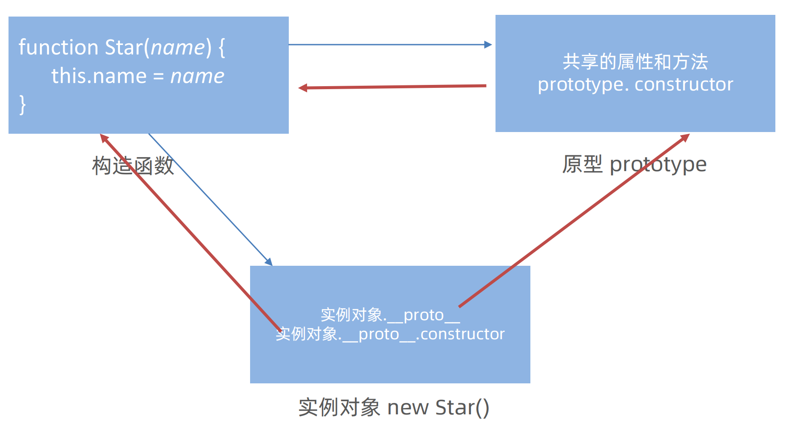

# 对象原型(`__proto__`)
构造函数可以创建实例对象，构造函数还有一个原型对象，一些公共的属性或者方法放到这个原型对象身上
但是 为啥实例对象可以访问原型对象里面的属性和方法呢？

**对象都会有一个属性 `__proto__` **指向构造函数的 prototype 原型对象，之所以我们对象可以使用构造函数 prototype  

原型对象的属性和方法，就是因为对象有 `__proto__` 原型的存在

-   `__proto__`是JS非标准属性
    -   所以部分浏览器中对象原型并非使用  `__proto__` 表示
-   [[prototype]] 和 `__proto__`意义相同 
-   `__proto__`用来表明当前实例对象指向哪个原型对象prototype
    -   注意！！！  `__proto__` 是只读的
-    `__proto__`对象原型里面也有一个 constructor属性，**指向创建该实例对象的构造函数**

