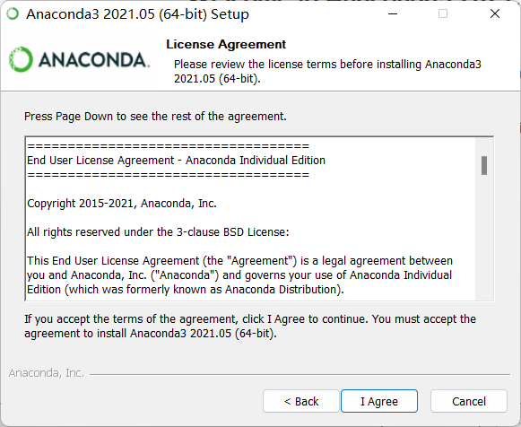
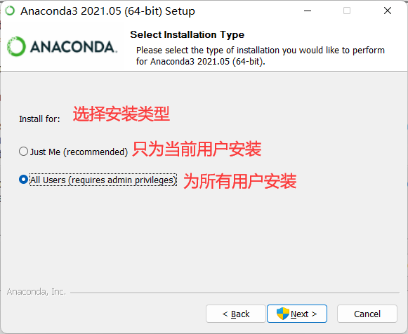
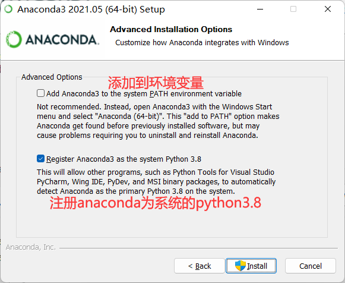

# Anaconda与PySpark安装

下面我们为 Windows平台安装Anaconda 与 PySpark标准类库

1、双击Anaconda安装包


2、点击 Next


3、点击 I Agree



4、选择安装类型，并点击Next



5、选择安装路径，并点击 Next


6、点击Install



7、点击Next


8、再次点击Next


9、Next （可以去掉打勾项）


9、配置国内源

找到 Anaconda Prompt，并双击打开它


找到当前用户的家目录，并在下面创建 `.condarc` 文件


将国内源粘贴到 `.condarc`文件下

```txt
channels:
  - defaults
show_channel_urls: true
channel_alias: https://mirrors.tuna.tsinghua.edu.cn/anaconda
default_channels:
  - https://mirrors.tuna.tsinghua.edu.cn/anaconda/pkgs/main
  - https://mirrors.tuna.tsinghua.edu.cn/anaconda/pkgs/free
  - https://mirrors.tuna.tsinghua.edu.cn/anaconda/pkgs/r
  - https://mirrors.tuna.tsinghua.edu.cn/anaconda/pkgs/pro
  - https://mirrors.tuna.tsinghua.edu.cn/anaconda/pkgs/msys2
custom_channels:
  conda-forge: https://mirrors.tuna.tsinghua.edu.cn/anaconda/cloud
  msys2: https://mirrors.tuna.tsinghua.edu.cn/anaconda/cloud
  bioconda: https://mirrors.tuna.tsinghua.edu.cn/anaconda/cloud
  menpo: https://mirrors.tuna.tsinghua.edu.cn/anaconda/cloud
  pytorch: https://mirrors.tuna.tsinghua.edu.cn/anaconda/cloud
  simpleitk: https://mirrors.tuna.tsinghua.edu.cn/anaconda/cloud
```

10、创建虚拟环境
重新打开 Anaconda Prompt ，并输入如下命令s


该命令的目的是为了创建一个名为 pyspark的虚拟环境

安装成功就是以下画面


如果出现了如下错误，只需要去anaconda安装目录修改用户对该目录有完全控制权限即可


10、切换虚拟环境
使用下面命令切换虚拟环境


11、安装PySpark、以及后续可能用的的包


看到 Successfully等信息说明安装成功