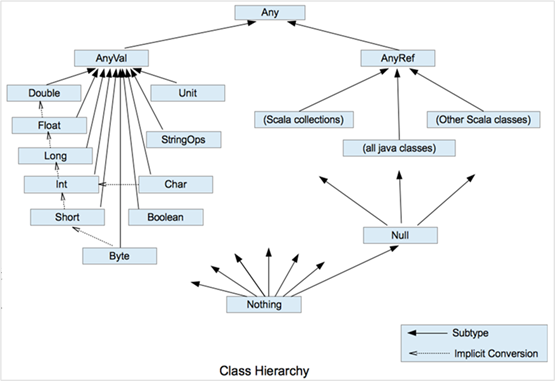

# Scala变量与数据类型

## 注释

​**Scala注释使用和Java完全一样**。注释是一个程序员必须要具有的良好编程习惯。将自己的思想通过注释先整理出来，再用代码去体现。

- 单行注释
- 多行注释
- 文档注释

```scala
def main(args: Array[String]): Unit = {
    // 单行注释

    /*
        多行注释
    */

    /**
     * doc注释
     */
}
```

## 变量与常量

常量：在程序执行的过程中，其值不会被改变的变量

Java中变量与常量的语法

- 变量类型 变量名称 = 初始值 `int a = 10`
- final 常量类型 常量名称 = 初始值  `final int b = 20`

Scala中变量与常量的语法

- var 变量名 [: 变量类型] = 初始值 `var i: Int = 10`
- val  常量名 [: 常量类型] = 初始值 `val j: Int = 20`

:::tip
`[: 变量类型]` 中的`[]` 表示是可选的，Scala会推导出变量的类型
:::

:::warning 注意
​**能用常量的地方尽量不用变量**

（1）声明变量时，类型可以忽略，编译器自动推导，即类型推导【这里这不是绝对的，如果推导不出来，还是要手动加上类型】

（2）**类型确定后，就不能修改**，说明**Scala是强类型语言**

（3）**变量声明时，必须要有初始值**

（4）在声明/定义一个变量时，可以使用 var 或 val 来修饰，**var**修饰的变量**可改变**，**val**修饰的变量**不可改变**。
:::

```scala
package com.clear.chapter02

object Test01_Variable {
  def main(args: Array[String]): Unit = {
    // 声明变量的通用语法
    var a: Int = 10

    //（1）声明变量时，类型可以忽略，编译器自动推导，即类型推导
    var a1 = 10
    val b1 = 20

    //（2）类型确定后，就不能修改，说明 Scala是强类型语言
    var a2 = 15
    // a2 = "hello" 非法，常量不能修改

    //（3）变量声明时，必须要有初始值
    // var a3: Int  非法

    //（4）在声明/定义一个变量时，可以使用 var 或 val 来修饰，var修饰的变量可改变，val修饰的变量不可改变。
    a1 = 12
    // b1 = 21 非法，常量不可改变
  }
}
```

## 标识符的命令规范

Scala 对各种变量、方法、函数等命名时使用的字符序列称为标识符。

**命名规则**

​	Scala在的标识符声明，**基本和Java是一致的**，但是细节上会有所变化，有以下三种规则

​	（1）以字母或者下划线开头，后接字母、数字、下划线

​	（2）以操作符开头，且只包含操作符（+ - * / # $ 等）

​	（3）用反引号 \`...\`包括的任意字符串，即使是Scala关键字（39个）也可以

:::warning
`$`开头的标识符为保留的 Scala 编译器产生的标志符使用，应用程序应该避免使用`$`开始的标识符，以免造成冲突
:::

```scala
package com.clear.chapter02

object Test03_Identifier {
  def main(args: Array[String]): Unit = {
    // （1）以字母或者下划线开头，后接字母、数字、下划线
    val hello: String = ""
    val _hello: String = ""
    // val 123hello: String = "" 非法，不能以数字开头
    // val h-b = "" 非法

    //（2）以操作符开头，且只包含操作符（+ - * / # $ 等）
    val +-*# = ""
    // val +s3 = "" 非法

    //（3）用反引号 `...`包括的任意字符串，即使是Scala关键字（39个）也可以
    // val try: String = "" 非法
    var `try`: String = ""
  }
}
```


### Scala中的关键字

- `package`、`import`、`class`、**`object`**、**`trait`**、`extends`、**`with`**、`type`、`for`
- `private`、`protected`、`abstract`、**`sealed`**、`final`、**`mplicit`**、`lazy`、`override`
- `try`、`catch`、`finally`、`throw`
- `if`、`else`、**`match`**、`case`、`do`、`while`、`for`、`return`、**`yield`**
- **`def`、`val`、`var`**
- `this`、`super`
- `new`

:::danger 

Scala是完全面向对象的编程语言，没有`break`、`continue`等关键字

Scala中`yield`关键字与线程没有关系，不要理解成与Java一致的

:::


## 字符串

​	在 Scala 中，字符串的类型实际上就是 Java中的 String类，它本身是没有 String 类的。

​	在 Scala 中，String 是一个不可变的字符串对象，所以该对象不可被修改。这就意味着你如果修改字符串就会产生一个新的字符串对象。

```scala
object ScalaString {
    def main(args: Array[String]): Unit = {
        val name : String = "scala"
        val subname : String = name.substring(0,2)
    }
}
```

### 字符串连接

基本语法

- 字符串，通过`+`号连接

```scala
object ScalaString {
    def main(args: Array[String]): Unit = {
        val name: String = "alice"
        val age: Int = 18
        // 字符串连接
        println(name + age)

        // * 用于将一个字符串复制多次并拼接（与python用法一致）
        println(name * 3)
    }
}
```

### 传值字符串

基本语法

- printf 用法：字符串通过 `%` 传值

```scala
object ScalaString {
    def main(args: Array[String]): Unit = {
        val name: String = "alice"
        val age: Int = 18

        // 传值字符串(格式化字符串)
        printf(s"%d岁的%s好美\n", age, name)
    }
}
```

### 插值字符串

基本语法

- 字符串模板（插值字符串）：通过 `$` 获取变量值

```scala
object ScalaString {
    def main(args: Array[String]): Unit = {
        val name: String = "alice"
        val age: Int = 18
        
        // 插值字符串
        // 将变量值插入到字符串
        println(s"${age}岁的${name}好美")

        val num: Double = 2.3456
        println(f"The num is ${num}%2.2f") // 格式化模板字符串
        println(raw"The num is ${num}%2.2f") // 将字符串原样输出
        
    }
}
```

### 多行字符串

基本语法

- 多行格式化字符串，用三引号表示，保持多行字符串原格式输出

```scala

object ScalaString {
    def main(args: Array[String]): Unit = {
        // 多行格式化字符串
        // 在封装JSON或SQL时比较常用
        // | 默认顶格符
        println(
                    s"""
                      | Hello
                      | ${name}
        """.stripMargin)

        val sql =
            s"""
                |select *
                |from
                |  student
                |where
                |  name = ${name}
                |and
                |  age > ${age}
                |""".stripMargin
        println(sql) 
    }
}
```


## 输入输出

###  输入

基本用法

​	`StdIn.readLine()`、`StdIn.readShort()`、`StdIn.readDouble()`

从屏幕（控制台）中获取输入

```scala
object ScalaIn {
    def main(args: Array[String]): Unit = {
        // 标准化屏幕输入
        val age : Int = scala.io.StdIn.readInt()
        println(age)
    }
}
```

从文件中获取输入

```scala
object ScalaIn {
    def main(args: Array[String]): Unit = {
        // 请注意文件路径的位置
        scala.io.Source.fromFile("input/user.json").foreach(
            line => {
                print(line)
            }
        )
        scala.io.Source.fromFile("input/user.json").getLines()
    }
}
```

### 输出

Scala进行文件写操作，用的都是 java中的I/O类

```scala
import java.io.{File, PrintWriter}
import scala.io.Source

object ScalaOut {
    def main(args: Array[String]): Unit = {
      val writer = new PrintWriter(new File("output/test.txt" ))
      writer.write("Hello Scala")
      writer.close()
    }
}
```

### 网络IO

Scala进行网络数据交互时，采用的也依然是 java中的I/O类

```scala
object TestServer {
    def main(args: Array[String]): Unit = {
        val server = new ServerSocket(9999)
        while ( true ) {
            val socket: Socket = server.accept()
            val reader = new BufferedReader(
                new InputStreamReader(
                    socket.getInputStream,
                    "UTF-8"
                )
            )
            var s : String = ""
            var flg = true
            while ( flg  ) {
                s = reader.readLine()
                if ( s != null ) {
                    println(s)
                } else {
                    flg = false
                }
            }
        }
    }
}

...

object TestClient {
    def main(args: Array[String]): Unit = {
        val client = new Socket("localhost", 9999)
        val out = new PrintWriter(
            new OutputStreamWriter(
                client.getOutputStream,
                "UTF-8"
            )
        )
        out.print("hello Scala")
        out.flush()
        out.close()
        client.close()
    }
}
```

## 数据类型

Scala与Java有着相同的数据类型，但是又有不一样的地方

### Java数据类型

Java的数据类型包含基本类型和引用类型

-   基本类型：byte, short, char, int, long, float, double, boolean
-   引用类型：Object，数组，字符串，包装类，集合，POJO对象等

:::tip
​	由于Java有基本类型，而且基本类型不是真正一样上的对象，即使后面产生了基本类型的包装类，但是仍然存在基本数据类型，所以Java语言并不是真正意思上的面向对象
:::

Java基本类型的包装类：Byte、Character、Short、Integer、Long、Float、Double、Boolean

:::warning
注意：

​	Java中基本类型和引用类型没有共同的祖先
:::


### Scala数据类型

**Scala是完全面向对象的语言**，所以**不存在基本数据类型**的概念，有的只是任意值对象类型（`AnyVal`）和任意引用对象类型（`AnyRef`）



1）Scala中一切数据都是对象，都是Any的子类。

2）Scala中数据类型分为两大类：数值类型（`AnyVal`）、引用类型（`AnyRef`），**不管是值类型还是引用类型都是对象**

3）Scala数据类型仍然遵守，低精度的值类型向高精度值类型，自动转换（**隐式转换**）

4）Scala中的 `StringOps` 是对Java中 String 的增强

5）`Unit`：对应Java中的void，用于方法返回值的位置，表示方法没有返回值。**Unit是一个数值类型**，只有一个对象就是`()`。Void不是数据类型，只是一个关键字

6）**Null是一个类型**，只有一个对象就是null。**它是所有引用类型（`AnyRef`）的子类。**

7）**`Nothing`，是所有数据类型的子类**，主要用在一个函数没有明确返回值时使用，因为这样我们可以把抛出的返回值，返回给任何的变量或者函数。


#### 整数类型（Byte、Short、Int、Long）

Scala的整数类型就是存放整数值的，比如 13、30、2456等

| 数据类型  | 描述                                                         |
| --------- | ------------------------------------------------------------ |
| Byte [1]  | 8位有符合补码整数。数值区间为 -128 到 127                    |
| Short [2] | 16位有符合补码整数。数值区间为 -32768 到 32767               |
| Int [4]   | 32位有符合补码整数。数值区间为 -2147483648 到 2147483647     |
| Long [8]  | 64位有符合补码整数。数值区间为 -9223372036854775808 到 9223372036854775807即2的(63-1)的次方 -1 |

#### 字符类型（Char）

基本说明

​	字符类型可以表示单个字符，字符类型是Char

​	字符常量是用单引号 '' 括起来的单个字符

```scala
val c1: Char = 'a'
val c2: Char = '9'
val c3: Char = '\t'  // 制表符

// 字符变量底层保存ASCII码
```

#### 布尔类型（Boolean）

```scala
val isTrue: Boolean = true
```

#### Unit、Null、Nothing类型

| 数据类型 | 描述                                                         |
| -------- | ------------------------------------------------------------ |
| Unit     | 表示无值，和其他语言中的 void 等同。用作不放会任何结果的方法的结果类型。**Unit只有一个实例值，写成 ()** |
| Null     | null，**Null类型只有一个实例值 null**                        |
| Nothing  | Nothing类型是Scala的类层级最低端；**它是任何其他类型的子类型**。当一个函数，我们确定没有正常的返回值，可以用Nothing 来知道返回类型，这样有一个好处，就是我们可以把返回的值（异常）赋给其他的函数或者变量（兼容性） |

```scala
// 空类型
// 空值Unit
def m1(): Unit = {
    println("m1被调用")
}

val a = m1()
println(a)  // ()

// 空引用
val n: Int = null // 会报错
var student = new Student("alice"，20)
studnet = null

// Nothing
def m2(n: Int): Nothing = { // 该方法不会正常返回
    throw new NullPointerExceotion
} 

def m3(n: Int): Int = {
    if (n == 0)
        throw new NullPointerExceotion
    else
        return n
} 
```


## 类型转换

### 自动类型转化（隐式转换）

基本说明

（1）自动提升原则：有多种类型的数据混合运算时，系统首先**自动将所有的数据转换成精度最大的那种数据类型，然后再进行计算**

```scala
val a1: Byte = 10
val b1: Long = 234
val result1: Long = a1 + b1
val result2: Int = a1 + b1.toInt
```

（2）**把精度大的数值类型赋值给精度小的数值类型时，就会报错**，反之就会进行自动类型转换

```scala
val a1: Byte = 10
val b1: Int = a1  // 低转高，自动类型转换
val c1: Byte = b1  // 报错，Int => Byte 不行
```

（3）（byte、short）和 char 之间不会相互自动转换

```scala
val a1: Byte = 10
val b1: Char = a1  // 报错
val c1: Byte = b1  // 报错
val c2: Byte = b1.toByte
```

（4）byte、short、char它们三者可以计算，在**计算时首先转为为Int类型**

```scala
val a1: Byte = 10
val b1: Short = 20
val c1: Char = 'c'

val result1: Short = a1 + b1  // 报错
val result2: Int = a1 + b1 
val result3: Int = a1 + b1 + c1  
```

### 强制类型转化

基本说明

​	自动类型转换的逆过程，将精度大的数值类型转换为精度小的数值类型。使用时要加上强制转函数，但可能造成精度降低或溢出。

（1）将数据**由高精度转换为低精度**，就需要使用到**强制类型转换**

（2）强制符合只针对最近的操作数有效，往往会使用小括号提升优先级

:::code-group
```java [Java强制类型转换]
int a = 10;
byte b = (byte)a;
```

```scala [Scala强制类型转换]
var a : Int = 10
Var b : Byte = a.toByte
val num: Int = 2.5.toInt
```

:::

:::tip
基本上Scala的`AnyVal`类型之间都提供了相应转换的方法
:::

### 字符串类型转化

scala是完全面向对象的语言，**所有的类型都提供了toString方法**，可以直接转换为字符串

```scala
lon.toString
```

任意类型都提供了和字符串进行拼接的方法

```scala
val i = 10
val s = "hello " + i
```

