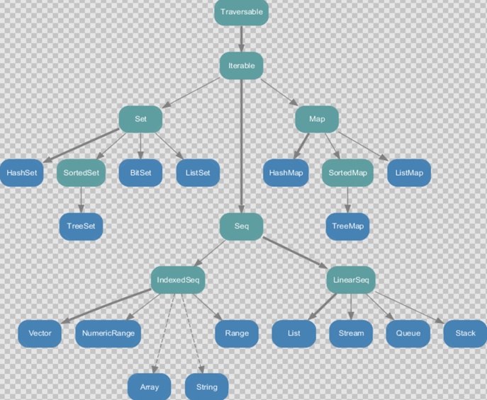

# Scala集合

## 回顾Java集合体系

在Java中，集合有三大类：`List`、`Set`、`Map`

`List`、`Set`有一个公共的父接口`Collection`，`Collection`在英文中是集合的意思，从直觉才讲它应该是所有集合的根接口，但是实际上并不是

`Map`比较特殊，它里面存储的是键值对，它不属于`Collection`体系

`Map`可以调用方法将键转换为`Collection`集合，值转换为`Collection`集合

:::warning

正是因为Java中的集合体系不是很合理，所以Scala重新设计了集合体系

:::

## 1 集合简介


Scala的集合有三大类：**序列`Seq`、集`Set`、映射`Map`**，所有的集合都扩展自`Iterable`特质。

对于几乎所有的集合类，Scala都同时提供了**可变**和**不可变**的版本

- 不可变集合：`scala.collection.immutable`
- 可变集合：`scala.collection.mutable`

:::tip
集合类的可变与不可变不是通过类型体系中继承关系实现的，而是通过放在不同的包下区分的

因此有些集合，可变与不可变名称是一样的，但是所在的包不同
:::

Scala不可变集合，就是指该集合对象本身不可改变，每次修改就会返回一个新对象，而不会对原对象进行修改。类似于java的String对象

可变集合，就是这个集合可以直接对原对象进行修改，而不回返回新对象。类似于java中的StringBuilder

:::warning 建议
在操作集合的时候，不可变用符号（符号在Scala底层也是方法调用），可变用方法
:::

### 不可变集合继承图



- `Set`、`Map`是Java中也有的集合

- `Seq`是Java没有的，我们发现`List`归属到`Seq`了，因此这里的List就和Java不是同一个概念了

- 我们前面的for循环有一个 1 to 3，就是`IndexedSeq`下的`Range`

- `String`、`Array`也是属于`IndexedSeq`

:::tip
在继承图中，可以发现它们与`IndexedSeq`是通过虚线指向的

因为`String`、`Array`并不直接继承自`IndexedSeq`，而是通过隐式转换的方式实现的（隐式转换规则在`Predef.scala`中）

:::

- 我们发现经典的数据结构比如`Queue`和`Stack`被归属到`LinerSeq`

- 注意Scala中的`Map`体系有一个`SortedMap`，说明Scala的`Map`可以支持排序

**`IndexedSeq`和`LinearSeq`的区别**

（1）`IndexSeq`是通过索引来查找和定位，因此速度快，比如String就是一个索引集合，通过索引即可定位

（2）`LinearSeq`是线型的，即有头尾的概念，这种数据结构一般是通过遍历来查找

### 可变集合继承图


## 2 数组

### 2.1 不可变数组

不可变指的是引用地址、数组长度不可改变，但是我们**可以修改**指定索引位置的**元素**

基本语法

:::code-group

```scala
// 数组的定义
val arr01 = new Array[Int](10)
```

```scala [伴生对象创建集合.scala]
// 伴生对象类似于工厂方法的感觉
// 因为伴生对象可以访问到Array类中的所有私有方法，所以可以创建数组方法
val arr01 = Array.apply(12, 13, 58, 99)

// 简写为
val arr01 = Array(12, 13, 58, 99)
```

:::

说明

- `new` 是关键字
- `[Int]` 表示该数组只能存放Int类型数据，想要存放任意类型，可以指定为`Any`
- (10)，表示数组的大小，确定后就不可以改变【不可变集合的体现】

演示：

```scala
object ImmutableArray {
    def main(args: Array[String]): Unit = {
        // 1.创建数组
        val arr: Array[Int] = new Array[Int](10)
        // 另一种创建方式
        val arr2 = Array(12, 13, 58, 99) // 其实是通过Array类的伴生对象中apply方法创建

        // 2.访问元素
        println(arr2(0))
        println(arr2(1))
        // println(arr2(5))  // ArrayIndexOutOfBoundsException

        // 3.数组赋值
        // 3.1 修改某个元素的值
        println(arr2) // [I@3ac3fd8b
        arr2(1) = 99 // 修改数组中元素的值后，数组引用不会改变
        // arr2(1) todo 本质上是arr2.apply(1) 编译器是这么做的，但是我们不能怎么写
        println(arr2) // [I@3ac3fd8b

        // 3.2 采用方法的形式修改数组的值
        arr2.update(0, 1)

        // 4.数组遍历
        // 4.1 查看数组
        println(arr2.mkString(", ")) // 1, 99, 58, 99
        // 4.2 普通for循环遍历
        for (i <- 0 until arr2.length) { // until表不包含边界
            println(arr2(i))
        }
        for (i <- arr2.indices) { // indices的返回值就是 0 until arr2.length
            println(arr2(i))
        }
        // 4.2 增强for Java中的增加for就是借鉴Scala的
        for (e <- arr2) {
            println(e)
        }
        // 4.3 简化遍历：迭代器
        val iterator = arr2.iterator
        while (iterator.hasNext) {
            printx(iterator.next())
        }

        // 4.4 foreach
        def printx(e: Int): Unit = {
            println(e)
        }

        arr2.foreach(printx)
        // lambda简化
        arr2.foreach((e: Int) => println(e))
        arr2.foreach((e) => println(e))
        arr2.foreach(println(_))
        arr2.foreach(println)  // 方法调用

        // 5.添加元素：会改变数组引用
        // def :+ [B >: A : ClassTag](x: B): Array[B]
        val newArr = arr2.:+(6)   // 在数组末尾添加元素
        println(newArr.mkString("-"))  // 1-99-58-99-6
        println(arr2)  // [I@3ac3fd8b
        println(newArr)  // [I@26f67b76

        // 在数组最前面添加元素
        val newArr2 = newArr.+:(10)
        println(newArr2.mkString("-"))  // 10-1-99-58-99-6

        // 简写
        val newArr3 = newArr2 :+ 15
        //    val newArr4 = newArr3 +: 20
        // 在Scala中方法调用时，方法名称最后为:，则如下(从右到左)
        val newArr4 = 20 +: newArr3
        println(newArr4.mkString("-"))  // 20-10-1-99-58-99-6-15
        val newArr5 = 10 +: 20 +: newArr4 :+ 8 :+ 9
        println(newArr5.mkString("-"))  // 10-20-20-10-1-99-58-99-6-15-8-9

        // 6.多维数组
        var myMatrix = Array.ofDim[Int](3, 3)
        // 访问元素
        myMatrix(0)(1)
        // 遍历
        for (i <- 0 until myMatrix.length; j <- 0 until myMatrix(i).length ){
            println(myMatrix(i)(j))
        }
        for (i <- myMatrix.indices; j <- myMatrix(i).indices ){
            print(myMatrix(i)(j) + "\t")
            if (j == myMatrix(i).length-1) println()
        }
        myMatrix.foreach(line => line.foreach(println))
        myMatrix.foreach(_.foreach(println))
    }
}
```

:::tip
`arr2(0)`、`arr2(1)`等的底层实际上是调用了`Array`类的`apply()`方法，注意不是伴生对象里的`apply()`方法

编译器在编译时，会将`arr2(0)`转换为`arr2.apply(0)`【我们无法直接调用，由编译器完成】

看`apply()`的方法注释也可以看到


`arr2(1) = 99`的底层实际上是调用了`Array`类的`update()`方法，与上面同理

:::


### 2.2 可变数组

ArrayBuffer需要引入`scala.collection.mutable.ArrayBuffer`

ArrayBuffer是有序的集合

演示：

```scala
import scala.collection.mutable.ArrayBuffer

object ArrayBufferTest {
  def main(args: Array[String]): Unit = {
    // 1.创建可变数组
    val arr: ArrayBuffer[Int] = new ArrayBuffer[Int]()
    // 另一种方式：使用ArrayBuffer类的伴生对象中的apply方法创建
    val arr2 = ArrayBuffer(23, 24, 25)

    println(arr) // ArrayBuffer()
    println(arr2) // ArrayBuffer(23, 24, 25)

    // 2.访问元素
    println(arr2(0))

    // 3.增加数据：可变类型，不会改变引用
    // 使用 +=:
    77 +=: arr2
	// 推荐使用append方法()，支持可变参数
    arr2.append(1, 2, 3, 4)
    arr2.prepend(6)
    arr2.insert(2,20)
    arr2.insertAll(3,arr)
    println(arr2)  // ArrayBuffer(6, 77, 20, 23, 24, 25, 1, 2, 3, 4)
    //

    // 4.修改数据：可变类型，不会改变引用
    arr2.update(0, 5)
    arr2(1) = 6

    // 5.删除数据
    // 按照索引删除
    val i: Int = arr2.remove(2)
    arr2.remove(2, 2)
    // 按照元素删除
    arr2 -= 10  // 如果ArrayBuffer中没有该元素，则不会删除
    arr2 -= 13
  }
}
```

### 2.3 可变数组和不可变数组转换

```scala
// 可变数组转换为不可变数组
val arrayBuffer:ArrayBuffer[Int] = ArrayBuffer(10,20,30)
val array: Array[Int] = arrayBuffer.toArray
println(arrayBuffer)  // ArrayBuffer(10, 20, 30)
println(array.mkString(","))  // 10,20,30
// 不可变数组转换为可变数组
val buffer: mutable.Buffer[Int] = array.toBuffer
println(buffer)  // ArrayBuffer(10, 20, 30)
```


## 3 **Seq集合**

### 3.1 不可变List

说明

-   List默认为不可变集合
-   List（数据有顺序，可重复）
-   合并List：将一个整体拆成一个一个的个体，称为扁平化
-   Nil空List

```scala
object ListTest {
    def main(args: Array[String]): Unit = {
        // 1.创建一个List（数据有顺序，可重复）
        val list = List(23, 23, 25)
        // 2.访问、遍历元素
        println(list(1))
        list.foreach(println)
        // 3.添加元素
        val list2 = 10 +: list  // 添加元素到第一个位置
        val list3 = list :+ 10  // 添加元素到末尾
        println(list2) // List(10, 23, 23, 25)
        println(list3) // List(23, 23, 25, 10)
        // 使用 :: 运算规则从右向左
        val list4 = list.::(5) // 我们比较少用 :: 添加元素
        println(list4) // List(5, 23, 23, 25)
        // 而是使用 :: 创建List
        val list5 = Nil.::(13)
        println(list5) // List(13)
        val list6 = 13 :: Nil
        println(list6) // List(13)
        val list7 = 1 :: 2 :: 3 :: 4 :: Nil  // 从右到左依次添加
        println(list7)  // List(1, 2, 3, 4)
        // 合并
        val list8 = list6 :: list7
        println(list8)  // List(List(13), 1, 2, 3, 4)
        // 合并列表：将一个整体拆成一个一个的个体，称为扁平化
        val list9 = List(1,2) ::: List(3,4)
        println(list9)  // List(1, 2, 3, 4)
        // ++ 等同于 :::
        val list10 = List(1,2) ++ List(3,4)
        println(list10)  // List(1, 2, 3, 4)
    }
}
```

### 3.2 可变List

ListBuffer需要引入`scala.collection.mutable.ListBuffer`

```scala
import scala.collection.mutable.ListBuffer

object ListBufferTest {
    def main(args: Array[String]): Unit = {
        // 1，创建ListBuffer
        val list1: ListBuffer[Int] = new ListBuffer[Int]()
        // Java中我们常使用new的方式，Scala中建议使用伴生对象的apply方法创建
        val list2 = ListBuffer(23, 24, 25)

        // 2.添加元素
        list2.append(15, 10)
        list2.prepend(20)
        list2.insert(1, 30)
        println(list2) // ListBuffer(20, 30, 23, 24, 25, 15, 10)

        31 +=: 32 +=: list1 += 25 += 26
        println(list1) // ListBuffer(31, 32, 25, 26)
        // 3.合并list
        val list3 = list1 ++ list2
        println(list3)  // ListBuffer(31, 32, 25, 26, 20, 30, 23, 24, 25, 15, 10)
        list1 ++= list2
        println(list1)  // ListBuffer(31, 32, 25, 26, 20, 30, 23, 24, 25, 15, 10)
        println(list2)  // ListBuffer(20, 30, 23, 24, 25, 15, 10)

        // 4.修改元素
        list2(2)=88  // 这个底层就是调用update
        list2.update(1,99)
        println(list2)  // ListBuffer(20, 99, 88, 24, 25, 15, 10)
        // 5.删除元素
        list2.remove(2)
        list2 -= 99
        println(list2)  // ListBuffer(20, 24, 25, 15, 10)
    }
}
```

### 3.3 可变集合和不可变集合转换

```scala
import scala.collection.mutable
import scala.collection.mutable.ListBuffer
object ScalaCollection{
    def main(args: Array[String]): Unit = {

        val buffer = ListBuffer(1,2,3,4)
        val list = List(5,6,7,8)

        // 可变集合转变为不可变集合
        val list1: List[Int] = buffer.toList
        // 不可变集合转变为可变集合
        val buffer1: mutable.Buffer[Int] = list.toBuffer
    }
}
```

## 4 Set集合

默认情况下，Scala使用的是不可变集合，如果你想使用可变集合，需要引用 `scala.collection.mutable.Set` 包

### 4.1 不可变Set

说明

-   Set默认是不可变集合，数据无序
-   数据不可重复

演示：

```scala
object ImmutableSet {
    def main(args: Array[String]): Unit = {
        // 1.创建Set：不可重复、无序
        val set = Set(1,2,3,3,4,4)
        println(set)  // Set(1, 2, 3, 4)
        // 2.添加元素
        val set2 = set.+(20)
        val set3 = set2 + 30
        println(set3)  // HashSet(20, 1, 2, 3, 30, 4)
        // 3.合并Set
        val set4 = Set(1,2,3)
        val set5 = Set(4,5,6)
        val set6 = set4 ++ set5
        println(set6)  // HashSet(5, 1, 6, 2, 3, 4)
        // 4.删除元素
        val set7 = set6 - 6
        println(set7)  // HashSet(5, 1, 2, 3, 4)
    }
}
```

### 4.2 可变Set

演示：

```scala
import scala.collection.mutable

object MutableSet {
    def main(args: Array[String]): Unit = {
        // 1.创建可变Set
        val set: mutable.Set[Int] = mutable.Set[Int](1, 3, 5, 7)
        println(set)  // HashSet(1, 3, 5, 7)

        // 2.添加元素
        val set2 = set + 10
        println(set2)  // HashSet(1, 10, 3, 5, 7)
        set2 += 11
        println(set2)  // HashSet(1, 3, 5, 7, 10, 11)
        set2.add(13)  // 可变类型建议使用这种方式
        println(set2)  // HashSet(1, 3, 5, 7, 10, 11, 13)

        // 3.删除元素
        set2 -= 13
        println(set2)  // HashSet(1, 3, 5, 7, 10, 11)
        set2.remove(11)
        println(set2)  // HashSet(1, 3, 5, 7, 10)

        // 4.合并两个可变Set
        val set3 = mutable.Set(1,2,3,4)
        val set4 = mutable.Set(3,4,5,7)
        val set5 = set3 ++ set4
        println(set5)  // HashSet(1, 2, 3, 4, 5, 7)
    }
}
```

## 5 Map集合

Map(映射)是一种可迭代的键值对（key/value）结构。所有的值都可以通过键来获取。Map 中的键都是唯一的。

Scala中的Map和Java类似，**也是一个散列表**，它存储的内容也是键值对（**key-value**）映射，Scala中**不可变的Map是有序的，可变的Map是无序的。**

### 5.1 不可变Map

**1）基本语法**

```scala
object MapTest {
    def main(args: Array[String]): Unit = {
        // 创建不可变集合map
        val map1: Map[String, Int] = Map("a" -> 1, "b" -> 2, "c" -> 3)
        val map2: Map[String, Int] = Map("c" -> 4, "d" -> 5, "e" -> 6)
        println(map1) // Map(a -> 1, b -> 2, c -> 3)
        println(map1.getClass) // class scala.collection.immutable.Map$Map3  Map3即该不可变map集合中有三个元素
        // 遍历元素
        map1.foreach((kv: (String, Int)) => println(kv))
        map1.foreach(println)

        // 取map中所有的key 或 value
        for (key <- map1.keys) {
            println(s"$key --> ${map1.get(key)}")
        }

        // 访问某一个key对应的value
        println(map1.get("a")) // Some(1) 被Option包装的value值
        println(map1.get("a").get) // 1
        // 如果不存在，获取默认值
        println(map1.getOrElse("c", 0)) // 3

        // 添加元素
        val map3 = map1 + ("d" -> 4)
        println(map1 eq map3) // false
        // 删除元素
        val map4 = map3 - "d"
        println(map4.mkString(","))  // a -> 1,b -> 2,c -> 3

        val map5: Map[String, Int] = map1 ++ map2
        println(map5 eq map1)   // false
        println(map5.mkString(",")) // e -> 6,a -> 1,b -> 2,c -> 4,d -> 5

        // 修改数据
        val map6: Map[String, Int] = map1.updated("b", 5)
        println(map6.mkString(","))   // a -> 1,b -> 5,c -> 3

    }
}
```

### 5.2 可变Map

**1）基本语法**

```scala
import scala.collection.mutable

object MutableMapTest {
  def main(args: Array[String]): Unit = {
    // 创建可变集合map
    val map1: mutable.Map[String, Int] = mutable.Map("a" -> 1, "b" -> 2, "c" -> 3)
    val map2: mutable.Map[String, Int] = mutable.Map("c" -> 4, "d" -> 5, "e" -> 6)
    println(map1)   // HashMap(a -> 1, b -> 2, c -> 3)
    println(map1.getClass) // class scala.collection.mutable.HashMap
    // 遍历元素
    map1.foreach((kv: (String, Int)) => println(kv))
    map1.foreach(println)

    // 添加元素
    map1.put("f",5)
    map1 += (("g",6))

    // 删除元素
    map1.remove("f")
    map1 -= "g"

    // 修改元素
    map1.update("a",6)
    map1 += (("c",9))

    // 合并两个Map
    map1 ++= map2
    println(map1) // HashMap(a -> 6, b -> 2, c -> 4, d -> 5, e -> 6)
    println(map2) // HashMap(c -> 4, d -> 5, e -> 6)
  }
}
```

## 6 元组

在Scala语言中，我们可以将多个无关的数据元素封装为一个整体，这个整体我们称之为：元素组合，简称元组。有时也可将元组看成容纳元素的容器，其中最多只能容纳22个

演示

```scala
object TupleTest {
    def main(args: Array[String]): Unit = {
        // 创建元组，使用小括号
        val tuple: Tuple3[Int, String, Int] = (1, "zhangsan", 30)

        // 根据顺序号访问元组的数据
        println(tuple._1)
        println(tuple._2)
        println(tuple._3)

        // 遍历元组数据
        // a.返回迭代器
        val iterator: Iterator[Any] = tuple.productIterator
        // b.遍历
        for (e <- iterator) {
            println(e)
        }
        // 根据索引访问元组
        val value: String = tuple.productElement(1).toString

        // 嵌套元组
        val mylTuple = (10, 5, "hello", ("hello", 1))
        println(mylTuple)
        println(mylTuple._4._1)  // hello

        // 如果元组的元素只有两个，那么我们称之为 todo 对偶元组，也称之为键值对
        val kv1: (String, Int) = ("a", 1)
        val kv2: (String, Int) = "a" -> 1
        println(kv1 eq kv2)  // false
    }
}
```

## 7 队列

Scala也提供了队列（Queue）的数据结构，队列的特点就是**先进先出**。

进队和出队的方法分别为 enqueue 和dequeue。

演示：

```scala
object QueueTest {
    def main(args: Array[String]): Unit = {
        // 创建队列（可变队列）
        val queue: mutable.Queue[String] = new mutable.Queue[String]()
        println(queue)

        // 添加元素：入队
        queue.enqueue("a", "b", "c")
        println(queue)

        val que1: mutable.Queue[String] = queue += "d"
        println(queue eq que1)  // true

        // 获取元素：出队
        println(queue.dequeue())
        println(queue.dequeue())
        println(queue.dequeue())
        println(queue)
    }
}
```


##  8 并行

Scala为了充分使用**多核CPU**，提供了并行集合（有别于前面的串行集合），用于多核环境的并行计算。

在Scala中，可以使用并行集合来实现并行计算。并行集合是一种特殊的集合类型，它可以将集合的操作并行化，以提高计算的效率。

Scala提供了`ParSeq`、`ParSet`和`ParMap`等并行集合类型，它们分别对应于Seq集合、Set集合和Map集合。这些并行集合类型可以通过在集合上调用`.par`方法来创建，并且可以使用与普通集合相同的操作方法。

下面是一个使用并行集合进行并行计算的示例：

演示：

```scala
package com.clear.collection.par

import scala.collection.parallel.CollectionConverters._

/**
 * 并行集合测试
 */
object ParTest {
    def main(args: Array[String]): Unit = {
        // 普通map
        val res1 = (1 to 10000).map{Thread.currentThread().getName}
        // 并行map
        val res2 = (1 to 10000).par.map{Thread.currentThread().getName}
    }
}
```

## 9 常用方法

### **1）常用方法**

```scala
/**
 * 集合通用操作
 */
object CommonOperation {
    def main(args: Array[String]): Unit = {
        val list = List(1, 3, 5, 7, 9, 88)
        val set = Set(23, 34, 45, 56)

        // 1.获取集合长度
        println(list.length)
        // 2.获取集合大小
        println(set.size)
        // 3.循环遍历
        for (elem <- list)
            println(elem)

        // 4.迭代器
        for (elem <- list.iterator) println(elem)

        // 5.生成字符串
        println(list) // List(1, 3, 5, 7, 9, 88)
        println(set) // Set(23, 34, 45, 56)
        println(list.mkString("==")) // 1==3==5==7==9==88

        // 6.是否包含
        println(list.contains(23))
        println(set.contains(23))
    }
}
```

### 2）衍生集合

```scala
package com.clear.collection.common

/**
 * 衍生集合
 */
object DerivedCollection {
    def main(args: Array[String]): Unit = {
        val list1 = List(1, 3, 5, 7, 9, 88)
        val list2 = List(3, 5, 7, 99, 111)


        // 1.获取集合的头
        println(list1.head) // 1
        // 2.获取集合的尾（不是头的都是尾）
        println(list1.tail) // List(3, 5, 7, 9, 88)
        // 3.获取集合的最后一个元素
        println(list1.last) // 88
        // 4.获取集合初始（不包含最后一个的集合）
        println(list1.init) // List(1, 3, 5, 7, 9)


        // 5.反转
        println(list1.reverse) // List(88, 9, 7, 5, 3, 1)
        // 6.取前（后）n个元素
        println(list1.take(3)) // List(1, 3, 5)
        println(list1.takeRight(4)) // List(5, 7, 9, 88)
        // 7.去掉前（后）n个元素
        println(list1.drop(3)) // List(7, 9, 88)
        println(list1.dropRight(4)) // List(1, 3)

        // 8.并集
        val union = list1.union(list2)
        println(union) // List(1, 3, 5, 7, 9, 88, 3, 5, 7, 99, 111)
        println(list1 ::: list2) // List(1, 3, 5, 7, 9, 88, 3, 5, 7, 99, 111)

        val set1 = Set(23, 34, 45, 56)
        val set2 = Set(23, 34, 78, 89)
        val union2 = set1.union(set2) // todo set集合自带去重
        println(union2) // HashSet(56, 78, 89, 23, 34, 45)
        // 9.交集
        val intersection: List[Int] = list1.intersect(list2)
        println(intersection) // List(3, 5, 7)
        // 10.差集
        val diff1 = list1.diff(list2)
        println(diff1) // List(1, 9, 88)
        val diff2 = list2.diff(list1)
        println(diff2) // List(99, 111)
        // 11.拉链
        // todo 两个集合对应位置组成一个对偶元组，多余的元素不构成二元组
        val zip = list1.zip(list2)
        println(zip)    // List((1,3), (3,5), (5,7), (7,99), (9,111))
        // 12.滑窗
        for (elem <- list1.sliding(2)){
            println(elem)
        }
    }
}
```

​        println("splitAt => " + list.splitAt(2))

​        // 滑动（窗口）

​        println("sliding => " + list.sliding(2))

​        // 滚动（没有重复）

​        println("sliding => " + list.sliding(2,2))

​        // 拉链

​        println("zip => " + list.zip(list1))

​        // 数据索引拉链

​        println("zipWithIndex => " + list.zipWithIndex)

​    }

}

### 3） 计算函数

#### 简单计算函数

```java
object SimpleComputerFunction {
  def main(args: Array[String]): Unit = {
    val list = List(5, 1, 2, 8, -2, 3, 4)
    val list2 = List(("a", 5), ("b", 1), ("c", 8), ("d", 2), ("e", -3), ("f", 4))
    // 求和
    // a)循环求和：代码简单但是繁琐
    var sum = 0
    for (elem <- list) {
      sum += elem
    }
    println(sum)
    // b)使用函数
    println(list.sum)


    // 求乘积
    println(list.product)

    // 求最大值
    println(list.max)
    println(list2.max) // 元组默认按照_1进行比较
    println(list2.maxBy(tuple => tuple._2)) // 使用Lambda表达式指定比较规则

    // 求最小值
    println(list.min)

    // 排序
    val sortedList = list.sorted
    println(sortedList)
    // 从大到小逆序排序
    println(list.sorted.reverse)
    // 传入隐射参数
    // todo 隐射参数：可有可无，如果不传入编译器会查找其他地方有隐射变量的定义直接使用
    println(list.sorted(Ordering[Int].reverse))
  }
}
```

#### 高级计算函数

```scala
package com.clear.collection.common

/**
 * 高级计算函数
 */
object HighComputerFunction {
  def main(args: Array[String]): Unit = {
    val list = List(1, 2, 3, 4, 5, 6, 7, 8, 9)
    // todo 过滤：遍历一个集合并从中获取满足指定条件的元素组成一个新的集合
    // 选取偶数
    val evenList = list.filter((elem: Int) => {
      elem % 2 == 0
    })
    println(evenList) // List(2, 4, 6, 8)

    // todo 转换/映射(map)：将集合中的每个元素映射到某一个函数
    // 将集合中的每个元素扩大2倍
    // val map2 = list.map(_ % 2)
    val map2 = list.map(elem => elem * 2)
    println(map2) // List(2, 4, 6, 8, 10, 12, 14, 16, 18)

    // todo 扁平化
    val nestedList: List[List[Int]] = List(List(1, 2, 3), List(4, 5), List(6, 7, 8, 9))
    val flatList = nestedList(0) ::: nestedList(1) ::: nestedList(2)
    println(flatList) // List(1, 2, 3, 4, 5, 6, 7, 8, 9)
    println(nestedList.flatten) // List(1, 2, 3, 4, 5, 6, 7, 8, 9)

    // todo 扁平化+映射：flatMap：相对于先进行map操作，在进行flatten操作
    val strings: List[String] = List("hello world", "hello spark", "hello scala")
    val splitString: List[Array[String]] = strings.map(string => string.split(" ")) // 分词
    val flattenString: List[String] = splitString.flatten // 扁平化
    println(flattenString) // List(hello, world, hello, spark, hello, scala)
    println(strings.flatMap(strings => strings.split(" "))) // 扁平映射  List(hello, world, hello, spark, hello, scala)

    // todo 分组group：按照指定的规则对集合的元素进行分组
    val groupMap = list.groupBy(elem => elem % 2)
    println(groupMap) // HashMap(0 -> List(2, 4, 6, 8), 1 -> List(1, 3, 5, 7, 9))
    val groupMap2 = list.groupBy(data => if (data % 2 == 0) "偶数" else "奇数")
    println(groupMap2) // HashMap(偶数 -> List(2, 4, 6, 8), 奇数 -> List(1, 3, 5, 7, 9))

    // todo 规约reduce
    println(list.reduce((x: Int, y: Int)=>{ x + y }))
    println(list.reduce((x, y)=>{ x + y }))
    println(list.reduce((x, y)=>( x + y )))
    println(list.reduce((x, y)=> x + y ))
    println(list.reduce(_+_))

    // 集合简化规约(左)
    println("reduceLeft => " + list.reduceLeft(_ + _))

    // 集合简化规约(右)
    println("reduceRight => " + list.reduceRight(_ + _))

    // todo 集合折叠
    println("fold => " + list.fold(0)(_ + _)) // fold => 45
    // 集合折叠(左)
    println("foldLeft => " + list.foldLeft(0)(_ + _)) // foldLeft => 45
    // 集合折叠(右)
    println("foldRight => " + list.foldRight(0)(_ + _)) // foldRight => 45

    // todo 集合扫描
    println("scan => " + list.scan(0)(_ + _)) // scan => List(0, 1, 3, 6, 10, 15, 21, 28, 36, 45)
    // 集合扫描(左)
    println("scanLeft => " + list.scanLeft(0)(_ + _)) // scanLeft => List(0, 1, 3, 6, 10, 15, 21, 28, 36, 45)
    // 集合扫描(右)
    println("scanRight => " + list.scanRight(0)(_ + _)) // scanRight => List(45, 44, 42, 39, 35, 30, 24, 17, 9, 0)

  }
}
```

 

### WordCount TopN 案例

word.txt

```
Hello Scala
Hello Spark
Hello Hadoop
```

代码实现：

```scala
import scala.io.Source

object WordCount {
  def main(args: Array[String]): Unit = {
    //    val bis = new BufferedInputStream(new FileInputStream("D:\\video\\workspace\\scala\\scala-demo\\src\\main\\scala\\com\\clear\\demo\\README.md"))
    //    val bytes = bis.readAllBytes()
    //    val str = bytes.toString
    //    println(str)

    val list: List[String] = Source.fromFile("src/main/scala/com/clear/demo/word.txt").getLines().toList
    val wordOneList: List[String] = list.flatMap(string => string.split(" "))

    val word2List: Map[String, List[String]] = wordOneList.groupBy(word => word)
    // 对分组后的list取长度，得到每个单词的个数
    val word2ListMap:Map[String,Int] = word2List.map(kv => (kv._1,kv._2.length))
    // 排序
    val sortList: List[(String, Int)] = word2ListMap
      .toList
      .sortWith(_._2 > _._2)
    println(sortList.take(3)) // List((Hello,3), (Scala,1), (Spark,1))
  }
}
```

  

