# Docker学习笔记

## 0 为什么会有Docker出现

-   Docker之所以发展如此迅速，就是因为他给出了开发中应用的部署过程中的出现的环境变量、版本、配置问题等问题的标准解决方案——**系统平滑移植，容器虚拟化技术。**
-   因为环境配置相对麻烦，换一台机器就得重新来一次，费时费力。很多人想到，能不能从根本上解决问题，软件可以带环境安装？也就是说，**安装的时候，把原始环境一模一样地复制过来**。

-   开发人员利用docker可以消除协作编码时“在不同机器上运行不一样”的问题。

-   传统上认为，软件编码开发/测试结束后，所产出的成果既是程序或能够编译执行的二进制字节码等（java为例）。
    -   而为了让这些程序可以顺利执行，开发团队也得准备完整的部署文件，让运维团队得以部署应用程序。
    -   开发需要清楚的告诉运维团队，用的全部配置文件+所有软件环境。不过。即便如此，仍然常常发生部署失败的情况。
    -   docker的出现**使得docker得以打破过去【程序即应用】的观念。透过镜像（images）将作业系统核心除外，运作应用程序所需要的系统环境，由下而上打包，达到应用程序跨平台间的无缝接轨运作。**

## 1 docker简介

Docker的思想就来源于集装箱！！！

-   docker是基于go语言实现的云开源项目
-   docker可以让开发者打包他们的应用以及依赖到一个轻量级、可移植的容器中，然后发布到任何流行的Linux机器上，也可以实现虚拟化技术。
-   docker的主要目标是“Build，Ship and Run Any App.Anywhere”，也就是通过对应用组件的封装、分发、部署、运行等生命周期的管理。使用户的APP（可以是一个web应用或数据库应用等）及其运行环境能做到**“一次镜像，处处运行”。**
-   **Linux容器技术的出现解决了这样一个问题，而docker就是在它的基础上发展过来的**。将应用打成镜像，通过镜像成为运行在docker容器上面的实例，而dockers容器在任何运行操作系统上都是一致的，这就是实现了跨平台、跨服务器。**只需要一次配置好环境，换到别的机子上就可以一键部署好，大大简化了操作。**

>    docker是完全使用==沙箱机制==，相互之间不会有任何接口，更重要的是容器性能开销极低

:::tip 总结
docker解决了**运行环境和配置问题**的软件容器，方便做持续集成并有助于整体发布的容器虚拟化技术。
:::


## 2 传统虚拟机和容器的对比

### 2.1 容器发展简史

-   虚拟化技术：**在2000年左右，虚拟化技术开始兴起**。虚拟化技术通过在物理服务器上创建多个虚拟机实例，使得多个应用程序可以在同一台服务器上运行，提高了服务器的利用率。
-   操作系统级虚拟化：在2000年代初，操作系统级虚拟化技术开始出现。这种虚拟化技术通过在操作系统层面上创建多个隔离的用户空间，每个用户空间可以运行一个应用程序，实现了更高的资源利用率和更快的启动时间。
-   Linux 容器：在2008年，Linux内核引入了一种称为cgroups（控制组）的功能，用于对进程进行资源限制和隔离。
    -   随后，**Docker公司在2013年发布了Docker容器引擎**（2013开源），将Linux容器技术进行了封装和简化，使得容器的创建、部署和管理变得更加简单和可靠。
-   容器生态系统的发展：随着Docker的流行，容器生态系统也得到了快速发展。许多公司和组织开始提供与容器相关的工具和服务，如Kubernetes、Mesos、OpenShift等，用于容器编排、管理和部署。
-   容器标准化：为了推动容器技术的发展和互操作性，容器标准化组织OCI（Open Container Initiative）成立于2015年，制定了容器运行时（runtime）和容器镜像（image）的标准规范。
-   容器云和边缘计算：随着云计算和边缘计算的发展，容器技术在云平台和边缘设备上得到了广泛应用。容器云平台如AWS ECS、Google Kubernetes Engine（GKE）、Microsoft Azure Container Instances等提供了强大的容器服务和管理工具。

总的来说，容器技术的发展经历了从虚拟化到操作系统级虚拟化，再到Linux容器的演进。随着Docker的出现和容器生态系统的发展，容器技术变得更加简单、可靠和流行，成为现代应用开发和部署的重要工具。

### 2.2 传统虚拟机技术

**虚拟机（virtual machine）就是带环境安装的一种解决方案**。它可以在一种操作系统里面运行另一种操作系统，比如在window10系统里面运行Linux系统CentOS7.应用程序对此毫无感知，因此虚拟机看上去跟真实系统一模一样，而对于底层系统来说，虚拟机就是一个普通文件，不需要了就删除，对其他部分毫无影响。这类虚拟机完美的运行了另一套系统，能够使应用程序程序，操作系统和硬件三者之间的逻辑不变。

传统虚拟机技术基于安装在操作系统上的虚拟机管理系统（如VirtualBox和VMware等），创建虚拟机（虚拟出各种硬件），在虚拟机上安装从操作系统，在从操作系统中安装部署各种应用。

**虚拟机缺点：**

- 1）资源占用多
- 2）冗余步骤多
- 3）启动慢

### 2.3 容器虚拟化技术

- 由于传统虚拟机存在某些缺点，Linux发展出了另一种虚拟化技术。
- **Linux容器（Linux Containers，即LXC）**是与系统其他部分隔离开的一些列的进程，从另一台镜像运行，并由该镜像提供支持进程所需的全部文件。容器提供的镜像包含了应用的所有依赖项，因而在从开发到测试再到生产的整个过程中，他都具有可移植性和一致性。
- **Linux容器不是模拟一个完整的操作系统**而是对进程进行隔离。有了容器，就可以将软件运行所需的所有资源打包到一个隔离的容器中。**容器与虚拟机不同，不需要捆绑一整套操作系统**，只需要软件工作所需的库资源和设置。系统因此变得高效并保证部署在任何环境中的软件都能始终如一的运行。

- docker容器在操作系统层面上实现虚拟化，直接复用本地主机的操作系统，而传统虚拟机则是在硬件层面实现虚拟化。与传统虚拟机相比，**docker优势体现为启动速度块、占用体积小。**

### 2.4 对比

**比较docker与传统虚拟化方式的不同之处：**

- **传统虚拟机技术是虚拟化出一套硬件后，在其上运行一个完整操作系统**，在该系统上再运行所需应用进程；
- 容器内的应用进程直接运行于宿主的内核，**容器内没有自己的内核且也没有进行硬件虚拟**。因此容器要比传统虚拟机更为轻便。
    - 简单来说：容器是没有内核的，也没有虚拟的硬件。
- **每个容器之间互相隔离（基于进程隔离）**，每个容器有自己的文件系统，容器之间进程不会相互影响，能区分计算资源。


## 3 Docker能干嘛

有了docker以后的变化

**技术职位变化**

```
coder ==> programmer ==> software engineer ==> DevOps engineer
```

**开发/运维（DevOps）新一代开发工程师**

**1）一次构建、随处运行**

- **更快速的应用交付和部署**

传统的应用开发完成后，需要提供一堆安装程序和配置说明文档，安装部署后需要根据配置文档进行繁杂的配置才能正常运行。

docker化之后只需要交付少量容器镜像文件，在正式生产环境加载镜像并运行即可，应用安装配置在镜像里硬件内置好，大大节省部署配置和测试严重的时间。

- **更快捷的升级和扩缩容**

随着微服务框架和docker的发展，大量的应用会通过微服务方式架构，应用的开发构建将变成搭乐高积木一样，每个docker容器将变成一块”积木“，应用的升级将变得非常容易。当现有的容器不足以支撑业务处理时，可通过镜像运行新的容器进行快速扩容，使应用系统的扩容从原先的天机变成分钟级甚至秒级。

- **更简单的系统运维**

应用容器化运行后，生产环境运行的应用可与开发、测试环境的应用高度一致，容器会将应用程序相关的环境和状态完美封装起来，不会因为底层基础架构和系统系统的不一致性给应用带来影响，产生新的BUG。当出现程序异常时，也可以通过测试环境的相同容器进行快速定位和恢复。

- **更高效的计算资源利用**

**docker是内核级虚拟化**，其不像传统的虚拟化技术一样需要额外的Hypervisor支持，所以在一台物理机上可以运行很多个容器实例，可大大提升物理服务器的CPU和内存的利用率。

**2）docker应用场景**

- 开发环境
- 测试环境	从开发环境拉取镜像
- 生产环境	从开发环境拉取镜像

**docker借鉴了标准集装箱的概念**。标准集装箱将货物运往世界各地，docker将这个模型运到自己的设计中，唯一不同的是：**集装箱运输货物，而docker运输软件**。


## 4 docker的好处

-   简化配置 	安装配置非常的方便
-   代码流水线（Code Pipeline）管理  传统项目部署可能需要经过很多环节（容易产生版本的依赖冲突问题，Docker提供了一个从开发到上线均一致的环境，让代码的流水线变得简单不少  SIT PRE PRD）
-   Devops 开发与运维一体化减少沟通成本（docker或是k8s实现）
-   虚拟技术 快速部署
-   弹性扩容


## 5 dock官网介绍

docker官网：http://www.docker.com

Docker官方文档：https://docs.docker.com/

Docker中文文档    https://dockerdocs.cn/

docker hub官网：https://hub.docker.com/


## 6 Docker安装

### 6.1 前提说明

这里我们基于centos安装 docker

- Docker并非一个通用的容器工具，它**依赖于已存在并运行的Linux内核环境**。
- Docker实质上是**在已经运行的Linux下制造了一个隔离的文件环境**，因此它执行的效率几乎等同于所部署的Linux主机。因此，**docker必须部署在Linux内核的系统上**。如果其他系统想部署docker就必须安装一个虚拟Linux环境

- 在windows上部署docker的方法是先安装一个虚拟机，并在安装Linux系统的虚拟机中运行docker。

**前提条件**

目前，centos仅发行版中的内核支持docker。docker运行在centos7（64-bit）上，要求系统为64位、Linux系统内核版本为3.8以上，这里选用centos7.x

**查看自己的系统内核**

uname命令可以打印当前系统相关信息（内核版本号、硬件架构、主机名、操作系统类型等）

```shell
[nhk@nhk etc]$ cat /etc/centos-release
CentOS Linux release 7.9.2009 (Core)
[nhk@nhk etc]$ uname -r
3.10.0-1160.el7.x86_64
```

### 6.2 docker的基本组成

**docker组成三要素：**

- 镜像（images）
- 容器（container）
- 仓库（repository）

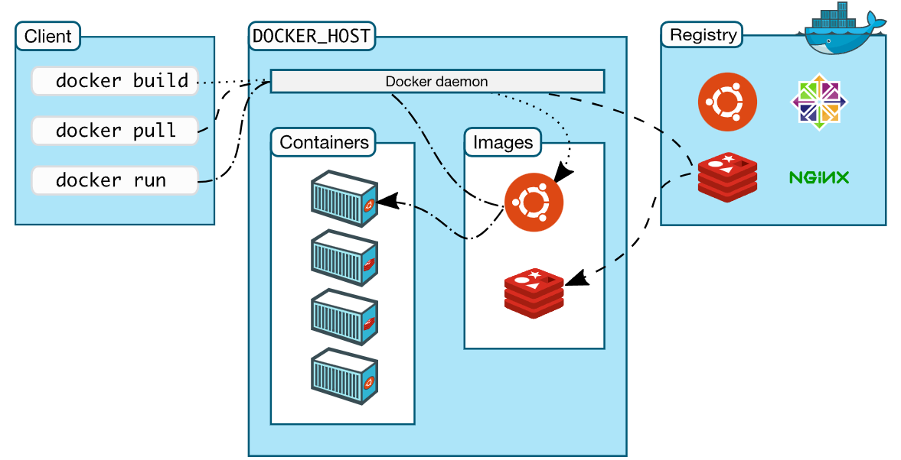

**1）镜像（images）**

Docker镜像（image）就是一个**只读**的模板。镜像可以用来创建docker容器，**一个镜像可以创建多个容器。**

它相当于是一个root文件系统。比如官方镜像centos:7包含了一套完整的一套centos:7最小系统的root文件系统。

相当于容器的“源代码”，**docker镜像文件类似于Java的类模板，而docker容器实例类相当于Java中new出来的实例对象。**

**镜像的来源：**

-   自己创建的镜像文件
-   Docker hub中拉取

容器与镜像的关系类似于面向对象编程中的对象和类

| docker | 面向对象 |
| ------ | -------- |
| 容器   | 对象     |
| 镜像   | 类       |

**2）容器**

- 从面向对象的角度

Docker利用容器（container）独立运行的一个或一组应用，应用程序或服务运行在容器里面，容器就类似于虚拟化的运行环境，**容器是用镜像创建的运行实例**，就像是Java中的类和实例对象一样，镜像是静态的定义，容器是镜像运行时的实体。容器为镜像提供了一个标准的和隔离的运行环境，它可以被启动、开始、停止、删除。每个容器都是相互隔离的、保证安全的平台

- 从镜像容器的角度

**可以把容器看做是一个简易版的Linux环境**（包括root用户权限、进程空间、用户空间和网络环境等）和运行在其中的应用程序。

**3）仓库**

仓库（repository）是**集中存放镜像**文件的场所。

类似于：

​	Maven仓库，存放各种jar包的地方

​	GitHub仓库，存放各种git项目的地方

​	Docker公司提供的官方repository被称为Docker Hub，存放各种镜像模板的地方

仓库可分为公开仓库（public）和私有仓库（private）两种形式

**最大的公开仓库是 Docker Hub（https://hub.docker.com/）**，存放了数量庞大的镜像供用户下载。国内的公开仓库包含阿里云、网易云等

**总结：**

**1）需要正确的理解仓库/镜像/容器这几个概念：**

**docker本身是一个容器运行载体或被称之为管理引擎**。我们把应用程序和配置依赖打包好形成一个可交付的运行环境，这个打包好的运行环境就是一个images镜像文件。**只有通用这个镜像才能生产docker容器实例**（类似于Java中new出来的一个对象）

image文件可以看作是容器的模板。docker根据image文件生成容器的实例。同一个iamge文件，可以生成多个同时运行的容器实例

**2）镜像文件**

image文件生成的容器实例，本身也是一个文件，成为镜像文件。

**3）容器实例**

一个容器运行一种服务，当我们需要的时候，就可以通过docker客户端创建一个对应的实例，也就是我们的容器

**4）仓库**

就是放一堆镜像的地方，我们可以把镜像发布到仓库中，需要的时候再从仓库拉取就可以

#### docker工作原理

docker是一个Client-Server结构的系统，docker守护进程运行在主机上，然后通过Socket连接从客户端访问，守护进程从客户端接受命令并管理运行在主机上的容器。**容器，是一个运行时环境，就是我们前面说过的集装箱。**

### 6.3 安装步骤

**1）确定CentOS7及其以上版本**

```shell
[nhk@nhk ~]$ cat /etc/centos-release
CentOS Linux release 7.9.2009 (Core)
```

**2）卸载旧版本**（可选，如果有就删除）

```shell
$ sudo yum remove docker \
                  docker-client \
                  docker-client-latest \
                  docker-common \
                  docker-latest \
                  docker-latest-logrotate \
                  docker-logrotate \
                  docker-engine
```

官方描述：

​	如果yum报告说这些包都没有安装，也没关系。  

​	在卸载Docker时，存储在/var/lib/docker/中的镜像、容器、卷和网络不会自动删除。

**3）yum安装gcc相关**

- 保证centos7能上外网，安装相关gcc

  ```shell
  $ sudo yum -y install gcc
  $ sudo yum -y install gcc-c++
  ```

**4）安装需要的软件包**

官网描述：

​	你可以根据自己的需求以不同的方式安装Docker Engine:

```shell
$ sudo yum install -y yum-utils
 
 # 下面这条命令禁止使用，因为在国内访问外网会受限制
 sudo yum-config-manager \  
    --add-repo \
    https://download.docker.com/linux/centos/docker-ce.repo
```

**5）设置stable镜像仓库**

**注意避坑：**

```shell
# 官方要求
sudo yum-config-manager --add-repo https://download.docker.com/linux/centos/docker-ce.repo
```

使用官方的仓库可能会遇到如下报错

```shell
[Errno 14] curl#35 -TCP connection reset by peer

[Errno 12] curl#35 -Timeout
```

**推荐使用国内的公开仓库阿里云、网易云等**

**下面配置阿里云仓库**

```shell
$ sudo yum-config-manager --add-repo https://mirrors.aliyun.com/docker-ce/linux/centos/docker-ce.repo
```

**6）更新yum软件包索引**

```shell
# yum makecache fast
```

**7）安装DOCKER CE**（社区版）

```shell
sudo yum install docker-ce docker-ce-cli containerd.io 
```

**8）启动docker**

```shell
sudo systemctl start docker
```

这里也可以选择修改docker的所属用户和所属组，以后敲命令就不用在sudo了（可选操作）

```shell
[nhk@nhk etc]$ pwd
/etc
[nhk@nhk etc]$ sudo chown nhk:nhk docker/
[nhk@nhk etc]$ ll|grep docker
drwxr-xr-x.  2 nhk  nhk         6 Apr  4 18:04 docker
```

**查看docker相应进程**

```shell
[nhk@nhk etc]$ ps -ef|grep docker
root       2577      1  0 02:58 ?        00:00:00 /usr/bin/dockerd -H fd:// --containerd=/run/containerd/containerd.sock
nhk        2725   1875  0 02:59 pts/0    00:00:00 grep --color=auto docker
```

**9）测试**

官方描述：

​	运行hello-world镜像，验证Docker引擎安装成功。

```shell
sudo docker run hello-world
```

查看docker版本

```shell
sudo docker version
```

**10）卸载Docker**（谨慎操作）

```shell
sudo systemctl stop docker
# 删除依赖
sudo yum remove docker-ce docker-ce-cli containerd.io 
# 删除资源
sudo rm -rf /var/lib/docker
sudo rm -rf /var/lib/containerd
```

## 7 阿里云镜像加速

官网：https://promotion.aliyun.com/ntms/act/kubernetes.html

**1）注册一个属于自己的阿里云账户**（可复用淘宝账户）

**2）获得加速器地址链接**

- 登录阿里云开发者平台

- 点击控制台

- 选择容器镜像服务

  选择镜像根据 ==> 镜像加速器  ==> 复制

  ```
  # 我的加速器地址如下
  https://5zwdz9je.mirror.aliyuncs.com
  ```

- 获取加速器地址

**3）粘贴脚本直接运行**

针对Docker客户端版本大于 1.10.0 的用户

您可以通过修改daemon配置文件`/etc/docker/daemon.json`来使用加速器

```shell
sudo mkdir -p /etc/docker
sudo tee /etc/docker/daemon.json <<-'EOF'
{
  "registry-mirrors": ["https://5zwdz9je.mirror.aliyuncs.com"] 	
}
EOF
sudo systemctl daemon-reload
sudo systemctl restart docker
```


## 8 永远的HelloWorld

**启动docker后台容器（测试运行hello-world）**

```shell
[nhk@nhk etc]$ sudo docker run hello-world 
Unable to find image 'hello-world:latest' locally  # 由于本地没有hello-world镜像，所有
latest: Pulling from library/hello-world		   # 接下来会去拉取这个镜像
2db29710123e: Pull complete 
Digest: sha256:2498fce14358aa50ead0cc6c19990fc6ff866ce72aeb5546e1d59caac3d0d60f
Status: Downloaded newer image for hello-world:latest

Hello from Docker! 	# 看到这里说明镜像拉取成功，并在容器里运行了（看到这段输出，helloworld会停止，容器自动终止）
This message shows that your installation appears to be working correctly.

To generate this message, Docker took the following steps:
 1. The Docker client contacted the Docker daemon.
 2. The Docker daemon pulled the "hello-world" image from the Docker Hub.
    (amd64)
 3. The Docker daemon created a new container from that image which runs the
    executable that produces the output you are currently reading.
 4. The Docker daemon streamed that output to the Docker client, which sent it
    to your terminal.

To try something more ambitious, you can run an Ubuntu container with:
 $ docker run -it ubuntu bash

Share images, automate workflows, and more with a free Docker ID:
 https://hub.docker.com/
[nhk@nhk etc]$ sudo docker images     # 查看本地镜像
REPOSITORY    TAG       IMAGE ID       CREATED         SIZE
hello-world   latest    feb5d9fea6a5   18 months ago   13.3kB
```

### 8.1 run干了什么

```txt
开始 ---> docker在本机中寻找该镜像(查看本机是否有该镜像)
			如果有 ---> 以该镜像为模板生产容器实例运行
			如果没有 ----> 取Docker Hub上查找该镜像
								---> 根据Hub能否找到
									找到 ---> 下载该镜像到本地-> 以该镜像为模板生产容器实例运行
									未找到 ---> 返回失败错误，查不到该镜像
```


## 9 为什么docker会比VM虚拟机快

### 9.1 底层原理

Docker是怎么工作的？

1）Docker是一个Client-Server结构的系统，Docker的守护进程运行在主机上。通过Socket从客户端访问！！

2）DockerServer 接收到Docker-Client的指令，就会执行这个命令 ！

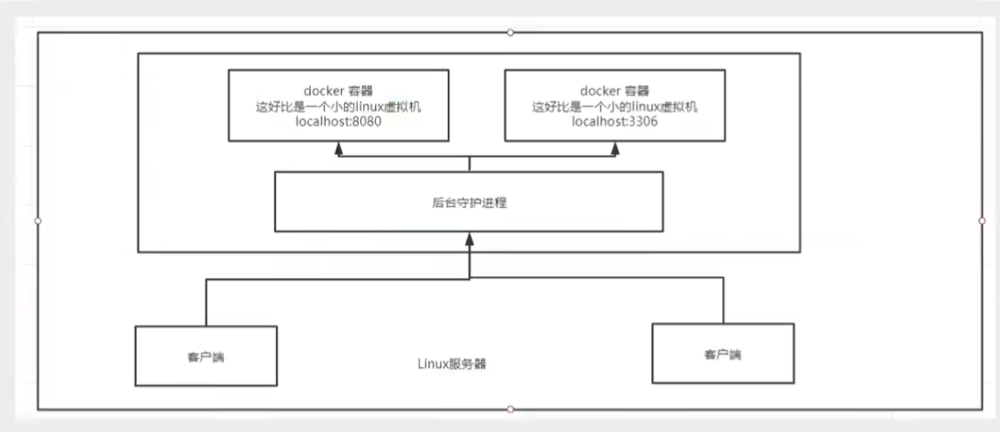

### 9.2 Docker为什么比VM快

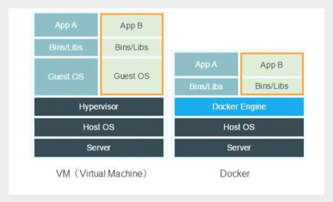

**1）docker有着比虚拟机更少的抽象层**

由于docker不需要Hypervisor（虚拟机）实现硬件资源虚拟化，运行在docker容器上的程序直接使用的都是实际物理机的硬件资源。因此CPU、内存利用率上docker将会在效率上有明显优势。

**2）docker利用的是宿主机的内核，而不需要加载操作系统OS内核**

当新建一个容器时，docker不需要和虚拟机一样重新加载一个操作系统内核。

-   进而避免引寻、加载操作系统内核返回等比较费时资源的过程，当新建一个虚拟机时，虚拟机软件需要加载OS，返回新建过程是分钟级别的。

-   而**docker由于直接利用宿主机的操作系统，则省略了返回过程，因此新建一个docker容器只需要几秒钟**。

### 9.3 对比

|            | **Docker容器**          | 虚拟机（VM）                         |
| ---------- | ----------------------- | ------------------------------------ |
| 操作系统   | 与宿主机共享OS          | 宿主机OS上运行虚拟机OS               |
| 存储大小   | 镜像小，便于存储与传输  | 镜像庞大（vmdk、vdi等）              |
| 运行性能   | 几乎无额外性能损失      | 操作系统额外的CPU、内存消耗（5~20%） |
| 移植性     | 轻便、灵活、适应于Linux | 笨重、与虚拟化技术耦合度高           |
| 硬件亲和性 | 面向软件开发者          | 面向硬件运维者                       |
| 部署速度   | 快速、秒级              | 较慢，10s以上                        |

## 10 Docker常用命令

### 10.1 帮助启动类命令

命令帮助文档：https://docs.docker.com/engine/reference/commandline

启动docker

```shell
sudo systemctl start docker
```

停止docker

```shell
sudo systemctl stop docker
```

重启docker

```shell
sudo systemctl restart docker
```

查看docker状态

```shell
sudo systemctl status docker
```

开机启动

```shell
sudo systemctl enable docker

sudo systemctl disable docker  # 禁止开启自动
```

查看docker概要信息，包括镜像和容器的数量

```shell
sudo docker info
```

查看docker总体帮助文档

```shell
sudo docker --help
```

查看docker命令帮助文档

```shell
sudo docker 具体命令 --help

# 例如
sudo docker cp --help
```

### 10.2 镜像命令

#### **1）列出本地主机上的镜像images**

```shell
sudo docker images [option]
```

options说明
- `-a`列出本地所有的镜像（仅历史映像层）
- `-q`只显示镜像ID

```sh
[nhk@nhk ~]$ sudo docker images
REPOSITORY    TAG       IMAGE ID       CREATED         SIZE
hello-world   latest    feb5d9fea6a5   18 months ago   13.3kB
```

参数说明：

| 参数       | 描述                         |
| ---------- | ---------------------------- |
| REPOSITORY | 表示镜像的仓库源             |
| TAG        | 镜像的标签（一般为版本信息） |
| IAMGE ID   | 镜像ID                       |
| CREATED    | 镜像创建的时间               |
| SIZE       | 镜像大小                     |

- 同一仓库源可以有多个TAG版本，代表这个仓库源的不同个版本，我们使用`REPOSITORY:TAG`来定义不同的镜像
- 如果不指定一个镜像的版本标签，例如你只使用ubuntu，docker将默认使用ubuntu:latest镜像


#### **2）查询镜像search**

```shell
docker search [options] 镜像名字
```

options说明
- `--limit` 只列出N个镜像，默认25个。例 `docker search --limit 5 redis`

:::tip
​建议去DockerHub上搜索相应的镜像，因为可以看到详细的帮助文档
:::

```shell
[nhk@nhk ~]$ docker search mysql --limit 3
NAME      DESCRIPTION                                     STARS     OFFICIAL   AUTOMATED
mysql     MySQL is a widely used, open-source relation…   14627     [OK]       
mariadb   MariaDB Server is a high performing open sou…   5576      [OK]       
percona   Percona Server is a fork of the MySQL relati…   622       [OK]       
```

各个选项说明

| 参数        | 说明             |
| ----------- | ---------------- |
| NAME        | 镜像名称         |
| DESCRIPTION | 镜像说明         |
| STARS       | 点赞数量         |
| OFFICIAL    | 是否是官方的     |
| AUTOMATED   | 是否是自动构建的 |

#### **3）下载镜像（拉取镜像）pull**

docker pull 某个xxx镜像名字

```shell
sudo docker pull 镜像名字[:TAG]
sudo docker pull 镜像名字

# 其中
# 	没有TAG就是最新版（latest）
# 	等价于
#	docker pull 镜像名字:latest
```

演示：

```shell
[root@nhk ~]# docker pull tomcat # 下载镜像，不写TAG，默认就是latest
Using default tag: latest
latest: Pulling from library/tomcat
0e29546d541c: Pull complete 		# 镜像分层下载，docker image的核心 （ 联合文件系统）
9b829c73b52b: Pull complete 
cb5b7ae36172: Pull complete 
6494e4811622: Pull complete 
668f6fcc5fa5: Pull complete 
dc120c3e0290: Pull complete 
8f7c0eebb7b1: Pull complete 
77b694f83996: Pull complete 
0f611256ec3a: Pull complete 
4f25def12f23: Pull complete 
Digest: sha256:9dee185c3b161cdfede1f5e35e8b56ebc9de88ed3a79526939701f3537a52324	# 签名
Status: Downloaded newer image for tomcat:latest
docker.io/library/tomcat:latest		# 真实地址

# 说明
docker pull tomcat
等价于
docker pull docker.io/library/tomcat:latest
```

#### **4）删除镜像rmi**

删除镜像可以根据 镜像ID或 镜像名字 删除

```shell
# 删除单个镜像
sudo docker rmi -f 镜像名字|镜像ID
# 删除多个镜像
sudo docker rmi -f 镜像名1:TAG 镜像名2:TAG 镜像名3:TAG 
# 删除全部镜像
sudo docker rmi -f ${sudo docker images -qa}
```

#### **5）查看镜像/容器/数据卷所占空间**

```shell
sudo docker system df
```

```shell
[nhk@nhk ~]$ sudo docker system df
TYPE            TOTAL     ACTIVE    SIZE      RECLAIMABLE
Images          2         1         72.79MB   72.78MB (99%)
Containers      2         0         0B        0B
Local Volumes   0         0         0B        0B
Build Cache     0         0         0B        0B
```

#### docker虚悬镜像（面试题）

**什么是docker虚悬镜像？**

仓库名、标签都是`<none>`的镜像，俗称虚悬镜像dangling image

形如一下就是虚悬镜像

```shell
[nhk@nhk ~]$ sudo docker images
REPOSITORY    TAG       IMAGE ID       CREATED         SIZE
<none>        <none>    daofd00b7d91   18 months ago   72.8MB
```

### 10.3 容器命令

**有镜像才能创建容器，这是根本前提**（接下来下载一个centos或ubuntu镜像演示）

```shell
sudo docker pull ubuntu   # 接下来采用ubuntu演示
```

对我们当前环境做出一下说明：

​	当前我们是在windows11上运行VMware虚拟出Linux（CentOS7），在CentOS7上安装了Docker，在Docker里创建了容器Ubuntu，如下

```
		Ubuntu
		Docker  
		CentOS7
		VMWare
		Windows11
```

#### **1）新建、启动容器 run**

**注意：**

​	**一个镜像可以被多个容器使用，因此我们新建容器的时候记得使用--name参数指定容器名称**

```shell
sudo docker run [options] IMAGE [COMMAND][AGE...]
```

options说明（常用）：有些是一个减号，有些是两个减号

-   **--name="容器新名字"** 	为容器指定一个名称，如果不指定则是随机生成
-   --d	**--detach 的缩写**， 后台运行容器并返回容器ID，也即启动守护式容器（后台运行）
-   -**-i	--interactive 的缩写，以交互模式运行容器（交互式操作），通常与 -t 同时使用**

-   **-t	--tty 的缩写，为容器重新分配一个伪输入终端（终端）**
    -   **通常与-i同时使用，也即启动交互式容器（前台有伪终端，等待交互）**

-   -P	**随机**端口映射，大写P

-   -p    **指定**端口映射，小写P

| 参数                          | 说明                               |
| ----------------------------- | ---------------------------------- |
| -p hostPort:containerPort     | 端口映射 -p 8080:80                |
| -p ip:hostPort:containerPort  | 配置监听地址 -p 10.0.0.100:8080:80 |
| -p ip::containerPort          | 随机分配端口 -p 10.0.0.100::80     |
| -p hostPort:containerPort:udp | 指定协议 -p 8080:80:tcp            |
| -p 81:80 -p 443:443           | 指定多个                           |

演示

使用镜像 centos:latest以**交互式**启动一个容器，在容器内执行/bin/bash命令

```shell
[nhk@nhk ~]$ sudo docker run -it ubuntu /bin/bash		# 启动并进入容器
root@e65153f110e5:/#    # 如果想要退出终端，直接输入exit

# 演示为容器指定一个名称
[nhk@nhk ~]$ sudo docker run -it --name=myubuntu ubuntu /bin/bash
root@4c1cdfe98c01:/# 

[nhk@nhk ~]$ sudo docker ps
CONTAINER ID   IMAGE     COMMAND       CREATED          STATUS          PORTS     NAMES
4c1cdfe98c01   ubuntu    "/bin/bash"   54 seconds ago   Up 53 seconds            myubuntu
```

#### 2）列出正在运行的容器 ps

```shell
sudo docker ps [options]
```

options说明（常用）：

| 参数 | 说明                           |
| ---- | ------------------------------ |
| 无参 | 默认显示**正在运行的容器**     |
| -a   | **列出所有容器**，包括未运行的 |
| -l   | 显示最近创建的容器             |
| -n=? | **显示最近?个创建的容器**      |
| -q   | **静默模式，只显示容器编号**   |
| -s   | 显示总的文件大小               |
| -f   | 根据条件过滤显示的内容。       |
|      |                                |
|      |                                |

```shell
[nhk@nhk ~]$ sudo docker run -it ubuntu 
root@1d16ca150d78:/# 

# 进入另一个shell查看
[nhk@nhk ~]$ sudo docker ps
CONTAINER ID   IMAGE     COMMAND   CREATED          STATUS          PORTS     NAMES
1d16ca150d78   ubuntu    "bash"    51 seconds ago   Up 50 seconds             condescending_mcclintock

# 参数说明
CONTAINER ID	该容器的ID
IMAGE	使用的镜像
COMMAND	容器中执行的命令
CREATED	
STATUS	
PORTS	容器暴露的端口
NAMES	容器名
```

#### **3）退出容器**

两种退出方式

**（1）exit**

​	run进去容器，**exit退出，容器停止**

**（2）ctrl+P+Q**

​	run进去容器，ctrl+P+Q退出，**容器不停止**

#### 4）启动已停止运行的容器start

```shell
sudo docker start 容器ID或容量名
```

#### 5）重启容器restart

```shell
sudo docker restart 容器ID或容量名
```

#### 6）停止容器stop

```shell
sudo docker stop 容器ID或容量名
```

#### 7）强制停止容器kill

```shell
sudo docker kill 容器ID或容量名
```

#### **8）删除已停止的容器rm**

```shell
sudo docker rm 容器ID		# 不能删除未停止的容器
```

```shell
# 一次性删除多个实例 （生产环境中别用，要不然牢饭管饱）
docker rm -f ${docker ps -a -q}   # -f表示强制（可以在容器未停止的状态下删除容器）
docker ps -a -q | xargs docker rm
```


**有镜像才能创建容器，这是根本前提**（下面下载一个redis6.0.8镜像演示）

#### **9）启动守护式容器（后台启动）**

在大部分的场景下，我们希望docker的服务是在后台运行的，我们可以通过 **-d 指定容器的后台运行模式**

**前台启动与后台启动的区别：**

-   前台启动：会打印启动日志信息
-   后台启动：不会打印启动的日志信息

```shell
sudo docker run -d 容器名
```

演示

```shell
# 使用镜像ubuntu:latest以后台模式启动一个容器
[nhk@nhk ~]$ sudo docker run -d ubuntu
9c8bf1ada3aa90cfa617d9eda01da6b6b081e0f50e849f62b5d716c8a085ffa9
[nhk@nhk ~]$ sudo docker ps
CONTAINER ID   IMAGE     COMMAND   CREATED   STATUS    PORTS     NAMES
# 使用 sudo docker ps 进行查看，会发现容器已经退出
注意避坑
# docker容器后台运行，就必须有一个前台进程
# 容器运行的命令如果不是哪些一直挂起的命令（如top、tail），就是会自动停止的

# 这个是docker的机制问题，比如web容器，我们以nginx为例。正常情况下，
# 我们配置启动服务只需要启动响应的service即可。例如service nginx start
# 但是，这样做，nginx以后台进程模式运行，就导致docker前台没有运行的应用，
# 这样的容器后台启动后，会立刻自杀因为它们觉得没事可做了
# 所以，最佳的解决方案是，将你要运行的程序以前台进程的形式运行，
# 常见就是命令行模式，表示我还要交互操作，别中断,^v^~~~~
[nhk@nhk ~]$ sudo docker run -it ubuntu
root@7354dff2f8f8:/# 

```

**redis前后台启动演示case**

前台交互式启动

```shell
[nhk@nhk ~]$ sudo docker run -it redis:6.0.8
```

后台守护式启动

```shell
[nhk@nhk ~]$ sudo docker run -d redis:6.0.8
```

#### 10）查看容器日志logs

```shell
sudo docker logs 容器ID
```

options说明（常用）：

| 参数    | 说明           |
| :------ | :------------- |
| -tf     | 显示日志       |
| -tail n | 要显示日志条数 |

```shell
[nhk@nhk ~]$ sudo docker -tf --tail 10 logs 16a17e5a38c9 
```

#### 11）查看容器内运行的进程top

```shell
sudo docker top 容器ID
```

#### 12）查看容器元数据inspect

```shell
sudo docker inspect 容器ID
```

#### 13）进入正在运行的容器并以命令行交互

方式一：

```shell
docker exec -it 容器ID bashShell
```

演示：

```shell
[nhk@nhk ~]$ sudo docker exec -it 79a691095514 /bin/bash  # 使用exec进入容器
root@79a691095514:/# exit    # exit退出后，容器 79a691095514 还在
exit
[nhk@nhk ~]$ sudo docker ps   
CONTAINER ID   IMAGE         COMMAND                  CREATED          STATUS          PORTS      NAMES
16a17e5a38c9   redis:6.0.8   "docker-entrypoint.s…"   41 minutes ago   Up 41 minutes   6379/tcp   elated_shirley
```

查看帮助

```shell
[nhk@nhk ~]$ sudo docker exec --help
```

方式二：

**重新进入**

```
docker attach 容器ID
```

演示：

```shell
[nhk@nhk ~]$ sudo docker attach 79a691095514   # 使用attach进入容器
root@79a691095514:/# exit    # exit退出后，容器 79a691095514 停止
exit
[nhk@nhk ~]$ sudo docker ps
CONTAINER ID   IMAGE         COMMAND                  CREATED          STATUS          PORTS      NAMES
```

#### **上述exec与attach区别：**

- attach直接进入容器启动命令的终端，**不会启动新的进程**

​		用exit退出，会导致容器停止

- exec是在容器中打开新的终端，并且**可以启动新的进程**

  	用exit退出，不会导致容器停止

**推荐使用 docker exec 命令，因为退出终端，不会导致容器的停止**

用之前的redis容器实例演示

```shell
# 进入redis服务
# docker exec -it 容器ID /bin/bash
[nhk@nhk ~]$ sudo docker exec -it 16a17e5a38c9 /bin/bash
root@16a17e5a38c9:/data# exit
exit
[nhk@nhk ~]$ sudo docker ps  # exit退出后，容器还在
CONTAINER ID   IMAGE         COMMAND                  CREATED          STATUS          PORTS      NAMES
16a17e5a38c9   redis:6.0.8   "docker-entrypoint.s…"   51 minutes ago   Up 51 minutes   6379/tcp   elated_shirley

# docker  exec -it 容器ID redis-cli
[nhk@nhk ~]$ sudo docker exec -it 16a17e5a38c9 redis-cli
127.0.0.1:6379> exit
[nhk@nhk ~]$ sudo docker ps
CONTAINER ID   IMAGE         COMMAND                  CREATED          STATUS          PORTS      NAMES
16a17e5a38c9   redis:6.0.8   "docker-entrypoint.s…"   52 minutes ago   Up 51 minutes   6379/tcp   elated_shirley
```

小结：

​	一般用**-d**后台启动的程序，再用exec进入对应容器实例


#### 14）从容器内拷贝文件到主机上cp

**容器 ---> 主机**

```shell
docker cp 容器ID:容器内路径 目的主机的路径
```

演示

```shell
[nhk@nhk ~]$ sudo docker exec -it 7354dff2f8f8 /bin/bash
root@7354dff2f8f8:/# cd /opt/
root@7354dff2f8f8:/opt# ll  # 在容器内/opt目录下有a.txt文件
total 0
drwxr-xr-x. 1 root root 19 Apr 12 12:12 ./
drwxr-xr-x. 1 root root 17 Apr 12 11:04 ../
-rw-r--r--. 1 root root  0 Apr 12 12:12 a.txt
root@7354dff2f8f8:/opt# exit            # 退出容器
exit 

[nhk@nhk ~]$ sudo docker cp 7354dff2f8f8:/opt/a.txt /tmp/a.txt  # 将容器的文件拷贝到本机的/opt目录下
[nhk@nhk ~]$ ll /tmp/
total 16
-rw-r--r--. 1 root root 1805 Apr 11 23:58 anaconda.log
-rw-r--r--. 1 root root    6 Apr 12 08:12 a.txt
```

#### 15）导入和导出容器 export import

**export**	导出容器的内容流作为一个tar归档文件 [对应import命令]

**import**	从tar包中内容创建一个新的文件系统再导入为镜像 [对应export命令]

演示：

```shell
# docker export 容器ID > 文件名.tar(或文件名.tar.gz)
[nhk@nhk ~]$ sudo docker ps
CONTAINER ID   IMAGE         COMMAND                  CREATED             STATUS             PORTS      NAMES
7354dff2f8f8   ubuntu        "bash"                   About an hour ago   Up About an hour              trusting_wing
[nhk@nhk ~]$ sudo docker export 7354dff2f8f8 > abc.tar.gz   # export
[nhk@nhk ~]$ ll
total 73400
-rw-rw-r--. 1 nhk nhk 75159552 Apr 12 08:24 abc.tar.gz

# cat 文件名.tar | docker import - 镜像用户/镜像名:镜像版本号
[nhk@nhk ~]$ cat abc.tar.gz | sudo docker import - clear/ubuntu:6.6
sha256:ed28b5fe41715a940c91e6e8362cc76d13cd7e5dd71cd92d20992f38f21a6c41
[nhk@nhk ~]$ sudo docker images
REPOSITORY     TAG       IMAGE ID       CREATED          SIZE
clear/ubuntu   6.6       ed28b5fe4171   36 seconds ago   72.8MB
ubuntu         latest    ba6acccedd29   18 months ago    72.8MB
redis          6.0.8     16ecd2772934   2 years ago      104MB
```

## 11 常用命令总结

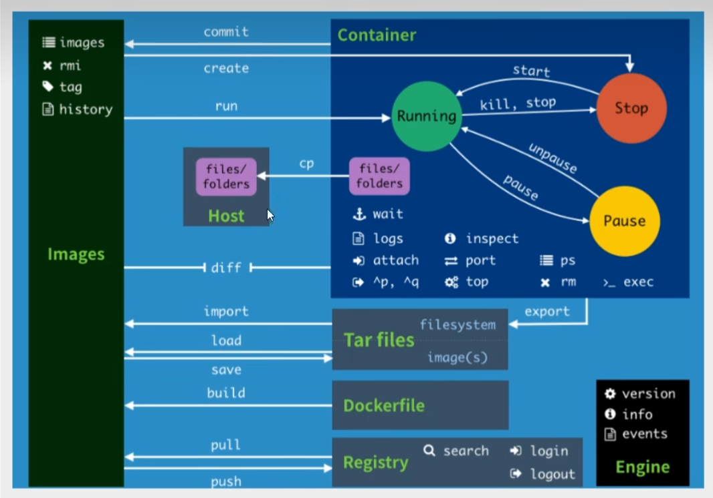

| 命名    | 英文描述                                                     | 解释                                                         |
| ------- | ------------------------------------------------------------ | ------------------------------------------------------------ |
| attch   | Attach  to a running container                               | 当前shell下attach连接指定运行镜像                            |
| build   | Build an image form a Dockerfile                             | 通过Dockerfile定制镜像                                       |
| commit  | Create a new image from a container changes                  | 提交当前容器为新的镜像                                       |
| cp      | Copy files/folders the container filesystem to the host path | 从容器中拷贝指定文件或者目录到宿主机中                       |
| create  | Create a new container                                       | 创建一个新的容器，同run，但不启动容器                        |
| diff    | Inspect changes on a container's filesystem                  | 查看docker容器的变化                                         |
| events  | Get real time events from the server                         | 从docker服务获取容器实时事件                                 |
| exec    | Run a command in an existing container                       | 在已存在的容器上运行命令                                     |
| export  | Stream the content of a container as tar archive             | 导入容器的内容流作为一个tar归档文件 [对应import]             |
| history | Show the history of an iamge                                 | 展示一个镜像形成历史                                         |
| images  | List images                                                  | 列出系统当前镜像                                             |
| import  | Create a new fileSystem image from contents of a tarball     | 从tar包中的内容创建一个新的文件系统映射                      |
| info    | Display system-wide information                              | 显示系统相关信息                                             |
| inspect | Return low-level information on a container                  | 查看容器详细信息                                             |
| kill    | Kill a running container                                     | kill 指定docker容器                                          |
| load    | Load an image form a tar archive                             | 从一个tar包中加载一个镜像 [对应save]                         |
| login   | Register or Login to the docker register server              | 注册或登陆一个docker源服务器                                 |
| logout  | Log out from a Docker registry server                        | 从当前Docker registry 退出                                   |
| logs    | Fetch the logs of a container                                | 输出当前容器日志信息                                         |
| port    | Lookup the public-facing port which is NAT -ed to PRIVATE_PORT | 查看映射端口对应的容器内部源端口                             |
| pause   | Pause all processes within a container                       | 暂停容器                                                     |
| ps      | List containers                                              | 列出容器列表                                                 |
| pull    | Pull an image or a repository from the docker register server | 从docker镜像源服务器拉取指定镜像或者库镜像                   |
| push    | Push an image or a repository to the docker register server  | 推送指定镜像或库镜像至docker源服务器                         |
| restart | Restart a running container                                  | 重启运行的容器                                               |
| rm      | Remove one or more containers                                | 移除一个或者多个容器                                         |
| rmi     | Remove one or more images                                    | 移除一个或者多个镜像（无容器使用该镜像时才可删除，否者需删除相关容器才可以删除） |
| run     | Run a command in a new container                             | 创建一个新的容器并运行一个命令                               |
| save    | Save an image to a tar archive                               | 保存一个镜像为一个tar包 [对应load]                           |
| search  | Search for an image on the Docker HUb                        | 在Docker 中搜索镜像                                          |
| start   | Start a stopped containers                                   | 启动容器                                                     |
| stop    | Stop a running containsers                                   | 停止容器                                                     |
| unpause | Unpause a paused container                                   | 取消暂停容器                                                 |
| version | Show the docker version information                          | 查看docker版本号                                             |
| wait    | Block until container stops，then print its exit code        | 截取容器停止时的退出状态值                                   |
| tag     | Tag an image into a repository                               | 给源中镜像打标签                                             |
| top     | Lookup the running processes of container                    | 查看容器中运行的进程信息                                     |
|         |                                                              |                                                              |
|         |                                                              |                                                              |

## 12 Docker镜像

### 12.1 镜像是什么

​	镜像是一种**轻量级、可执行**的独立软件包，它包含运行某个软件所需的所有内容，我们把应用程序和配置依赖打包好形成一个可交付的运行环境（包括代码、运行是所需的库、环境变量和配置文件等），这个打包好的运行环境就是image镜像文件

特别强调：

​	**只有通过这个镜像文件才能生成Docker容器实例**（类似于Java中new出来的一个对象）

镜像的来源可以有如下方式：

-   从远程库pull
-   朋友拷贝给你
-   自己制作一个镜像DockerFile

### 12.2 UnionFS（联合文件系统）

UnionFs（联合文件系统）是一种==分层==、轻量级、性能高的文件系统，它支持对**文件系统的修改作为一次提交来一层层的叠加**，同时可以将不同的目录挂载到同一个虚拟文件系统下（unite several directories into a single virtual filesystem）。Union文件体系是Docker镜像的基础。**镜像可以通过分层来进行继承**，基于基础镜像（没有父镜像，类似于Java的Object），可以制作各种具体的应用镜像

特性：

​	一次同时加载多个文件系统，但从外面看起来，只能看做是一个文件系统，联合加载会把各层文件系统叠加起来，这样最终的文件系统会包含所有的文件和目录

### 12.3 Docker镜像加载原理

Docker镜像加载原理：

​	**Docker的镜像实际上由一层一层的文件系统组成**，这种层级的文件系统==UnionFs==。

-   **bootfs（boot file system）**

bootfs（boot file system）**主要包含bootloader和kernel，bootloader主要是加载kernel**，Linux刚启动会加载bootfs文件系统，**在Docker镜像的最底层是引导文件系统bootfs**。这一层与我们典型的Linux/Unix系统是一样的，**包含boot加载器和内核**。当boot加载完成之后整个内核就都在内存中了，此时内存的使用权已由bootfs转交给内核，此时系统会卸载bootfs。

​	大白话：bootfs这部分是公用的，无论是什么样的镜像都会用到，启动以后这部分就不需要了

-   **rootfs（root file system）**

rootfs（root file system），在bootfs之上。包含的就是典型的Linux系统的/dev，/proc，/bin，/etc等标准目录和文件。rootfs就是各种不同的操作系统的发行版。比如Ubuntu、CentOS等

```
# 形如
		rootfs
		bootfs
```

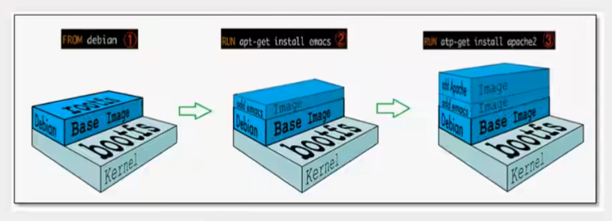

平时我们安装虚拟机的CentOS、Ubuntu等都是好几个G，为什么docker这里的才200M，甚至更小？

```shell
[root@nhk opt]# docker images
REPOSITORY             TAG       IMAGE ID       CREATED         SIZE
ubuntu                 latest    ba6acccedd29   18 months ago   72.8MB
```

对于一个精简的OS，rootfs可以很小，只包括最基本的命令、工具和程序库就可以了，因为底层直接用Host的kernel，自己只需提供rootfs即可。

由此可见对于**不同的Linux发行版，bootfs基本是一致的，rootfs会有差别，**

**由此不同的发行版可以共同bootfs。**

总结：

​	虚拟机是分钟级别的，容器是秒级的！！！

### 12.4 Docket镜像分层

以pull命令为例，在我们下载的过程中，我们可以看到docker的镜像好像是一层一层的在下载

```shell
[root@nhk ~]# docker pull tomcat
Using default tag: latest
latest: Pulling from library/tomcat
0e29546d541c: Pull complete 		# 镜像分层
9b829c73b52b: Pull complete 
cb5b7ae36172: Pull complete 
6494e4811622: Pull complete 
668f6fcc5fa5: Pull complete 
dc120c3e0290: Pull complete 
8f7c0eebb7b1: Pull complete 
77b694f83996: Pull complete 
0f611256ec3a: Pull complete 
4f25def12f23: Pull complete 
Digest: sha256:9dee185c3b161cdfede1f5e35e8b56ebc9de88ed3a79526939701f3537a52324
Status: Downloaded newer image for tomcat:latest
docker.io/library/tomcat:latest
```

### 12.5 为什么Docker镜像要采用分层结构

镜像分层最大的好处就是**资源共享**，方便复制迁移，就是为了**复用**。

比如说，有多个镜像从相同的base镜像构建而来，那么Docker Host只需在磁盘上保存一份base镜像；同时内存中也只需加载一份base镜像，就可以为所有容器服务了。而且镜像的每一层都可以被共享

查看镜像分层的方式可以通过 docker image inspect 命令

```shell
[root@nhk ~]# docker image inspect tomcat:latest 
[
    {
        .....
        
        "RootFS": {
            "Type": "layers",
            "Layers": [
                "sha256:11936051f93baf5a4fb090a8fa0999309b8173556f7826598e235e8a82127bce",
 "sha256:31892cc314cb1993ba1b8eb5f3002c4e9f099a9237af0d03d1893c6fcc559aab",
 "sha256:8bf42db0de72f74f4ef0c1d1743f5d54efc3491ee38f4af6d914a6032148b78e",
 "sha256:26a504e63be4c63395f216d70b1b8af52263a5289908df8e96a0e7c840813adc",              "sha256:f9e18e59a5651609a1503ac17dcfc05856b5bea21e41595828471f02ad56a225",
 "sha256:832e177bb5008934e2f5ed723247c04e1dd220d59a90ce32000b7c22bd9d9b54",              "sha256:3bb5258f46d2a511ddca2a4ec8f9091d676a116830a7f336815f02c4b34dbb23",
 "sha256:59c516e5b6fafa2e6b63d76492702371ca008ade6e37d931089fe368385041a0",                "sha256:bd2befca2f7ef51f03b757caab549cc040a36143f3b7e3dab94fb308322f2953",
  "sha256:3e2ed6847c7a081bd90ab8805efcb39a2933a807627eb7a4016728f881430f5f"
            ]
        },
        "Metadata": {
            "LastTagTime": "0001-01-01T00:00:00Z"
        }
    }
]
```

### 12.6 重点理解

-   **Docker镜像层都是只读的，容器层是可写的**
-   当容器启动时，一个新的可写成被加载到镜像的顶部
-   这一层通常被称作是“容器层”，“容器层”之下的都叫“镜像层”。

当容器启动时，一个新的可写层被加载到镜像的顶部。这一层通常被称作是“容器层”，“容器层”之下的都叫“镜像层”。**所有对容器的改动（无论添加、删除、还是修改文件）都只会发生在容器层**。只有容器层是可写的，容器层下面的所有镜像层都是只读的。

```shell
形如
		container  	容器层
		image		镜像层
		image
		...
		base image
		bootfs		# 这一层容器启动只会也可以不要
		kernel 		# 内核是复用宿主机的
```

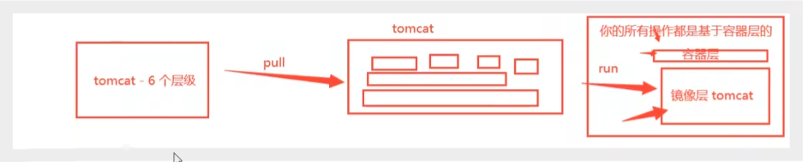

下面举一个比较形象的例子：

所有的 Docker 镜像都起始于一个基础镜像层，当进行修改或增加新的内容时，就会在当前镜像层之上，创建新的镜像层。
假如基于 Ubuntu Linux 16.04创建一个新的镜像，这就是新镜像的第一层；

如果在该镜像中添加 Python包，就会在基础镜像层之上创建第二个镜像层；

如果继续添加一个安全补丁，就会创建第三个镜像层。

该镜像当前已经包含3 个镜像层，如下图所示（这只是一个用于演示的很简单的例子）

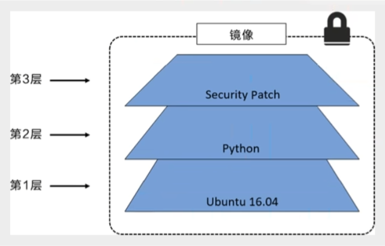

在添加额外的镜像层的同时，镜像始终保持是当前所有镜像的组合，理解这一点非常重要。下图中举了一个简单的例子，每个镜像层包含3个文件，而镜像包含了来自两个镜像层的6个文件。

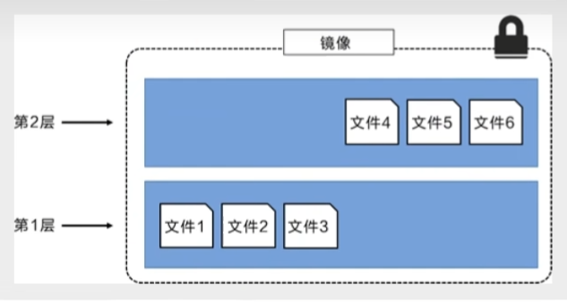

上图中的镜像层跟之前图中的略有区别，主要目的是便于展示文件。

下图中展示了一个稍微复杂的三层镜像，在外部看来整个镜像只有6个文件，这是因为最上层中的文件7是文件5的一个更新版

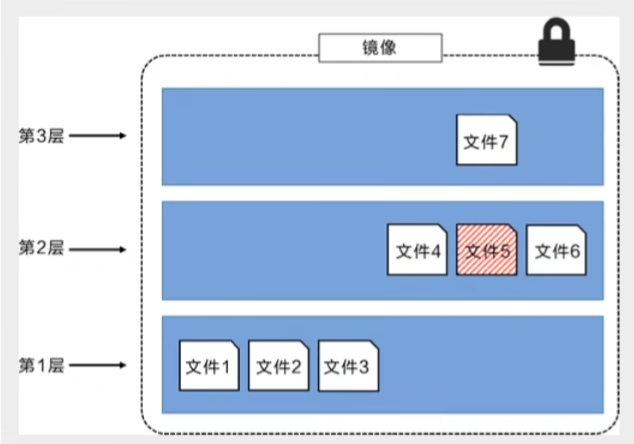

这种情况下，上层镜像层中的文件覆盖了底层镜像层中的文件。这样就使得文件的更新版本作为一个新镜像层添加到镜像当中。

Docker 通过存储引擎（新版本采用快照机制）的方式来实现镜像层堆栈，并保证多镜像层对外展示为统一的文件系统。
Linux 上可用的存储引擎有 AUFS、Overlay2、Device Mapper、Btrfs 以及 ZFS。顾名思义，每种存储引擎都基于 Linux 中对应的文件系统或者块设备技术，并且每种存储引擎都有其独有的性能特点。

Docker 在 Windows 上仅支持 windowsfilter 一种存储引擎，该引擎基于 NTFS 文件系统之上实现了分层和COW［1]。

下图展示了与系统显示相同的三层镜像。所有镜像层堆叠并合并，对外提供统的视图。

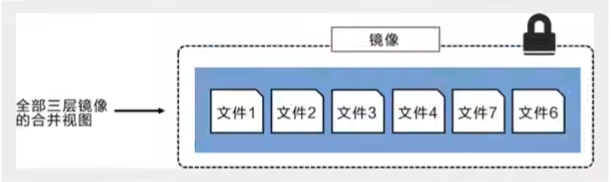

**总结**

-   **Docker镜像层都是只读的，容器层是可写的**
-   当容器启动时，一个新的可写成被加载到镜像的顶部
-   这一层通常被称作是“容器层”，“容器层”之下的都叫“镜像层”。

### 12.7 Docker镜像 commit

**docker commit**提交容器副本使之成为一个新的镜像（即根据当前的容器制作新的镜像文件）

**命令如下**

```shell
docker commit -m="提交的描述信息" -a="作者" 容器ID 要创建的目标镜像名:[标签名]
```

案例演示：

​	在一个ubuntu安装vim再提交镜像

1）从Hub上下载ubuntu镜像到本地并成功运行

```shell
systemctl start docker	# 启动docker(可选)

[root@nhk opt]# docker pull ubnutu	# 拉取镜像，默认latest

[root@nhk opt]# docker images	# 列出本地镜像
REPOSITORY             TAG       IMAGE ID       CREATED         SIZE
ubuntu                 latest    ba6acccedd29   18 months ago   72.8MB

[root@nhk opt]# docker run --name="myubnutu" -it ba6acccedd29 /bin/bash 
root@8e75daabf2eb:/# 
```

2）原始的默认Ubuntu镜像是不带vim命令的

```shell
root@8e75daabf2eb:/# vim 
bash: vim: command not found
```

3）外网连通的情况下，安装vim

```shell
# docker容器内执行以下命令
root@8e75daabf2eb:/# apt-get update     # apt-get类似于centos的yum

root@8e75daabf2eb:/# apt-get -y install vim  
```

4）安装完成后，commit我们自己的新镜像

提交容器副本，使之成为新的镜像

```shell
# 打开另一个shell
[root@nhk ~]# docker ps
CONTAINER ID   IMAGE          COMMAND       CREATED         STATUS         PORTS     NAMES
8e75daabf2eb   ba6acccedd29   "/bin/bash"   9 minutes ago   Up 9 minutes             myubnutu
[root@nhk ~]# docker commit -m="add vim ok" -a="nhk" 8e75daabf2eb clear/myubnutu:1.1
sha256:f660b5fc84e88fa5dbc08e5694e054e092a3d9cea83e6af48b4643304a908e68

[root@nhk ~]# docker images    # 对比大小，发现增加了vim命令的比默认的size大了很多
REPOSITORY             TAG       IMAGE ID       CREATED          SIZE
clear/myubnutu         1.1       f660b5fc84e8   48 seconds ago   183MB
ubuntu                 latest    ba6acccedd29   18 months ago    72.8MB
```

5）启动我们的新镜像并和原来的对比

```shell
[root@nhk ~]# docker run -it ubuntu /bin/bash
root@5dac18788b76:/# vim
bash: vim: command not found
root@5dac18788b76:/# exit
exit

# 启动新镜像
[root@nhk ~]# docker run -it f660b5fc84e8 /bin/bash
root@543d0143b87b:/# vim      
root@543d0143b87b:/# 
```

#### 12.7.1 小总结

Docker中的镜像分层，**支持通过扩展现有镜像，创建新的镜像**。类似于Java继承与一个Base基础类，自己再按需扩展。**新镜像是从base镜像一层一层叠加生成的。每安装一个软件，就在现在镜像的基础上增加一层。**


## 13 本地镜像发布到阿里云

由于Dockehub服务器在国外的原因，因此我们这里选择将镜像发布到阿里云

### 13.1 镜像的生成方法

**基于当前的容器创建一个新的镜像，新功能增强**

```shell
docker commit [options] 容器ID [REPOSITORY]:[TAG]
# 参数说明
#	-a 提交的镜像作者
#	-m 提交时的说明文字
```

```shell
docker commit -m="提交的描述信息" -a="作者" 容器ID 要创建的目标镜像名:[标签名]
```


### 13.2 将本地镜像推送到阿里云

#### 1）本地镜像素材原型

```shell
[root@nhk ~]# docker images  # 以这个clear/myubnutu   为例
REPOSITORY             TAG       IMAGE ID       CREATED          SIZE
clear/myubnutu         1.1       f660b5fc84e8   16 minutes ago   183MB
ubuntu                 latest    ba6acccedd29   18 months ago    72.8MB
```

#### 2）阿里云开发者平台

```
https://cr.console.aliyun.com
```

#### 3）创建仓库镜像

1、在阿里云上选择控制台，进入容器镜像服务

2、选择个人实例 ===> 创建个人版

3、**创建命名空间**（命名空间为 nhk666）

4、**创建镜像仓库**（镜像仓库名为 clear，选择**本地仓库**）

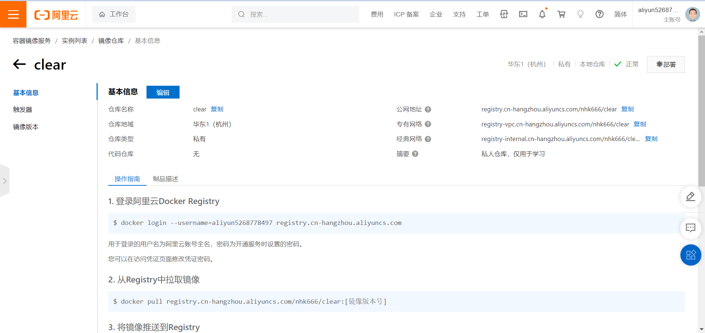

5、进入管理界面获得脚本

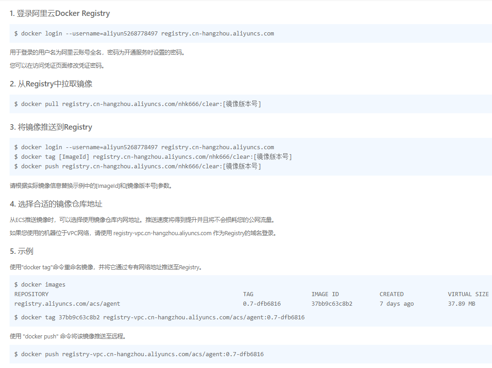

1. 登录阿里云Docker Registry

```shell
$ docker login --username=aliyun5268778497 registry.cn-hangzhou.aliyuncs.com
```

用于登录的用户名为阿里云账号全名，密码为开通服务时设置的密码。

您可以在访问凭证页面修改凭证密码。

2.  从Registry中拉取镜像

```shell
$ docker pull registry.cn-hangzhou.aliyuncs.com/nhk666/clear:[镜像版本号]
```

3. 将镜像推送到Registry

```shell
$ docker login --username=aliyun5268778497 registry.cn-hangzhou.aliyuncs.com
$ docker tag [ImageId] registry.cn-hangzhou.aliyuncs.com/nhk666/clear:[镜像版本号]
$ docker push registry.cn-hangzhou.aliyuncs.com/nhk666/clear:[镜像版本号]
```

请根据实际镜像信息替换示例中的[ImageId]和[镜像版本号]参数。

4. 选择合适的镜像仓库地址

从ECS推送镜像时，可以选择使用镜像仓库内网地址。推送速度将得到提升并且将不会损耗您的公网流量。

如果您使用的机器位于VPC网络，请使用 registry-vpc.cn-hangzhou.aliyuncs.com 作为Registry的域名登录。

5.  示例

使用"docker tag"命令重命名镜像，并将它通过专有网络地址推送至Registry。

```shell
$ docker images
REPOSITORY      	              TAG           IMAGE ID      CREATED        VIRTUAL SIZE
registry.aliyuncs.com/acs/agent   0.7-dfb6816   37bb9c63c8b2  7 days ago     37.89 MB

$ docker tag 37bb9c63c8b2 registry-vpc.cn-hangzhou.aliyuncs.com/acs/agent:0.7-dfb6816
```

使用 "docker push" 命令将该镜像推送至远程。

```shell
$ docker push registry-vpc.cn-hangzhou.aliyuncs.com/acs/agent:0.7-dfb6816
```

#### 4）将镜像推送到阿里云

将镜像推送到阿里云registry

```shell
#  登录阿里云Docker Registry
[root@nhk ~]# docker login --username=aliyun5268778497 registry.cn-hangzhou.aliyuncs.com
Password: 
WARNING! Your password will be stored unencrypted in /root/.docker/config.json.
Configure a credential helper to remove this warning. See
https://docs.docker.com/engine/reference/commandline/login/#credentials-store

Login Succeeded


# 使用"docker tag"命令重命名镜像，并将它通过专有网络地址推送至Registry。
[root@nhk ~]# docker images 
REPOSITORY            TAG            IMAGE ID       CREATED          SIZE
clear/myubnutu        1.2            2a0aab226f36   3 months ago     119MB

[root@nhk ~]# docker tag 2a0aab226f36 registry.cn-hangzhou.aliyuncs.com/nhk666/clear:1.2
[root@nhk ~]# docker images | grep clear
clear/myubnutu                                   1.2            2a0aab226f36   3 months ago     119MB
registry.cn-hangzhou.aliyuncs.com/nhk666/clear   1.2            2a0aab226f36   3 months ago     119MB			# 这个就是我们重命名的镜像


# 将镜像推送至远程镜像仓库
[root@nhk ~]# docker push registry.cn-hangzhou.aliyuncs.com/nhk666/clear:1.2
The push refers to repository [registry.cn-hangzhou.aliyuncs.com/nhk666/clear]
2687cbb37d59: Pushed 
9f54eef41275: Mounted from nhk/clear 
1.2: digest: sha256:214a6882f769a366495e0cdbf2702c08cc9674f684cad41edf496fdc5b4d80c8 size: 741
```

接着可以在阿里云上查看我们push的镜像

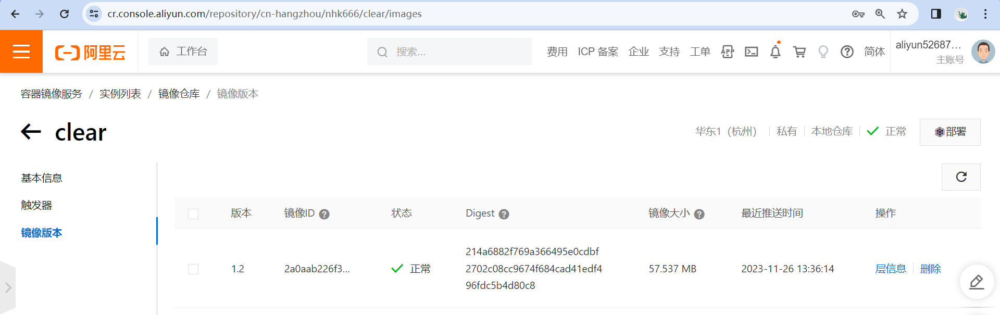

说明：

​	当我们的镜像上传到阿里云的仓库镜像后，不能将本地删除，否则会报错，如下

```shell
[root@nhk ~]# docker rmi 2a0aab226f36
Error response from daemon: conflict: unable to delete 2a0aab226f36 (must be forced) - image is referenced in multiple repositories
```


### 13.3 将阿里云上的镜像下载到本地

```shell
#  从Registry中拉取镜像
#  docker pull registry.cn-hangzhou.aliyuncs.com/nhk666/clear:[镜像版本号]
```


## 14 本地镜像发布到私有仓库

1、官方 Docker Hub地址，但是中国大陆访问太慢了，已经有被阿里云取代的趋势，不太主流

```
https://hub.docker.com/
```

2、Docker Hub、阿里云这样的公共镜像仓库可能不太方法，涉及机密的公司不可能提供镜像给公网，所以需要创建一个本地私人仓库供给团队使用，基于公司内部项目构建镜像


**Docker Registry是官方提供的工具，可以用于构建私有镜像仓库**


### 14.1 将本地镜像推送到私有仓库

#### 1）下载镜像Docker Registry

```shell
[root@nhk ~]# docker pull registry
Using default tag: latest
latest: Pulling from library/registry
Digest: sha256:169211e20e2f2d5d115674681eb79d21a217b296b43374b8e39f97fcf866b375
Status: Image is up to date for registry:latest
docker.io/library/registry:latest


[root@nhk ~]# docker images | grep registry
registry.cn-hangzhou.aliyuncs.com/nhk666/clear   1.2            2a0aab226f36   3 months ago        119MB
registry                                         latest         b8604a3fe854   2 years ago         26.2MB
```

#### 2）**运行私有库Registry**

相当于本地有个私有Docker hub

```shell
# 默认情况，仓库被创建在容器的/var/lib/registry目录下，建议自行用容器卷映射，方便宿主机联调
[root@nhk ~]# docker run -d -p 5000:5000 -v /nhk/myregistry/:/tmp/registry --privileged=true registry
14567cf5127490e3d02fee33398ead76552e9e058a54a1e18a842e98dbcaf605
# 说明	
#	/nhk/myregistry/表示本地路径
# 	/tmp/registry表示容器路径


[root@nhk ~]# docker ps | grep registry
14567cf51274   registry              "/entrypoint.sh /etc…"   42 seconds ago   Up 41 seconds      0.0.0.0:5000->5000/tcp, :::5000->5000/tcp                 
                             dazzling_morse
```

3）案例演示，创建一个新镜像，ubuntu安装ifcofig命令

1、原始的ubuntu镜像是不带着ifconfig命令的，

```shell
[root@nhk ~]# docker run -it ubuntu /bin/bash 
root@82d8b8193918:/# ifconfig
bash: ifconfig: command not found
```

2、需要在外网连通的情况下，使用apt-get命令安装，并测试ifconfig

```shell
# 以下命令在容器内执行
root@82d8b8193918:/# apt-get update 

root@82d8b8193918:/# apt-get install net-tools

root@82d8b8193918:/# ifconfig 
eth0: flags=4163<UP,BROADCAST,RUNNING,MULTICAST>  mtu 1500
        inet 172.17.0.5  netmask 255.255.0.0  broadcast 172.17.255.255
        ether 02:42:ac:11:00:05  txqueuelen 0  (Ethernet)
        RX packets 16919  bytes 30457408 (30.4 MB)
        RX errors 0  dropped 0  overruns 0  frame 0
        TX packets 10031  bytes 546696 (546.6 KB)
        TX errors 0  dropped 0 overruns 0  carrier 0  collisions 0

lo: flags=73<UP,LOOPBACK,RUNNING>  mtu 65536
        inet 127.0.0.1  netmask 255.0.0.0
        loop  txqueuelen 1000  (Local Loopback)
        RX packets 0  bytes 0 (0.0 B)
        RX errors 0  dropped 0  overruns 0  frame 0
        TX packets 0  bytes 0 (0.0 B)
        TX errors 0  dropped 0 overruns 0  carrier 0  collisions 0
```

3、打开新的shell，将容器commit成的新的镜像

```shell
[root@nhk ~]# docker commit -m="add ifconfig ok" -a="nhk" 82d8b8193918 clear/testubuntu:1.0
sha256:43ceac032ec8ff7d99d536e19afaea26451f89b73eb4cc92a98d35b20de65b62

[root@nhk ~]# docker images | grep testubuntu
clear/testubuntu                                 1.0            43ceac032ec8   19 seconds ago      122MB
```

4）curl验证私服库上有什么镜像

```shell
[root@nhk ~]# curl -XGET http://192.168.188.150:5000/v2/_catalog
{"repositories":[]}   # 目前私服库没有任何镜像
```

5）将新镜像testubuntu:1.0修改符合私服规范的Tag

```shell
# docker tag 镜像:Tag Host:Port/Repository:Tag

[root@nhk ~]# docker tag clear/testubuntu:1.0 192.168.188.150:5000/testubuntu:1.0

# 查看镜像
[root@nhk ~]# docker images | grep testubuntu
192.168.188.150:5000/testubuntu                  1.0            43ceac032ec8   2 minutes ago       122MB
clear/testubuntu                                 1.0            43ceac032ec8   2 minutes ago       122MB
```

6）修改配置文件使之支持http

**docker默认不允许http方式推送镜像，通过配置选项来取消这个限制（若修改完配置不生效，建议重启docker）**

```shell
[root@nhk ~]# vim /etc/docker/daemon.json

{
  "registry-mirrors": ["https://5zwdz9je.mirror.aliyuncs.com"],
  "insecure-registries": ["192.168.188.150:5000"]
}


# registry-mirrors配置的是国内阿里提供的镜像加速地址
# 注意：一定要加两个配置之间的逗号
```

7）push推送到私服库

```shell
[root@nhk ~]# docker push 192.168.188.150:5000/testubuntu:1.0
```

8）再次curl验证私服库上有什么镜像

```shell
[root@nhk ~]# curl -XGET http://192.168.188.150:5000/v2/_catalog
{"repositories":["nhkubuntu"]}
```

9）pull到本地运行

```shell
[root@nhk ~]# docker pull 192.168.188.150:5000/testubuntu:1.0
```


## 15 Docker容器数据卷

**坑：容器卷记得加入参数 --privileged=true**

为什么？

Docker挂载主机目录访问**如果出现cantnot open directory .: Permission denied**

​	解决方法：在挂载目录后多加一个 --privileged=true 参数即可

CentOS7安全模块比之前的系统版本加强，不安全的会先禁止，所以目录挂载的情况被默认为不安全行为。

在SELinux里面挂载目录被禁止掉了，如果要开启，我们**一般使用--privileged=true命令，扩大容器的权限解决挂载目录没有权限的问题，也即使用该参数，container内的root拥有真正的root权限**，否则，container内的root之上外部的一个普通用户权限。

### 15.1 参数 -v

之前用过的这条命令

```shell
[root@nhk opt]# docker run -d -p 5000:5000 -v /nhk/myregistry/:/tmp/registry --privileged=true registry	

# /nhk/myregistry/ 代表宿主机上的目录，不存在则自动创建
# /tmp/registry	代表docker容器的目录，不存在也自动创建
```

### 15.2 Docker容器数据卷

卷就是目录或文件，存在于一个或多个容器中，由Docker挂载到容器中，但不属于联合文件系统，因此能够绕过Union File System提供一些用于**持续存储**或**共享数据**的特性：

​	卷的设计目的就是**数据的持久化**，完全独立于容器的生命周期，因此**Docker不会在容器删除时删除其挂载的数据卷**

​	**容器间也是可以进行数据共享的**

```shell

               容器数据卷的方式
               完成数据持久化
docker容器数据   ===========>  映射，容器内的数据 备份+持久化到本地主机目录   

# 个人理解
# 持久化到本机的目录与容器内目录有点双向绑定的意思
# 因为，我们修改容器内目录，宿主机的目录也会改变；改变容器目录，宿主机也会改变（这里所说的目录是至bind的目录）
```

简单来说：就是将Docker容器内的数据保存在宿主机的磁盘中

一句话：有点类似于redis里面的rdb和aof文件

**其实Docker容器数据卷有点想前面学过的cp export import的命令，但是容器卷比他们强大**

#### 15.2.1 运行一个带有容器卷存储功能的容器实例

```shell
docker run [-it|-d等都行] [--name="容器新名字" ] --privileged=true -v /宿主机绝对路径目录:/容器内目录 镜像名[:TAG]
```

### 15.3 Docker容器卷能干嘛

将应用与运行的环境打包成镜像，run后形成容器实例运行，但是我们对数据的要求希望是**持久化的**

Docker容器产生的数据，如果不备份，那么容器实例删除后，容器内的数据自然也就没有了。**为了能保存数据在docker中，我们使用容器卷**

特点：

-   数据卷可在容器之间共享或重用数据
-   卷中的更改可以直接实时生效（注意：是实时生效）
-   数据卷中的更改不会包含在镜像的更新中
-   数据卷的生命周期一直持续到没有容器使用它为止（当容器停止以后，我们修改了数据卷，重启容器后，数据也会更新在容器中）

### 15.4 容器数据卷案例

#### 15.4.1 宿主vs容器直接映射添加容器卷

##### 1）命令

1）使用命令添加容器卷

```shell
# 命令
docker run -it -v /宿主机目录:/容器内目录 ubuntu /bin/bash
```

```shell
[root@nhk ~]# docker run -it --name="myu1" --privileged=true -v /opt/myHostData/:/tmp/myDockerData ubuntu /bin/bash
root@145fd329c761:/# 


# 查看正在运行的容器
[root@nhk myHostData]# docker ps
CONTAINER ID   IMAGE     COMMAND       CREATED         STATUS         PORTS     NAMES
145fd329c761   ubuntu    "/bin/bash"   2 minutes ago   Up 2 minutes             myu1
```

##### 2）查看容器卷是否挂载成功

```shell
root@145fd329c761:/# cd /tmp/myDockerData/
root@145fd329c761:/tmp/myDockerData#       # Docker容器目录

[root@nhk ~]# cd /opt/myHostData/
[root@nhk myHostData]# pwd   	# 宿主机目录
/opt/myHostData

# 查看数据卷是否挂载成功（最简单粗暴的方法）
[root@nhk ~]# docker inspect 145fd329c761

# 可以看到如下json数据
  "Mounts": [
            {
                "Type": "bind",
                "Source": "/opt/myHostData",    		# 宿主机目录
                "Destination": "/tmp/myDockerData",     # 容器内目录
                "Mode": "",
                "RW": true,
                "Propagation": "rprivate"
            }
        ],

```

##### 3）验证容器和宿主机之间数据共享（验证容器卷）

验证：

​	docker修改，主机同步获得

​	主机修改，docker同步获得

​	docker容器stop，主机修改，docker重启重启看数据是否同步（结果是依然同步）

```shell
# 1）在容器内的数据卷上创建文件 1.tx2
root@145fd329c761:/tmp/myDockerData# pwd
/tmp/myDockerData
root@145fd329c761:/tmp/myDockerData# touch 1.txt
root@145fd329c761:/tmp/myDockerData# echo "hello world" >> 1.txt 
root@145fd329c761:/tmp/myDockerData# cat 1.txt 
hello world
root@145fd329c761:/tmp/myDockerData# ll
total 4
drwxr-xr-x. 2 root root 19 Apr 16 05:46 ./
drwxrwxrwt. 1 root root 26 Apr 16 05:40 ../
-rw-r--r--. 1 root root 12 Apr 16 05:46 1.txt

# 在宿主机查询
[root@nhk myHostData]# ll
total 4
-rw-r--r--. 1 root root 12 Apr 16 01:46 1.txt
[root@nhk myHostData]# cat 1.txt 
hello world


# 2）在宿主机上创建文件 2.txt
[root@nhk myHostData]# touch 2.txt
[root@nhk myHostData]# echo "i miss you" >> 2.txt 
[root@nhk myHostData]# cat 2.txt 
i miss you
[root@nhk myHostData]# ll
total 8
-rw-r--r--. 1 root root 12 Apr 16 01:46 1.txt
-rw-r--r--. 1 root root 11 Apr 16 01:47 2.txt

# 在容器内查询
root@145fd329c761:/tmp/myDockerData# ll
total 8
drwxr-xr-x. 2 root root 32 Apr 16 05:47 ./
drwxrwxrwt. 1 root root 26 Apr 16 05:40 ../
-rw-r--r--. 1 root root 12 Apr 16 05:46 1.txt
-rw-r--r--. 1 root root 11 Apr 16 05:47 2.txt
root@145fd329c761:/tmp/myDockerData# cat 2.txt 
i miss you
```

但容器停止后修改宿主机目录，重启容器查看是否依然数据共享（同步）

```shell
# 停止容器
[root@nhk myHostData]#  docker stop 145fd329c761
145fd329c761
[root@nhk myHostData]#  docker ps
CONTAINER ID   IMAGE     COMMAND   CREATED   STATUS    PORTS     NAMES

# 修改宿主机目录下1.txt
[root@nhk myHostData]# echo "i love you" >> 1.txt 
[root@nhk myHostData]# cat 1.txt 
hello world
i love you

# 重启容器
[root@nhk myHostData]# docker start 145fd329c761
145fd329c761
[root@nhk myHostData]# docker ps
CONTAINER ID   IMAGE     COMMAND       CREATED          STATUS         PORTS     NAMES
145fd329c761   ubuntu    "/bin/bash"   20 minutes ago   Up 5 seconds             myu1

# 重新进入容器
[root@nhk ~]# docker exec -it 145fd329c761 /bin/bash
root@145fd329c761:/# cd /tmp/myDockerData/
root@145fd329c761:/tmp/myDockerData# ll
total 8
drwxr-xr-x. 2 root root 32 Apr 16 05:47 ./
drwxrwxrwt. 1 root root 26 Apr 16 05:40 ../
-rw-r--r--. 1 root root 23 Apr 16 06:00 1.txt
-rw-r--r--. 1 root root 11 Apr 16 05:47 2.txt
root@145fd329c761:/tmp/myDockerData# cat 1.txt   # 查看后发现，即使容器停止，数据卷目录被修改后，
hello world										# 容器重启后数据卷依然同步 
i love you
```

### 15.5 具名挂载和匿名挂载

#### 匿名挂载:star:

演示：

```shell
# -v 容器内路径
[root@nhk ~]# docker run -d -P --name nginx01 -v /etc/nginx nginx

# 查看所有的 volume 情况
[root@nhk ~]# docker volume ls
DRIVER    VOLUME NAME
local     0b860f5b7deb97124cd09e43d61aa3648bdae29d6c8ada4f6f165211b92f7da8
local     0c0443a513972007ac308fbe115e8d2d5ef7ae21958b7d88333844294e20b4e6
...

# 以上这种就是匿名挂载，我们在 -v 后面只写了容器内的路径，没有写容器外的路径！！容器外路径默认会在 /var/lib/docker/volumes/xxx/_data
```

#### 具名挂载:star:

演示：

```shell
# -v 卷名:容器内路径
[root@nhk ~]# docker run -d -P --name nginx02 -v juming-nginx:/etc/nginx nginx

[root@nhk ~]# docker volume ls 
DRIVER    VOLUME NAME
local     juming-nginx

# 查看一下这个卷
[root@nhk ~]# docker volume inspect juming-nginx 
[
    {
        "CreatedAt": "2023-11-23T01:51:39-05:00",
        "Driver": "local",
        "Labels": null,
        "Mountpoint": "/var/lib/docker/volumes/juming-nginx/_data",
        "Name": "juming-nginx",
        "Options": null,
        "Scope": "local"
    }
]
```

#### 总结

-   所有的docker容器内的卷，在没有指明目录的情况下都是在 **/var/lib/docker/volumes/xxx/_data**

-   通过具名挂载可以很方便的找到一个卷，大多数情况下我们都会选择使用**具名挂载**

-   如何确认是具名挂载、匿名挂载还是指定路径挂载？
    -   -v 容器内路径	# 匿名挂载
    -   -v 卷名:容器内路径    # 具名挂载
    -   -v /宿主机路径:/容器内路径    # 指定路径挂载


### 15.5 读写 规则映射添加说明

命令

```shell
docker run -it --privileged=true -v /宿主机目录:/容器内目录:rw 镜像名

# 其中，容器内的目录默认rw （read、write）
# 当然，我们也可以设置为ro（read only），在宿主机目录修改，在容器内只读（容器内部无法操作）
```

**只读方式**：

-   容器实例内部被限制，只能读取不能写

-   此时如果宿主机写入内容，可以同步给容器内，容器可以读取到。

演示

```shell
[root@nhk ~]# docker run -it --privileged=true -v /opt/mydockeru/:/tmp/u:ro --name u2 ubuntu
root@78787720cff1:/# cd /tmp/u
root@78787720cff1:/tmp/u# touch b.txt
touch: cannot touch 'b.txt': Read-only file system   # 显示文件系统只读
root@78787720cff1:/tmp/u# 

# 在宿主机目录创建b.txt
[root@nhk opt]# cd mydockeru/ 
[root@nhk mydockeru]# touch b.txt
[root@nhk mydockeru]# echo "hahaha" >> b.txt 
[root@nhk mydockeru]# ll
total 4
-rw-r--r--. 1 root root 7 Apr 16 02:20 b.txt

# 在容器目录中只读
root@78787720cff1:/tmp/u# cat b.txt 
hahaha
```

### 15.6 数据卷容器的继承和共享

演示

1）容器1完成与宿主机的映射

```shell
# u1
[root@nhk opt]#  docker run -it --privileged=true -v /opt/mydocker/u1:/opt/u1 --name u1 ubuntu
root@f96a51890579:/# cd  /opt/u1/
root@f96a51890579:/opt/u1# ll
total 0
drwxr-xr-x. 2 root root  6 Apr 16 06:29 ./
drwxr-xr-x. 1 root root 16 Apr 16 06:28 ../
root@f96a51890579:/opt/u1# touch u1data.txt
root@f96a51890579:/opt/u1# ls
u1data.txt
	
# 宿主机查看
[root@nhk ~]# cd /opt/mydocker/u1/
[root@nhk u1]# ll
total 0
-rw-r--r--. 1 root root 0 Apr 16 02:29 u1data.txt
```

2）容器2继承容器1的卷规则

验证：容器2与容器1之间的数据共享性

```shell
# 命令
docker run -it --privileged=true --volumes-from 父类 --name u2 ubuntu
```

```shell
# u2
[root@nhk ~]# docker run -it --privileged=true --volumes-from u1 --name u2 ubuntu
root@b6250ca29f1c:/# cd /opt/u1/
root@b6250ca29f1c:/opt/u1# ll
total 0
drwxr-xr-x. 2 root root 24 Apr 16 06:29 ./
drwxr-xr-x. 1 root root 16 Apr 16 06:35 ../
-rw-r--r--. 1 root root  0 Apr 16 06:29 u1data.txt     # 从u1继承而来

# 在u2创建新文件 u2data.txt
root@b6250ca29f1c:/opt/u1# touch u2data.txt
root@b6250ca29f1c:/opt/u1# ll
total 0
drwxr-xr-x. 2 root root 42 Apr 16 06:37 ./
drwxr-xr-x. 1 root root 16 Apr 16 06:35 ../
-rw-r--r--. 1 root root  0 Apr 16 06:29 u1data.txt
-rw-r--r--. 1 root root  0 Apr 16 06:37 u2data.txt
## 下面验证容器数据的共享性
##		去 宿主机 和 容器u1 查看，只要能看到 u2data.txt，那就证明了容器数据卷的共享性

# 去宿主机查看，可以看到 u2data.txt
[root@nhk u1]# ll
total 0
-rw-r--r--. 1 root root 0 Apr 16 02:29 u1data.txt
-rw-r--r--. 1 root root 0 Apr 16 02:37 u2data.txt
[root@nhk u1]# 
# 去u1查看，也可以看到 u2data.txt
root@f96a51890579:/opt/u1# ll
total 0
drwxr-xr-x. 2 root root 42 Apr 16 06:37 ./
drwxr-xr-x. 1 root root 16 Apr 16 06:28 ../
-rw-r--r--. 1 root root  0 Apr 16 06:29 u1data.txt
-rw-r--r--. 1 root root  0 Apr 16 06:37 u2data.txt


# 停止u1
root@f96a51890579:/opt/u1# exit
exit
[root@nhk opt]# docker ps
CONTAINER ID   IMAGE     COMMAND       CREATED          STATUS          PORTS     NAMES
b6250ca29f1c   ubuntu    "bash"        3 minutes ago    Up 3 minutes              u2

## 下面验证容器即使停止了，再次开启也是可以共享到容器卷数据的
# 在宿主机创建文件 host.txt
[root@nhk u1]# touch host.txt
[root@nhk u1]# ll
total 0
-rw-r--r--. 1 root root 0 Apr 16 02:40 host.txt
-rw-r--r--. 1 root root 0 Apr 16 02:29 u1data.txt
-rw-r--r--. 1 root root 0 Apr 16 02:37 u2data.txt

# 查看u2，发现即使u1停止，他依然能同步卷数据
root@b6250ca29f1c:/opt/u1# ll
total 0
drwxr-xr-x. 2 root root 58 Apr 16 06:40 ./
drwxr-xr-x. 1 root root 16 Apr 16 06:35 ../
-rw-r--r--. 1 root root  0 Apr 16 06:40 host.txt
-rw-r--r--. 1 root root  0 Apr 16 06:29 u1data.txt
-rw-r--r--. 1 root root  0 Apr 16 06:37 u2data.txt

# 在u2创建文件 u2data2.txt
root@b6250ca29f1c:/opt/u1# touch u2data2.txt
root@b6250ca29f1c:/opt/u1# ll
total 0
drwxr-xr-x. 2 root root 77 Apr 16 06:41 ./
drwxr-xr-x. 1 root root 16 Apr 16 06:35 ../
-rw-r--r--. 1 root root  0 Apr 16 06:40 host.txt
-rw-r--r--. 1 root root  0 Apr 16 06:29 u1data.txt
-rw-r--r--. 1 root root  0 Apr 16 06:37 u2data.txt
-rw-r--r--. 1 root root  0 Apr 16 06:41 u2data2.txt

# 查看宿主机，发现即使u1停止了，也不影响u2的数据卷同步
[root@nhk u1]# ll
total 0
-rw-r--r--. 1 root root 0 Apr 16 02:40 host.txt
-rw-r--r--. 1 root root 0 Apr 16 02:29 u1data.txt
-rw-r--r--. 1 root root 0 Apr 16 02:41 u2data2.txt
-rw-r--r--. 1 root root 0 Apr 16 02:37 u2data.txt

# 重启u1，发现数据卷也同步到了u1
[root@nhk opt]# docker ps -n 2        # 查看最近创建的2个容器
CONTAINER ID   IMAGE     COMMAND   CREATED          STATUS                     PORTS     NAMES
b6250ca29f1c   ubuntu    "bash"    8 minutes ago    Up 8 minutes                         u2
f96a51890579   ubuntu    "bash"    15 minutes ago   Exited (0) 4 minutes ago             u1
[root@nhk opt]# docker start u1		# 启动容器u1
u1
[root@nhk opt]# docker exec -it u1 /bin/bash  # 以exec方式进入容器u1
root@f96a51890579:/# ll /opt/u1     # 查看目录发现，数据依然同步
total 0
drwxr-xr-x. 2 root root 77 Apr 16 06:41 ./
drwxr-xr-x. 1 root root 16 Apr 16 06:28 ../
-rw-r--r--. 1 root root  0 Apr 16 06:40 host.txt
-rw-r--r--. 1 root root  0 Apr 16 06:29 u1data.txt
-rw-r--r--. 1 root root  0 Apr 16 06:37 u2data.txt
-rw-r--r--. 1 root root  0 Apr 16 06:41 u2data2.txt
```

#### 结论

-   容器之间配置信息的传递，**数据容器卷的生命周期一直持续到没有容器使用为止**

-   但是一旦持久化到本地（例如宿主机），这个时候，本地的数据是不会删除的！


## 16 Docker常用安装

### 16.1 总体步骤

#### 1）搜索镜像

去官网搜索

```
https://hub.docker.com/
```

或直接使用命令search搜索

```shell
docker search 
docker search [--limit=5] 镜像名字  # --limit 5表示查询5条，默认25条
```

#### 2）拉取镜像   

```shell
docker pull 镜像名[:TAG]    # TAG表示执行TAG，默认拉取latest
```

#### 3）查看镜像

```shell
docker images
```

#### 4）启动镜像

其实我们直接启动镜像也可以，如果本地查看没有镜像，回去远程仓库拉取到本地仓库，然后再启动

```shell
docker run [-it|-d] <镜像名|镜像ID> [option]
```

#### 5）停止容器

```shell
docker stop 容器ID或容量名
```

#### 6）移除镜像

```shell
docker rmi 镜像名或镜像ID
```

如果该镜像还有对应的容器，则不能移除，当然如果你想移除也可以使用**参数 -f 强制移除**

```shell
docker rmi -f 镜像名或镜像ID
```


### 16.2 安装tomcat演示

**1）docker hub上面查找到tomcat镜像**

```
https://hub.docker.com/
```

或使用名称

```shell
docker search tomcat
```

**2）从docker hub上拉取tomcat镜像到本地** ，我们前面配置了阿里云，所以其实我们不是去docker hub上拉取

```shell
docker search tomcat 			# 默认拉取latest
```

**3）docker images查看是否有拉取到的tomcat**

```shell
docker images
```

**4）使用tomcat镜像创建容器实例**（也叫做运行镜像）

```shell
docker run -it -p 8080:8080 tomcat

# 参数说明
#	-p小写 主机端口:docker容器端口
#	-P大写 随机分配端口
#	-i 交互
#	-t 终端（伪终端）
#	d 后台（守护式）
```

**5）访问tom猫首页**

如果关闭了防火墙，则这可以在宿主机访问，没有关闭则可在带可视化界面的服务器上访问

```
http://192.168.188.150:8080/          # ip根据自己主机的去修改
```

但是我们发现，访问上面域名发现报错404，原因是新版tomcat对webapp目录做出了修改（webapp已经为空了，tom猫首页的信息已经放在了webapps.dist目录下面）

解决方法：

-   ​	可能是没有关闭防火墙

-   ​	把webapps.dist目录换成webapps

```shell
[root@nhk ~]# docker run -d -p 8080:8080 --name t1 tomcat    # 以守护方式启动容器t1
[root@nhk ~]# docker ps
CONTAINER ID   IMAGE     COMMAND             CREATED          STATUS          PORTS                                       NAMES
79f7a0c771b1   tomcat    "catalina.sh run"   43 seconds ago   Up 42 seconds   0.0.0.0:8080->8080/tcp, :::8080->8080/tcp   t1
[root@nhk ~]# docker exec -it 79f7a0c771b1 /bin/bash
root@79f7a0c771b1:/usr/local/tomcat# 
root@79f7a0c771b1:/usr/local/tomcat# ls -l
total 128
drwxr-xr-x. 2 root root  4096 Mar 28 01:16 bin
-rw-r--r--. 1 root root 20123 Feb 27 20:25 BUILDING.txt
drwxr-xr-x. 1 root root    22 Apr 18 13:06 conf
-rw-r--r--. 1 root root  6210 Feb 27 20:25 CONTRIBUTING.md
drwxr-xr-x. 2 root root  4096 Mar 28 01:16 lib
-rw-r--r--. 1 root root 60393 Feb 27 20:25 LICENSE
drwxrwxrwt. 1 root root    80 Apr 18 13:06 logs
drwxr-xr-x. 2 root root   158 Mar 28 01:16 native-jni-lib
-rw-r--r--. 1 root root  2333 Feb 27 20:25 NOTICE
-rw-r--r--. 1 root root  3398 Feb 27 20:25 README.md
-rw-r--r--. 1 root root  6775 Feb 27 20:25 RELEASE-NOTES
-rw-r--r--. 1 root root 16076 Feb 27 20:25 RUNNING.txt
drwxrwxrwt. 2 root root    30 Mar 28 01:16 temp
drwxr-xr-x. 2 root root     6 Mar 28 01:16 webapps
drwxr-xr-x. 7 root root    81 Feb 27 20:25 webapps.dist
drwxrwxrwt. 2 root root     6 Feb 27 20:25 work
root@79f7a0c771b1:/usr/local/tomcat# rm -rf webapps
root@79f7a0c771b1:/usr/local/tomcat# mv webapps.dist webapps
```

再次访问

```
http://192.168.188.150:8080/
```

成功看到tom猫首页

**6）免修改说明**

因为新版tomcat太麻烦，因此我们一般都是以旧版本的，而且旧版本已经能够满足我们的需求了

```shell
docker pull billygoo/tomcat8-jdk8
docker run -d -p 8080:8080 --name mytomcat8 billygoo/tomcat8-jdk8
```

### 16.3 安装mysql演示

**1）docker hub上面查找镜像**

```shell
docker search mysql
```

2）从docker hub上（阿里云加速器）**拉取**mysql镜像到本地（标签为5.7）

```shell
docker pull mysql:5.7

# 看到如下信息则说明拉取成功
Status: Downloaded newer image for mysql:5.7
docker.io/library/mysql:5.7
```

**3）使用mysql5.7镜像创建容器**（也叫运行容器）

命令出处，从哪里来？

很显然是docker hub上searh相应的镜像，然后查询到的，如下就是查询到的一条命令

```shell
docker run --name some-mysql -e MYSQL_ROOT_PASSWORD=my-secret-pw -d mysql:tag

# 参数说明
# --name 指定容器名称
# -e MYSQL_ROOT_PASSWORD 设置root用户密码
# -d 守护式
```

#### 简单版

使用mysql镜像

```shell
[root@nhk ~]# docker run -p 3306:3306 --name mysql5.7 -e MYSQL_ROOT_PASSWORD=123456 -d mysql:5.7
7e82cd8a6a28bba1671d644f114072b1cbb0d8d8887d519ace0545d9112fde17
[root@nhk ~]# docker ps
CONTAINER ID   IMAGE       COMMAND                  CREATED          STATUS          PORTS                                                  NAMES
7e82cd8a6a28   mysql:5.7   "docker-entrypoint.s…"   56 seconds ago   Up 54 seconds   0.0.0.0:3306->3306/tcp, :::3306->3306/tcp, 33060/tcp   mysql5.7
[root@nhk ~]# docker exec -it 7e82cd8a6a28 /bin/bash
root@7e82cd8a6a28:/# mysql -uroot -p
Enter password: 
Welcome to the MySQL monitor.  Commands end with ; or \g.
Your MySQL connection id is 2
Server version: 5.7.36 MySQL Community Server (GPL)

Copyright (c) 2000, 2021, Oracle and/or its affiliates.

Oracle is a registered trademark of Oracle Corporation and/or its
affiliates. Other names may be trademarks of their respective
owners.

Type 'help;' or '\h' for help. Type '\c' to clear the current input statement.

mysql> 
```

建库建表插入数据

```mysql
mysql> create database db01;

mysql> use db01;

mysql> create table tb1(age int,name varchar(20));

mysql> insert into tb1 values(18,'nhk');

mysql> select * from tb1;
+------+------+
| age  | name |
+------+------+
|   18 | nhk  |
```

外部window连接运行在docker上的mysql容器实例服务

我们使用datagrip连接，输入虚拟机ip、mysql 用户和密码之后成功登录

**问题**

**1）插入中文乱码问题，为什么报错？**

​	docker上默认字符集编码隐患，在docker里查看容器实例，如下

```mysql
mysql> show variables like 'character%';
+--------------------------+----------------------------+
| Variable_name            | Value                      |
+--------------------------+----------------------------+
| character_set_client     | latin1                     |
| character_set_connection | latin1                     |
| character_set_database   | latin1                     |
| character_set_filesystem | binary                     |
| character_set_results    | latin1                     |
| character_set_server     | latin1                     |
| character_set_system     | utf8                       |
| character_sets_dir       | /usr/share/mysql/charsets/ |
+--------------------------+----------------------------+
```

**2）删除容器后，里面的mysql数据怎么办？**

容器实例万一被删除，里面的数据就没了

### 实战开发版（包含容器数据卷）

实战开发版就是为了**解决中文乱码问题，mysql数据的存储问题**而生的。

容器卷	===>  解决mysql数据的存储问题

my.cnf设置字符集 ===> 解决中文乱码问题

**1）新建容器实例**

```mysql
[root@nhk ~]# docker run -d -p 3306:3306 --privileged=true -v /opt/data/mysql/log:/var/log/mysql -v /opt/data/mysql/data:/var/lib/mysql -v /opt/data/mysql/conf:/etc/mysql/conf.d --name mysql -e MYSQL_ROOT_PASSWORD=123456 -d mysql:5.7

[root@nhk mysql]# pwd
/opt/data/mysql
[root@nhk mysql]# ll     # 下面是挂载的容器卷
total 4
drwxr-xr-x. 2 root    root   20 Apr 18 09:48 conf
drwxr-xr-x. 6 polkitd root 4096 Apr 18 09:50 data
drwxr-xr-x. 2 root    root    6 Apr 18 09:43 log
```

**2）新建my.cnf** 

通过容器卷同步给mysql容器实例

```shell
[root@nhk ~]# cd /opt/data/mysql/conf/
# 内容如下

[client]
default_character_set=utf8
[mysqld]
collation_server = utf8_general_ci
character_set_server = utf8
```

**3）重新启动MySQL容器实例再重新进入并查看字符编码**

```shell
[root@nhk conf]# docker restart mysql
mysql
[root@nhk conf]# docker exec -it mysql bash
root@bdbf0b1367e9:/# mysql -u root -p
Enter password: 

mysql> show variables like 'character%';
+--------------------------+----------------------------+
| Variable_name            | Value                      |
+--------------------------+----------------------------+
| character_set_client     | utf8                       |
| character_set_connection | utf8                       |
| character_set_database   | utf8                       |
| character_set_filesystem | binary                     |
| character_set_results    | utf8                       |
| character_set_server     | utf8                       |
| character_set_system     | utf8                       |
| character_sets_dir       | /usr/share/mysql/charsets/ |
+--------------------------+----------------------------+
```

4）新建库表测试插入中文

通过datagrip测试

```mysql
create database db01;
use db01;
create table tb1(age int,name varchar(20));
insert into tb1 values(18,'宁洪康');
select * from tb1;

+------+------+
| age  | name |
+------+------+
|   18 | 宁洪康  |
```

#### 结论

-   容器卷	===>  解决mysql数据的存储问题
-   my.cnf设置字符集 ===> 解决中文乱码问题
-   docker安装完MySQL并run出容器后，建议先修改完字符集后再新建MySQL库表


### 16.4 安装redis

1）从docker hub（阿里云加速器）拉取redis镜像到本地，标签为6.0.8

```shell
docker pull redis:6.0.8

[root@nhk ~]# docker images
REPOSITORY                   TAG       IMAGE ID       CREATED         SIZE
redis                        6.0.8     16ecd2772934   2 years ago     104MB
```

2）基本命令

```shell
dicker run -d -p 6379:6379 redis:6.0.8

docker exec -it 镜像id /bin/bash

redis-cli
```

**注意：挂载容器卷记得要加入参数 --privileged=true**

如果不加参数 --privileged=true，docker挂载主机目录docker访问出现cannot open directory .**:Permission denied**

3）在CentOS宿主机下新建目录 /opt/data/redis 

```shell
[root@nhk /]# mkdir -p /opt/data/redis
```

4）将redis.conf文件模块拷贝进 /opt/data/redis目录下

```shell
[root@nhk redis]# pwd
/opt/data/redis
[root@nhk redis]# ll
total 84
-rw-r--r--. 1 root root 85560 Apr 18 21:31 redis.conf

```

5）修改 /opt/data/redis 目录下redis.conf文件

```shell
# 1.开启redis验证（可选）
requirepass 123

# 2.运行redis外地连接（必须注释掉 bind 127.0.0.1）
# bind 127.0.0.l

# 3.deamonize no
将deamonize yes注释起来或 deamonize no 设置，因为该配置和docker run 中-d参数其冲突，会导致容器一致启动失败	

# 4.开启redis持久化， appendonly yes（可选）
```

6）使用redis:6.0.8镜像创建容器（也叫运行镜像）

```shell
# 命令如下
docker run -p 6379:6379 --name myredis --privileged=true -v /opt/data/redis/redis.conf:/etc/redis.conf -v /opt/data/redis/data:/data -d redis:6.0.8 redis-server /etc/redis/redis.conf

#
[root@nhk redis]# docker run -p 6379:6379 --name myredis --privileged=true -v /opt/data/redis/redis.conf:/etc/redis.conf -v /opt/data/redis/data:/data -d red
is:6.0.8 redis-server /etc/redis/redis.conf5bb1b00952ed053f44f1d55bf414a6e82c6c87db253462e53679aae4fd1a100f

docker exec -it myredis /bin/bash

```

7）测试redis-clie连接上来

```

# 在redis里
redis-cli

set k1 v1
get k1

ping

select 15
```

8）证明docker启动使用了我们指定的配置文件

```
# 修改前
databases 16  # 默认16

# 我们将他修改为10
# 宿主机的修改会同步给docker容器里的配置

```

9）测试redis-cli连接上来第二次 

```
docker restart myredis

docker exec -it myredis /bin/bash

selete 9   # 返回ok

select 10   # 返回 ERR DB index is out of range
```

 