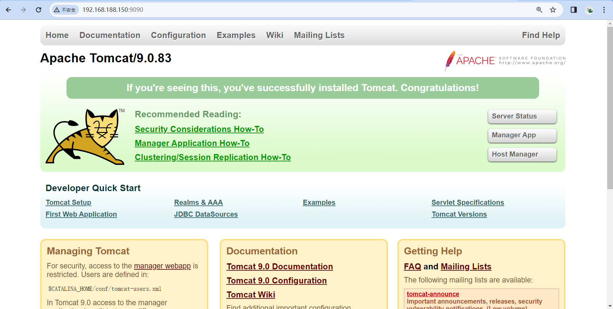
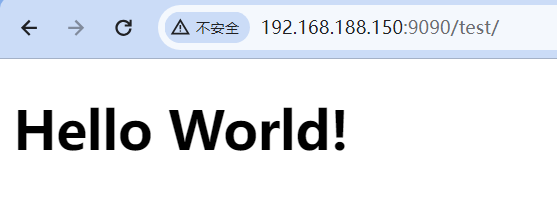

# Dockerfile部署Tomcat

分析：需要tomcat压缩包，tomcat依赖于jdk，因此还需要jdk压缩包

```shell
[root@nhk tomcat]# pwd
/opt/software/tomcat
[root@nhk tomcat]# ll
total 196868
-rw-r--r--. 1 root root  11801705 Nov 25 22:41 apache-tomcat-9.0.83.tar.gz
-rw-r--r--. 1 root root 189784266 Dec 25  2017 jdk-8u152-linux-x64.tar.gz
-rw-r--r--. 1 root root         0 Nov 25 22:42 readme.txt
```

## 1）编写Dockerfile文件

```shell
[root@nhk tomcat]# vim Dockerfile
```

Dockerfile文件内容如下

```dockerfile
FROM centos
MAINTAINER nhk<13605975424@163.com>

COPY readme.txt /usr/local/readme.txt

ADD jdk-8u152-linux-x64.tar.gz /usr/local/
ADD apache-tomcat-9.0.83.tar.gz /usr/local/

#RUN yum -y install vim

ENV MYPATH /usr/local
WORKDIR $MYPATH

ENV JAVA_HOME /usr/local/jdk1.8.0_152
ENV CLASSPATH $JAVA_HOME/lib/dt.jar:$JAVA_HOME/lib/tools.jar
ENV CATALINA_HOME /usr/local/apache-tomcat-9.0.83
ENV CATALINA_BASH /usr/local/apache-tomcat-9.0.83
ENV PATH $PATH:$JAVA_HOME/bin:$CATALINA_HOME/lib:$CATALINA_HOME/bin

EXPOSE 8080

CMD /usr/local/apache-tomcat-9.0.83/bin/startup.sh && tail -F /usr/local/apache-tomcat-9.0.83/bin/logs/catalina.out
```

说明：

​	不知是何原因，我们	RUN yum -y install vim 总是报错，我们这里先将他注释了

## 2）docker build 构建镜像

```shell
[root@nhk tomcat]# docker build -t mytomcat:1.0 .
[+] Building 17.1s (10/10) FINISHED                                                                                                                          
 => [internal] load build definition from Dockerfile                                                                                                    0.0s
 => => transferring dockerfile: 729B                                                                                                                    0.0s
 => [internal] load .dockerignore                                                                                                                       0.0s
 => => transferring context: 2B                                                                                                                         0.0s
 => [internal] load metadata for docker.io/library/centos:latest                                                                                       15.2s
 => [1/5] FROM docker.io/library/centos@sha256:a27fd8080b517143cbbbab9dfb7c8571c40d67d534bbdee55bd6c473f432b177                                         0.0s
 => [internal] load build context                                                                                                                       0.0s
 => => transferring context: 285B                                                                                                                       0.0s
 => CACHED [2/5] COPY readme.txt /usr/local/readme.txt                                                                                                  0.0s
 => CACHED [3/5] ADD jdk-8u152-linux-x64.tar.gz /usr/local/                                                                                             0.0s
 => CACHED [4/5] ADD apache-tomcat-9.0.83.tar.gz /usr/local/                                                                                            0.0s
 => [5/5] WORKDIR /usr/local                                                                                                                            0.0s
 => exporting to image                                                                                                                                  1.8s
 => => exporting layers                                                                                                                                 1.8s
 => => writing image sha256:cffd0ea990a58cb72b3b9257e68b26fa6f327024d2657f83b66fd7d029c19066                                                            0.0s
 => => naming to docker.io/library/mytomcat:1.0                                                                                                         0.0s
```

查看新镜像

```shell
[root@nhk tomcat]# docker images | grep tomcat
mytomcat              1.0            cffd0ea990a5   About a minute ago   632MB
```


## 3）运行新镜像

```shell
[root@nhk tomcat]# docker run -d -p 9090:8080 --name my-tomcat -v /opt/data/tomcat/test:/usr/local/apache-tomcat-9.0.83/webapps/test -v /opt/data/tomcat/tomcatlogs:/usr/local/apache-tomcat-9.0.83/logs mytomcat:1.0 
0f93a4cf8a097c05803121053e1980caf215cc0580a20ff17c0e7c61e63367a7

[root@nhk tomcat]# docker exec -it my-tomcat /bin/bash
[root@0f93a4cf8a09 local]# pwd
/usr/local
[root@0f93a4cf8a09 local]# ls -l
total 0
drwxr-xr-x. 1 root root  45 Nov 26 03:56 apache-tomcat-9.0.83
drwxr-xr-x. 2 root root   6 Nov  3  2020 bin
drwxr-xr-x. 2 root root   6 Nov  3  2020 etc
drwxr-xr-x. 2 root root   6 Nov  3  2020 games
drwxr-xr-x. 2 root root   6 Nov  3  2020 include
drwxr-xr-x. 8   10  143 255 Sep 14  2017 jdk1.8.0_152
drwxr-xr-x. 2 root root   6 Nov  3  2020 lib
drwxr-xr-x. 3 root root  17 Sep 15  2021 lib64
drwxr-xr-x. 2 root root   6 Nov  3  2020 libexec
-rw-r--r--. 1 root root   0 Nov 26 03:42 readme.txt
drwxr-xr-x. 2 root root   6 Nov  3  2020 sbin
drwxr-xr-x. 5 root root  49 Sep 15  2021 share
drwxr-xr-x. 2 root root   6 Nov  3  2020 src
```

## 4）在外部访问Tomcat服务器



## 5）发布项目

由于我们前面做了容器卷，所以在本地发布即可

为了简单，我们手动编写一个简单的web项目

```shell
[root@nhk test]# pwd
/opt/data/tomcat/test
[root@nhk test]# mkdir WEB-INF
[root@nhk test]# cd WEB-INF/
[root@nhk test]# vim web.xml
```

web.xml

```xml
<?xml version="1.0" encoding="UTF-8"?>
<web-app id="WebApp_9" version="3.0" xmlns="http://java.sun.com/xml/ns/javaee" 
	xmlns:xsi="https://www.w3.org/2001/XMLSchema-instance" 
	xsi:schemaLocation="http://java.sun.com/xml/ns/javaee 
  http://java.sun.com/xml/ns/javaee/web-app_3_0.xsd">

</web-app>
```

```shell
[root@nhk WEB-INF]# cd ..
[root@nhk test]# vim index.jsp
```

index.jsp

```html
<%@ page language="java" contentType="text/html; charset=UTF-8" pageEncoding="UTF-8" %>
<!DOCTYPE html>
<html>
    <head>
        <title>JSP - Hello World</title>
    </head>
    <body>
        <h1><%= "Hello World!" %></h1>
    </body>
</html>
```

访问发现，项目部署成功，可以直接访问

