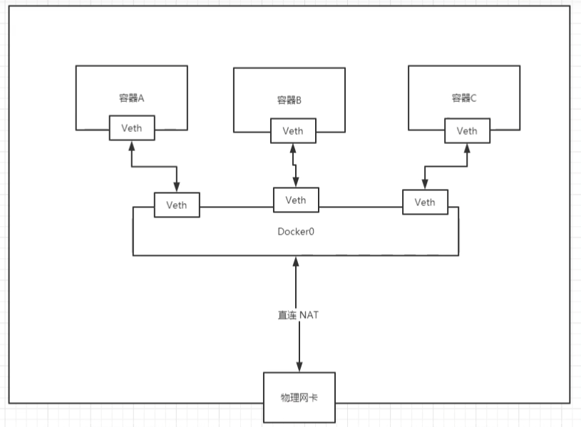
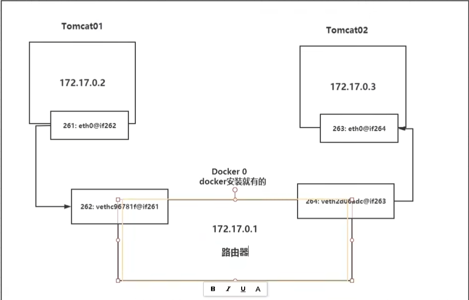

# Docker网络

## Docker网络是什么

Docker 网络是 Docker 容器之间进行通信和连接的网络环境。在 Docker 中，每个容器都有自己的网络命名空间，这意味着每个容器都有自己的网络接口、IP 地址和网络配置

Docker网络启动后，会在宿主机中建立一个名称为 docker0 的网卡

### 1）Docker不启动，默认的网络情况

```shell
[root@nhk ~]# ifconfig 
ens33: flags=4163<UP,BROADCAST,RUNNING,MULTICAST>  mtu 1500
        inet 192.168.188.150  netmask 255.255.255.0  broadcast 192.168.188.255
        inet6 fe80::382f:4868:f511:276f  prefixlen 64  scopeid 0x20<link>
        ether 00:0c:29:65:d3:21  txqueuelen 1000  (Ethernet)
        RX packets 4410  bytes 403698 (394.2 KiB)
        RX errors 0  dropped 0  overruns 0  frame 0
        TX packets 2896  bytes 516834 (504.7 KiB)
        TX errors 0  dropped 0 overruns 0  carrier 0  collisions 0

lo: flags=73<UP,LOOPBACK,RUNNING>  mtu 65536		# 本机回环地址
        inet 127.0.0.1  netmask 255.0.0.0
        inet6 ::1  prefixlen 128  scopeid 0x10<host>
        loop  txqueuelen 1000  (Local Loopback)
        RX packets 32  bytes 2592 (2.5 KiB)
        RX errors 0  dropped 0  overruns 0  frame 0
        TX packets 32  bytes 2592 (2.5 KiB)
        TX errors 0  dropped 0 overruns 0  carrier 0  collisions 0

virbr0: flags=4099<UP,BROADCAST,MULTICAST>  mtu 1500
        inet 192.168.122.1  netmask 255.255.255.0  broadcast 192.168.122.255
        ether 52:54:00:da:bd:9f  txqueuelen 1000  (Ethernet)
        RX packets 0  bytes 0 (0.0 B)
        RX errors 0  dropped 0  overruns 0  frame 0
        TX packets 0  bytes 0 (0.0 B)
        TX errors 0  dropped 0 overruns 0  carrier 0  collisions 0
        
# virbr0
在CentOS7安装过程中如果有选择相关虚拟化的服务安装服务后，启动网卡时会发现有一个以网桥连接的私网地址的virbr0网卡（virbr0网卡：它还有一个固定的默认IP地址 192.168.122.1），是做虚拟机网桥使用的，其作用是为连接其上的虚拟网卡提供NAT访问外网的功能。
```

### 2）Docker启动后，默认的网络情况

```shell
[root@nhk ~]# ifconfig    # 会产生一个名为 docker0 的虚拟网桥
docker0: flags=4099<UP,BROADCAST,MULTICAST>  mtu 1500			
        inet 172.17.0.1  netmask 255.255.0.0  broadcast 172.17.255.255
        inet6 fe80::42:22ff:fee7:54a1  prefixlen 64  scopeid 0x20<link>
        ether 02:42:22:e7:54:a1  txqueuelen 0  (Ethernet)
        RX packets 9  bytes 542 (542.0 B)
        RX errors 0  dropped 0  overruns 0  frame 0
        TX packets 15  bytes 1541 (1.5 KiB)
        TX errors 0  dropped 0 overruns 0  carrier 0  collisions 0

ens33: flags=4163<UP,BROADCAST,RUNNING,MULTICAST>  mtu 1500
        inet 192.168.188.150  netmask 255.255.255.0  broadcast 192.168.188.255
        inet6 fe80::382f:4868:f511:276f  prefixlen 64  scopeid 0x20<link>
        ether 00:0c:29:65:d3:21  txqueuelen 1000  (Ethernet)
        RX packets 4587  bytes 418581 (408.7 KiB)
        RX errors 0  dropped 0  overruns 0  frame 0
        TX packets 3024  bytes 548746 (535.8 KiB)
        TX errors 0  dropped 0 overruns 0  carrier 0  collisions 0

lo: flags=73<UP,LOOPBACK,RUNNING>  mtu 65536
        inet 127.0.0.1  netmask 255.0.0.0
        inet6 ::1  prefixlen 128  scopeid 0x10<host>
        loop  txqueuelen 1000  (Local Loopback)
        RX packets 32  bytes 2592 (2.5 KiB)
        RX errors 0  dropped 0  overruns 0  frame 0
        TX packets 32  bytes 2592 (2.5 KiB)
        TX errors 0  dropped 0 overruns 0  carrier 0  collisions 0

virbr0: flags=4099<UP,BROADCAST,MULTICAST>  mtu 1500
        inet 192.168.122.1  netmask 255.255.255.0  broadcast 192.168.122.255
        ether 52:54:00:da:bd:9f  txqueuelen 1000  (Ethernet)
        RX packets 0  bytes 0 (0.0 B)
        RX errors 0  dropped 0  overruns 0  frame 0
        TX packets 0  bytes 0 (0.0 B)
        TX errors 0  dropped 0 overruns 0  carrier 0  collisions 0
```

## Docker网络作用

Docker网络主要能做以下两件事：

-   容器间的互联和通信以及端口映射
-   容器IP变动时候可以通过服务名直接网络通信而不受到影响


## Docker network 常用命令

### 查看docker网络模式

查看默认创建的3大网络模式

```shell
[root@nhk ~]# docker network ls
NETWORK ID     NAME              DRIVER    SCOPE
8a75617d76d8   bridge            bridge    local
079c5936358a   host              host      local
b10eb48a66f7   none              null      local
```

### 查看网络源数据

命令格式

```shell
docker network inspect XXX网络名字
```

```shell
[root@nhk ~]# docker network inspect bridge   # 查看的是默认的bridge
[
    {
        "Name": "bridge",
        "Id": "8a75617d76d8174ec040263e5d66b9fd174ca72f23095d1857af66cef2ec1aab",
        "Created": "2023-06-05T01:30:20.686059947-04:00",
        "Scope": "local",
        "Driver": "bridge",
        "EnableIPv6": false,
        "IPAM": {
            "Driver": "default",
            "Options": null,
            "Config": [
                {
                    "Subnet": "172.17.0.0/16",
                    "Gateway": "172.17.0.1"
                }
            ]
        },
        "Internal": false,
        "Attachable": false,
        "Ingress": false,
        "ConfigFrom": {
            "Network": ""
        },
        "ConfigOnly": false,
        "Containers": {},
        "Options": {
            "com.docker.network.bridge.default_bridge": "true",
            "com.docker.network.bridge.enable_icc": "true",
            "com.docker.network.bridge.enable_ip_masquerade": "true",
            "com.docker.network.bridge.host_binding_ipv4": "0.0.0.0",
            "com.docker.network.bridge.name": "docker0",
            "com.docker.network.driver.mtu": "1500"
        },
        "Labels": {}
    }
]
[root@nhk ~]# 
```

### 删除网络

命令格式

```shell
docker network rm XXX网络名字
```

### 查看帮助

```shell
[root@nhk ~]# docker network --help

Usage:  docker network COMMAND

Manage networks

Commands:
  connect     Connect a container to a network		# 将容器连接到网络
  create      Create a network						# 创建网络
  disconnect  Disconnect a container from a network	# 断开容器与网络的连接
  inspect     Display detailed information on one or more networks # 显示一个或多个网络的详细信息
  ls          List networks					# 网络列表 
  prune       Remove all unused networks	# 删除所有未使用的网络
  rm          Remove one or more networks	# 删除一个或多个网络

Run 'docker network COMMAND --help' for more information on a command.
```

### 创建网络

```shell
[root@nhk ~]# docker network create --help

Usage:  docker network create [OPTIONS] NETWORK

Create a network

Options:
      --attachable           Enable manual container attachment
      --aux-address map      Auxiliary IPv4 or IPv6 addresses used by Network driver (default map[])
      --config-from string   The network from which to copy the configuration
      --config-only          Create a configuration only network
  -d, --driver string        Driver to manage the Network (default "bridge")
      --gateway strings      IPv4 or IPv6 Gateway for the master subnet
      --ingress              Create swarm routing-mesh network
      --internal             Restrict external access to the network
      --ip-range strings     Allocate container ip from a sub-range
      --ipam-driver string   IP Address Management Driver (default "default")
      --ipam-opt map         Set IPAM driver specific options (default map[])
      --ipv6                 Enable IPv6 networking
      --label list           Set metadata on a network
  -o, --opt map              Set driver specific options (default map[])
      --scope string         Control the network's scope
      --subnet strings       Subnet in CIDR format that represents a network segment
```

例如：

```shell
docker network create --dirver bridge --subnet 192.168.0.0/16 --gateway 192.168.0.1 mynet
```

### 演示案例

```shell
[root@nhk ~]# docker network create aaa_network    # 创建网络
dd09c16d817371405974f2d0e06eb27d5363aeb65255419ec4eca1fc0a57ef93
[root@nhk ~]# docker network ls		# 列出网络
NETWORK ID     NAME              DRIVER    SCOPE
dd09c16d8173   aaa_network       bridge    local
8a75617d76d8   bridge            bridge    local
079c5936358a   host              host      local
b10eb48a66f7   none              null      local
[root@nhk ~]# docker network rm aaa_network 	# 删除网络
aaa_network
[root@nhk ~]# docker network ls
NETWORK ID     NAME              DRIVER    SCOPE
8a75617d76d8   bridge            bridge    local
079c5936358a   host              host      local
b10eb48a66f7   none              null      local
```

说明：

​	在创建Docker网络时，有**默认参数 --dirver bridge**


## Docker网络模式

Docker网络模式有5种，主要是以下四种：

| 网络模式  | 描述                                                         | 命令                                            |
| --------- | ------------------------------------------------------------ | ----------------------------------------------- |
| bridge    | 为每个容器分配、设置IP等，并将容器连接到一个 `docker0`的虚拟网桥，**默认为该模式** | 使用 **--network bridge** 指定，默认使用docker0 |
| host      | 容器将不会模拟出自己的网卡，配置自己的IP等，而是**使用宿主机的IP和端口** | 使用 **--network host** 指定                    |
| none      | 容器有独立的 Network namespace，但并没有对其进行任何的网络设置，如分配 veth pair 和网桥连接，Ip等 | 使用 **--network none** 指定                    |
| container | 新创建的容器不会指定自己的网卡和配置自己的IP，而是和指定的容器共享IP、端口范围等 | 使用 --network container:NAME或容器ID指定       |

### 容器实例内默认网络IP生产规则

```shell
# 1.先启动两个ubuntu容器实例
[root@nhk ~]# docker run -it --name u1 ubuntu bash
root@030e1aa6f6b0:/# [root@nhk ~]#      # run进去，可以使用ctrl+q+p退出，容器不会停止
[root@nhk ~]# docker run -it --name u2 ubuntu bash
root@85377f94fa48:/# [root@nhk ~]#   
[root@nhk ~]# 
[root@nhk ~]# docker ps
CONTAINER ID   IMAGE     COMMAND   CREATED          STATUS          PORTS     NAMES
85377f94fa48   ubuntu    "bash"    49 seconds ago   Up 48 seconds             u2
030e1aa6f6b0   ubuntu    "bash"    3 minutes ago    Up 3 minutes              u1

# 2.使用命令 docker inspect 容器ID或名字   查看容器内部细节
[root@nhk ~]# docker inspect u1 | tail -20
            "Networks": {
                "bridge": {
                    "IPAMConfig": null,
                    "Links": null,
                    "Aliases": null,
                    "NetworkID": "8a75617d76d8174ec040263e5d66b9fd174ca72f23095d1857af66cef2ec1aab",
                    "EndpointID": "5c8beb5cd7d0be4b4b915f936eb6e43984901d7a424b85f3c8a7bc8e7b2000a4",
                    "Gateway": "172.17.0.1",
                    "IPAddress": "172.17.0.2",
                    "IPPrefixLen": 16,
                    "IPv6Gateway": "",
                    "GlobalIPv6Address": "",
                    "GlobalIPv6PrefixLen": 0,
                    "MacAddress": "02:42:ac:11:00:02",
                    "DriverOpts": null
                }
            }
        }
    }
]
[root@nhk ~]# docker inspect u2 | tail -20
            "Networks": {
                "bridge": {
                    "IPAMConfig": null,
                    "Links": null,
                    "Aliases": null,
                    "NetworkID": "8a75617d76d8174ec040263e5d66b9fd174ca72f23095d1857af66cef2ec1aab",
                    "EndpointID": "a82734da07cde955ca4267afdf62840c5be092567a0611a5b8f69a7013c6cb2a",
                    "Gateway": "172.17.0.1",
                    "IPAddress": "172.17.0.3",
                    "IPPrefixLen": 16,
                    "IPv6Gateway": "",
                    "GlobalIPv6Address": "",
                    "GlobalIPv6PrefixLen": 0,
                    "MacAddress": "02:42:ac:11:00:03",
                    "DriverOpts": null
                }
            }
        }
    }
]
[root@nhk ~]# 
# 从上面可以看到 u1 使用的是 172.17.0.2
#			   u2 使用的是 172.17.0.3

# 3.接下来关闭 u2 实例，新建u3，查看ip变化情况
[root@nhk ~]# docker stop u2
u2
[root@nhk ~]# docker run -it --name u3 ubuntu bash
root@3047ee811de3:/# [root@nhk ~]# 
[root@nhk ~]# docker inspect u3 |tail -20
            "Networks": {
                "bridge": {
                    "IPAMConfig": null,
                    "Links": null,
                    "Aliases": null,
                    "NetworkID": "8a75617d76d8174ec040263e5d66b9fd174ca72f23095d1857af66cef2ec1aab",
                    "EndpointID": "eba5ee2d3a1fb3df36a6b5c8490e0f3b45e27fd7ef4cff6e3a067a375b064b0e",
                    "Gateway": "172.17.0.1",
                    "IPAddress": "172.17.0.3",
                    "IPPrefixLen": 16,
                    "IPv6Gateway": "",
                    "GlobalIPv6Address": "",
                    "GlobalIPv6PrefixLen": 0,
                    "MacAddress": "02:42:ac:11:00:03",
                    "DriverOpts": null
                }
            }
        }
    }
]
[root@nhk ~]# 
# 观察发现，u3使用了 172.17.0.3 ,当u2再次运行的时候，就使用不了 172.17.0.3 了，网络就会发生变化
```

总结

​	**Dokcer容器内部的IP是有可能会发生变化的**

### Docker网络——bridge（桥接）

bridge 模式 是什么？

​	Docker服务默认会创建一个名为 docker0 网桥（其上有一个docker0内部接口），该桥接网络的名称为docker0，**它在内核层连通了其他的物理或虚拟网卡**，这就**将所有的容器和本地主机都放到了同一个物理网络**。	Docker默认指定了 docker0 接口的IP地址和子网掩码，**让主机和容器之间可以通过网桥相互通信**。

```shell
# 查看 bridge 网络的详细信息，并通过 grep 获取名称项
[root@nhk ~]# docker network inspect bridge | grep name
            "com.docker.network.bridge.name": "docker0",
            
[root@nhk ~]# ifconfig | grep docker
docker0: flags=4163<UP,BROADCAST,RUNNING,MULTICAST>  mtu 1500
```

-   Docker使用Linux桥接，在宿主机虚拟一个Docker容器网桥（docker0），Docker启动一个容器时**会根据Docker网桥的网段分配给容器一个IP地址**，称为 `Container-IP`，同时**Docker网桥是每个容器的默认网关**。因为在同一个宿主机内的容器都接入同一个网桥，这样**容器之间就能够通过容器的 Container-IP 直接通信**。

-   docker run 的时候，没有指定network 的话，默认使用的网络模式就是bridge，使用的就是docker0。在宿主机ifconfig，就可以看到docker0 和自己 create 的network eth0，eth1，eth2...... ，分别代表网卡一、网卡二、网卡三...... ，lo 代表 127.0.0.1 ，即 localhost，inter addr 用来表示网卡的IP地址
    -   **网桥docker0 创建一对对等虚拟设备接口，一个叫 veth，另一个叫 eth0**，成对匹配
    -   整个宿主机的网桥模式都是 docker0，类似一个交换机有一堆接口，每个接口叫**veth**，在本地主机和容器内分别创建一个虚拟接口，并让它们彼此连通（这样一对接口叫 ==veth pair==）
    -   每个容器实例内部也有一块网卡，每个接口叫**eth0**。

-   docker0 上面的每个veth 匹配某个容器实例内部的 eth0，两两配对，一一匹配

通过上述，将宿主机上的所有容器都连接到这个内部网络，两个容器在同一个网络下，会从这个网关拿到分配的ip，此时两个容器的网络是互通的。

下面是一个Docker网络模型图：



下面通过代码来验证

```shell
# 启动两个容器实例
[root@nhk ~]# docker run -itd --name centos7001 centos7:ssh /bin/bash
f833d07afbe36c59698e68629229f8986d625305538643d145ef38e9cf0461b9
[root@nhk ~]# docker run -itd --name centos7002 centos7:ssh /bin/bash
18a43817e08e4d6ebdb1db8b645896edabd3e1a234980a6fe28716e02078ada3

# 查看宿主机
[root@nhk ~]# ip addr
...
12: veth4e2c0a0@if11: <BROADCAST,MULTICAST,UP,LOWER_UP> mtu 1500 qdisc noqueue master docker0 state UP group default 
    link/ether 52:69:13:f4:6c:2f brd ff:ff:ff:ff:ff:ff link-netnsid 0
    inet6 fe80::5069:13ff:fef4:6c2f/64 scope link 
       valid_lft forever preferred_lft forever
14: veth65be1b1@if13: <BROADCAST,MULTICAST,UP,LOWER_UP> mtu 1500 qdisc noqueue master docker0 state UP group default 
    link/ether 36:c4:4b:a7:a0:d5 brd ff:ff:ff:ff:ff:ff link-netnsid 1
    inet6 fe80::34c4:4bff:fea7:a0d5/64 scope link 
       valid_lft forever preferred_lft forever
# 查看到了      12: veth4e2c0a0@if11     14: veth65be1b1@if13  两个veth pair


# 进入容器内部查看
[root@nhk ~]# docker exec -it centos7001 /bin/bash
[root@f833d07afbe3 /]# ip addr
...
11: eth0@if12: <BROADCAST,MULTICAST,UP,LOWER_UP> mtu 1500 qdisc noqueue state UP group default 
    link/ether 02:42:ac:11:00:02 brd ff:ff:ff:ff:ff:ff link-netnsid 0
    inet 172.17.0.2/16 brd 172.17.255.255 scope global eth0
       valid_lft forever preferred_lft forever

[root@nhk ~]# docker exec -it centos7002 /bin/bash
[root@18a43817e08e /]# ip addr
...
13: eth0@if14: <BROADCAST,MULTICAST,UP,LOWER_UP> mtu 1500 qdisc noqueue state UP group default 
    link/ether 02:42:ac:11:00:03 brd ff:ff:ff:ff:ff:ff link-netnsid 0
    inet 172.17.0.3/16 brd 172.17.255.255 scope global eth0
       valid_lft forever preferred_lft forever
# 两个容器分别查看到了 11: eth0@if12    13: eth0@if14 

刚好与宿主机查到的 12: veth4e2c0a0@if11     14: veth65be1b1@if13 相对应了，证明 veth，eth0，成对匹配
```

下面是它们的网络模型：



### Docker网络——host（主机模式）

host 模式是什么？

​	**直接使用宿主机的IP与外界进行通信**，不需要额外进行NAT转换

​	说白了：就是容器和宿主机共享网络

-   容器将**不会获得**一个独立的 Network Namespace ，而是和宿主机共用一个Network Namespace。容器**将不会虚拟出自己的网卡，而是直接使用宿主机的IP和端口**

演示

```shell
[root@nhk ~]# docker run -itd -p 8083:8080 --network host --name centos7003 centos7:ssh /bin/bash
WARNING: Published ports are discarded when using host network mode  # 警告：使用主机网络模式时，已发布的端口将被丢弃
05ce66cbb2628e9ef21fbfba0ebe4ed5829a3a28e7f32fc774b3f3b7718390a8
[root@nhk ~]# docker ps   # 此时，我们查看容器，发现我们映射出去的端口没有成功映射出去
CONTAINER ID   IMAGE         COMMAND       CREATED          STATUS          PORTS     NAMES
05ce66cbb262   centos7:ssh   "/bin/bash"   4 minutes ago    Up 4 minutes              centos7003

# 这里遇到了问题： docker启动时总是遇见怎么个警告
# 原因： docker启动时指定 --network=host 或 -net=host，如果还指定了端口映射，那么这时候就会有这么个警告，并且通过 -p 设置的参数将不会起到任何作用，端口号会以主机端口号为主，重复时则递增。
# 解决方法： 使用docker的其他网络模式，例如 --network=bridge，就这就解决了，或者是无视这个警告

[root@nhk ~]# docker inspect centos7003 | tail -n 20
            "Networks": {
                "host": {
                    "IPAMConfig": null,
                    "Links": null,
                    "Aliases": null,
                    "NetworkID": "079c5936358a32cf4ebb844f0c5e6018471edde2eb2a05007cbb1f077b82d717",
                    "EndpointID": "4351a5ecafc6ff92ff7c4f04554391b71036570606a78d7e4882b1b389c4ed30",
                    "Gateway": "",		# 发现host模式下，容器没有分配网关和IP
                    "IPAddress": "",
                    "IPPrefixLen": 0,
                    "IPv6Gateway": "",
                    "GlobalIPv6Address": "",
                    "GlobalIPv6PrefixLen": 0,
                    "MacAddress": "",
                    "DriverOpts": null
                }
            }
        }
    }
]

# 进入容器查看ip
[root@nhk ~]# docker exec -it centos7003 /bin/bash
[root@nhk /]# ifconfig 
docker0: flags=4163<UP,BROADCAST,RUNNING,MULTICAST>  mtu 1500
        inet 172.17.0.1  netmask 255.255.0.0  broadcast 172.17.255.255
        inet6 fe80::42:33ff:fe89:8eda  prefixlen 64  scopeid 0x20<link>
        ether 02:42:33:89:8e:da  txqueuelen 0  (Ethernet)
        RX packets 0  bytes 0 (0.0 B)
        RX errors 0  dropped 0  overruns 0  frame 0
        TX packets 13  bytes 1752 (1.7 KiB)
		..
		
# 查看后发现，host 模式的网络配置与宿主机一致
```

总结

​	**使用 host 模式时，端口映射没有意义，因此不推荐使用 -p 参数**

那如果没有 -p 设置端口映射了，我们怎么访问容器内的8083端口呢？

-   在 host 模式下，容器会借用宿主机的IP地址，所有容器与宿主机共享IP，此时也直接使用宿主机的对应端口访问8083，即通过 宿主机ip:8083 方式访问

-   host模式的好处，外部主机可以与容器直接进行通信


### Docker网络——none（不配置）

none 模式是什么？

​	在none模式下，并不为Docker容器进行任何的网络配置

​	也就是说，这个Docker容器没有网卡、IP、路由等信息，只有lo标识（127.0.0.1的本地回环）

​	此时，需要我们自己为Docker容器添加网卡、配置IP等

演示

```shell
[root@nhk ~]# docker run -itd -p 8084:8080 --network none --name centos7004 centos7:ssh /bin/bash
6ed05e25ccecc1add0114aeb4e525546a83c75406c5dd49be4998a6f52506e9d
[root@nhk ~]# docker inspect centos7004 | tail -n 20
            "Networks": {
                "none": {
                    "IPAMConfig": null,
                    "Links": null,
                    "Aliases": null,
                    "NetworkID": "b10eb48a66f7d2ef959475a8a90b66b5356c053d9fec87d083949aea39a37924",
                    "EndpointID": "2174d69badad4969b4245b733a38d6f1083045207a8d566e0d5dedb857c84268",
                    "Gateway": "",
                    "IPAddress": "",
                    "IPPrefixLen": 0,
                    "IPv6Gateway": "",
                    "GlobalIPv6Address": "",
                    "GlobalIPv6PrefixLen": 0,
                    "MacAddress": "",
                    "DriverOpts": null
                }
            }
        }
    }
]
[root@nhk ~]# docker exec -it centos7004 /bin/bash
[root@6ed05e25ccec /]# ip addr   # 只有lo
1: lo: <LOOPBACK,UP,LOWER_UP> mtu 65536 qdisc noqueue state UNKNOWN group default qlen 1000
    link/loopback 00:00:00:00:00:00 brd 00:00:00:00:00:00
    inet 127.0.0.1/8 scope host lo
       valid_lft forever preferred_lft forever
```


### Docker网络——container

container 模式是什么？

​	**新建的容器和已经存在的一个容器共享一个网络IP配置**，而不是和宿主机共享。新创建的容器不会创建自己的网卡信息、配置IP等，而是和一个指定的容器共享IP、端口范围等。

​	同样，两个容器除了网络方面，其他的如文件系统、进程列表等都是隔离的

演示

```shell
[root@nhk ~]# docker run -itd -p 8085:8080  --name centos7005 centos7:ssh
3ec3291fa0e87c9ac2a61f0c4435fd1b850410f00b2be1cfcf0aa9600b13d977
[root@nhk ~]# docker run -itd -p 8086:8080 --network container:centos7005 --name centos7006 centos7:ssh 
docker: Error response from daemon: conflicting options: port publishing and the container type network mode.
See 'docker run --help'.

# 报错，相当于centos7005与 centos7006公用同一个ip同一个端口，导致端口冲突
```

再次演示

```shell
# Alpine Linux 是一款独立的、非商用的Linux发行版，专为追求安全的、简单的和资源效率的用户而设计。这个Linux 很适合做Docker的基础镜像，因为它非常的小巧，特别适合容器打包
# 启动容器 alpine1
[root@nhk ~]# docker run -it --name alpine1 alpine /bin/sh
/ # 

# 启动容器 alpine2
[root@nhk ~]# docker run -it --network container:alpine1 --name alpine2 alpine /bin/sh
/ # 


# 在容器 alpine1 输入   观察到  19: eth0@if20  172.17.0.4
/ # ip addr
1: lo: <LOOPBACK,UP,LOWER_UP> mtu 65536 qdisc noqueue state UNKNOWN qlen 1000
    link/loopback 00:00:00:00:00:00 brd 00:00:00:00:00:00
    inet 127.0.0.1/8 scope host lo
       valid_lft forever preferred_lft forever
19: eth0@if20: <BROADCAST,MULTICAST,UP,LOWER_UP,M-DOWN> mtu 1500 qdisc noqueue state UP 
    link/ether 02:42:ac:11:00:04 brd ff:ff:ff:ff:ff:ff
    inet 172.17.0.4/16 brd 172.17.255.255 scope global eth0
       valid_lft forever preferred_lft forever
/ # 

# 在容器 alpine2 输入   观察到  19: eth0@if20  172.17.0.4 ，验证了两个容器共用了网络配置
/ # ip addr
1: lo: <LOOPBACK,UP,LOWER_UP> mtu 65536 qdisc noqueue state UNKNOWN qlen 1000
    link/loopback 00:00:00:00:00:00 brd 00:00:00:00:00:00
    inet 127.0.0.1/8 scope host lo
       valid_lft forever preferred_lft forever
19: eth0@if20: <BROADCAST,MULTICAST,UP,LOWER_UP,M-DOWN> mtu 1500 qdisc noqueue state UP 
    link/ether 02:42:ac:11:00:04 brd ff:ff:ff:ff:ff:ff
    inet 172.17.0.4/16 brd 172.17.255.255 scope global eth0
       valid_lft forever preferred_lft forever
/ # 


# 此时关闭容器 apline1，再看看容器apline2 的网络配置，发现没有了，只有一个lo了
/ # ip addr
1: lo: <LOOPBACK,UP,LOWER_UP> mtu 65536 qdisc noqueue state UNKNOWN qlen 1000
    link/loopback 00:00:00:00:00:00 brd 00:00:00:00:00:00
    inet 127.0.0.1/8 scope host lo
       valid_lft forever preferred_lft forever
/ # 
```


## 自定义网络（也使用bridge）

### 没有自定义网络之前

1）创建两个容器实例

```shell
[root@nhk ~]# docker run -itd -p 8081:8080 --name centos7001 centos7:ssh 
bf0c0411632b8737d68dac0fd3ff0b4e599d5672b6a13befafdc1881787cdc99
[root@nhk ~]# docker run -itd -p 8082:8080 --name centos7002 centos7:ssh 
683d89bb0c261b845cf81034ef934de0a4ec17e3ba01a2eeb391b1c4da9b953d
```

说明：

​	我们在创建容器时，如果没有指定网络，**默认就是 -net bridge**

2）打开两个终端分别进入两个容器，并查看IP

```shell
[root@nhk ~]# docker exec -it centos7001 /bin/bash
[root@bf0c0411632b /]# 
[root@bf0c0411632b /]# ifconfig 
eth0: flags=4163<UP,BROADCAST,RUNNING,MULTICAST>  mtu 1500
        inet 172.17.0.2  netmask 255.255.0.0  broadcast 172.17.255.255
...

[root@nhk ~]# docker exec -it centos7002 /bin/bash
[root@683d89bb0c26 /]# 
[root@683d89bb0c26 /]# ifconfig 
eth0: flags=4163<UP,BROADCAST,RUNNING,MULTICAST>  mtu 1500
        inet 172.17.0.3  netmask 255.255.0.0  broadcast 172.17.255.255
...
```

3）两个容器按照IP地址ping

```shell
# centos7001 屏 centos7002 能ping通
[root@bf0c0411632b /]# ping 172.17.0.3
PING 172.17.0.3 (172.17.0.3) 56(84) bytes of data.
64 bytes from 172.17.0.3: icmp_seq=1 ttl=64 time=0.079 ms
64 bytes from 172.17.0.3: icmp_seq=2 ttl=64 time=0.180 ms
^C
--- 172.17.0.3 ping statistics ---
2 packets transmitted, 2 received, 0% packet loss, time 1002ms
rtt min/avg/max/mdev = 0.079/0.129/0.180/0.051 ms
[root@bf0c0411632b /]# 

# centos7002 屏 centos7001 能ping通
[root@683d89bb0c26 /]# ping 172.17.0.2
PING 172.17.0.2 (172.17.0.2) 56(84) bytes of data.
64 bytes from 172.17.0.2: icmp_seq=1 ttl=64 time=0.063 ms
64 bytes from 172.17.0.2: icmp_seq=2 ttl=64 time=0.177 ms
64 bytes from 172.17.0.2: icmp_seq=3 ttl=64 time=0.143 ms
^C
--- 172.17.0.2 ping statistics ---
3 packets transmitted, 3 received, 0% packet loss, time 2004ms
rtt min/avg/max/mdev = 0.063/0.127/0.177/0.049 ms
[root@683d89bb0c26 /]# 
```

4）两个容器按照服务名ping

```shell
[root@bf0c0411632b /]# ping centos7002
ping: centos7002: Name or service not known

[root@683d89bb0c26 /]# ping centos7002
ping: centos7002: Name or service not known

# 都ping不通
```

### 用了自定义网络之后

1）自定义桥接网络，自定义网络默认使用的是桥接网络bridge

```shell
[root@nhk ~]# docker network create test_network
59aa9546e3270fbd1076d7daa2cd75142876d69d10854c9046fec59dc10542cf
[root@nhk ~]# docker network ls
NETWORK ID     NAME           DRIVER    SCOPE
d36aa7b6e75b   bridge         bridge    local
079c5936358a   host           host      local
b10eb48a66f7   none           null      local
59aa9546e327   test_network   bridge    local
```

2）新建容器并加入自定义网络

```shell
[root@nhk ~]# docker run -itd -p 8081:8080 --network test_network --name centos7001 centos7:ssh 
ea495df658d3d6a102c8c23c5c9cf4fbed660b0bccefca0d4203581cbfa8c9ca

[root@nhk ~]# docker run -itd -p 8082:8080 --network test_network --name centos7002 centos7:ssh 
963e806885fd73cdb2ac1b61080e3a578d1a34157dfbb68ffc8cc900f6345bb8
```

3）容器相互ping

```shell
[root@ea495df658d3 /]# ping 172.18.0.3    
PING 172.18.0.3 (172.18.0.3) 56(84) bytes of data.
64 bytes from 172.18.0.3: icmp_seq=1 ttl=64 time=0.066 ms
64 bytes from 172.18.0.3: icmp_seq=2 ttl=64 time=0.175 ms
^C
--- 172.18.0.3 ping statistics ---
2 packets transmitted, 2 received, 0% packet loss, time 1001ms
rtt min/avg/max/mdev = 0.066/0.120/0.175/0.055 ms
[root@ea495df658d3 /]# 

[root@963e806885fd /]# ping 172.18.0.2
PING 172.18.0.2 (172.18.0.2) 56(84) bytes of data.
64 bytes from 172.18.0.2: icmp_seq=1 ttl=64 time=0.141 ms
64 bytes from 172.18.0.2: icmp_seq=2 ttl=64 time=0.191 ms
^C
--- 172.18.0.2 ping statistics ---
2 packets transmitted, 2 received, 0% packet loss, time 1001ms
rtt min/avg/max/mdev = 0.141/0.166/0.191/0.025 ms
[root@963e806885fd /]# 

[root@ea495df658d3 /]# ping centos7002
PING centos7002 (172.18.0.3) 56(84) bytes of data.
64 bytes from centos7002.test_network (172.18.0.3): icmp_seq=1 ttl=64 time=0.042 ms
64 bytes from centos7002.test_network (172.18.0.3): icmp_seq=2 ttl=64 time=0.182 ms
^C
--- centos7002 ping statistics ---
2 packets transmitted, 2 received, 0% packet loss, time 1001ms
rtt min/avg/max/mdev = 0.042/0.112/0.182/0.070 ms
[root@ea495df658d3 /]# 

[root@963e806885fd /]# ping centos7001
PING centos7001 (172.18.0.2) 56(84) bytes of data.
64 bytes from centos7001.test_network (172.18.0.2): icmp_seq=1 ttl=64 time=0.053 ms
64 bytes from centos7001.test_network (172.18.0.2): icmp_seq=2 ttl=64 time=0.111 ms
^C
--- centos7001 ping statistics ---
2 packets transmitted, 2 received, 0% packet loss, time 1000ms
rtt min/avg/max/mdev = 0.053/0.082/0.111/0.029 ms
[root@963e806885fd /]# 

# 结果发现，当容器加入自定义网络后，相互通过ip ping 和 服务名 ping 都能ping通 
```

总结

​	**自定义网络本身就维护好了主机名和ip的对应关系**（ip和域名都能通）

## 网络连通 connect

网络连通：就是打通容器与网络

```shell
[root@nhk ~]# docker network --help

Usage:  docker network COMMAND

Manage networks

Commands:
  connect     Connect a container to a network
  create      Create a network
  disconnect  Disconnect a container from a network
  inspect     Display detailed information on one or more networks
  ls          List networks
  prune       Remove all unused networks
  rm          Remove one or more networks

Run 'docker network COMMAND --help' for more information on a command.
[root@nhk ~]# docker network connect --help

Usage:  docker network connect [OPTIONS] NETWORK CONTAINER

Connect a container to a network

Options:
      --alias strings           Add network-scoped alias for the container
      --driver-opt strings      driver options for the network
      --ip string               IPv4 address (e.g., "172.30.100.104")
      --ip6 string              IPv6 address (e.g., "2001:db8::33")
      --link list               Add link to another container
      --link-local-ip strings   Add a link-local address for the container
```

