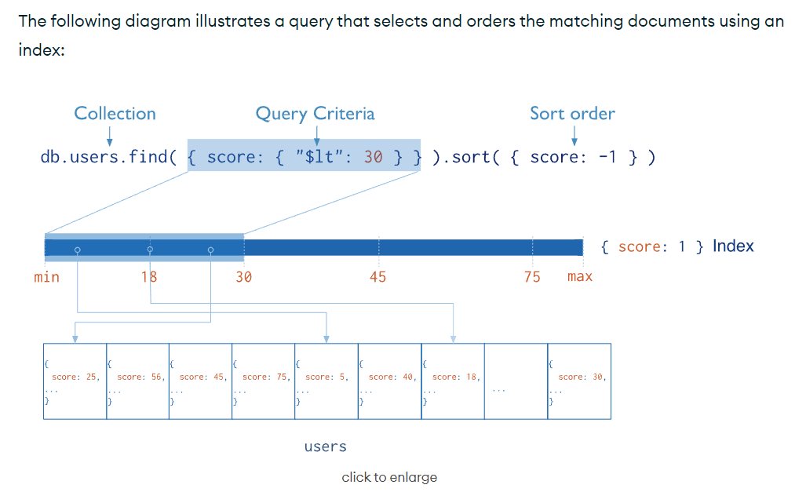

# MongoDB基本操作

## 1 数据库相关操作

### 1.1 查看所有的数据库

```shell
#查看所有的数据库
show dbs
或
show databases
```

```shell
> show dbs
admin 0.000GB
config 0.000GB
local 0.000GB
```

说明：

- **admin**：从权限的角度来看，这是"root"数据库。要是将一个用户添加到这个数据库，这个用户自动继承所有数据库的权限。
  - **一些特定的服务器端命令也只能从这个数据库运行**，比如列出所有的数据库或者关闭服务器。
- **local**：这个数据永远不会被复制，可以用来存储限于本地单台服务器的任意集合
- **config**：当Mongo用于分片设置时，config数据库在内部使用，**用于保存分片的相关**

warning 强调

​我们尽量不要去操作这些数据库，如果要使用可以创建自己的库

:::

### 1.2 选择数据库

```shell
#通过use关键字切换数据库
# 如果数据库不存在则自动创建
use 数据库名称
```

```shell
> use admin
switched to db admin
```

### 1.3 创建数据库

:::tip

我们使用use命令切换数据库的时候，MongoDB会自动创建数据库，但是**插入数据时才会创建数据库**（达到一个懒加载的效果）

:::

```shell
#创建数据库
> use testdb
switched to db testdb

> show dbs 	#并没有创建数据库
admin 0.000GB
config 0.000GB
local 0.000GB

#说明：
# 在MongoDB中，数据库是自动创建的，通过use切换到新数据库中，进行插入数据即可自动创建数据库
# 当数据库中没有任何集合时，是不显示的


# 查看当前所在数据库
> db
testdb


# 插入数据
> db.user.insert({id:1,name:'zhangsan'})  # 插入数据
WriteResult({ "nInserted" : 1 })
> show dbs
admin 0.000GB
config 0.000GB
local 0.000GB
testdb 0.000GB  # 数据库自动创建 只有当插入数据时才会创建（懒执行，类似于scala中lazy关键字）
```

数据库名可以是满足以下条件的任意UTF-8字符串

- 不能是空字符串（`""`）
- 不得含有`' '`（空格）、`.`、`$`、`/`、`\`和`\0` (空字符)
- 应全部小写
- 最多64字节

有一些数据库名是保留的，可以直接访问这些有特殊作用的数据库。

- **admin**： 从权限的角度来看，这是"root"数据库。要是将一个用户添加到这个数据库，这个用户自动继承所有数据库的权限。
  - 一些特定的服务器端命令也只能从这个数据库运行，比如列出所有的数据库或者关闭服务器。
- **local:** 这个数据永远不会被复制，可以用来存储限于本地单台服务器的任意集合
- **config**: 当Mongo用于分片设置时，config数据库在内部使用，用于保存分片的相关信息

再次注意:

- 在 MongoDB 中，集合（collection）只有在内容插入后才会创建! 就是说，创建集合(数据表)后要再插入一个文档(记录)，集合才会真正创建

### 1.4 查看当前数据库

```shell
db
```

```shell
# 查看当前所在数据库
> db
testdb
```

### 1.5 删除数据库

```shell
db.dropDatabase()
```

> 提示：主要用来删除已经持久化的数据库

```shell
#先切换到要删除的数据中
> use testdb 
switched to db testdb
#删除数据库
> db.dropDatabase()
{ "ok" : 1 }
# 注意：我们现在即使删除了数据库，我们当前依然在 testdb中，这一点需要注意
> db
testdb

> show dbs
admin 0.000GB
config 0.000GB
local 0.000GB
```

## 2 集合相关操作

### 2.1 查看集合

```shell
> use testsb
switched to db testsb
# 查看集合
> show tables
> show collections
```

### 2.2 创建集合（collection）

- 1）**集合的显示创建**

``` shell
db.createCollection('集合名称',[options])

# optiosn 可以是如下参数：
#  capped 布尔类型 如果为true，则创建固定集合。固定集合是指有着固定大小的集合，当达到最大值时，它会自动覆盖最早的文档。该值为ture时，必须指定size
#  size  数值类型  为固定集合指定一个最大值，即字节数。
#  max   数值类型  指定固定集合中包含文档的最大数量
```

- 集合的命名规范：
  - 集合名不能是空字符串""。
  - 集合名不能含有`\0`字符（空字符），这个字符表示集合名的结尾。
  - 集合名不能以"system."开头，这是为系统集合保留的前缀。
  - 用户创建的集合名字不能含有保留字符。有些驱动程序的确支持在集合名里面包含，这是因为某些系统生成的集合中包含该字符。除非你要访问这种系统创建的集合，否则千万不要在名字里出现`$`

```shell
> db.createCollection('user')
{ "ok" : 1 }


#查看表（在mongodb中称之为collection）
> show tables
user
> show collections
user

> db.createCollection('products',{max:100,capped:true,size:5000})
{ "ok" : 1 }
> show collections
products
user
```

- 2）**集合的隐式创建**

即使用use切换/选择数据库

说明：

​- 当向一个集合中插入一个文档的时候，如果集合不存在，则会自动创建集合

​- 所以我们不需要手动提前创建出集合

```shell
> db.emps.insert({name:'nhk'})
WriteResult({ "nInserted" : 1 })

> show collections
emps
products
user
```

### 2.3 删除集合（collection）

```shell
#删除集合（表）
> db.集合名称.drop()  # 如果成功删除选定集合，则 drop() 方法返回 true，否则返回 false
```

```shell
> db.products.drop()
true
> show collections
emps
user
```

## 3 文档相关操作

官方手册：https://www.mongodb.com/docs/v5.0/crud/	

### 3.1 插入文档

在MongoDB中，存储的文档结构是一种类似于json的结构，称之为bson（全称为：`Binary JSON`）

- **插入单条文档**

```shell
db.集合名称.insert({'id':1,'username':'zhangsan','age':20})

db.集合名称.save({'id':1,'username':'zhangsan','age':20})
```

说明：

​- 插入的文档是BSON模式，所以所有的bson属性都可以省略引号不写

- **插入多条文档**

```shell
db.集合名称.insertMany(
	[<document1>, <document2>, ...],
	{
		writeConcern: 1,  # 写入策略，默认为 1，即要求确认写操作，0 是不要求
		ordered: true  # 指定是否按顺序写入，默认 true，按顺序写入
	}
)
```

- **脚本方式**

```shell
for (let i=0;i<100;i++){
	db.集合名称.insert({"_id":i, name:"zhangsan_"+1, age:23});
}
```

演示：

```shell
#插入单条
#语法：db.COLLECTION_NAME.insert(document)
> db.user.insert({'id':1,'username':'zhangsan','age':20})
WriteResult({ "nInserted" : 1 })

> db.user.save({id:2,username:'lisi',age:25})
WriteResult({ "nInserted" : 1 })

> db.user.save({})		# 只写一个花括号，啥也不写也可以
WriteResult({ "nInserted" : 1 })


# 插入多条
> db.user.insertMany([{username:'wangwu',age:20},{_id:1,username:'zhaoliu',age:18}])
{
	"acknowledged" : true,
	"insertedIds" : [
		ObjectId("6561bd904cd8dd8b8a7031bd"),
		1
	]
}

#查询数据
> db.user.find()
{ "_id" : ObjectId("6561bc9e4cd8dd8b8a7031ba"), "id" : 1, "username" : "zhangsan", "age" : 20 }
{ "_id" : ObjectId("6561bcc84cd8dd8b8a7031bb"), "id" : 2, "username" : "lisi", "age" : 25 }
{ "_id" : ObjectId("6561bcd34cd8dd8b8a7031bc") }
{ "_id" : ObjectId("6561bd904cd8dd8b8a7031bd"), "username" : "wangwu", "age" : 20 }
{ "_id" : 1, "username" : "zhaoliu", "age" : 18 }	# 这条文档的 _id 是我们手动指定的


# 使用inset插入多条文档
> db.user.insert([{username:'wangwu',age:23},{_id:2,username:'zhaoliu'}])
BulkWriteResult({
	"writeErrors" : [ ],
	"writeConcernErrors" : [ ],
	"nInserted" : 2,
	"nUpserted" : 0,
	"nMatched" : 0,
	"nModified" : 0,
	"nRemoved" : 0,
	"upserted" : [ ]
})


# 使用脚本插入
> for (let i=0;i<10;i++){
... db.user.insert({"_id":i, name:"zhangsan_"+1, age:23});
... }
WriteResult({ "nInserted" : 1 })
```

注意：

​- 在mongodb中，**每个文档都会有一个 `_id` 作为唯一标识**，`_id` 默认会自动生成如果手动指定将使用手动指定的值作为 `_id` 的值。

### 3.2 删除文档

通过remove()方法进行删除数据，语法如下

```json
db.集合名称.remove(
	<query>,
	{
		justOne: <boolean>,
		writeConcern: <document>
	}
)
```

**参数说明：**

- **query** :（可选）删除的文档的条件。 
- **justOne** : （可选）如果设为 true 或 1，则**只删除一个文档**，如果不设置该参数，或使用**默认值 false**，则删除所有匹配条件的文档。 
- **writeConcern** :（可选）抛出异常的级别。 

实例

```shell
> db.user.find()
{ "_id" : ObjectId("6561bc9e4cd8dd8b8a7031ba"), "id" : 1, "username" : "zhangsan", "age" : 20 }
{ "_id" : ObjectId("6561bcc84cd8dd8b8a7031bb"), "id" : 2, "username" : "lisi", "age" : 25 }
{ "_id" : ObjectId("6561bcd34cd8dd8b8a7031bc") }
{ "_id" : ObjectId("6561bd904cd8dd8b8a7031bd"), "username" : "wangwu", "age" : 20 }
{ "_id" : 1, "username" : "zhaoliu", "age" : 18 }
{ "_id" : ObjectId("6561be074cd8dd8b8a7031be"), "username" : "wangwu", "age" : 23 }
{ "_id" : 2, "username" : "zhaoliu" }
{ "_id" : 0, "name" : "zhangsan_1", "age" : 23 }
{ "_id" : 3, "name" : "zhangsan_1", "age" : 23 }
{ "_id" : 4, "name" : "zhangsan_1", "age" : 23 }
{ "_id" : 5, "name" : "zhangsan_1", "age" : 23 }
{ "_id" : 6, "name" : "zhangsan_1", "age" : 23 }
{ "_id" : 7, "name" : "zhangsan_1", "age" : 23 }
{ "_id" : 8, "name" : "zhangsan_1", "age" : 23 }
{ "_id" : 9, "name" : "zhangsan_1", "age" : 23 }

# 删除单条文档
> db.user.remove({_id:1})
WriteResult({ "nRemoved" : 1 })

> db.user.remove({_id:'ObjectId("6561bc9e4cd8dd8b8a7031ba")'})
WriteResult({ "nRemoved" : 0 })

> db.user.remove({age:25})
WriteResult({ "nRemoved" : 1 })		#删除了2条数据

#插入4条测试数据
db.user.insert({id:1,username:'zhangsan',age:20})
db.user.insert({id:2,username:'lisi',age:21})
db.user.insert({id:3,username:'wangwu',age:22})
db.user.insert({id:4,username:'zhaoliu',age:22})

# 测试只删除age=22的文档，并且只删除匹配的第一条文档
> db.user.remove({age:22},true)
WriteResult({ "nRemoved" : 1 }) #删除了1条数据


# 删除所有文档
> > db.user.remove({})
WriteResult({ "nRemoved" : 16 })

# 说明：为了简化操作，官方推荐使用deleteOne()与deleteMany()进行删除数据操作。
db.user.deleteOne({id:1})
db.user.deleteMany({}) #删除所有数据
```

### 3.3 更新文档

update() 方法用于更新已存在的文档。语法格式如下：

```shell
db.集合名称.update(
	<query>,
	<update>,
	{
		upsert: <boolean>,
		multi: <boolean>,
		writeConcern: <document>
	}
)
```

**参数说明：** 

- **query** : update的查询条件，类似sql update查询内where后面的。 
- **update** : update的对象和一些更新的操作符（如 \$,\$inc...）等，也可以理解为sql update查询内set后面的 
- **upsert** : (可选)，这个参数的意思是，如果不存在update的记录，是否插入objNew,true为插入，默认是false，不插入。 
- **multi** : (可选)，mongodb **默认是false,只更新找到的第一条记录**，如果这个参数为true,就把按条件查出来多条记录全部更新。 
- **writeConcern** :(可选)，抛出异常的级别（比较少使用）

说明：

​- **update必须加上更新条件**（这点与MySQL很不相同，MySQL可以不加条件，但是会更新全表）

​- **update语句默认更新匹配到的第一条记录**

```shell
# 插入模拟数据
> for(let i=0;i<10;i++){
... db.user.insert({name:'nhk_'+1, age:23, _id:i});
... }
WriteResult({ "nInserted" : 1 })
> db.user.insert({name:'nhk_9', age:30, _id:11})
WriteResult({ "nInserted" : 1 })
> db.user.find()
{ "_id" : 0, "name" : "nhk_1", "age" : 23 }
{ "_id" : 1, "name" : "nhk_1", "age" : 23 }
{ "_id" : 2, "name" : "nhk_1", "age" : 23 }
{ "_id" : 3, "name" : "nhk_1", "age" : 23 }
{ "_id" : 4, "name" : "nhk_1", "age" : 23 }
{ "_id" : 5, "name" : "nhk_1", "age" : 23 }
{ "_id" : 6, "name" : "nhk_1", "age" : 23 }
{ "_id" : 7, "name" : "nhk_1", "age" : 23 }
{ "_id" : 8, "name" : "nhk_1", "age" : 23 }
{ "_id" : 9, "name" : "nhk_1", "age" : 23 }
{ "_id" : 11, "name" : "nhk_9", "age" : 30 }


# 更新文档
#   注意：如果这样写，会删除掉其他的字段
> db.user.update({age:30},{age:31})
WriteResult({ "nMatched" : 1, "nUpserted" : 0, "nModified" : 1 })
> db.user.find()
{ "_id" : 0, "name" : "nhk_1", "age" : 23 }
{ "_id" : 1, "name" : "nhk_1", "age" : 23 }
{ "_id" : 2, "name" : "nhk_1", "age" : 23 }
{ "_id" : 3, "name" : "nhk_1", "age" : 23 }
{ "_id" : 4, "name" : "nhk_1", "age" : 23 }
{ "_id" : 5, "name" : "nhk_1", "age" : 23 }
{ "_id" : 6, "name" : "nhk_1", "age" : 23 }
{ "_id" : 7, "name" : "nhk_1", "age" : 23 }
{ "_id" : 8, "name" : "nhk_1", "age" : 23 }
{ "_id" : 9, "name" : "nhk_1", "age" : 23 }
{ "_id" : 11, "age" : 31 }		# 发现更新完以后，name字段不见了
# 说明：
#    在mongodb中，会先找到匹配的文档，将其删除后再插入


# 更新文档
# 		更新不存在的字段，会新增字段
> db.user.update({_id:9},{$set:{age:24,sex:'男'}})
WriteResult({ "nMatched" : 1, "nUpserted" : 0, "nModified" : 1 })
> db.user.find()
{ "_id" : 0, "name" : "nhk_1", "age" : 23 }
{ "_id" : 1, "name" : "nhk_1", "age" : 23 }
{ "_id" : 2, "name" : "nhk_1", "age" : 23 }
{ "_id" : 3, "name" : "nhk_1", "age" : 23 }
{ "_id" : 4, "name" : "nhk_1", "age" : 23 }
{ "_id" : 5, "name" : "nhk_1", "age" : 23 }
{ "_id" : 6, "name" : "nhk_1", "age" : 23 }
{ "_id" : 7, "name" : "nhk_1", "age" : 23 }
{ "_id" : 8, "name" : "nhk_1", "age" : 23 }
{ "_id" : 9, "name" : "nhk_1", "age" : 24, "sex" : "男" } # 只更新了想更新的属性，其他没有改变，并且新增了原本不存在的属性sex
{ "_id" : 11, "age" : 31 }


# 更新文档（更新匹配到的所有）
> db.user.update({age:23},{$set:{age:25}})		# 默认只更新匹配到的第一条文档
WriteResult({ "nMatched" : 1, "nUpserted" : 0, "nModified" : 1 })
> db.user.find()
{ "_id" : 0, "name" : "nhk_1", "age" : 25 }
{ "_id" : 1, "name" : "nhk_1", "age" : 23 }
{ "_id" : 2, "name" : "nhk_1", "age" : 23 }
{ "_id" : 3, "name" : "nhk_1", "age" : 23 }
{ "_id" : 4, "name" : "nhk_1", "age" : 23 }
{ "_id" : 5, "name" : "nhk_1", "age" : 23 }
{ "_id" : 6, "name" : "nhk_1", "age" : 23 }
{ "_id" : 7, "name" : "nhk_1", "age" : 23 }
{ "_id" : 8, "name" : "nhk_1", "age" : 23 }
{ "_id" : 9, "name" : "nhk_1", "age" : 24, "sex" : "男" }
{ "_id" : 11, "age" : 31 }
# 要想更新匹配到的所有文档，需要加上{multi:true}
> db.user.update({age:23},{$set:{age:25}},{multi:true})
WriteResult({ "nMatched" : 8, "nUpserted" : 0, "nModified" : 8 })
> db.user.find()
{ "_id" : 0, "name" : "nhk_1", "age" : 25 }
{ "_id" : 1, "name" : "nhk_1", "age" : 25 }
{ "_id" : 2, "name" : "nhk_1", "age" : 25 }
{ "_id" : 3, "name" : "nhk_1", "age" : 25 }
{ "_id" : 4, "name" : "nhk_1", "age" : 25 }
{ "_id" : 5, "name" : "nhk_1", "age" : 25 }
{ "_id" : 6, "name" : "nhk_1", "age" : 25 }
{ "_id" : 7, "name" : "nhk_1", "age" : 25 }
{ "_id" : 8, "name" : "nhk_1", "age" : 25 }
{ "_id" : 9, "name" : "nhk_1", "age" : 24, "sex" : "男" }
{ "_id" : 11, "age" : 31 }


# 更新文档，若不存在则插入文档
> db.user.update({age:23},{$set:{age:66}},{upsert:true})
WriteResult({
	"nMatched" : 0,
	"nUpserted" : 1,
	"nModified" : 0,
	"_id" : ObjectId("6561e44ed36a77465e78edd7")
})
> db.user.find()
{ "_id" : 0, "name" : "nhk_1", "age" : 25 }
{ "_id" : 1, "name" : "nhk_1", "age" : 25 }
{ "_id" : 2, "name" : "nhk_1", "age" : 25 }
{ "_id" : 3, "name" : "nhk_1", "age" : 25 }
{ "_id" : 4, "name" : "nhk_1", "age" : 25 }
{ "_id" : 5, "name" : "nhk_1", "age" : 25 }
{ "_id" : 6, "name" : "nhk_1", "age" : 25 }
{ "_id" : 7, "name" : "nhk_1", "age" : 25 }
{ "_id" : 8, "name" : "nhk_1", "age" : 25 }
{ "_id" : 9, "name" : "nhk_1", "age" : 24, "sex" : "男" }
{ "_id" : 11, "age" : 31 }
{ "_id" : ObjectId("6561e44ed36a77465e78edd7"), "age" : 66 }
```

### 3.4 查询数据

MongoDB查询文档使用 find() 方法。find方法以非结构化的方式来显示所有的文档

MongoDB 查询数据的语法格式如下：

```shell
db.集合名称.find([query],[projection])
```

- **query** ：可选，使用查询操作符指定**查询条件** 
- **projection** ：可选，使用投影操作符指定返回的键。查询时返回文档中所有键值， 只需省略该参数即可（默认省略）。 

如果你需要以易读的方式来读取数据，可以使用 pretty() 方法，语法格式如下： 

```shell
>db.集合名称.find().pretty()
```

注意：

- pretty() 方法以格式化的方式来显示所有文档。

条件查询：

| 操作 | **格式**                  | **范例**                                       | RDBMS中的类似语句   |
| ---- | ------------------------- | ---------------------------------------------- | ------------------- |
| =    | {\<key>:\<value> }        | db.col.find({"by":"程序员"}).pretty()          | where by = '程序员' |
| <    | {\<key>:{$lt: \<value>}}  | db.col.find({"likes": {$==lt==:50}}).pretty()  | where likes < 50    |
| <=   | {\<key>:{$lte: \<value>}} | db.col.find({"likes": {$==lte==:50}}).pretty() | where likes <= 50   |
| >    | {\<key>:{$gt:\<value>}}   | db.col.find({"likes": {$==gt==:50}}).pretty()  | where likes > 50    |
| \>=  | {\<key>:{$gte: \<value>}} | db.col.find({"likes": {$==gte==:50}}).pretty() | where likes >= 50   |
| !=   | {\<key>:{$ne:\<value>}}   | db.col.find({"likes": {$==ne==:50}}).pretty()  | where likes != 50   |

实例：

```shell
#插入测试数据
db.user.remove({})
db.user.insert({id:1,username:'zhangsan',age:20})
db.user.insert({id:2,username:'lisi',age:21})
db.user.insert({id:3,username:'wangwu',age:22})
db.user.insert({id:4,username:'zhaoliu',age:22})

# 查询全部文档
> db.user.find()
{ "_id" : ObjectId("6561e621e420c47ed5a8cf9d"), "id" : 1, "username" : "zhangsan", "age" : 20 }
{ "_id" : ObjectId("6561e621e420c47ed5a8cf9e"), "id" : 2, "username" : "lisi", "age" : 21 }
{ "_id" : ObjectId("6561e621e420c47ed5a8cf9f"), "id" : 3, "username" : "wangwu", "age" : 22 }
{ "_id" : ObjectId("6561e622e420c47ed5a8cfa0"), "id" : 4, "username" : "zhaoliu", "age" : 22 }

> db.user.find().pretty()
{
	"_id" : ObjectId("6561e621e420c47ed5a8cf9d"),
	"id" : 1,
	"username" : "zhangsan",
	"age" : 20
}
{
	"_id" : ObjectId("6561e621e420c47ed5a8cf9e"),
	"id" : 2,
	"username" : "lisi",
	"age" : 21
}
{
	"_id" : ObjectId("6561e621e420c47ed5a8cf9f"),
	"id" : 3,
	"username" : "wangwu",
	"age" : 22
}
{
	"_id" : ObjectId("6561e622e420c47ed5a8cfa0"),
	"id" : 4,
	"username" : "zhaoliu",
	"age" : 22
}

# 只查询id与username字段
> db.user.find({},{id:1,username:1})
{ "_id" : ObjectId("6561e621e420c47ed5a8cf9d"), "id" : 1, "username" : "zhangsan" }
{ "_id" : ObjectId("6561e621e420c47ed5a8cf9e"), "id" : 2, "username" : "lisi" }
{ "_id" : ObjectId("6561e621e420c47ed5a8cf9f"), "id" : 3, "username" : "wangwu" }
{ "_id" : ObjectId("6561e622e420c47ed5a8cfa0"), "id" : 4, "username" : "zhaoliu" }
```

#### AND 

```shell
db.集合名称.find({key1:value1, key2:value2})
```

类似于SQL的 WHERE key1=value1 AND key2=value2

```shell
> db.user.find({id:1,username:"zhangsan"}).pretty()
{
	"_id" : ObjectId("6561e621e420c47ed5a8cf9d"),
	"id" : 1,
	"username" : "zhangsan",
	"age" : 20
}

# and查询，id=1并且age>=21
> db.user.find({id:1,age:{$gte:20}}).pretty()
{
	"_id" : ObjectId("6561e621e420c47ed5a8cf9d"),
	"id" : 1,
	"username" : "zhangsan",
	"age" : 20
}


# 注意：在mongodb中，如果查询的字段有重复，后面的覆盖签名，如下
> db.user.find({username:'zhangsan',username:'lisi'}).pretty()
{
	"_id" : ObjectId("6561e621e420c47ed5a8cf9e"),
	"id" : 2,
	"username" : "lisi",
	"age" : 21
}
```

#### OR

MongoDB 中OR 条件使用了关键字 **$or**

```shell
db.集合名称.find(
 {
	$or:[
		{key1:value1},{key2:value2}
	]	
 }
).pretty()
```

类似于SQL的 WHERE key1=value1 OR key2=value2

```shell
# or查询，查询username=zhangsan or username=lisi
> db.user.find({$or:[{username:'zhangsan'},{username:'lisi'}]}).pretty()
{
	"_id" : ObjectId("6561e621e420c47ed5a8cf9d"),
	"id" : 1,
	"username" : "zhangsan",
	"age" : 20
}
{
	"_id" : ObjectId("6561e621e420c47ed5a8cf9e"),
	"id" : 2,
	"username" : "lisi",
	"age" : 21
}
```

#### AND 和 OR联合

类似于SQL的 WHERE age>20 AND (username='wangwu' OR username='zhaoliu')

```shell
> db.user.find({age:{$gt:20},$or:[{username:'wangwu'},{username:'zhaoliu'}]}).pretty()
{
	"_id" : ObjectId("6561e621e420c47ed5a8cf9f"),
	"id" : 3,
	"username" : "wangwu",
	"age" : 22
}
{
	"_id" : ObjectId("6561e622e420c47ed5a8cfa0"),
	"id" : 4,
	"username" : "zhaoliu",
	"age" : 22
}
```

#### 排序

```shell
# 排序查询
db.集合名称.find().sort({key1:1,key2:-1})
# 说明
#    1 升序
#   -1 降序
```

```shell
# 查询出id、username字段，并按照id倒序排序
> db.user.find({},{id:1,username:1}).sort({id:-1}) #按照id倒序排序
{ "_id" : ObjectId("6561e622e420c47ed5a8cfa0"), "id" : 4, "username" : "zhaoliu" }
{ "_id" : ObjectId("6561e621e420c47ed5a8cf9f"), "id" : 3, "username" : "wangwu" }
{ "_id" : ObjectId("6561e621e420c47ed5a8cf9e"), "id" : 2, "username" : "lisi" }
{ "_id" : ObjectId("6561e621e420c47ed5a8cf9d"), "id" : 1, "username" : "zhangsan" }
```

#### 分页

```shell
#分页查询：Skip()跳过几条，limit()查询条数
db.集合名称.find().limit(2).skip(1) #跳过1条数据，查询2条数据
```

```shell
> db.user.find().limit(2).skip(2)
{ "_id" : ObjectId("6561e621e420c47ed5a8cf9f"), "id" : 3, "username" : "wangwu", "age" : 22 }
{ "_id" : ObjectId("6561e622e420c47ed5a8cfa0"), "id" : 4, "username" : "zhaoliu", "age" : 22 }
```

#### 数值中查询

```shell
# 插入测试数据
> db.user.insert({id:5,username:'mazi',likes:['吃饭','睡觉','看美女']})

> db.user.find({username:'mazi',likes:"看美女"})
{ "_id" : ObjectId("6561f2b8e420c47ed5a8cfa1"), "id" : 5, "username" : "mazi", "likes" : [ "吃饭", "睡觉", "看美女" ] }

# $size 按照数值长度查询
# 下面，查询likes数值长度为3的
> db.user.find({likes:{$size:3}})
{ "_id" : ObjectId("6561f2b8e420c47ed5a8cfa1"), "id" : 5, "username" : "mazi", "likes" : [ "吃饭", "睡觉", "看美女" ] }
```

#### 模糊查询

注意：Mongo中没有模糊查询，但是可以通过正则表达式的方式实现类似于模糊查询的效果

类似于SQL中的 WHERE likes LIKE '%美女%' 

```shell
> db.user.find({likes:/美女/})
{ "_id" : ObjectId("6561f2b8e420c47ed5a8cfa1"), "id" : 5, "username" : "mazi", "likes" : [ "吃饭", "睡觉", "看美女" ] }
```

#### count

```shell
db.集合名称.find().count() #查询集合中文档总条数
db.集合名称.find({key1:value1}).count()
```

类似于SQL中的`SELECT count(key1) FROM ...`

```shell
> db.user.find().count()
4

# 查询 age>20 的文档条数
> db.user.find({age:{$gt:20}}).count()
3
```

#### distinct

```shell
db.集合名称.distinct('字段')
```

类似于SQL中，SELECT DISTINCT 字段 FROM ...

```shell
> db.user.distinct('age')
[ 20, 21, 22 ]
```

#### 指定返回字段

```shell
db.集合名称.find({条件},{key1:1,key2:1})
# 说明
#   1 返回
#   0 不返回
#	
```

```shell
# 只查询username与age字段
> db.user.find({},{username:1,age:1})
{ "_id" : ObjectId("6561e621e420c47ed5a8cf9d"), "username" : "zhangsan", "age" : 20 }
{ "_id" : ObjectId("6561e621e420c47ed5a8cf9e"), "username" : "lisi", "age" : 21 }
{ "_id" : ObjectId("6561e621e420c47ed5a8cf9f"), "username" : "wangwu", "age" : 22 }
{ "_id" : ObjectId("6561e622e420c47ed5a8cfa0"), "username" : "zhaoliu", "age" : 22 }
{ "_id" : ObjectId("6561f2b8e420c47ed5a8cfa1"), "username" : "mazi" }
# 查询结果不包含_id字段
> db.user.find({},{_id:0})
{ "id" : 1, "username" : "zhangsan", "age" : 20 }
{ "id" : 2, "username" : "lisi", "age" : 21 }
{ "id" : 3, "username" : "wangwu", "age" : 22 }
{ "id" : 4, "username" : "zhaoliu", "age" : 22 }
{ "id" : 5, "username" : "mazi", "likes" : [ "吃饭", "睡觉", "看美女" ] }

# 1 和 0 不能同时调用，否则报错
> db.user.find({},{username:1,age:0})
Error: error: {
	"ok" : 0,
	"errmsg" : "Cannot do exclusion on field age in inclusion projection",
	"code" : 31254,
	"codeName" : "Location31254"
}
```

## 4 $type

## 4.1 说明

`$type`操作符是基于BSON类型来检索集合中匹配的数据类型，并返回结果

MongoDB中可以使用的类型如下表所示：

| 类型                     | 数字 | 备注          |
| ------------------------ | ---- | ------------- |
| Double                   | 1    |               |
| String                   | 2    |               |
| Object                   | 3    |               |
| Array                    | 4    |               |
| Binary data              | 5    |               |
| Undefined                | 6    | 已废弃        |
| Object id                | 7    |               |
| Boolean                  | 8    |               |
| Date                     | 9    |               |
| Null                     | 10   |               |
| Regular Expression       | 11   |               |
| JavaScript               | 13   |               |
| Symbol                   | 14   |               |
| JavaScript（with scope） | 15   |               |
| 32-bit integer           | 16   |               |
| Timestamp                | 17   |               |
| 64-bit integer           | 18   |               |
| Min Key                  | 255  | Query with -1 |
| Max Key                  | 127  |               |

### 4.2 使用

 插入测试数据

```json
db.col.insert({
    title: 'PHP 教程',
    description: 'PHP是世界上最好的语言',
    by: 'nhk',
    url: 'http:www.php.com',
    tags: ['php'],
    likes: 200
});

db.col.insert({
    title: 'Java 教程',
    description: 'PHP狗都不用，Java一切皆对象',
    by: 'nhk',
    url: 'http:www.java.com',
    tags: ['java'],
    likes: 550
});

db.col.insert({
    title: 'MongoDB 教程',
    description: 'MongoDB是第一个支持事务的NoSQL数据库',
    by: 'nhk',
    url: 'http:www.mongodb.com',
    tags: ['mongodb'],
    likes: 100
});
```

如果想获取 col 集合中title字段为String的文档，就可以使用如下命令

```json
> db.col.find({title:{$type: 2}}).pretty()
{
	"_id" : ObjectId("6561faf1e420c47ed5a8cfa2"),
	"title" : "PHP 教程",
	"description" : "PHP是世界上最好的语言",
	"by" : "nhk",
	"url" : "http:www.php.com",
	"tags" : [
		"php"
	],
	"likes" : 200
}
{
	"_id" : ObjectId("6561faf1e420c47ed5a8cfa3"),
	"title" : "Java 教程",
	"description" : "PHP狗都不用，Java一切皆对象",
	"by" : "nhk",
	"url" : "http:www.java.com",
	"tags" : [
		"java"
	],
	"likes" : 550
}
{
	"_id" : ObjectId("6561faf3e420c47ed5a8cfa4"),
	"title" : "MongoDB 教程",
	"description" : "MongoDB是第一个支持事务的NoSQL数据库",
	"by" : "nhk",
	"url" : "http:www.mongodb.com",
	"tags" : [
		"mongodb"
	],
	"likes" : 100
}

# 或者
> db.col.find({title:{$type: 'string'}}).pretty()
{
	"_id" : ObjectId("6561faf1e420c47ed5a8cfa2"),
	"title" : "PHP 教程",
	"description" : "PHP是世界上最好的语言",
	"by" : "nhk",
	"url" : "http:www.php.com",
	"tags" : [
		"php"
	],
	"likes" : 200
}
{
	"_id" : ObjectId("6561faf1e420c47ed5a8cfa3"),
	"title" : "Java 教程",
	"description" : "PHP狗都不用，Java一切皆对象",
	"by" : "nhk",
	"url" : "http:www.java.com",
	"tags" : [
		"java"
	],
	"likes" : 550
}
{
	"_id" : ObjectId("6561faf3e420c47ed5a8cfa4"),
	"title" : "MongoDB 教程",
	"description" : "MongoDB是第一个支持事务的NoSQL数据库",
	"by" : "nhk",
	"url" : "http:www.mongodb.com",
	"tags" : [
		"mongodb"
	],
	"likes" : 100
}
```

如果想获取 col 集合中tags字段为Array的文档，就可以使用如下命令

```shell
> db.col.find({tags:{$type: 4}}).pretty()
# 或者
> db.col.find({tags:{$type: 'array'}}).pretty()
```

## 5 索引

官网：https://www.mongodb.com/docs/v5.0/indexes/

​			https://docs.mongodb.com/manual/indexes/

索引通常能够极大的提高查询的效率，如果没有索引，MongoDB在读取数据时必须扫描集合中的每个文件并选取那些符合查询条件的记录。 

这种扫描全集合的查询效率是非常低的，特别在处理大量的数据时，查询可以要花费几十秒甚至几分钟，这对网站 的性能是非常致命的。 

索引是特殊的数据结构，索引存储在一个易于遍历读取的数据集合中，索引是对数据库表中一列或多列的值进行排 序的一种结构 。

**索引原理**



Fundamentally, indexes in MongoDB are similar to indexes in other database systems. MongoDB defines indexes at the [collection](https://www.mongodb.com/docs/v5.0/reference/glossary/#std-term-collection) level and supports indexes on any field or sub-field of the documents in a MongoDB collection.（从根本上说，MongoDB中的索引与其他数据库系统中的索引相似。MongoDB在集合级别定义索引，并支持在MongoDB集合中文档的任何字段或子字段上创建索引。）

### 5.1 查看索引

```shell
#查看索引
> db.user.getIndexes()
[ { "v" : 2, "key" : { "_id" : 1 }, "name" : "_id_" } ]
```

### 5.2 创建索引

普通索引：https://www.mongodb.com/docs/v5.0/core/index-single/

复合索引：https://www.mongodb.com/docs/v5.0/core/index-compound/

```shell
db.collection.createIndex( keys, <options> )
# 例如： db.集合名称.createIndex({title:1})
```

说明：

​- 语法中 keys 值为你要创建的索引字段，1 为指定按升序创建索引，-1 为指定按降序创建索引。

createIndex()方法接收的可选参数如下：

| Parameter              | Type          | Description                                                                                                                                 |
| ---------------------- | ------------- | ------------------------------------------------------------------------------------------------------------------------------------------- |
| **background**         | Boolean       | 建索引过程会阻塞其它数据库操作，background可指定以后台方式创建索引，即增加"background”可选参数。"background”默认值为false。                 |
| **unique**             | Boolean       | 建立的索引是否唯一。指定为true创建唯一索引。默认值为false                                                                                   |
| **name**               | string        | 索引的名称。如果未指定，MongoDB的通过连接索引的字段名和排序顺序生成一个索引名称。                                                           |
| sparse                 | Boolean       | 对文档中不存在的字段数据不启用索引；这个参数需要特别注意，如果设置为true的话，在索引字段中不会查询出不包含对应字段的文档。。默认值为 false. |
| **expireAfterSeconds** | integer       | 指定一个以秒为单位的数值，完成TTL设定，设定集合的生存时间。                                                                                 |
| v                      | index version | 索引的版本号。默认的索引版本取决于mongod创建索引时运行的版本。                                                                              |
| weights                | document      | 索引权重值，效值在1到 99,999之间，表示该索引相对于其他索引字段的得分权重。                                                                  |
| default_language       | string        | 对于文本索引，该参数决定了停用词及词干和词器的规则的列表。默认为英语                                                                        |
| language_override      | string        | 对于文本索引，该参数指定了包含在文档中的字段名，语言覆盖默认的language，默认值为language                                                    |

```shell
# 创建索引
> db.user.createIndex({username:1});	#说明：1表示升序创建索引，-1表示降序创建索引。
{
	"numIndexesBefore" : 1,
	"numIndexesAfter" : 2,
	"createdCollectionAutomatically" : false,
	"ok" : 1
}
# 查看索引
> db.user.getIndexes()
[
	{
		"v" : 2,
		"key" : {
			"_id" : 1
		},
		"name" : "_id_"
	},
	{
		"v" : 2,
		"key" : {
			"username" : 1
		},
		"name" : "username_1"
	}
]

# 创建索引，并指定索引有效期
# 说明：	mongodb中复合索引和传统关系型数据库一致都是 左前缀原则
> db.user.createIndex({age:1},{expireAfterSeconds:15});
{
	"numIndexesBefore" : 3,
	"numIndexesAfter" : 4,
	"createdCollectionAutomatically" : false,
	"ok" : 1
}
# 查看索引
> db.user.getIndexes()
[
	...
    {
		"v" : 2,
		"key" : {
			"age" : 1
		},
		"name" : "age_1",
		"expireAfterSeconds" : 15
	}
]


# 创建联合（复合）索引，并指定索引名 
> db.user.createIndex({'age':1, 'id':-1},{name:'age_id_index'})
{
	"numIndexesBefore" : 2,
	"numIndexesAfter" : 3,
	"createdCollectionAutomatically" : false,
	"ok" : 1
}
# 查看索引
> db.user.getIndexes()
[
	...
	
	{
		"v" : 2,
		"key" : {
			"username" : 1
		},
		"name" : "username_1"
	},
	{
		"v" : 2,
		"key" : {
			"age" : 1,
			"id" : -1
		},
		"name" : "age_id_index"
	}
]
```

### 5.3 查看集合索引大小

```shell
> db.user.totalIndexSize()
98304
```

### 5.4 删除集合指定的索引

```shell
# 删除指定索引
> db.user.dropIndex('age_id_index')
{ "nIndexesWas" : 4, "ok" : 1 }
```

### 5.5 删除集合所有的索引

```shell
# 删除所有索引
> db.user.dropIndexes()
{
	"nIndexesWas" : 3,
	"msg" : "non-_id indexes dropped for collection",
	"ok" : 1
}

# 查看索引
> db.user.getIndexes()			# 注意：删除除了_id之外的索引
[ { "v" : 2, "key" : { "_id" : 1 }, "name" : "_id_" } ]
```

## 6 执行计划

MongoDB 查询分析可以确保我们建议的索引是否有效，是查询语句性能分析的重要工具

```shell
#插入1000条数据
for(var i=1;i<1000;i++)db.user.insert({id:100+i,username:'name_'+i,age:10+i})
```

```shell
#查看执行计划
> db.user.find({age:{$gt:100},id:{$lt:200}}).explain()
{
	"queryPlanner" : {
		"plannerVersion" : 1,
		"namespace" : "testdb.user",
		"indexFilterSet" : false,
		"parsedQuery" : {
			"$and" : [
				{
					"id" : {
						"$lt" : 200
                     }
				},
				{
        			"age" : {
       					"$gt" : 100
        			}
        		}
        	]
        },
		"winningPlan" : { #最佳执行计划
			"stage" : "FETCH", #查询方式，常见的有COLLSCAN/全表扫描、IXSCAN/索引扫描、FETCH/根据索引去检索文档、SHARD_MERGE/合并分片结果、IDHACK/针对_id进行查询
        	"inputStage" : {
        		"stage" : "IXSCAN",
        		"keyPattern" : {
                    "age" : 1,
                    "id" : -1
        		},
                "indexName" : "age_1_id_-1",
                "isMultiKey" : false,
                "multiKeyPaths" : {
                    "age" : [ ],
                    "id" : [ ]
                },
                "isUnique" : false,
                "isSparse" : false,
                "isPartial" : false,
                "indexVersion" : 2,
                "direction" : "forward",
                "indexBounds" : {
                "age" : [
                    "(100.0, inf.0]"
                    ],
                    "id" : [
                    "(200.0, -inf.0]"
            		]
            	}
            }
        },
		"rejectedPlans" : [ ]
	},
	"serverInfo" : {
        "host" : "c493d5ff750a",
        "port" : 27017,
        "version" : "4.0.3",
		"gitVersion" : "7ea530946fa7880364d88c8d8b6026bbc9ffa48c"
	},
	"ok" : 1
}
```

```shell
#测试没有使用索引
> db.user.find({username:'zhangsan'}).explain()
{
    "queryPlanner" : {
        "plannerVersion" : 1,
        "namespace" : "testdb.user",
        "indexFilterSet" : false,
        "parsedQuery" : {
        	"username" : {
        		"$eq" : "zhangsan"
				}
			},
			"winningPlan" : {
            	"stage" : "COLLSCAN", #全表扫描
            	"filter" : {
            		"username" : {
            			"$eq" : "zhangsan"
					}
				},
				"direction" : "forward"
			},
			"rejectedPlans" : [ ]
	},
	"serverInfo" : {
		"host" : "c493d5ff750a",
        "port" : 27017,
        "version" : "4.0.3",
		"gitVersion" : "7ea530946fa7880364d88c8d8b6026bbc9ffa48c"
	},
	"ok" : 1
}
```

## 7 聚合查询

MongoDB 中聚合（aggregate）主要用于处理数据（诸如统计平均值，求和等），并返回计算后的数据结果。有点类似 SQL 语句中的 count(*)。

**常见聚合表达式**

| 表达式    | 描述                                                                               | 实例                                                                            |
| --------- | ---------------------------------------------------------------------------------- | ------------------------------------------------------------------------------- |
| $sum      | 计算总和。                                                                         | db.mycol.aggregate([{$group: {_id:"$by_user",num_tutorial: {$sum: "$likes"}}}]) |
| $avg      | 计算平均值                                                                         | db.mycol.aggregate([{$group: {_id:"$by_user",num_tutorial: {$avg: "$likes"}}}]) |
| $min      | 获取集合中所有文档对应值得最小值。                                                 | db.mycol.aggregate([{$group: {_id:"$by_user",num_tutorial: {$min: "$likes"}}}]) |
| $max      | 获取集合中所有文档对应值得最大值。                                                 | db.mycol.aggregate([{$group: {_id:"$by_user",num_tutorial: {$max: "$likes"}}}]) |
| $push     | 将值加入一个数组中，不会判断是否有重复的值。                                       | db.mycol.aggregate([{$group: {_id:"$by_user",url: {$push: "$url"}}}])           |
| $addToSet | 将值加入一个数组中，会判新是否有重复的值，若相同的值在数组中已经存在了，则不加入。 | db.mycol.aggregate([{$group: {_id:"$by_user",url: {$addToSet: "$url"}}}])       |
| $first    | 根据资源文档的排序获取第一个文档数据                                               | db.mycol.aggregate([{$group: {_id:"$by_user",first_url: {$first: "$url"}}}])    |
| $last     | 根据资源文档的排序获取最后一个文格数据                                             | db.mycol.aggregate([{$group: {_id:"$by_user",last_url: {$last: "$url"}}}])      |

插入测试数据

```json
db.test.insert([
    {
        title: 'MongoDB Overview',
        description: 'MongoDB is no sql database',
        by_user: 'runoob.com',
        url: 'http://www.runoob.com',
        tags: ['mongodb', 'database', 'NoSQL'],
        likes: 100
    },
    {
        title: 'NoSQL Overview',
        description: 'No sql database is very fast',
        by_user: 'runoob.com',
        url: 'http://www.runoob.com',
        tags: ['mongodb', 'database', 'NoSQL'],
        likes: 10
    },
    {
        title: 'Neo4j Overview',
        description: 'Neo4j is no sql database',
        by_user: 'Neo4j',
        url: 'http://www.neo4j.com',
        tags: ['neo4j', 'database', 'NoSQL'],
        likes: 750
    }
])
```

现在我们通过以上集合计算每个作者所写的文章数，使用aggregatel计算结果如下：

```shell
> db.test.aggregate([{$group: {_id:"$by_user",num_tutorial: {$sum: 1}}}])
{ "_id" : "runoob.com", "num_tutorial" : 2 }
{ "_id" : "Neo4j", "num_tutorial" : 1 }
```
