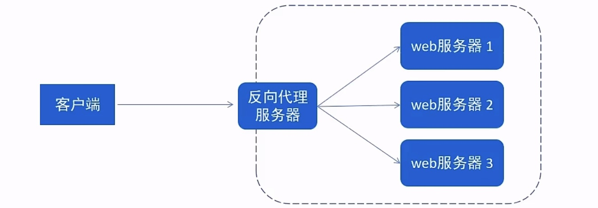
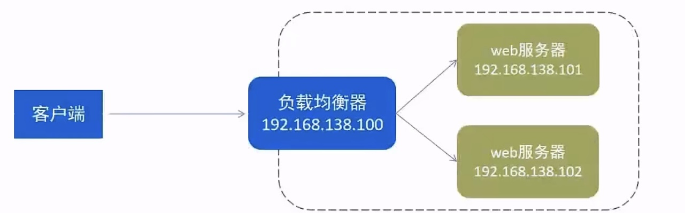

# Nginx

## 开发中Nginx的具体应用？

### 部署静态资源

Nginx可以作为静态web服务器来部習静态资源。静态资源指在服务端真实存在并且能够直接展示的一些文件，比如常见的html页面、CSS文件、js文件、图片、视频等资源。

相对于Tomcat，Nginx处理静态资源的能力更加高效，所以在生产环境下，一般都会将静态资源部署到Nginx中

将静态资源部署到Nginx非常简单，只需要**将文件复制到Nginx安装目录下的html目录中**即可。

nginx.conf部分解读如下：

```shell
server {
    listen       80;	#监听端口
    server_name  localhost;	#服务名称

    location / {		#匹配客户端请求url
    root   html;		#指定静态资源根目录
    index  index.html index.htm;	#指定默认首页
	}

}
```

###  反向代理

-   **正向代理**

是一个位于客户端和原始服务器（origin server）之间的服务器，为了从原始服务器取得内容，客户端向代理发送一个请求并指定目标（原始服务器），然后代理向原始服务器转交请求并将获得的内容返回给客户端。

正向代理的典型用途是为在防火墙内的局域网客户端提供访问internet的途径。

正向代理**一般是在==客户端设置代理服务器==，通过代理服务器转发请求，最终访问到目标服务器**


-   **反向代理**

位于用户（客户端）与目标服务器之间，但是对于用户而言，反向代理服务器就相当于目标服务器，即用户直接访问反向代理服务器就可以获得目标服务器的资源，反向代理服务器负责将请求转发给目标服务器。

用户不需要知道目标服务器的地址（换句话说，就是隐藏了目标服务器的IP地址，暴露的仅仅是代理服务器的IP地址），也无需在用户端做任何设定。

>   客户端对代理是无感知的，因为客户端不需要任何设置即可访问



反向代理示例：

```shell
server {
    listen       80;
    server_name  localhost;

    location / {
    	proxy_pass http://192.168.188.150:8080 	#反向代理配置，将请求转发到指定服务
	}
}
```

两者区别

-   正向代理需要知道代理服务器的地址（即需要在客户端进行设置）
    -   比如我们要访问YouTube，我们可以在香港买一台代理服务器，我们访问香港的代理服务器，由代理服务器去国外访问YouTube。最终返回给我们
-   反向代理的话，客户端不需要进行任何设置。反向代理服务器就相当于目标服务器


###  负载均衡

早期的网站流量和业务功能都比较简单，单台服务器就可以满足基本需求，但是随着互联网的发展，业务流量越来越大并且业务逻辑也越来越复杂，单台服务器的性能及单点故障问题就凸显出来了，因此需要多台服务器组成应用集群，进行性能的水平扩展以及避免单点故障出现。

-   应用集群：将同一应用部署到多台机器上，组成应用集群，接收负载均衡器分发的请求，进行业务处理并返回响应数据
-   负载均衡器：将用户请求根据对应的**负载均衡算法分发到应用集群中的一台服务器进行处理**



负载均衡示例：

```shell
# 配置负载均衡
upstream targetserver{	#upstream指令可以设定一组服务器
    server 192.168.138.101:8080	weight=10;	#weight权重越大，分发概率越大
    server 192.168.138.102:8080	weight=5;
}
server {
    listen       8080;
    server_name  localhost;

    location / {
    	proxy_pass http://targetserver 	#反向代理配置，将请求转发到指定服务
	}
}
```

## 如何实现负载均衡？

可以通过upstream指令定义一组后端服务器，并在location块中使用proxy_pass指向这个upstream组。

常见的负载均衡算法有轮询、加权、ip哈希等，可以在upstream中进行设置

| 名称       | 说明             |
| ---------- | ---------------- |
| 轮询       | **默认**         |
| weight     | 权重方式         |
| ip_hash    | 依据ip分配方式   |
| least_conn | 依据最少连接方式 |
| url_hash   | 依据url分配方式  |
| fair       | 依据响应时间方式 |

示例：

```shell
# 配置负载均衡
upstream targetserver{	#upstream指令可以设定一组服务器
    server 192.168.138.101:8080	weight=10;	#weight权重越大，分发概率越大
    server 192.168.138.102:8080	weight=5;
}
server {
    listen       8080;
    server_name  localhost;

    location / {
    	proxy_pass http://targetserver 	#反向代理配置，将请求转发到指定服务
	}
}
```


## Nginx如何处理重定向？

使用return指令实现重定向

例如：return 301 https://www.example.com 表示 301 永久重定向到指定的URL


## Nginx中的虚拟主机（Virtual Host）是什么？如何配置？

虚拟主机是在一台服务器上运行多个网站的方法

**如何配置**

通过配置不同的server块，根据域名或端口等条件来区分不同的网站。可以通过 server_name 指令指定域名，然后配置相关的路径和处理规则


## Nginx如何处理SSL证书？

首先需要获取SSL证书（公钥和私钥），然后在Nginx的配置中使用 ssl_certificate 和 ssl_certificate_key 指令指定证书和密钥的路径，同时配置相关的SSL协议和加密套件等参数。


## Nginx中的upstream模块有什么用？

upstream模块用于定义后端服务器组，以便在反向代理或负载均衡场景中使用，实现将请求分发到多个后端服务器。

```shell
# 配置负载均衡
upstream targetserver {	#upstream指令可以设定一组服务器
    server 192.168.138.101:8080	weight=10;	#weight权重越大，分发概率越大
    server 192.168.138.102:8080	weight=5;
}
```


## Nginx中的location指令有什么用？

location指令用于匹配请求的URL路径，并定义对该路径的处理方式。如代理、重定向、返回文件等。

```shell
location / {
	proxy_pass http://targetserver 	#反向代理配置，将请求转发到指定服务
}
```


#

## Nginx如何实现缓存？

可以使用proxy_cache指令来配置缓存策略，包括缓存的键、缓存时间、缓存大小等。


## 如何使用Nginx配置后端https协议访问

参考：https://juejin.cn/post/7273803674790903847
