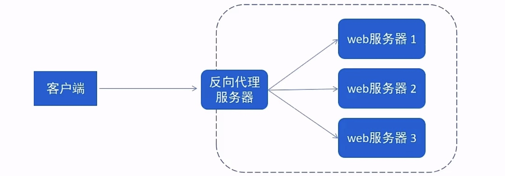
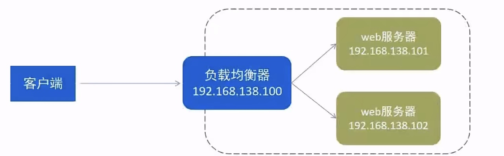

# Nginx

## Nginx的常用命令？

-   查看版本

```
./nginx -v
```

-   **检查配置文件正确性**

```
./nginx -t
```

-   启动nginx命令

```
./nginx
```

-   停止

```shell
./nginx -s stop
```

示例：

```shell
[root@nhk sbin]# ./nginx 	
[root@nhk sbin]# ps -ef | grep nginx	# 查看相关进程
root       6020      1  0 02:07 ?        00:00:00 nginx: master process ./nginx
nobody     6021   6020  0 02:07 ?        00:00:00 nginx: worker process
root       6023   5890  0 02:08 pts/0    00:00:00 grep --color=auto nginx
[root@nhk sbin]# ./nginx -s stop
[root@nhk sbin]# ps -ef | grep nginx
root       6036   5890  0 02:08 pts/0    00:00:00 grep --color=auto nginx
```

-   **重新加载配置文件**

```shell
./nginx -s reload
```


## Nginx配置文件结构？

Nginx配置文件（conf/nginx.conf）整体分三部分：

-   **全局块**
-   **events块**
-   **http块**
    -   http全局块
    -   server块
        -   server全局块
        -   location块

注意：

-   http块包含http全局块、server块

-   http块可以配置多个server块，每个server块可以配置多个location块


### **全局块**

从配置文件开始到 events块之间的内容，主要会设置一些影响nginx服务器整体运行的配置指令

主要包括配置运行nginx服务器的用户（组）、运行生成的worker process数，进程PID存放路径、日志存放路径和类型以及配置文件的引入等

例如：worker_processes  1; worker_processes的值越大，可以处理的并发处理量也就越多

### **events块**

events块涉及到的指令主要影响nginx服务器与用户的网络连接

例如：worker_connections  1024; 表示支持的最大连接数为1024

### **http块**

这是nginx服务器配置中最频繁的部分，代理、缓存、日志定义等绝大多数的功能和第三方模块的配置都在这里配置。

注意：

-   http块包含http全局块、server块

-   http块可以配置多个server块，每个server块可以配置多个location块

#### **http全局块**

http全局块配置的指令包括文件引入、MIME-TYPE定义、日志自定义、连接超时时间、单链接请求数上限等

#### server块

server块与虚拟主机有密切关系，虚拟主机从用户的角度看，和一台独立的硬件主机是完全一样的，该技术的产生主要是为了节省互联网服务器硬件成本。

-   http块可以配置多个server块，而每个server块就相当于一个虚拟主机
-   每个server块又可以分为全局server块和location块
    -   其中location块可以同时包含多个

##### 全局server块

全局server块中最常见的配置是配置本虚拟主机的监听配置和本虚拟主机的名称或IP地址

##### location块

一个server块中可以同时包含多个location块

location块的主要作用是基于nginx服务器接收到的请求字符串（例如：server_name/uri-string），对虚拟主机名称（也可以是IP别名）之外的字符串（例如：前面的/uri-string ）进行匹配，对特点的请求进行处理。如地址定向、数据缓存、应答控制等。

此外，还有许多第三方模块的配置也是在location块中配置

```shell
# 全局块
worker_processes  1;

# events块
events {
    worker_connections  1024;
}

# http块
http {
	# http全局块
    include       mime.types;
    default_type  application/octet-stream;

    sendfile        on;
  
    keepalive_timeout  65;
	
	# server块，server块可以有很多个
	# 每个server块下可以包含多个location块
    server {
    	# 全局server块
        listen       80;
        server_name  localhost;

 
        location / {
            root   html;
            index  index.html index.htm;
        }

        error_page   500 502 503 504  /50x.html;
        location = /50x.html {
            root   html;
        }
    }

}
```


## 开发中Nginx的具体应用？

### 部署静态资源

Nginx可以作为静态web服务器来部習静态资源。静态资源指在服务端真实存在并且能够直接展示的一些文件，比如常见的html页面、CSS文件、js文件、图片、视频等资源。

相对于Tomcat，Nginx处理静态资源的能力更加高效，所以在生产环境下，一般都会将静态资源部署到Nginx中

将静态资源部署到Nginx非常简单，只需要**将文件复制到Nginx安装目录下的html目录中**即可。

nginx.conf部分解读如下：

```shell
server {
    listen       80;	#监听端口
    server_name  localhost;	#服务名称

    location / {		#匹配客户端请求url
    root   html;		#指定静态资源根目录
    index  index.html index.htm;	#指定默认首页
	}

}
```

###  反向代理

-   **正向代理**

是一个位于客户端和原始服务器（origin server）之间的服务器，为了从原始服务器取得内容，客户端向代理发送一个请求并指定目标（原始服务器），然后代理向原始服务器转交请求并将获得的内容返回给客户端。

正向代理的典型用途是为在防火墙内的局域网客户端提供访问internet的途径。

正向代理**一般是在==客户端设置代理服务器==，通过代理服务器转发请求，最终访问到目标服务器**


-   **反向代理**

位于用户（客户端）与目标服务器之间，但是对于用户而言，反向代理服务器就相当于目标服务器，即用户直接访问反向代理服务器就可以获得目标服务器的资源，反向代理服务器负责将请求转发给目标服务器。

用户不需要知道目标服务器的地址（换句话说，就是隐藏了目标服务器的IP地址，暴露的仅仅是代理服务器的IP地址），也无需在用户端做任何设定。

>   客户端对代理是无感知的，因为客户端不需要任何设置即可访问



反向代理示例：

```shell
server {
    listen       80;
    server_name  localhost;

    location / {
    	proxy_pass http://192.168.188.150:8080 	#反向代理配置，将请求转发到指定服务
	}
}
```

两者区别

-   正向代理需要知道代理服务器的地址（即需要在客户端进行设置）
    -   比如我们要访问YouTube，我们可以在香港买一台代理服务器，我们访问香港的代理服务器，由代理服务器去国外访问YouTube。最终返回给我们
-   反向代理的话，客户端不需要进行任何设置。反向代理服务器就相当于目标服务器


###  负载均衡

早期的网站流量和业务功能都比较简单，单台服务器就可以满足基本需求，但是随着互联网的发展，业务流量越来越大并且业务逻辑也越来越复杂，单台服务器的性能及单点故障问题就凸显出来了，因此需要多台服务器组成应用集群，进行性能的水平扩展以及避免单点故障出现。

-   应用集群：将同一应用部署到多台机器上，组成应用集群，接收负载均衡器分发的请求，进行业务处理并返回响应数据
-   负载均衡器：将用户请求根据对应的**负载均衡算法分发到应用集群中的一台服务器进行处理**



负载均衡示例：

```shell
# 配置负载均衡
upstream targetserver{	#upstream指令可以设定一组服务器
    server 192.168.138.101:8080	weight=10;	#weight权重越大，分发概率越大
    server 192.168.138.102:8080	weight=5;
}
server {
    listen       8080;
    server_name  localhost;

    location / {
    	proxy_pass http://targetserver 	#反向代理配置，将请求转发到指定服务
	}
}
```

## 如何实现负载均衡？

可以通过upstream指令定义一组后端服务器，并在location块中使用proxy_pass指向这个upstream组。

常见的负载均衡算法有轮询、加权、ip哈希等，可以在upstream中进行设置

| 名称       | 说明             |
| ---------- | ---------------- |
| 轮询       | **默认**         |
| weight     | 权重方式         |
| ip_hash    | 依据ip分配方式   |
| least_conn | 依据最少连接方式 |
| url_hash   | 依据url分配方式  |
| fair       | 依据响应时间方式 |

示例：

```shell
# 配置负载均衡
upstream targetserver{	#upstream指令可以设定一组服务器
    server 192.168.138.101:8080	weight=10;	#weight权重越大，分发概率越大
    server 192.168.138.102:8080	weight=5;
}
server {
    listen       8080;
    server_name  localhost;

    location / {
    	proxy_pass http://targetserver 	#反向代理配置，将请求转发到指定服务
	}
}
```


## Nginx如何处理重定向？

使用return指令实现重定向

例如：return 301 https://www.example.com 表示 301 永久重定向到指定的URL


## Nginx中的虚拟主机（Virtual Host）是什么？如何配置？

虚拟主机是在一台服务器上运行多个网站的方法

**如何配置**

通过配置不同的server块，根据域名或端口等条件来区分不同的网站。可以通过 server_name 指令指定域名，然后配置相关的路径和处理规则


## Nginx如何处理SSL证书？

首先需要获取SSL证书（公钥和私钥），然后在Nginx的配置中使用 ssl_certificate 和 ssl_certificate_key 指令指定证书和密钥的路径，同时配置相关的SSL协议和加密套件等参数。


## Nginx中的upstream模块有什么用？

upstream模块用于定义后端服务器组，以便在反向代理或负载均衡场景中使用，实现将请求分发到多个后端服务器。

```shell
# 配置负载均衡
upstream targetserver {	#upstream指令可以设定一组服务器
    server 192.168.138.101:8080	weight=10;	#weight权重越大，分发概率越大
    server 192.168.138.102:8080	weight=5;
}
```


## Nginx中的location指令有什么用？

location指令用于匹配请求的URL路径，并定义对该路径的处理方式。如代理、重定向、返回文件等。

```shell
location / {
	proxy_pass http://targetserver 	#反向代理配置，将请求转发到指定服务
}
```


## Nginx如何实现跨域访问？

跨域问题通常发生在浏览器出于安全考虑实施了同源策略（Same-origin policy），当从一个源加载的文档或脚本尝试与另一个源请求资源时，就会触发这种限制。

>   补充：跨域问题只会发生在客户端，服务器之间不存在跨域问题

可以通过在响应头中添加Access-Control-Allow-Origin等相关的跨域头信息来实现跨域访问。

下面是如何在 Nginx 中配置以支持跨域访问的例子：

1.  打开 Nginx 配置文件，通常是 `/etc/nginx/nginx.conf` 或者在 `/etc/nginx/conf.d/` 目录下的某个文件。
2.  在 server 块中针对需要处理跨域请求的服务配置 location 块，添加适当的 CORS (Cross-Origin Resource Sharing) 相关头信息。例如：

```shell
server {
    listen 80;
    server_name yourdomain.com;

    location /api/ {
        if ($request_method = 'OPTIONS') {	# 处理预检请求
            add_header 'Access-Control-Allow-Origin' '*';
            add_header 'Access-Control-Allow-Methods' 'GET, POST, OPTIONS';
            add_header 'Access-Control-Allow-Headers' 'DNT,X-CustomHeader,Keep-Alive,User-Agent,X-Requested-With,If-Modified-Since,Cache-Control,Content-Type,Authorization';

            return 204;
        }

        add_header 'Access-Control-Allow-Origin' '*'; # 允许任何来源
        # 如果需要限制特定来源，可以改为: add_header 'Access-Control-Allow-Origin' 'http://example.com';
        add_header 'Access-Control-Allow-Credentials' 'true'; # 是否允许发送凭证
        add_header 'Access-Control-Expose-Headers' 'Content-Length,X-JSON'; # 暴露哪些头部给API调用者

        # 你的其他配置...
    }
}
```


## Nginx如何实现缓存？

可以使用proxy_cache指令来配置缓存策略，包括缓存的键、缓存时间、缓存大小等。


## 如何使用Nginx配置后端https协议访问

参考：https://juejin.cn/post/7273803674790903847

